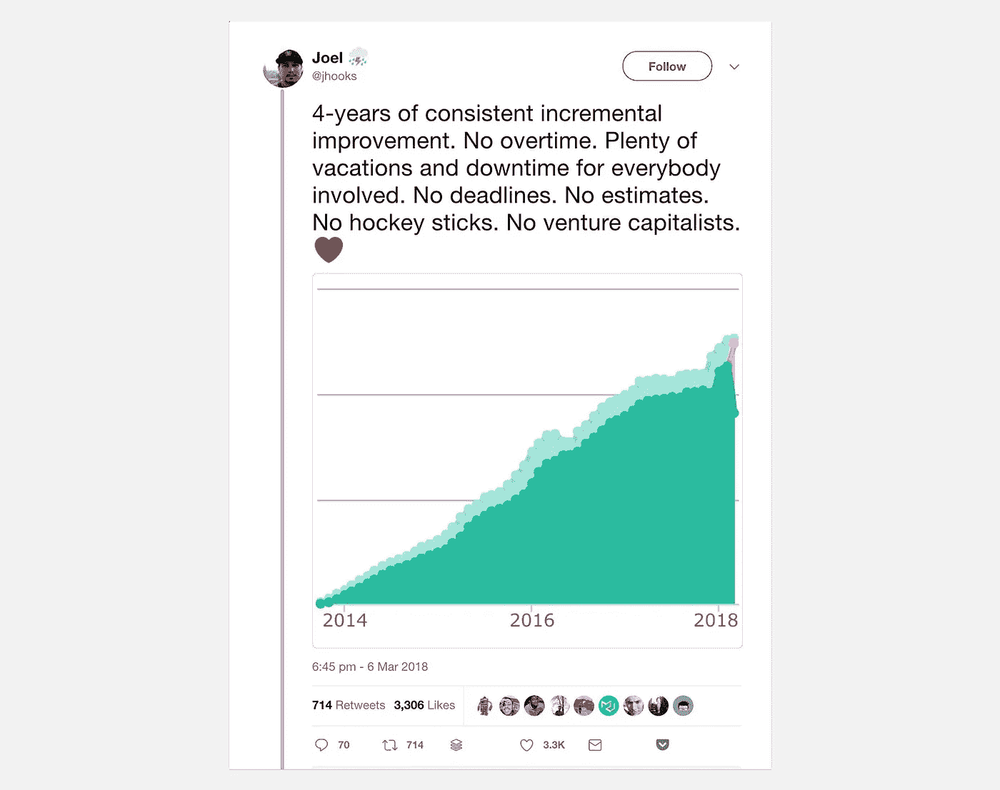

# 如何在不出卖自由的情况下建立一个创业帝国

> 原文：<https://medium.com/swlh/how-to-build-a-startup-empire-without-selling-your-freedom-604143b21a61>

Joel’s [self-funding journey](https://twitter.com/jhooks/status/971215329354399744).

找到一家创业公司很容易。找到一个你不相信其愿景的创始人。

我坐在一位创始人旁边，过去一年来，他的远见卓识令我钦佩。

在新加坡市中心的星巴克里，声音大得不能再大了，但噪音可能是我们俩最不想要的东西。