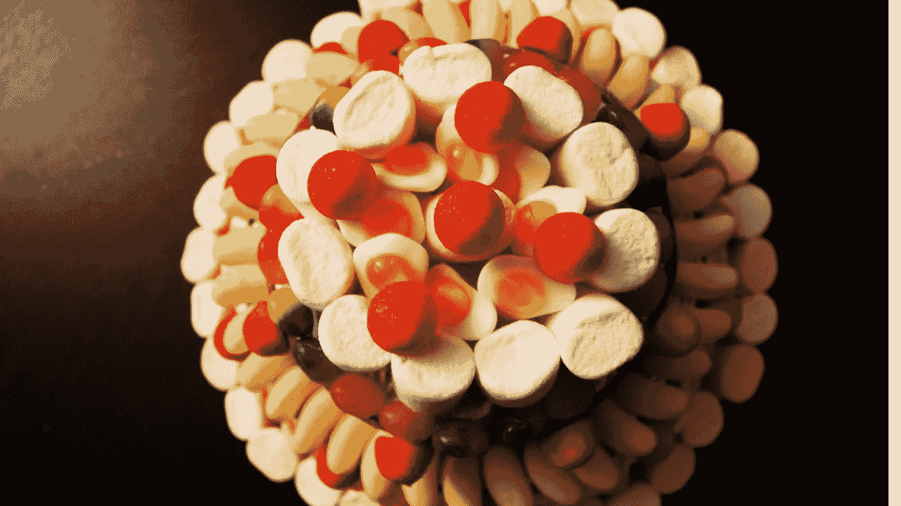

# 如果你是一个非技术型的创始人，如何打造一个能够胜任工作的 MVP

> 原文：<https://medium.com/swlh/how-to-build-an-mvp-that-does-its-job-if-youre-a-non-tech-founder-3a0d5d01858f>

在当今以客户为导向的按需经济中，消费者的需求变化很快，与之不匹配的产品无法在市场上生存。

那么企业家如何确保自己的产品符合客户的期望呢？

**通过构建和发布最小可行产品(MVP)。**

由于 MVP，创始人可以检查客户是否想要他们的产品，获得有价值的反馈，并调整他们的报价，以更好地响应客户的需求。

回想一下 MySpace——它之所以失败，是因为它的[没有发展到能够满足用户群](https://www.ft.com/content/fd9ffd9c-dee5-11de-adff-00144feab49a)不断变化的需求。

## 在这篇文章中，我将谈论:

*   什么是 MVP
*   为什么投资 it 是个好主意；
*   如何建立一个 MVP 来完成它的工作并提升你的商业理念。

# 什么是 MVP，为什么你应该投资 MVP？

最小可行产品是新产品的一个版本，它允许以最少的努力收集关于客户的最大量的信息。Eric Ries 在他的书[精益创业](http://theleanstartup.com/)中是这样定义的。

一个好的 MVP 使用最基本的功能来解决特定的问题。它通过解决一个痛点来瞄准特定的受众。它可以通过实用而直观的用户体验快速构建和启动。

## 这里有一个 MVP 能为你的企业带来什么的例子:

你可能每周五晚上都会得到一个优步奖。好吧，回到 2010 年，优步被称为 UberCab，只被创始人和他们的朋友使用。专注于旧金山的一个小用户群，它的创始人更了解客户的需求和偏好。他们改进了他们的产品，在优步陷入困境之前，在 14 轮风险投资和私募股权投资中成功筹集了大约 115 亿美元。

所以，MVP 是个好主意。

## 以下是你应该建立 MVP 的 4 个理由:

*   **它加速了产品的构建** —明智的做法是首先验证你的想法，然后开始创造你的产品。如果你不能 100%确定你的客户需要什么，建立一个团队和销售流程是有风险的。
*   **快速了解客户反馈** —一旦你有了产品的第一个功能版本，就向客户展示你的产品，并收集有价值的反馈，以构建你的目标受众想要的东西(同时也是它的销售或营销过程)。
*   **它吸引早期采用者** —这是第一批会使用你的 MVP 的人。一旦你认识到谁是早期采用者，就更容易验证你的产品假设和建立营销活动。
*   **它以低风险产生高投资回报** —以最小的风险最大化您已有资产的价值。不要构建新产品的所有功能，先询问用户——他们可能只需要这些功能中的一两个来解决他们的问题。这就是你在发布产品时节省时间和金钱的方式。

# 以下是如何构建一个完成其工作的 MVP

**1。定义‘为什么’**

在开始设计你的产品之前，有一件事你应该做——确定它的“为什么”只有这样，你才能激励他人购买你的想法。

回答这些问题，否则可能会导致 MVP 失败:

*   它解决什么问题？
*   目标是谁？
*   他们为什么要关心？
*   是什么让我的解决方案成为解决这个问题的最佳方案？

## **2。勾画用户故事**

一旦你定义了你的 MVP 的“为什么”,是时候提出它的潜在特征了。

但是 MVP 是你产品的简化版本，所以你需要区分特性的优先级，决定哪些是绝对必要的。

你可以通过勾画用户故事来实现。

写下你希望用户用你的产品完成的任务列表。现在是时候对这些任务进行优先排序了。给它们贴上“必须拥有”、“应该拥有”和“可以拥有”的标签——这就是我们如何表明特性的重要性。

看到那些在你的列表中名列前茅的功能了吗？它们代表了交付具有独特和设计良好的用户体验的 MVP 所需的最少的功能，可以帮助用户有效地解决他们的问题。

不要扔掉你的列表——它将成为你开发产品时可能添加的功能的积压。

## **3。终极功能测试**

如果你仍然不确定一个特性是否应该进入你的 MVP，问这个问题:

*我可以推出没有此功能的产品吗？*

从用户角度回答一下。如果你发布时没有这个功能，用户还能解决他们的问题吗？

如果你的答案是肯定的，那就把它放到待办事项中。如果答案是否定的，评估添加该功能所需的资源，并决定它是否在您的时间表和预算内。将你的产品减少到最低限度，以降低其风险。

## **4。遵循蛋糕模型**

Brandon Schauer 开发的[蛋糕模型](https://vimeo.com/19738421)提供了两种不同的产品开发模型。

设计新产品的一个方法是从干蛋糕开始。随着项目的发展，你要添加馅料和糖衣。但是采纳客户的观点，你就会发现这个模型是有问题的。事实是，没有馅料或糖衣的蛋糕并没有那么吸引人。

几乎任何人都能做出那样的蛋糕。

另一个模型是纸杯蛋糕模型，你在开发 MVP 时应该遵循这个模型。从一些小的，但是令人满意的事情开始。你的纸杯蛋糕将拥有所有必要的原料和吸引人的外观。

你可能会提供有限的功能，但他们将在一个有吸引力的软件包。

## **5。建立一个社区**

当你不用花很多钱就可以开始建立一个忠实用户的社区时，花钱做营销是没有意义的。

**这里有 3 个策略来推广你的想法，并开始把人们聚集在你的价值观周围:**

*   **创建一个登陆页面**——登陆页面有助于验证你的商业想法。Buffer 就是这么做的，而且很有效。描述你的产品的好处，添加一个强大的行动号召，并带来网络流量。与您的客户取得联系，调整您的产品以满足他们的需求。
*   开始写博客——Groupon 最初是通过写 WordPress 博客开始的。他们在当地社区推广他们的博客帖子，并提高了转化率，今天服务了惊人的 4800 万客户。博客展示了你的想法，并为用户留下反馈提供了一个平台。
*   **制作视频** — Pebble 利用视频在 Kickstarter 上为他们的智能手表创意筹集资金，并以超过 1000 万美元的认捐结束了活动。视频是展示产品优势的一种强有力的方式。

[在 Sunscrapers](http://www.sunscrapers.com) ，我们经常会遇到一些创始人，他们有很棒的产品创意，但不想冒险在一个可能无法准确满足市场需求的解决方案上投入大量资金。

这时我们建议创建一个 MVP。

这是检查一个想法在市场上表现如何的最佳策略，有助于企业家了解他们产品的核心，向目标受众推销产品，并收集客户反馈以微调他们的产品。

*如果你喜欢这篇文章，请点击拍手图标，在社交媒体上分享这个故事，并在* [*媒体*](https://medium.com/sunscrapers) *或*[*Linkedin*](https://www.linkedin.com/company/sunscrapers/)*上关注 Sunscrapers！谢谢大家！*

*本文原载于 2020 年 2 月 1 日 https://sunscrapers.com***。**

## *这篇文章发表在 [The Startup](https://medium.com/swlh) 上，这是 Medium 最大的创业刊物，拥有 275，554+人关注。*

## *在这里订阅接收[我们的头条新闻](http://growthsupply.com/the-startup-newsletter/)。*

**