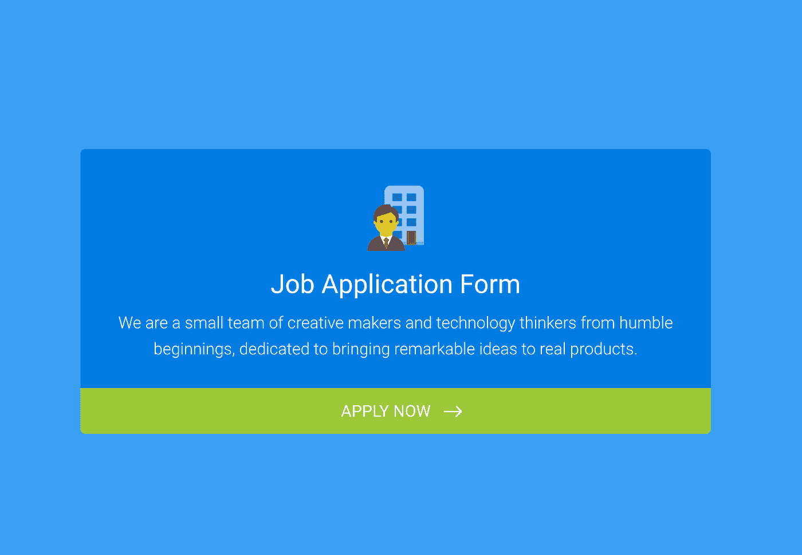
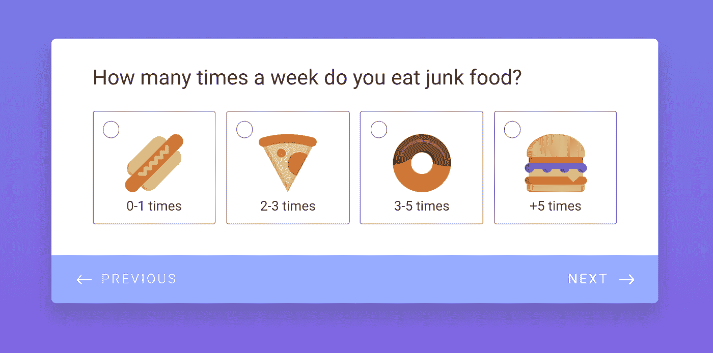
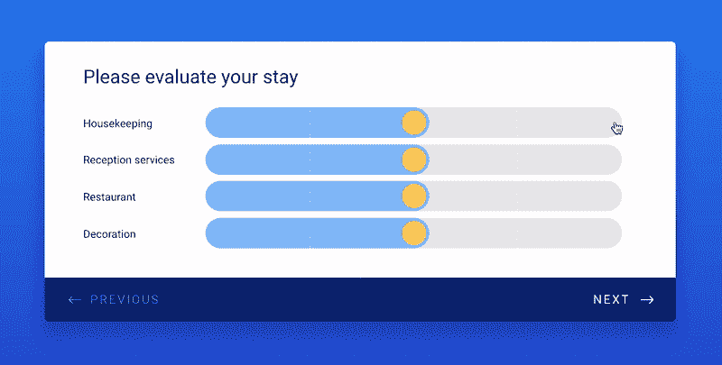
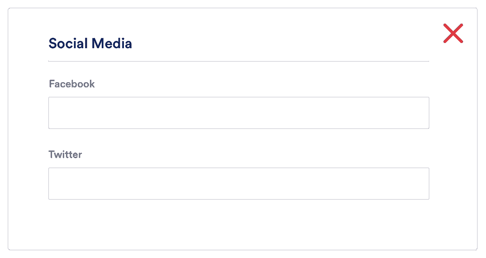
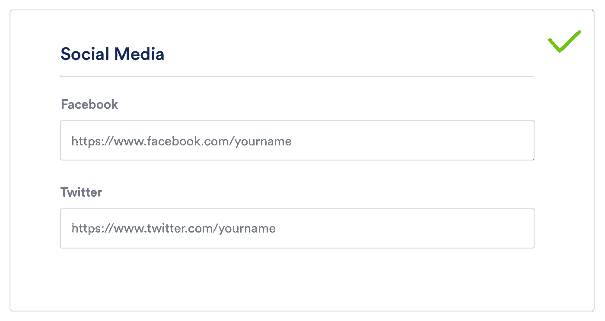
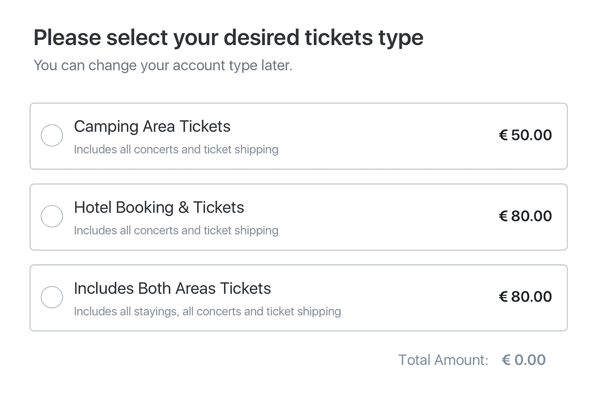
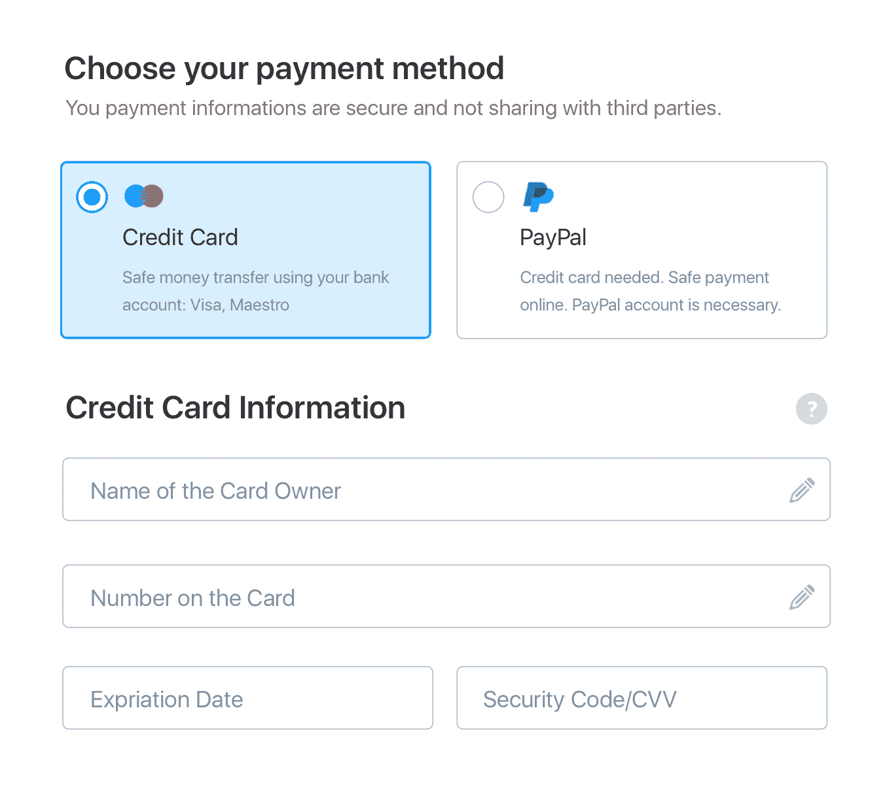

# 如何构建一个在线表单

> 原文：<https://medium.com/swlh/how-to-build-an-online-form-that-converts-3edbbee2613f>

Originally published on [**JOTFORM.COM**](http://jotform.com)

> “带着好奇心去听。沟通的最大问题是我们不听不理解。我们听听回复。当我们带着好奇心听的时候，我们不会带着回答的意图去听。我们倾听话语背后的内容。”
> 
> ―罗伊·t·贝内特

倾听并不总是面对面发生的。

此时此刻，世界上某个地方的某个人正试图通过网络形式来倾听他们的听众。

在线表格等同于数据，它们意味着从与你的业务互动的任何人那里收集反馈。

就像数学、园艺、编织一样，形体塑造并不像看上去那样简单。在一个好的表单表面简单的背后，隐藏着调整、深思熟虑的决策、仔细的计划以及——是的——创造力。

正确的数据是一件美好的事情。它阐明和阐明，推动企业前进，创造更强有力的领导者。这是好企业和伟大企业的区别。

为了收集您需要的数据，我们必须从表单的基本框架开始。每一个高转换形式都是由智能的、精明的信息架构构建的。

让我们开始吧。

## 你为什么需要一张表格？

正如史蒂夫·乔布斯所说，你需要接近你的客户。[毕竟，他们是你成功的关键。我们都想深入客户的大脑，了解如何更好地为他们服务。](https://www.jotform.com/blog/how-focusing-on-the-customer-not-the-competition-brought-us-over-1-million-new-signups-in-a-year/)

所以，当有机会问他们问题时——一种形式——很容易就开始头脑风暴世界上你可能会问他们的所有问题。

**反抗！**

这是智能、战略性表单构建的第一条规则:

## 每一个额外的问题都会降低用户完成表单的可能性。

每一件衣服，每一件装饰品，每一个不需要的附加部分。

> 较长的表格=较低的转化率。

相反，写下你想从表格中获得的知识，并逆向工作。

> 你的表格的目的是什么？反馈？研究？性能？

写下你希望从调查中获得的具体知识，以及几个你认为可能回答你的假设的简单问题，包括一组可能的答案。

在答案的旁边，写下你期望每个答案的百分比。将未来的结果与这些猜测进行比较，就会发现你的直觉哪里强，哪里存在盲点。

这个预调查过程还将帮助您综合调查的关键方面，并指导您的设计过程。

记住:随着你的调查范围的扩大，潜在的回答者会越来越少。

## 简洁是最重要的——也是最没有被充分利用的——表单设计特征。

所以。仔细考虑你需要什么和不需要什么。杀了你的宝贝。

仔细思考*为什么*你需要这个答案，以及*你将如何*使用它。如果你有任何不确定性，丢掉它。考虑你想要的确切数据，把你的问题和它联系起来，然后拿起你的红色编辑笔——无情地删掉其他的东西。

形式越短，结果越甜。长表格会导致回答者 **a)完全退出调查，或者 b)简单地关闭并点击随机复选框**直到调查完成。

b)只需关闭并点击随机复选框，直到它完成。

无论哪种情况，您的数据都会受到威胁。

表单是您的企业和客户之间的对话。像任何谈话一样，没有人喜欢漫步者。

现在，让我们看看构建表单本身。

# 标题-问题类型-占位符

## 标题

有没有在匆忙中拿起一些标签不好的东西，回到家却发现你美味的零食实际上是狗粮？

填写表格的人通常都很匆忙。我是说，急着把表格做完。

在他们开始点击之前，给它一个不清楚的标题会激怒他们。这听起来显而易见，但你会感到惊讶。

简单地说，标题应该是对将要发生的事情的最短最准确的描述:没有点击诱饵，没有令人费解的句子，没有混乱。

这意味着标题应该是“工作申请”,而不是“填写我”

## 欢迎页面

标题应该在欢迎页面上或后面，并带有对表单本身的简短描述。尽量让这种描述保持中立。

为什么？因为人类有帮助他人的自然倾向。

当然，这是好事。但是如果你告诉他们你的表格有一个具体的目标，他们可能会带着让你达到目标的意图来回答，而不是完全诚实。

# 题型

这是模板建造者的座右铭:

> 问题越清晰，数据越清晰。

明确问题=使用什么服务？

不清楚的问题=告诉我们您使用的服务。

简单导致有意义的结果:问题的答案将易于分析和可视化。

# 正确的工具=正确的答案

你要一个电子邮件地址；您会收到一个没有@符号的响应。您请求一个电话号码；你一半的答案没有包含足够的数字。

投入大量精力构建一个表单，却发现结果因为一个输入错误而无法使用，至少可以说是令人恼火的。

细节决定成败。

例如，如果您使用文本框来显示电子邮件信息，电子邮件验证将不起作用。然后，响应者可以输入:

*Ecem.jotform.com*

而不是这个:

*ecem@jotform.com*

阻止您联系用户。

> 为了避免这种情况，请确保您使用正确的设置来获得您需要的答案。然后，您可以使用“字段验证”来强制答案格式:
> 
> "答案必须包含一个 __ "

# 使用简单的语言

现在不是炫耀你英语 A 级的时候。回复者不会对冗长的单词和复杂的措辞印象深刻。

避免使用长词、不常用词和多义词。保持句子简短、直接、明快。

你的数据会感谢你的。

# 一次问一件事

双重问题得到模棱两可的答案。模棱两可的答案是无法分析的。

通过扫描表单中的单词“and/”或“or ”,确保避免这个陷阱。发现一个？将问题分成两部分。

哦，尽可能地精确。

例如，不要问“你经常吃垃圾食品吗”，而是问“你一周吃几次垃圾食品？”。

具体的答案意味着水晶般清晰的数据。

# 怎样才能让用户的生活更轻松？

## 使用预定义的答案

为马拉松而训练，为考试而学习，为升职而努力。在生活的某些领域，走艰难的路会收获最好的结果。

填表？一个都没有。

容易完成的问题会激励用户快速浏览表单；过于复杂的问题会让他们检查脸书、打哈欠和喂猫。

那么，如何才能让答题尽可能不费力呢？通过给用户一个(隐喻的)开端。一种方法是通过单项选择(单选)或多项选择(复选框)提问:

> 问:您使用我们的哪些服务？
> 
> a.个人培训
> 
> b.Spa 和游泳池
> 
> c.健康

最小思维。不打字。没有比这更简单的了。每个人都是赢家，因为预定义的答案更容易评估。

如果有一个你无法预见的潜在答案，弹出一个“其他”选项和一个文本框，让你的观众输入一个自定义的回答。嘣。

这也有助于将答案可视化。我们在用表情滑块这一最独特的功能制作 JotForm 卡片时就利用了这一点。

用户可以选择最能代表他们感受的表情符号，而不是费力地穿过永无止境的“强烈同意——强烈不同意”语句的细微差别。

另一个例子是评估滑块。通过拖动蓝点或点击灰点，受访者可以获得快速反馈，并看到他们的答案立即改变。

可以说最简单的问题类型是是/否。

我们注意到用户倾向于使用单选按钮来创建是非问题。因此，我们的最终任务是通过为输入表类型添加是-否切换来使他们的生活变得更容易。

## 占位符/阐明默认值。

我们的生活压力很大。我们的日子很长。我们的社交生活很忙。所以，在事物的尺度上，人们也乐于投入大量的注意力，填表得分相对较低。

让我们现实一点:很多时候，用户会匆忙回答问题，只是部分关注。所以，把你的形态想象成寻宝。对于一个六岁的孩子来说。在他们生日那天。

你希望他们毫不费力地快速到达终点线和他们的奖品。这意味着用线索、暗示和方向引导他们前进。

没有人想玩猜谜游戏或感到困惑。

引导用户的一个好方法是使用占位符文本。这指定了描述输入字段的预期值的简短提示(例如，样本值或预期格式的简要描述)。

这意味着他们可以浏览页面并理解问题/答案，而不必全文阅读。

## 相关问题组(拆分部分)和逻辑问题顺序

另一种让用户轻松愉快地填写表单的方法是对问题进行分组。我们都有多年来形成的潜意识联想。利用这一点。

对相关问题进行分组有两个主要目标:

## 降低认知负荷

认知负荷越低，你的表单成功率越高。当一种形式合乎逻辑时，认知负荷直线下降；当较长的内容被分成小块时；当用户可以不假思索地遵循一个众所周知的叙述(个人详细信息—地址—支付)。

在一天结束的时候，我们需要做的就是把用户从表单的开始带到结束，而不会失去他们。怎么会？让他们保持动力。

这意味着他们需要知道对他们的期望，以及表格需要多长时间。这就是为什么我们在 [JotForm Cards](https://www.jotform.com/cards/) : **中增加了一个进度条，它让用户在进步的同时感到满意。**

视觉上划分部分使表格更容易理解。从简单的问题开始也有助于表单填写更加顺畅。当用户一开始就能快速浏览问题时，他们会感到继续下去的动力。他触发了天赋进步效应。

## 逻辑问题顺序

按照逻辑顺序提问依赖于一件事:设身处地为你的听众着想。如果你是他们，你希望订单如何流动？每个问题都应该推动他们进入下一个问题。

这大部分可以归结为常识。例如，在名字前询问某人的地址会很奇怪。或者在选择产品之前询问支付方式。

## 条件逻辑

这里有另一种使用逻辑来让你的观众受益的方法:使它有条件。

条件逻辑是复杂过程的强大简化工具。基本上，它让你根据手头的情况调整结构或过程。在这种情况下，这意味着根据用户的回答显示/隐藏某些问题。

将你的表单拆分成多条路径称为“分支”。因此，一个看起来超级简单的表单可能在其后端有多个分支。您可以通过绘制一个决策树来形象化地描述这一点，每条路径由一个不同的分支表示。

假设您正在为最近的活动创建一个在线反馈表。该活动有 3 种不同的门票类型:贵宾、商务和经济。您需要这些信息，因为您希望改进并找到解决方案，让不满意的客户下次满意。

> 2018 活动反馈表
> 
> 1.你的票是什么类型的？
> 
> -贵宾
> 
> -普通
> 
> -经济
> 
> 2.请评价您的总体体验
> 
> -星级超过 5
> 
> 3.请提供您的电子邮件地址:

在这种情况下，你不需要联系那些喜欢这个活动的人，只需要联系那些不满意的人。你可以用星级来识别他们。根据星级评定，您可以指定:

如果星级值等于或小于 3，则显示电子邮件地址问题。

您可以使用条件逻辑做的一些其他事情:

*   当用户选择特定答案时显示进一步的问题
*   构建多页调查，根据用户回答进行页面跳转
*   根据用户的选择，单独下载 PDF 文件
*   设计一个测验，根据用户的回答显示不同的“感谢信息”
*   用密码保护表单。用户输入密码后，表单才会显示
*   在用户做出特定选择之前，不显示提交按钮

# 共享表单

## 共享前测试您的表单

你的表格完成了。但是现在还不是发布的时候。

我们都有盲点。当一个表单的成功取决于数据的质量时，最好保持谨慎。因此，请确保您已经提供了可靠的答案选择，并且通过预测试您的调查没有遗漏任何内容。

将其发送给家人/朋友，并要求他们记录需要多长时间来回复调查，以及他们如何体验问题流。这也将有助于您下次评估表单的设计。

# 如何和你的观众交朋友

## 联系你的救援人员

让我们假设你在一家有三个部门的公司工作:人力资源、市场和销售。

对贵公司网站上表格的回复必须由相关部门提供。使用条件逻辑，您可以根据响应者的回答自动向不同部门发送电子邮件。

人们喜欢被倾听。因此，通过正确的人传达回应者将增加消费者的满意度，也有利于您公司的声誉。另外，下次你给他们发表格时，他们会更愿意填写。

# 最后的想法

信息建筑可能不会像真正的建筑那样让人们兴奋。但我认为细节和逻辑也同样有趣。构建一个让用户参与进来并收集清晰有用数据的表单是一项需要磨练和赞美的技能。

在 JotForm，我们总是试图让这个过程更有趣、更简单、更实际。这是一项正在进行的工作，但我们有一个伟大的时间去尝试。很想听听你下面的评论。

## 感谢阅读。如果你喜欢这篇文章，请随意点击那个按钮👏帮助其他人找到它。

## [在 Twitter 上打招呼](https://twitter.com/JotForm)或者在 [JotForm](http://pix.jotform.com/Vci4H3l8) 查看我们正在建造的东西。

【www.jotform.com】最初发表于**。**