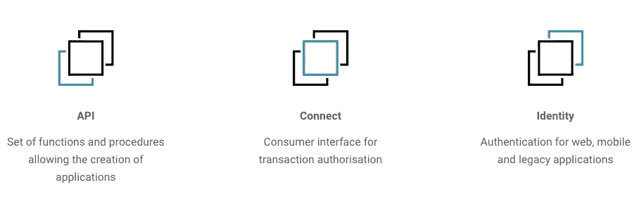

# 如何在没有区块链知识的情况下构建区块链应用程序

> 原文：<https://medium.com/swlh/how-to-build-blockchain-d-apps-with-zero-blockchain-knowledge-800cea420d4c>

未能获得关注的 dapp 数量每天都在增加，问题仍然是:杀手级应用在哪里？一个主要问题是构建区块链应用程序并不容易。编写这样一个应用程序的学习曲线太高了，因此我们忘记了最初为什么要构建 dapp。

## 一分钟介绍 Arkane

该视频解释了开发人员如何创建基于区块链的应用程序或集成，而无需每个区块链的陡峭学习曲线。

应用程序开发人员现在可以像以前一样继续开发应用程序了。用户友好、直观且重要的应用。

## 如果您是一名开发人员并想了解更多信息

你可以在这里找到一个关于如何开始与 Arkane 整合的简短演示:[https://github.com/ArkaneNetwork/DevoxxDemo](https://github.com/ArkaneNetwork/DevoxxDemo)

在我们新的[开发者门户网站](http://bit.ly/DevDocsArkane2)上，您可以找到:

*   如何开始使用我们的快速入门指南？
*   不同类型应用程序的代码示例(单页、移动应用程序等)。
*   可用的组件/构建模块。
*   我们的 Java SDK 易于集成。
*   可用功能的完整参考。

或者 c [如果你想了解更多，直接打电报给我们](https://t.me/ArkaneNetworkOfficial)

[Arkane.network](https://arkane.network/) in collaboration with [FundRequest.io](https://fundrequest.io/)

## 这篇文章发表在 [The Startup](https://medium.com/swlh) 上，这是 Medium 最大的创业刊物，有+395，714 人关注。

## 订阅接收[我们的头条新闻](http://growthsupply.com/the-startup-newsletter/)。

