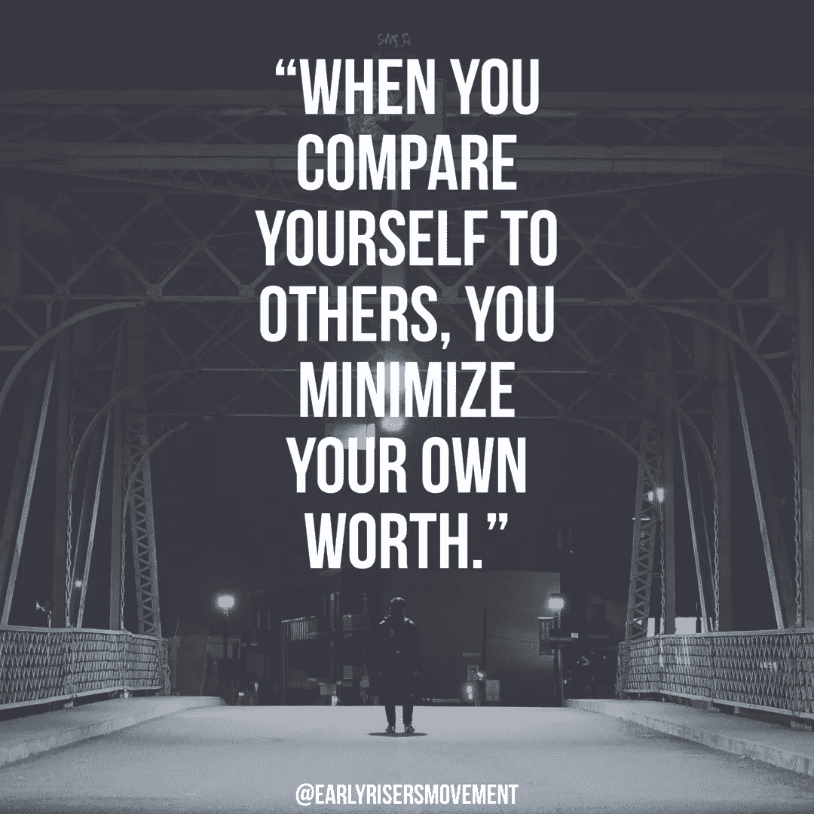
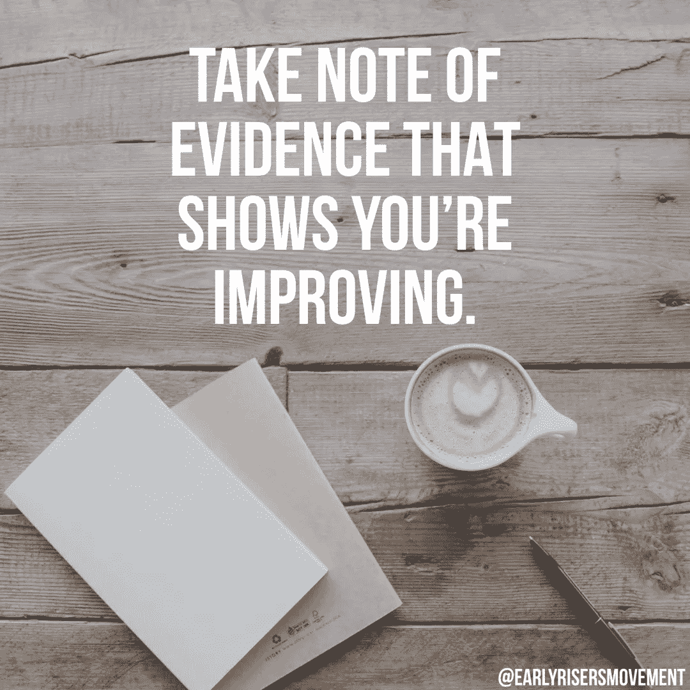

# 如何对你做的任何事情建立信心

> 原文：<https://medium.com/swlh/how-to-build-confidence-in-anything-that-you-do-1a057a45169c>

每当我们面对生活中的新情况时，我们通常都是从缺乏自信开始的。无论我们认为这意味着我们没有安全感，我们紧张不安，或者我们觉得我们会失败，很明显，为了在生活的任何方面都取得成功，自信都是必要的。但是，实际上可以做些什么来提高信心呢？因为我们自信的心态，什么可以用来增加我们成功的机会？这里有四件对提高自信至关重要的事情，以及两个应该每天做的练习，可以极大地提高生活中任何领域的自信。

# 摘要

1.  **变得清晰—** 当面对任何新的情况时，我们都需要明确自己想要的是什么。我们的工作就是尽可能地获取细节，这样我们才能完全理解最终目标以及实现目标的具体步骤。获得清晰和对过程有更好的理解将有助于我们对达到目标的能力有信心。
2.  **关注好的方面—** 每当你开始一件新的事情时，你注定会失败。你肯定会搞砸，犯错误，有时甚至会做一些让你看起来很蠢的事情(让你觉得你看起来*真的*蠢)。如果你把注意力集中在这些事情上，它们将会开始削弱你对你正在努力做的事情的动力和兴奋感。但是如果你把你的注意力转移到好的事情上，你就可以专注于对你有利的事情，以及如何在这些事情上更进一步。
3.  **不要拿自己和别人比较——**当你开始尝试在生活的某个方面建立自信时，其他人会比你更好。就是这么回事。无论他们做这件事的时间比你长多少年，或者即使他们和你同时开始做这件事，与他们相比并不符合你的最佳利益。当你把自己和其他人比较时，你是在最小化你自己的潜力，让你自己沮丧，甚至可能失败。通过在内部转移这个焦点，你能够更好地理解你的潜力以及这对你意味着什么。
4.  **建立成长心态—** 当你面临任何需要成长的情况时，你有机会对这种情况保持固定心态或成长心态。如果你有一个固定的心态，你下意识地(甚至有时有意识地)相信你的技能组合不足以让你在那种情况下取得成功，事实就是这样。你生来就是这样，所以这不是你的错，你对此无能为力。但是如果你以一种成长的心态来对待这种情况，你会知道你现在所处的位置并不是你有潜力的位置，同时也明白这需要努力，这将是一个过程。建立一个成长的心态会让你对现状既现实又有野心。

# 那你会怎么做呢？

如果你想在生活的任何方面建立自信，我建议你做两件事。

1.  **走出去，去做—** 你真正获得自信的唯一方法是在你努力做的事情上做得更好，而你在你努力做的事情上做得更好的唯一方法是走出去，去做。是的，这可能会不舒服，可能需要努力，但这是真正实现目标的必要条件。如果你想让自己轻松一点，从小步开始。例如，如果你想成为一名更好的公共演说家，不要一开始就对着一屋子几百人演讲，而是站起来，在一个没有任何人的房间前演讲。继续在几个你觉得舒服的朋友面前说话，然后在陌生人面前说话，等等。
2.  **成为求证者—** 当我们注意到那些给我们指明正确方向的事情时，它有助于我们建立信心。出去买一本杂志，或者为你的求证杂志指定几张纸。在每一天结束的时候(或者甚至当一天中发生了某些事情的时候)，写下那些显示你正在成长和进步的事情。例如，如果你试图在社交技巧方面获得自信，记下你一天中进行得特别顺利的任何对话，或者在这些对话中你做的让你感觉更舒服的任何事情。

如果你喜欢这篇文章并想要更多，我每周四都会像这样发布每周内容。你可以[订阅我们的时事通讯](https://earlyrisers.activehosted.com/f/1)获取电子邮件通知，或者在 [iTunes](https://itunes.apple.com/us/podcast/early-risers-podcast/id1343955996?mt=2) 或 [Google Play](https://goo.gl/Nvt1ra) 上订阅我们的播客，以便随时了解最新动态。不要害怕在 [Instagram](http://instagram.com/earlyrisersmovement) 或[脸书](http://facebook.com/groups/earlyrisersmovement)上与我联系！

# 引用视频分享

## 这篇文章发表在 [The Startup](https://medium.com/swlh) 上，这是 Medium 最大的创业刊物，拥有 308，589+读者。

## 在此订阅接收[我们的头条新闻](http://growthsupply.com/the-startup-newsletter/)。

