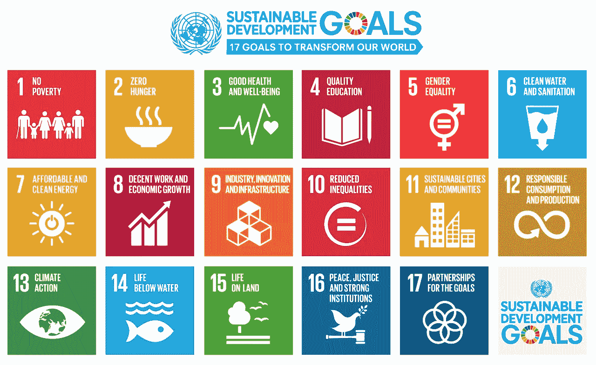
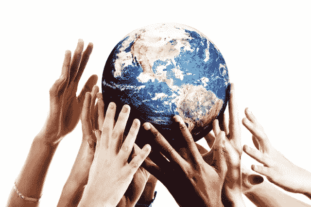

# 如何建设可持续发展的未来

> 原文：<https://medium.com/swlh/how-to-build-towards-a-sustainable-future-16cd4d786677>

随着年轻一代要求积极承担社会责任，可持续发展的话题在过去几年里越来越多。

涉足金融服务行业超过七年，社会影响和可持续性成为新投资者的两个非常重要的总体主题和需求。这一要求得到了 T2 联合国的进一步推动，联合国在 2015 年制定了 17 个可持续发展目标，并计划在 2030 年前实现，被称为“2030 议程”。

Source: United Nations

作为一个对社会企业充满热情的人，与他们保持联系总是一个挑战。作为一名有抱负的社会企业家，我希望与那些已经建立了自己的社会企业的更有经验的社会企业家建立联系，这是另一个挑战。

由于各种因素，包括缺乏资源、工具、指导和金融资本，许多项目从未开始。当社会项目面临独特的挑战时，尤其如此。

这是不对的。

为了满足社会需求，建设社会企业应该被放在优先位置，其他活动家和社会企业家的故事必须被强调，以创建这种支持系统。

全球连接必须存在，这样我们才能通过企业的力量解决影响我们所有人的严重问题。

# 1M1L 的承诺

作为[100 万 1 爱](http://www.1m1l.org) ( [1M1L](https://medium.com/u/e8add68f804f?source=post_page-----16cd4d786677--------------------------------) ) *，*的联合创始人，我们希望致力于解决这一问题，使社会项目成为现实。我们正在创建一个相互支持的社区，让个人和组织相互联系，相互扶持。

## 我们的愿景

建立一个对发展更可持续的未来充满热情的全球社区。

## 我们的目标

激励、赋权和联系至少 100 万人和社会责任组织，致力于改变当地社区，产生持久的全球影响。

然而，

# 我们也有一个有趣的目标，我们需要你的帮助

在接下来的几天里，我们的 [1M1L](https://medium.com/u/e8add68f804f?source=post_page-----16cd4d786677--------------------------------) 计划在我们的**数码博览会**上重点展示。我们相信任何人都可以通过独特的方式创造自己的社会影响力。

通过我们的数字展会，**您**将能够:

1.  上传一张自己的照片。
2.  从[联合国的 17 个可持续发展目标中选择一个对你最重要的。](https://medium.com/u/3e33f42d2bd?source=post_page-----16cd4d786677--------------------------------)
3.  分享你强有力的信息！

我们有趣的目标是达到 100 万的照片上传量，开始朝着我们的最终愿景前进。

# 要参与其中，请订阅我们，了解最新动态

将您的电子邮件添加到我们位于 www.1m1l.org[的网站](http://www.1m1l.org)，

并关注我们在[媒体](https://medium.com/u/504c7870fdb6?source=post_page-----16cd4d786677--------------------------------):[www.medium.com/1m1l](http://www.medium.com/1m1l)上的发布

## 这篇文章发表在 [The Startup](https://medium.com/swlh) 上，这是 Medium 最大的创业刊物，有+386，607 人关注。

## 在此订阅接收[我们的头条新闻](http://growthsupply.com/the-startup-newsletter/)。

