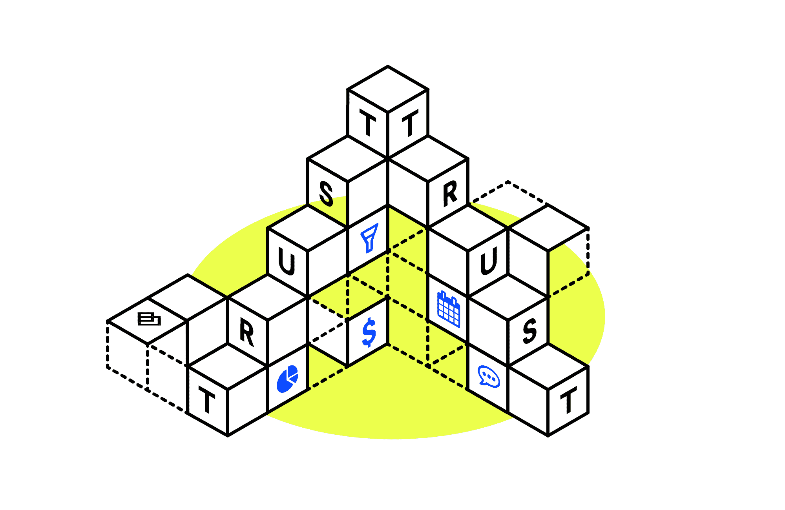
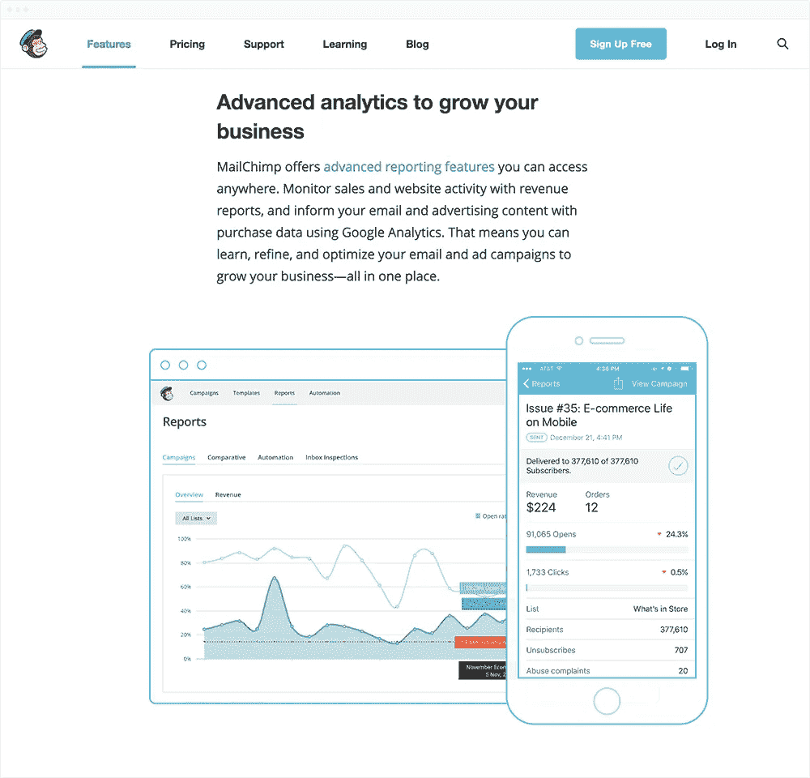
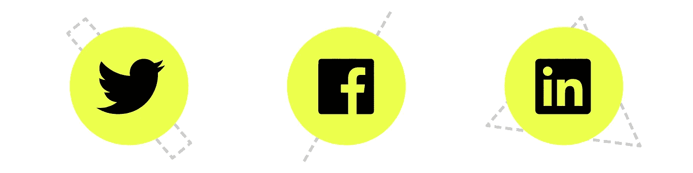
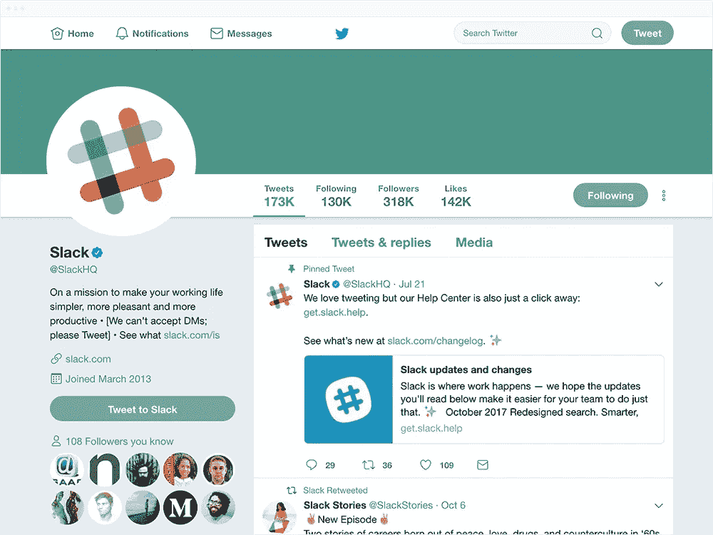
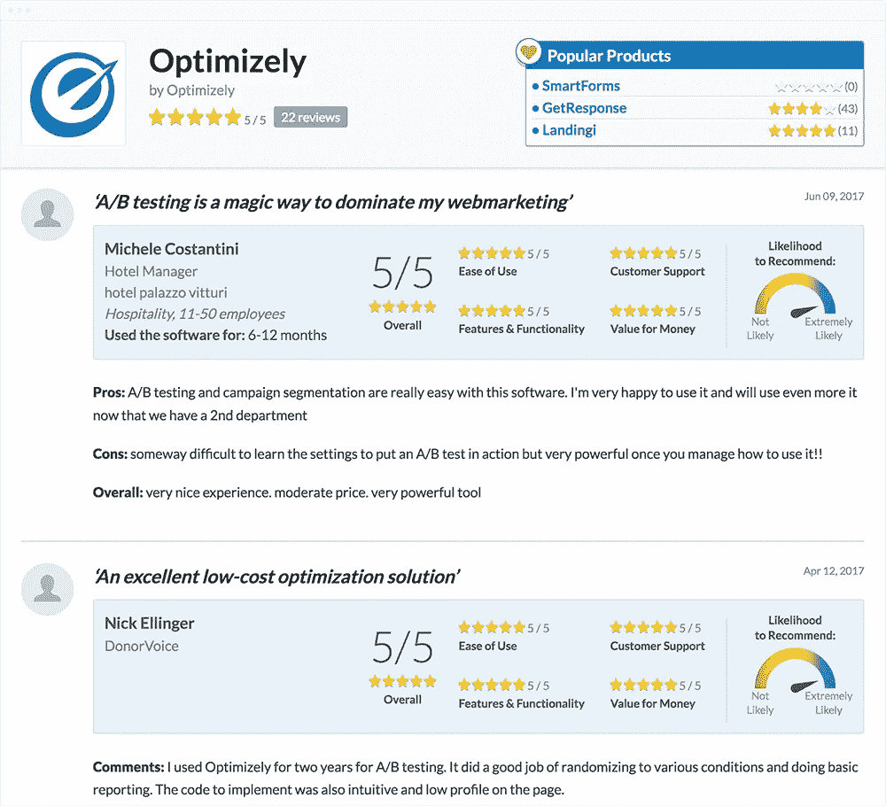
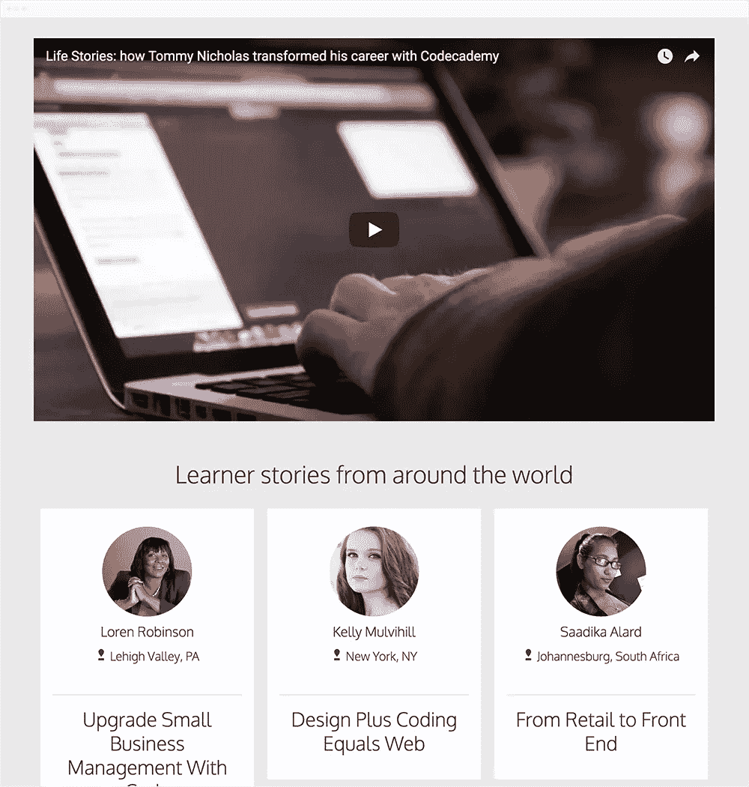
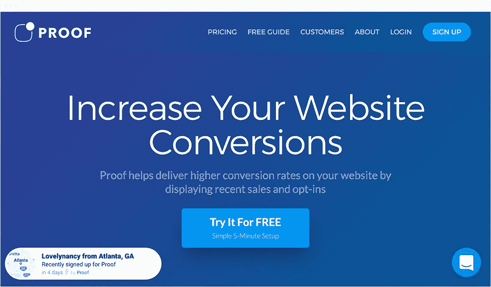
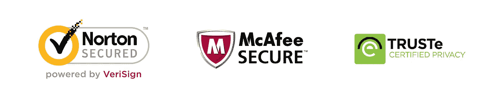
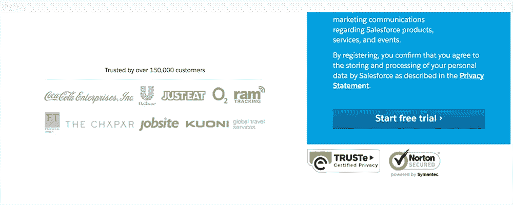

# 如何让用户信任一个 SaaS

> 原文：<https://medium.com/swlh/how-to-build-trust-in-saas-51917870e0c0>

## 如何在 B2B 网站上建立信任

让我们想象一种可能的情况。两个目标受众相近的品牌，可靠完善的服务，同样牛逼的客服。

其中一个品牌就是你的品牌。另一个是你的竞争对手。

那么，你认为用户应该选择哪一个呢？

你可能认为它是更便宜的。但实际上，研究表明，低价有时可能会阻止用户购买便宜的品牌，让他们选择更贵的品牌。

你可能认为它是上市时间更长的一种。但事实上，许多新产品，如网飞或 Spotify，很快就成为了热门产品，远远超过了老玩家。

或者你可能认为这一切都必须基于用户的个人偏好。但是，尽管我们喜欢把自己和用户看作独特的个体，社会心理学家会告诉你，人们往往倾向于以某种可预测的方式行事。

可以预测，顾客会选择他或她更信任的品牌。

信任是最难获得也最容易失去的东西之一，没有一个好的理由是绝对得不到的。但是，每个品牌都可以使用一些屡试不爽的方法来激发客户信任，增加参与度，并将更多线索转化为销售额。它们是什么？

## **1。产品描述**

当用户第一次接触你的产品或服务时，他们往往不太了解它是如何工作的，它是什么样子的，它的价格是多少……有时他们甚至不知道它是做什么的！确保你没有留下这样的盲点，因为透明和信息可以培养信任。关于产品或服务的信息越多，他们就越愿意把钱托付给你。

根据 Adweek 报道的[研究](http://www.adweek.com/digital/81-shoppers-conduct-online-research-making-purchase-infographic/http://www.adweek.com/digital/81-shoppers-conduct-online-research-making-purchase-infographic/),超过 80%的购买者在购买产品前会进行网上调查。更重要的是，超过 40%的购买者在他们的方法上是有条不紊的——他们分析可用的选项，并根据事实和数据做出决定。所以，想想你想提供的价值，用数字来支持，然后说出来！

See how [Mailchimp](http://www.mailchimp.com/‎) does this? One by one feature description, a link to get more details and a real-life image.

## 如何用产品信息建立信任？

*   提供产品或服务的详细信息(特色、
    外观&感觉、功能和费用)。
*   定期发布产品更新信息，确保您的产品正在开发中。

👉提示:不确定如何创建知识库？
寻找 [KnowledgeOwl](https://www.knowledgeowl.com/home) 、 [Zendesk](http://www.zendesk.com) 或 [Freshdesk](https://freshdesk.com/) 等软件。这些应用程序不仅能帮助你建立知识库，还能提供强大的知识库，告诉你如何一步一步地做到这一点！

## **2。社交媒体**

产品页面或知识库是有效的信任建立者，但是它们有一个严重的缺点——不是每个人都会访问它们。但是有些网页几乎每个人都会定期访问。想想推特。脸书。Instagram。它们都可以帮助你与那些从未听说过你的访问者建立信任。那些关注你的社交媒体的人，不管是主动还是被动，都表明他们认可你的品牌。他们的支持可以帮助你说服更多的人信任你。你需要的是一个账户，一些相当有规律的活动和一个不断扩大的追随者圈子。

正如蒂莫西·亚历山大在他关于社交媒体的文章中所说，

> “社交媒体不仅仅是向客户销售的一种方式。这是一种联系、创建社区、建立信任和忠诚度的方式。(……)开始与客户建立关系，停止向他们销售。当你建立了信任和忠诚度，销售就会到来。”

## 如何与社交媒体建立信任？

*   让访问者关注你的频道。你的追随者越多，其他人加入的可能性就越大，因此——他们对你的品牌就越信任。
*   定期发布娱乐内容。越多人喜欢你的内容，他们就越有可能分享和喜欢你发布的内容，从而进一步增加信任。
*   如果和你的帖子没有互动，就不要那样离开。让你的团队分享和喜欢，然后你的追随者更有可能做同样的事情！

Noticed the number of likes and shares there? [Slack](https://slack.com/) surely knows how to do this right!

## **3。产品评论**

让我们面对现实吧。用户通常对美化你的惊人产品及其完美特性的描述保持警惕——尤其是如果你是写这些描述的人！你可能是软件方面的专家，但你不是独立的专家——至少在你的客户眼中不是，他们可能会认为你是某个恶作剧的金钱驱动的所有者，只想卖出去赚更多。另一方面，你现在的客户看起来和他们站在同一边，只能说很多他们对你的软件的真实体验。

没有什么比现实生活中的体验更好，所以如果客户对你的应用或网站有过愉快的体验，确保他们大声说出来。如果一篇评论是相关的，并且清楚地展示了使用你的应用程序的好处——它肯定会在读者中建立信任。当它发布在第三方网站而不是你自己的网站上时，可能会更加有效。

[Capterra’s](https://www.capterra.com/) reviews really help to get valuable information about the product and review writer.

## 如何用点评建立信任？

*   保持评论的价值:观点是伟大的，尤其是如果它们是积极的，但是不要忘记事实！如果评论集中在客户喜欢的功能上，并解释了原因，这显然比缺乏流动性的“我爱这个应用程序”更有助于建立信任。"
*   保持评论的独立性:让它们像其他第三方网站一样在目录(Getapp.com、Capterra.com)、留言板、友好网站中自由游荡。

👉提示:尽可能多的查阅目录和网站。展示你品牌的列表越多，你的潜在用户发现和信任它的机会就越大！这里有一些 [SaaS 目录&评论网站以及如何在那里上市](https://kraftblick.com/blog/60-saas-directories/)。

## **4。感言**

有一件事比评论更有效。这是由你所在领域的关键人物或著名专家撰写的评论。如果这样的人认为你的服务很棒，你很快就会拥有他们的粉丝和追随者(很快就会有你的客户)——也是这么想的！

在任何一家公司，推荐对于建立信任都是非常重要的。正如 Yoast 报道的那样，推荐比信任印章甚至这个商店的整体声誉更能影响一个在线商店的可信度。但是为了赢得信任，它们需要对读者有价值。有时甚至负反馈也能起作用。

[Codecademy](https://www.codecademy.com/) has it more captivating, with video testimonials and personal stories

## 如何用推荐书建立信任？

*   保持个性化:客户提供的个人信息越多越好。如果每份证明都提供了写它的人的照片，他们的名字和职位，而不仅仅是一些昵称或名字，那么它将更值得信赖。
*   保持相关性:推荐与潜在用户的目标和需求越相关，就越能赢得信任。一份值得信赖的证明不太关注业务，而更关注使用你的产品或服务的积极结果。它会说，例如，你的产品或服务如何帮助提高其他企业的盈利能力或接受度。
*   保持方便:证明通常采取简短的书面形式，但是视频证明可以帮助你建立更多的可信度。在视频推荐中，不仅仅是说了什么，还有如何说。如果你的用户充满自信地谈论你的产品，这可能也会被观众注意到，并有助于激发更多的信任。

## **5。最近活动通知**

许多访问你网站的人只是四处看看，收集信息，并不信任，也没有足够的准备去订阅、注册试用或购买产品或服务。但是如果他们看到其他人也这样做…他们会不会觉得更安全，更愿意信任你？

哦，是的，他们会的。心理学家称之为社会证明的一些简单技巧可以为你创造奇迹，显示出如此多的其他访问者正在实现你的转变目标！如果你显示关于目前已经做了什么来改善你的服务的信息……或者仅仅显示系统状态，就像 [Typeform](https://www.typeform.com) 所做的那样，也可以达到类似的效果。更多信任在… 3… 2… 1…内激活。

## 如何用通知建立信任？

*   告诉你的访客刚刚达到的转化目标！
*   显示有关新版本、更新、调试等的信息。一旦它们被你的开发团队发布
*   通知系统状态，并确保它在大约 99%的时间内“开启”

[Proof](https://www.codecademy.com/) helps to increase trust by notifying your visitors what other users have done

👉*提示:你可以使用这些应用程序来显示活动通知:* 1。[Fomo](https://www.usefomo.com/) —使用 Fomo，您可以显示您的用户做了什么(注册，升级到更高的计划)和您做了什么(软件更新)
2。[证据](https://useproof.com/)—您可以显示用户活动通知，设置只需几分钟

## **6。信托印章**

访问者最常见的焦虑之一是业务可靠性，这在 SaaS 公司中更加突出，这些公司将敏感数据存储在云中。在线支付也是如此，必须提供所有这些个人信息……这些往往是阻止潜在客户信任你并把钱交给你的决定性因素。

许多类似于[这个](https://www.crazyegg.com/blog/trust-seal-ecommerce/)的研究表明，一个确保安全支付的信任印章或一个诱导信任的标志可以决定是否购买你的产品。向您的用户保证，他们的数据是加密的，页面是安全的，支付方式是安全的，可以立即提高信任度。

## 如何与海豹建立信任？

*   在重要的字段和 CTA 旁边使用印章，并选择熟悉的品牌，如 Visa-Mastercard、PayPal、Norton 和 Google，以使其信任诱导效果更大
*   以诱导信任的标志为特色，如 Braintree 或 Recurly，以表明支付是安全的

[Salesforce](https://www.salesforce.com/) places two security seals right next to a CTA button.

👉小贴士:把你的印章放在正确的地方。仅仅在你的网站或登陆页面上有一个信任印章就能提高消费者的信心，但它们的位置也同样重要。将信任印章移近销售线索捕获字段将有助于唤起输入敏感信息的用户的更多信任。把它们放在页眉或页脚，让你的潜在买家永远看得见。

## **所以一切都归结于…**

信任。如果你的潜在用户不信任你的产品和品牌，他们就不会成为你的客户。这 6 种方法可以帮助你快速增加客户对你品牌的信心，提高参与度，增加销售额。

但是还有一件事可以帮助你，那就是理解你的用户:他们的需求、期望和恐惧。如果你知道这些是什么，你可以用你自己的建立信任的策略来充分地回应它们。

例如，如果你的用户关心在线支付，用户通知和徽章可能是必须的。如果他们担心你的产品不容易使用——确保你有足够的评论说它是容易使用的！如果产品还不流行，他们可能害怕未知——建立你的社交网络，或者尝试从一个受欢迎/受尊敬的客户那里获得一些推荐。这里有一个简单的 9 步框架，可以帮助你更好地了解你的用户——(你也可以用它来写你的 UVP！):

 [## 以用户为中心的设计画布——第一个将用户需求与商业目标相结合的 UX 工具

### 以用户为中心的设计画布(UCDC)是一个易于使用和有效的 UX 工具，用于分析，组织和促进…

ucdc.therectangles.com](https://ucdc.therectangles.com/) 

你在你的网站上尝试过这些方法吗？或者你用过其他成功的方法吗？我很乐意在评论中读到你的经历！:)

## 这个故事发表在《创业公司》杂志上，有 260，100 多人聚集在一起阅读 Medium 关于创业的主要故事。

## 在这里订阅接收[我们的头条新闻](http://growthsupply.com/the-startup-newsletter/)。

