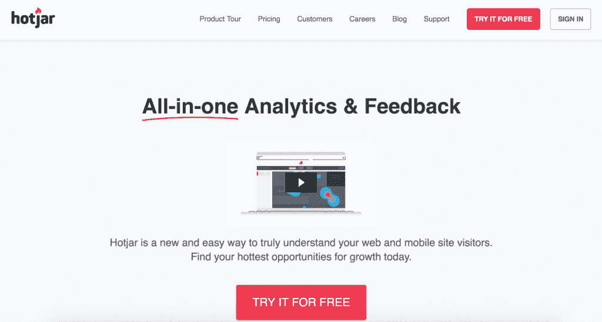
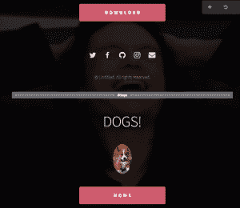
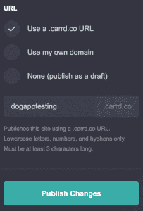

# 如何在 1 小时内建立你的第一个登陆页面

> 原文：<https://medium.com/swlh/how-to-build-your-first-landing-page-in-under-1-hour-aedab57190e>

[柏林自举](https://www.davidemcneill.com/2017/11/28/birth-berlin-bootstrappers/)于 2018 年 1 月 16 日在 [Kontist GmbH](https://kontist.com/) 的办公室举办了其[第三届活动](https://berlinbootstrappers.com/2018/01/vol-3-ideation-validation-landing-page-creation/)。随着 [Eventbrite](https://www.eventbrite.com/o/berlin-bootstrappers-15985223735) 加入我们寻找参与者的渠道，包括[脸书团体](https://www.facebook.com/groups/1460460574045605/)和 [Meetup](https://www.meetup.com/Berlin-Bootstrappers/) ，我们能够获得 100 多张门票预订，有近 50 人出席！更棒的是，90%以上的与会者都是第一次来！我从未想过，我会从去年 10 月和 15 个密友一起喝酒聊天，变成几个月后第三次活动中的近 50 人。看到柏林自举队在过去的四个月里成长真是令人难以置信，我迫不及待地想看看 2018 年对这个团队来说意味着什么！

我在第三个活动上的演讲名为“建立你的第一个登陆页面”，讲述了我最近为我即将出版的关于在日本找工作的书制作登陆页面的过程。我演讲的目的是向人们展示获得一个登录页面是多么容易，这样他们就可以迈出创业的第一步。我建议尽快为你的项目设计一个登陆页面，这样你就可以马上开始吸引流量，测试用户如何在上面转化，并开始建立一个受众群。

如果您已经注册了必要的服务，并准备好了副本和资产，那么您可以在一个小时内快速创建一个登录页面！事实上，本周早些时候，我刚刚为我的新项目《外籍人士帝国》做了这件事。让我来告诉你如何制作你自己的，但是在我们开始之前，让我们确保我们在登陆页面的话题上是一致的。

# 登录页面概述

登录页面是访问者访问网站时看到的第一个网页。虽然它可以是网站访问者首先到达的任何页面，但在许多情况下，它是主页。在这篇文章中，我将讨论只有一页供用户登陆的单页登陆页面。这意味着来自所有渠道的用户将在开始时看到完全相同的登录页面。无论他们是来自社交媒体上的链接、搜索引擎，还是通过口碑推荐，所有的访问者都将登陆同一页面，所以你需要确保你的文案与你的目标客户对话，但仍然保持足够的概括性，不会拒绝其他可能不符合你预期的用户。

登录页面应该让用户了解你的产品优势，以及为什么他们应该关心你将向他们提供什么。大多数自举企业都有竞争，所以详细说明你的产品与你所在领域的主要企业有何不同是个好主意。例如，当我评估网络上已经存在的与外国人相关的内容时，我注意到大多数内容分散在几十个小型个人博客上，大多数文章缺乏任何真正的见解，不值得与对在特定国家工作感兴趣的人分享。基于这种认识，我决定开始一个播客系列，编写国家指南，包括前面提到的关于在日本工作的书，并最终建立一个外籍人士社区，为希望在国外生活和工作的人提供可行的建议，帮助他们实现梦想。我把我的登陆页面重点放在突出听众可以从《外籍人士帝国》中得到的可操作的建议上，希望它能吸引我的目标群体，即现在的或即将成为外籍人士的人。

# 登录页面示例

登陆页面最重要的部分是一个伟大的行动号召(CTA)。好的登录页面会驱使用户去做一些事情，并且是围绕着如何最好地吸引用户去做这些事情而设计的。通常情况下，一个登陆页面有一个醒目且颜色漂亮的按钮，作为设计者，你希望用户点击这个按钮。通过正确的设计、文案和价值主张，CTA 可以成为决定其成功的登录页面的唯一组成部分。在一些真实世界的例子中更容易看到这一点，所以让我们来看看！

# 我会教你变得富有

我想给你们看的第一个例子是 Ramit Sethi 的[我会教你变得富有](https://www.iwillteachyoutoberich.com/)登录页面:

快速浏览完左边的照片后，你的目光移向标题“你知道你的收入潜力吗？”在浏览“开始测验”CTA 之前。页面上的其余信息被有意地做得更小，更不分散注意力，这样用户就会被吸引去点击 CTA。

点击按钮后，用户将被引导填写 7 步测验，然后输入他们的姓名和电子邮件地址以获得测验结果。我猜想 Sethi 先生的最终目标是获得用户的电子邮件地址，他将根据从登陆页面到 7 个步骤中的每一个步骤以及最后的电子邮件订阅表格的转化率来评估漏斗的成功。通过激起用户对登录页面上的测验的兴趣，参与的用户将进入快速简单的测验漏斗，沿途提供有价值的个人信息。一旦他们投入了必要的时间来完成测验，用户可能会重视收到测验的结果，从而在表单中输入他们的电子邮件地址。

# 热罐

从软件即服务(SaaS)的角度来看，另一个值得关注的例子是 [HotJar](http://hotjar.com/) 登录页面:

HotJar 是一家自举式分析公司，我相信他们已经利用他们的 A/B 测试能力来开发一个非常吸引人的登录页面，以获得新客户。即使看一眼，两个红色的“免费试用”按钮几乎会跳出屏幕，让第一次访问的人直接决定开始注册。CTA 很简单，但是没有理由让您希望用户在页面上做的事情复杂化。通过其副本、颜色和位置使 CTA 按钮脱颖而出，然后强调该产品可以免费测试的事实，然后坐下来(希望)让注册开始流入！

现在，您已经看到了一些实例，让我们开始构建您自己的登录页面。

# 规划您的登录页面

在着手制作一个新的登陆页面的具体细节之前，你应该考虑一下为什么要制作一个。登录页面主要用于 1)宣传您的产品，2)验证想法，3)推动销售、注册或任何其他您希望用户采取的行动。我认为在你计划的产品发布前几个月建立一个登陆页面是很好的，这样你就可以开始建立对它的兴趣，增加流量，看看人们对它的反应，如果所有迹象都很好，就向一群热切的初始用户发布产品。

正如我上面所描述的，每一个登陆页面驱动用户做一些事情是至关重要的。现在你的工作是确定想要的行动是什么。它可以是注册一个电子邮件列表，购买一个产品，下载一个应用程序，参加一个测验，注册一个帐户，或者你可以推动用户在你的网站上做的一百万件其他事情。如果你不确定如何驱使你的访问者去做，我建议默认让用户注册一个邮件列表。这将允许你建立一个受众群体，一旦产品准备上线，你就可以直接接触到他们。

# 域名，托管和网页建设者

现在你知道了为什么你要制作一个登陆页面，以及你想让用户在上面做什么，我们将很快完成构建、托管和制作它的步骤！

# 挑选域名

我想强调的是，决定域名的第一步不应该占用你太多的时间！虽然从一开始就为你的网站精心挑选一个完美的名字可能很诱人，但这只是你最初的登陆页面。作为一个单页网站，你不太可能出现在任何谷歌搜索结果中。你甚至可以选择不发布最终产品，并在它没有得到你最终想要的吸引力后放弃登陆页面。如果你以后想改变域名，你可以随时购买另一个便宜的 10-15 美元/年的域名，所以不要在决定使用域名时感到麻痹。

如果你确实想做一些研究来挑选名字，那么就把你要制作的登陆页面的概念拿出来，想出几个与主题相关的关键词。去像 [Google Trends](http://trends.google.com/) 和 [KWFinder](https://kwfinder.com/) 这样的网站，看看哪个关键词带来的流量最大。将最热门的关键词组合成一个有意义的短语，然后前往 [launchaco](https://www.launchaco.com/name) 看看。com 域和社交媒体句柄仍然可用。你绝对可以选择. net。co 或。如果你喜欢的话，可以使用 io 域名，但是我认为如果可能的话，最好使用. com，这样其他人就可以尽可能容易地找到你(这可能意味着围绕你的公司名称的竞争会更少)。如果初始。您可以尝试更改单词的顺序或添加另一个短单词来查找仍然可用的. com。

# 购买域名，托管和登陆页面生成器

有很多公司出售域名、主机和网站建设服务，其中大多数都提供这三种服务。以下是一些专门从事这些领域的公司的例子:

你可以选择一家公司来提供这三种服务，但是选择不同的公司会更便宜。老实说，我是根据价格来做决定的。我选择了 HostGator，因为如果我预付三年的托管服务，我就可以获得一笔很好的签约交易。我从包括 HostGator、GoDaddy 和 Namecheap 在内的多家公司购买了基于最便宜价格和注册促销的域名，然后将它们作为附加域名全部添加到我的 HostGator 帐户中。

为了构建登录页面，我决定使用 Carrd，因为它使用起来很直观，有很棒的功能集，而且非常便宜。试用该产品的免费版本，一旦您对它感到满意，就可以升级到 pro 帐户，这样您就可以使用自定义域名(就像您刚刚购买的那个)，MailChimp 和其他电子邮件提供商的注册表单，Stripe 等 widgets 支付服务，几个漂亮的登录页面布局以及更多功能，而每年的费用仅为 19 美元。我并不隶属于 Carrd，但我认为这项服务物有所值。

# 使用 Carrd 构建您的登录页面

现在所有的服务都已经设置好了，可以开始使用了，我将通过 Carrd 详细介绍如何构建一个优秀的登录页面。

# 步骤 1:选择基本页面布局

一旦你决定用 Carrd 建立一个登陆页面，你就会看到多个布局选项。你的布局选择应该取决于你想通过你的登陆页面传达什么。有独特的设计来展示一个新的业务，展示产品发布前的倒计时，介绍你和你的工作，等等。选择一种布局，使您能够轻松地根据您的使用案例对其进行定制。

# 第二步:制作你的文案

单击页面上的文本框，编辑默认文本并调整设置，如字体、颜色和粗细。牢记你的目标受众，尽可能地精简文案，用最少的话表达你的观点。

# 第三步:添加漂亮的免费图片

图片胜过千言万语，所以明智地添加图片来吸引访问者的注意力。我建议使用来自像 [Flickr](http://flickr.com/) 、 [Pexels](http://pexels.com/) 和 [Pixabay](http://pixabay.com/) 这样的网站的知识共享许可下的免费照片，以获得高质量的图像来推广你的产品。如果你需要编辑这些图片，使用免费版本的 Canva T7——这是我迄今为止遇到的对我的企业最有用的服务之一！

# 步骤 4:使用容器布局内容

你在 Carrd 上得到的默认布局非常好，但如果你想添加额外的文本字段、图像或其他小部件，那么你可能需要做一些自定义的拖放布局工作。控制元素在页面上如何显示的一个好方法是使用容器。通过顶部菜单中的“+”按钮添加一个容器，并放入您希望保存在该容器中的所有内容。然后，您可以为整个容器设置宽度、填充和边距等选项，以便内容以您喜欢的方式显示在页面上。

# 第五步:完善你的 CTA

你必须让你的 CTA 有完美的副本、颜色和大小来吸引你的访客点击它！确保 CTA 按钮文案简短、切中要点，但考虑到页面上的内容，也要有意义。我在日本海外工作登录页面上对该规则的一个例外是，我决定在最初的登录页面上使用 CTA“立即购买”,然后是电子邮件订阅提示，以便我可以评估访问者是否至少有足够的兴趣潜在地购买该产品，即使我还没有任何东西可以出售给他们。有些人建议直接从登录页面付款，只告诉付款人，在你拿到钱后，产品还没有准备好发货，但我宁愿通过电子邮件向这些用户展示我的书和其他内容随着时间的推移将提供的价值，而不是强迫他们在了解更多关于我的信息以及他们希望从购买中获得什么之前就拿走他们的信用卡。

# 步骤 6:添加更多页面(如果需要)

虽然 Carrd 提供了单页登录页面，但是您可以在该页面上添加分节符，这样您就可以对访问者隐藏网站的某些部分，直到他们单击相应的按钮来显示它们。例如，如果您希望在网站上有一个单独的“关于我”部分，您可以将初始登录页面中的一个按钮链接到该部分，以便只有感兴趣的用户才能看到它，然后您可以将另一个按钮链接回“关于我”部分的主页视图。

为此，您必须再次进入“+”菜单，并单击右下角的“控制”按钮。这将允许您为页面添加分节符和名称。在我的例子中，我选择了名为“#dogs”的部分。然后，我在链接到 URL“# dogs”的主要部分放置了一个下载按钮，在链接到“#home”的新部分放置了另一个按钮，这是登录页面初始部分的默认名称:

这将使感兴趣的用户能够看到页面的不同部分，然后再次回到页面的主要部分，有效地在一个页面内创建多页登录页面。

# 步骤 7:添加联系人和注册表单

通过在您的页面上添加联系表单，让访问者可以方便地联系您并表达他们对您的产品的兴趣。将此表单放在主页上的“联系”链接后面可能是有意义的，该链接会将他们与表单一起发送到网站的特定部分。

对于那些对添加电子邮件注册表单感兴趣的人，您还可以选择与 MailChimp、Revue、ConvertKit 和 MailerLite 的内置集成。我使用 MailChimp 是因为你可以免费给多达 2000 名订户发送电子邮件，所以我通常会在 MailChimp 中创建一个特定的列表，将感兴趣的订户添加到该特定项目中，然后开始为我的产品建立受众的过程。

# 第八步:支付和其他小工具

如果你想在你的登陆页面上增加访客付费的功能，Carrd 可以与 Stripe、Gumroad 和 PayPal 集成。您还可以添加一个脸书“喜欢”小部件以及一个字体小部件，这将有助于您从访问者那里调查和获取其他信息。如果你想收到付款和客户反馈，从一开始就把它们整合起来！

# 上线啦！

一旦你完成了对你的文案、图片、布局和插件的修改，是时候让全世界看到你的新登陆页面了！通过点击老式的软盘形状的按钮来发布页面，你将被要求给你的页面一个标题和描述。这两个字段对于 SEO 都非常重要，因为它们的内容将决定用户在 Google 搜索结果中偶然看到你的登陆页面时会看到什么。不要在这里花太多时间，但至少输入一些与你网站内容合理相关的东西。

接下来，在高级选项下，您可以输入一个 Google Analytics ID 来跟踪您登录页面上的用户行为。我建议在网站上线之前这样做，这样你就可以看到从你启动页面之日起的所有跟踪数据。

最后，一旦您对所有内容进行了三重检查，您将能够选择使用. carrd.co 域名还是您自己的域名:

如果您使用先前购买的域名，请选择“使用我自己的域名”，在框中输入 URL，然后更改您用来注册该域名的网站上的 CNAME 和 A 记录。不要担心，Carrd 仪表板上有大量指南，向您展示如何在众多注册服务商的界面上执行此操作。完成这些更改后，点击“发布更改”按钮，很快您的登录页面将面向全球用户开放！

# 下一步是什么

现在您已经有了一个活动的登录页面，是时候按照您创建它的目的来使用它了！

*   如果你制作网页是为了宣传你的产品，你可以先把它放在你的社交媒体档案上，给潜在用户和合作伙伴发电子邮件，在相关博客上留下评论，并链接到你的网页，联系相关领域的影响者告诉他们，等等。
*   如果你想验证一个想法，那么通过 Google AdWords、脸书广告、Instagram 广告或其他平台来增加页面的付费流量，看看用户是如何转化的，这可能是一个好主意。让用户访问你的页面要花多少钱？这些用户是否采取了您希望他们采取的行动，如果是，让每个用户这样做平均需要多少成本？这些见解可以帮助你决定是否推进你的商业想法。

不管你的目标和最终结果如何，为自己走到这一步而感到欣慰吧！大多数人甚至没有进入这个过程的登录页面启动步骤，因为他们害怕把自己放在那里，所以在回去工作之前花一分钟考虑一下你的成就😉

# [演示幻灯片](https://www.slideshare.net/DavidMcNeill3/how-to-build-your-first-landing-page-in-under-an-hour)

你可以在这里找到[演讲的幻灯片。](https://www.slideshare.net/DavidMcNeill3/how-to-build-your-first-landing-page-in-under-an-hour)

*原载于 2018 年 1 月 27 日*[*www.davidemcneill.com*](https://www.davidemcneill.com/2018/01/27/how-to-build-your-first-landing-page-in-under-1-hour/)*。*

## 这个故事发表在 [The Startup](https://medium.com/swlh) 上，这是 Medium 最大的企业家出版物，拥有 290，182+人。

## 在此订阅接收[我们的头条新闻](http://growthsupply.com/the-startup-newsletter/)。

