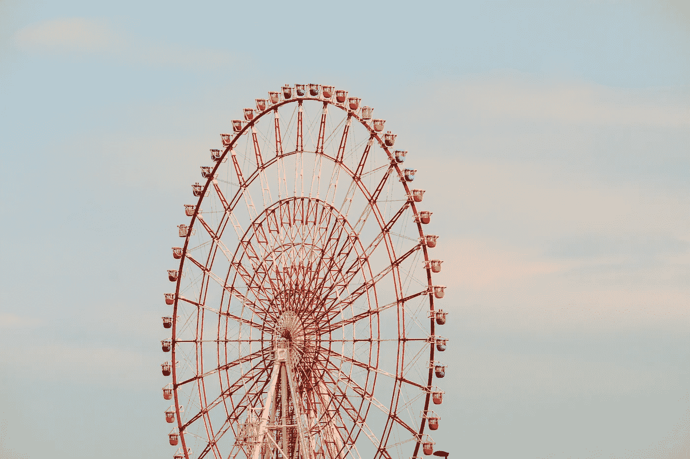

# 如何建立自己的生产力系统

> 原文：<https://medium.com/swlh/how-to-build-your-own-productivity-system-445a51b89c12>

一天总有 24 小时。对于这个星球上的每个人来说，时间是唯一完全相同的资源。这就是为什么有效的时间管理是如此珍贵的技能。知道如何组织你的生产力和工作会让你比其他人更有优势。你成为时间的*法师。*

但也是很难得的技能。有效的时间管理很难。有些人有某种系统在…