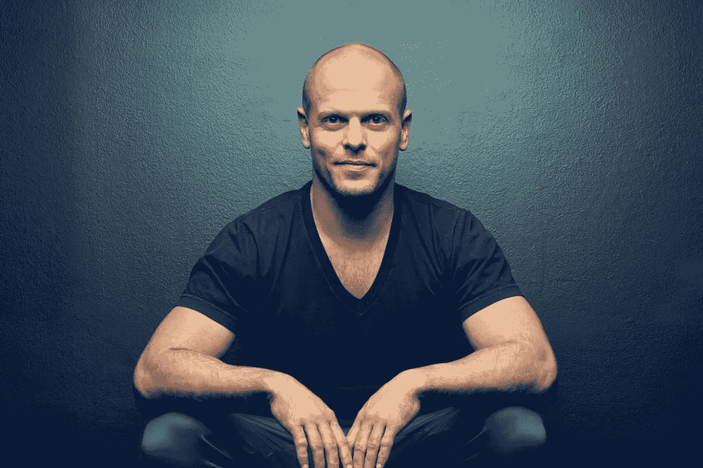

# 如何绕过“10，000 小时”的路线走向精通

> 原文：<https://medium.com/swlh/how-to-by-pass-the-10-000-hours-route-to-mastery-12d9d6d9e1e4>

Photo by [Jared Rice](https://unsplash.com/photos/NTyBbu66_SI?utm_source=unsplash&utm_medium=referral&utm_content=creditCopyText) on [Unsplash](https://unsplash.com/search/photos/workout?utm_source=unsplash&utm_medium=referral&utm_content=creditCopyText)

10，000 小时规则是建立精通(在任何领域)的许多经验规则之一。)根据这个规则—

> 要成为任何领域的世界级人物，都需要 10000 小时的“刻意练习”。

虽然这条规则符合我们人类的普遍认知

> 努力=结果

这不一定是真的。

向您隆重介绍，[蒂莫西·费里斯](https://tim.blog/)。

Source — Google Images

他是世界级的作家、演说家、企业家和多语者(懂得并能够使用几种语言的人)，他没有在这些追求上花费 10，000 小时。

事实上，蒂姆是最佳极简主义的坚定支持者。

他达到精通的过程完全是革命性的—

# 解构

Photo by [Michał Parzuchowski](https://unsplash.com/photos/geNNFqfvw48?utm_source=unsplash&utm_medium=referral&utm_content=creditCopyText) on [Unsplash](https://unsplash.com/search/photos/construction?utm_source=unsplash&utm_medium=referral&utm_content=creditCopyText)

通常，通往精通的道路包括许多方面。不要把你的注意力分散在所有这些方面，明智的做法是把这个过程“解构”到最基本的部分。

例如，如果我想精通在媒体上写作。我需要明白写作不仅仅是*写作。当我解构这个过程时，我脑海中浮现出一些不可或缺的部分*

*   发展写作风格。
*   营销你的内容。
*   研究你写的主题。
*   吸引观众。
*   定期发布内容。

我确信这个谜题还有更多碎片，但是解构的过程帮助我认识了这些碎片。

# 选择

Photo by [Jess Watters](https://unsplash.com/photos/l3N9Q27zULw?utm_source=unsplash&utm_medium=referral&utm_content=creditCopyText) on [Unsplash](https://unsplash.com/search/photos/tools?utm_source=unsplash&utm_medium=referral&utm_content=creditCopyText)

一旦我们解构了通往精通的道路，我们需要做出艰难的选择。

我们需要尊重 80/20 法则，专注于重要的 20%,那将会给我们带来至少 80%的结果。**这一选择过程至关重要，因为我们可以用最少的时间获得最大的效果。**

如果我们考虑掌握媒体写作的例子，我会选择定期发布内容。

我坚信发表内容将有助于我发展写作风格。没有多少作家定期出版，这将有助于我脱颖而出(间接营销)。如果我定期写一些主题，我每次都会学到一些关于这个主题的东西。在某种程度上，我发表的每一篇文章都在帮助我发展我所关注的主题的知识(*实用*研究)。经常写作会让我的作品在更多人的眼中定位。他们与我的帖子的互动，将塑造我对下一个帖子的想法(*直接*参与)。

因为定期发布内容给了我(在媒体上写作的)各方面的额外优势，正是这 20%将在我的精通之路上给我至少 80%的结果。

# 定序

Photo by [H E N G S T R E A M](https://unsplash.com/photos/pjJdOE2XBRU?utm_source=unsplash&utm_medium=referral&utm_content=creditCopyText) on [Unsplash](https://unsplash.com/search/photos/numbers?utm_source=unsplash&utm_medium=referral&utm_content=creditCopyText)

我们做事的顺序改变了游戏规则。通常，我们需要如何达到精通都有指导方针。蒂姆建议我们*质疑*这些指导方针，并*玩弄*我们做事的预定顺序。

在中等写作(或任何形式的写作)中，掌握的一般顺序是—

*   找一个你感兴趣的领域。
*   阅读与该领域相关的内容。
*   写一写那个领域。

然而，在我掌握的过程中，我把顺序打乱了—

*   阅读我感兴趣的内容。
*   写下影响我的内容。
*   写了很多领域之后，我会找到我感兴趣的领域。

这种顺序上的改变确保了我不会被限制在特定的内容上。此外，我觉得这种方法有助于我更经常地锻炼创造力。

# 桩

Photo by [Chris Liverani](https://unsplash.com/photos/MJX7-BAdkt0?utm_source=unsplash&utm_medium=referral&utm_content=creditCopyText) on [Unsplash](https://unsplash.com/search/photos/bet?utm_source=unsplash&utm_medium=referral&utm_content=creditCopyText)

这种方法的最后也是最重要的*部分*是股权。每当我们开始掌握某个特定领域的知识时，我们都需要参与其中

> 如果我们不掌握，我们会失去什么？

掌握知识的个人利益为达到顶峰提供了额外的激励。激励越多，我们找到的掌握知识的创造性方法就越多。

我是甜点的真正爱好者。在我追求成为世界级媒体作家的过程中，我对甜点的享用权岌岌可危。为了掌握中篇，我和自己定了一个约定，连续三天不吃中篇文章会把我吃甜点的时间推迟 15 天。我在利用我对甜点的热爱来推动我迈向中等精通的道路。由于这些利害关系，我发现了许多创造性的方法来更快地发表更好的文章。

# 概括起来

这里是至关重要的 **20%** ，它将帮助你获得这篇文章中至少 **80%** 的知识

*   “一万小时”的成功之路是不现实的，尤其是在这个时代。
*   蒂莫西·费里斯提出了另一条通往卓越的路线，它专注于最佳极简主义(做得更少，得到更多的结果)。)
*   这种方法可以被认为是 DS3(解构、选择、排序和标桩)。
*   将你的掌握方法解构到最基本的部分(基本方面)
*   选择能让你获得至少 80%结果的 20%的方面。
*   质疑推荐的方法顺序，不同的顺序可能更有益。
*   掌握你的赌注。这些股份会给你额外的动力去成功，并培养创造性的方法去超越目标。

**感谢阅读！如果你喜欢这个帖子，请尽情鼓掌，并关注我的** [**中**](/@BITSianIam) **。请留下回复，告诉我如何改进。**

**联系我—**

[Quora](https://www.quora.com/profile/Abhishek-Rathan-Athreya) | [脸书](https://www.facebook.com/abhishek.athreya) | [LinkedIn](https://www.linkedin.com/in/abhishek-r-athreya-69a64688/)

## 这篇文章发表在 [The Startup](https://medium.com/swlh) 上，这是 Medium 最大的创业刊物，有 305，461+人关注。

## 订阅接收[我们的头条新闻](http://growthsupply.com/the-startup-newsletter/)。

