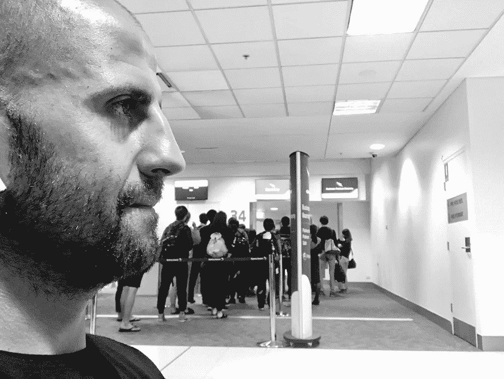

# 如何挑战你的信念来改变重要的事情并提升自己

> 原文：<https://medium.com/swlh/how-to-challenge-your-beliefs-to-change-what-matters-and-improve-yourself-86dbe97308e9>

## 扰乱自己的 7 个策略

直到我们能够质疑自己的想法，培养自我意识，有意识地行动，理解是什么限制了我们，接受它并把它作为一种优势。除非我们——作为个人或组织——掌握了这些领域，否则我们无法改变重要的事情。想学一门很关键的核心技能？挑战你的信念。

以下是一些你可以用来挑战你的信念和思维方式的策略:

# 大中小

今天，思想以光速传播，同样的事情也发生在人们、社区、事件、商业等之间的联系上。我们寻求取悦尽可能多的人，但机会不是创造一个由数字而不是人组成的大量观众。开放是为了建立一个我们可以与之互动的人的小社区，一个有目的的社区。价值在于信任你的人，在于和你想法一样、理解你、支持你的人。其余的完全无关紧要。这样的社区建立在信任的基础上，做我们所说的，说我们所做的，实现我们的意图，并根据社区的价值观行事。

# 注意力是关键

在一个时间似乎越来越少的世界里，你不需要更多的可能性；你需要更多的关注。七年了，注意力持续时间一天比一天短。然而对注意力的需求却不断增长，而且越来越快。它甚至已经成为一种经济，因为顾客、公众、观众、读者或消费者要求相应的“注意力回归”。如果没有回报，他们会离开，我们会变得不那么相关(或者更糟，完全不相关，直到看不见我们)。挑战你的想法，因为你在浪费听你说话的人的注意力。你每时每刻都在失去信心和注意力。

# 修改营销方法

挑战你的信念意味着承认我们的许多努力都是为了寻找产品和服务的市场，然后卖给我们的客户。错误的策略，当人们信任你的时候，当你获得了他们的关注的时候，当你对他们有价值的时候。然后是时候开发他们需要的产品或服务了。而不是创造某一天可能有人会买的“东西”。如果我们改变观念，把精力集中在他们的需求、欲望、期望和兴趣上，而不是我们的，那么好处和结果将是积极的。这就是为什么，当你挑战你的信仰时，你改变了看待世界的方式，以一种非常积极的方式。

# 创造你自己的“产品”

一个常见的误解是生产内容来产生社交网络上的活动。当我每周回顾一次我的社交平台，花几分钟时间看内容时，我看到的是公司和人们努力创造他们喜欢的内容。这是浪费时间和精力。相反，创造你的产品/服务。围绕它展开一个故事，并开始传播它。从短期或长期来看，这将比分享你的周末、工作旅行、名人名言或总是创造自己的“产品”的其他人的内容带来更好的结果。当我谈论产品时，我谈论项目，当然是基于激情、活动、爱好。不要为了出名、喜欢或被接受而行动，要为了达到目的、造成积极影响而行动，要假装真实。

# 你在改变什么？

非常认真地考虑这个问题，无论你有播客、Youtube 频道、餐厅、鞋店还是战略咨询公司。不管怎样，你的工作必须改变人们的某些东西。改变购买习惯，生活方式，交流，旅行，饮食，互动。如果你没有进化哪怕是很小的东西，你就没有做你该做的工作。

# 生活在困惑中

如果每个人都爱你，你就活在一个骗人的世界里。如果没有人质疑你，大多数人都在对你撒谎，或者你做的工作很平庸。我们的思维必须重新解释不适、困惑、不确定、不安、紧张的含义，并将其换成反义词。我们必须明白，支配这些资产会给我们带来我们想要的和平与自由，走寻常路只会把我们引向毁灭。找到不同意你的人，批评你的人，让你回到脆弱的状态。如果你不在边际工作，那就是你在玩安全游戏，这肯定是有风险的。

# 别管那些数字了

分析、统计、博客访客、播客下载、Instagram 和 Twitter 上的粉丝。你赢得的粉丝。有负数有什么用？不知道谁下载了播客？不知道有多少粉丝是你的顾客？了解那些购买你的人是否在社交网络上关注你？我认为所有这些数字在那些钦佩我们伟大的人眼里都是好看的。我认识太多的人，他们的收入比你我高十倍，但他们几乎坚持不到月底。挑战我们的想法是让你周围的人很少，这些人重视你所重视的东西。想象一下你每天影响一个你后来认识的人，一年 365 次影响人，绰绰有余，你不觉得吗？

# 挑战你的信念

如果你不了解你生活的这个世界，你就不太可能重塑自己。有些人生活在希望中，希望所有的东西都能够融合在一起。还有其他人(颠覆者，变革的推动者**，*)，他们正在改变一切，挑战他们的思维，从而挑战这个系统。改变重要的事情。***

***你不觉得是时候挑战自己的信念，信任和投资自己，重塑自己了吗？***

***【*本文首发于*[***isragarcia.com***](https://isragarcia.com/how-to-challenge-your-beliefs)***

# ****只有当你觉得值得的时候，才让这个故事震撼吧！如果你发现任何有价值的东西，请鼓掌。****

> ****Isra Garcia = 55 个客户，44 个企业建议，398 次发言，3.366 篇帖子，24 个项目，6 本书，380 场讲座，6 家公司，16 次冒险，23 次实验，∞失败。到目前为止…****
> 
> ****[有一手](https://isragarcia.com/wp/marketer)。顾问。扬声器。作家。教育家。经理。在 [IG](http://thisisig.com) 的负责人。博主。企业家。颠覆性创新。数字化转型。高绩效者和生活方式实验者。****

# ****行动号召>>点击[此处](http://feeds.feedburner.com/isragarcia)订阅更多类似的文章！****

********

## ****这个故事发表在 [The Startup](https://medium.com/swlh) 上，这是 Medium 最大的创业刊物，有 300，118+人关注。****

## ****在这里订阅接收[我们的头条新闻](http://growthsupply.com/the-startup-newsletter/)。****

********