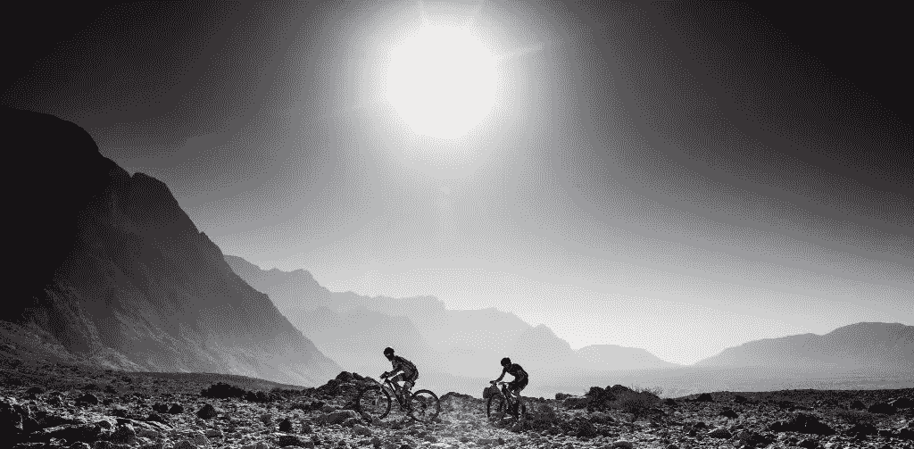
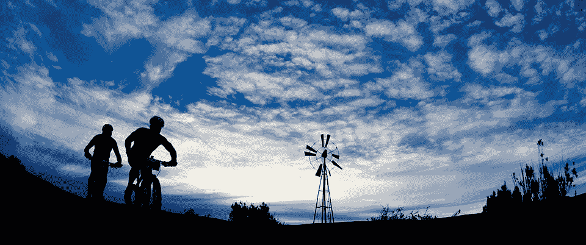

# 如何挑战自己以产生积极的影响

> 原文：<https://medium.com/swlh/how-to-challenge-yourself-in-order-to-make-a-positive-impact-839b2e1e5e82>

## 兰加贫民窟的一个极端挑战(这次我需要你的帮助)

今天，我提出我将要接受的新的社会和极限挑战，质疑我自己，如果可能的话，挑战你。

名字: ***骑到*** 。

2014 年我进行了我的第一次社交挑战， [**燃烧人任务**](https://www.youtube.com/watch?v=Zzbegjy8ENQ) 。这项挑战包括穿越旧金山和黑岩城之间的距离( [**《燃烧的人》**](https://burningman.org/) )，包括三个部分和三种不同的运动。首先是 467 公里的自行车，6 公里的游泳，最后是 100 公里的跑步。总共 573 公里，为了积极的改变，筹集资金帮助 [**音乐之桥**](http://www.bridgesformusic.org/) 在 Langa 建立第一所创业、技术和创新学校。这是一次史诗般的冒险，充满了学习和难忘的时刻。

2015 年，我尝试进行另一项社交挑战，连续三天进行三次铁人三项距离。一个我无法完成的挑战。

2016 年是 [**泰坦沙漠**](http://www.titandesert.com/en/home/) ， [**活的可能性**](https://isragarcia.es/vive-posibilidad-documental) 。第一次是 epic，这是世界上最艰难的山地车挑战，也是我面临的最困难的挑战(骑行 600 公里穿越沙漠)。第二个，我记忆中最美的冒险。

2017 年，我发起了另一种挑战，挑战自己。对抗无为， [**内观静修**](https://www.dhamma.org/es/index) 。

# 一个社会的，实验的和极端的挑战

*Artwork:* [*Charlie Abad Estudio*](http://charlieabadestudio.com/)*.*

去年我访问了兰加，在那里我能够观察到项目的发展和音乐之桥在该地区正在进行的高工作。学校 的 [**项目按部就班，基本准备就绪。缺少最后一个推动，这就是为什么我们决定创建这个实验/挑战/社会倡议。**](http://www.bridgesformusic.org/webapp/BRIDGES-ACADEMY-LANGA-SOUTH-AFRICA-projectDetail.html?id=145)

带着这个目标，2018 年我与华伦天奴一起设计了这个社会项目，同样是出于慈善目的。“燃烧之旅”包括从开普敦到坦库瓦卡鲁沙漠( [**非洲燃烧**](https://www.afrikaburn.com/) )的比赛，全程 320 公里，没有休息。分为公路车 210 公里和胖车 110 公里。与众不同的是，我们将在不休息的情况下禁食，从头到尾不吃任何固体食物。

# 为什么这将是一个实验和一个极限挑战

出于许多原因:

*   我从一月开始就一直在旅行(" [**El Viaje**](https://www.youtube.com/playlist?list=PLEFgG_bSqaFxvbaLrOq4v1-YSg1VURGFr) ")，这让我无法准备该如何准备。
*   我不得不准备的一个月，我不仅没有训练，而且由于手术我一直在休息。
*   停一个月就是停一个月。从下周六到下周六，我必须在身体上和精神上做好准备。
*   现在是时候尝试我通过已经进行的 [**实验**](https://isragarcia.com/social-media-off-experiment) 所学到的很多东西了。
*   这是我第一次在这种距离上禁食。
*   不到最后一分钟，我不知道我会不会这么做。这取决于你和我(解释如下)
*   我带着我的衣服旅行；我带着和我开始时一样的指导方针，轻装上阵，继续前往南非和非洲。
*   事实上，我已经有一年多没有准备这样的挑战了，至少身体上没有。
*   我将用这种类型的极限挑战来测试 [**对高性能**](https://isragarcia.com/daily-high-performance-practices) 的影响。

当然，要做到这一点，我需要你的一点点帮助。

# 你会帮助我/我们吗？

就像我上面说的，我想过找你帮忙，不多，就一点点…

如果我的捐款达到 2000€，无论发生什么事情，我都会参加这次挑战。即使我没有准备，如果是那样的话，我也会完成它。

这就是数学:在这个博客中，像这样的帖子，每天可以达到 1000 多人。如果你们每一个读到这篇文章的人只捐赠三欧元/美元，我们将超越长期目标。我希望不止三个，我希望你能帮助我实现目标并开始这个挑战，但最重要的是，希望你会喜欢在**完成学校建设的想法。我希望你也能传播这个信息，不是为我，而是为那些没有特权的人们，他们应该得到和我们一样的机会。**

# **贡献力量，推动变革，最大化影响，让你的捐赠> >[此处](https://www.justgiving.com/fundraising/ridetoburn) < <**

**反思它，并参与运动。**

# **你想参加吗？**

**如果除了帮助你想成为一个冒险的参与者，成为这个社会和极限挑战的五个人之一，你可以做到这一点，有五个空间可以加入挑战/实验。联系 burn challenge(at)bridgesformusic . org，他们会告诉你如何参与的所有细节。**

**本文最早出现在[**isragarcia.com**](https://isragarcia.com/extreme-challenge-positive-impact)。**

# **只有当你觉得值得的时候，才让这个故事震撼吧！如果你发现任何有价值的东西，请鼓掌。**

> **Isra Garcia = 53 个客户，48 家企业，398 次演讲，3.454 篇帖子，24 个项目，6 本书，380 场讲座，6 家公司，16 次冒险，25 次实验，∞失败。到目前为止…**
> 
> **[营销人员](https://isragarcia.com/wp/marketer)。顾问。扬声器。作家。教育家。经理。在 [IG](http://thisisig.com) 的负责人。博主。企业家。颠覆性创新。数字化转型。高绩效者和生活方式实验者。**

# **行动号召>>点击[此处](http://feeds.feedburner.com/isragarcia)订阅更多类似的文章！**

****

## **这篇文章发表在 [The Startup](https://medium.com/swlh) 上，这是 Medium 最大的创业刊物，有 317，238+人关注。**

## **在这里订阅接收[我们的头条新闻](http://growthsupply.com/the-startup-newsletter/)。**

****