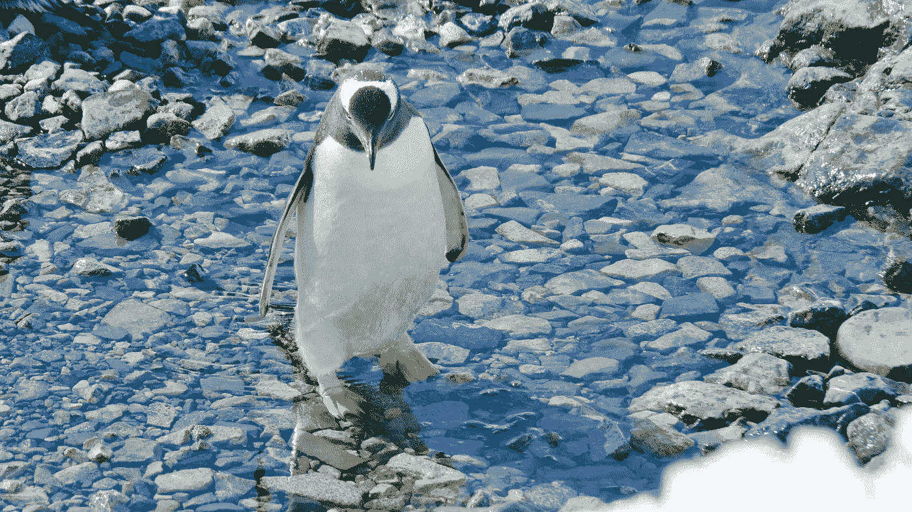
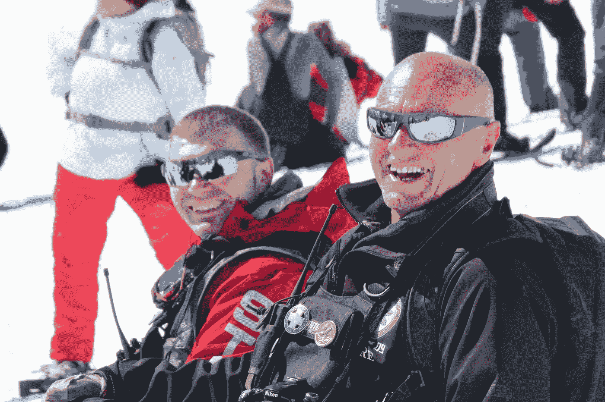
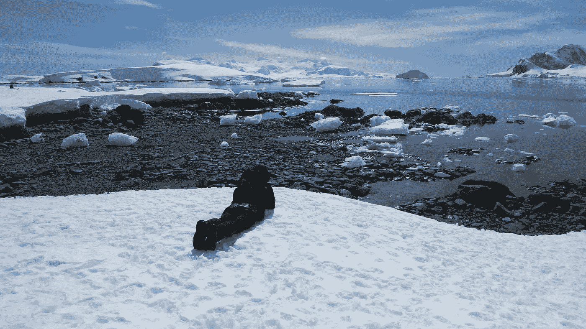
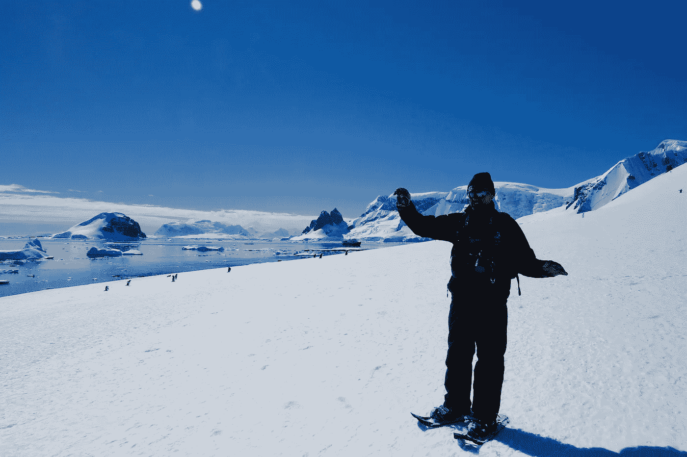
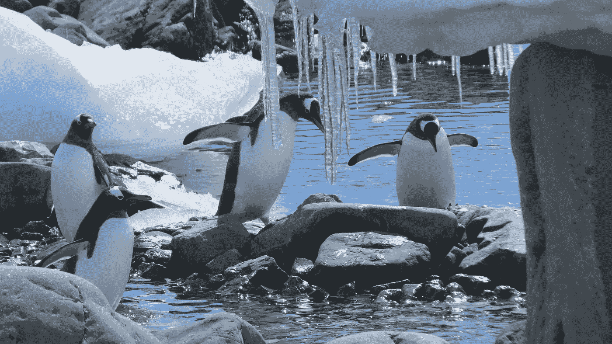

# 你他妈的怎么改变人生方向？

> 原文：<https://medium.com/swlh/how-to-change-your-life-direction-dc67247090c6>

## 怎样才能改变自己的人生方向？很大的问题，对吧！？

[Strategic Steph](https://www.instagram.com/strategicstephtravels/)

> 我他妈的怎么改变人生方向？

光是思考这个问题就可能成为变革的催化剂。

[Strategic Steph](https://www.instagram.com/strategicstephtravels/)

这个问题可以在任何年龄或人生阶段掠过你的脑海；对我来说，它总是在旅行时出现。

临近 2016 年底，我敲定了离婚，年满 30 岁，走遍天涯海角把屎都弄直了。

在南极洲的时候，我学到了很多改变人生的课程，并有幸遇到了比尔·史密斯，一位睿智、多才多艺的苏格兰滑雪巡逻员、艺术家和极地探险向导。

[Strategic Steph](https://www.instagram.com/strategicstephtravels/)

在海上的漫长日子里，当我陶醉在南极洲清澈透明的氛围中时，我问比尔我怎样才能改变我的生活方向。

比尔毫不犹豫地建议说，改变我的人生方向需要一段时间的反思。我不得不停下来，问自己这辈子在做什么，真正花时间去思考我在哪里，我在朝什么方向前进。

> 反思和冥想为激发你的内心、思想和灵魂的改变提供了催化剂。

[Strategic Steph](https://www.instagram.com/strategicstephtravels/)

[斯密斯](http://www.clachtollcottage.co.uk/)教会了我们看、看、想、*做* …听、听、理解和*做*的艺术。

你必须有行动和改变方向的精神和热情——要知道，如果你继续前进，大门就会向你敞开。

> 好奇，不谨慎，质疑一切。

成为一名终身学生，发展技能，无论你走到哪里，都可以向周围的人学习。

[Strategic Steph](https://www.instagram.com/strategicstephtravels/)

你永远也不会知道未来会发生什么，你也无法计划未来，所以跟着你的兴趣走，继续前进。

比尔让我想起并强调了我从离婚中学到的最重要的一课——从失败中学到的要比从成功中学到的多得多。

如果你害怕犯错误，或者太在意别人的想法，你就无法前进，所以当你直面恐惧时，承认并拥抱它们。

[Strategic Steph](https://www.instagram.com/strategicstephtravels/)

比尔永远改变了我的看法，他给了我最后一条建议:

> “记住，这样的早晨将不再存在……所以，充分利用它，并且时刻记住让它变得有趣！”

活在当下，不要害怕跟随你的直觉，追逐你的梦想，为你的幸福而奋斗。

如果你明天死了呢？你对你现在的生活满意吗？

你是唯一一个过自己生活的人，所以不要放弃对恐惧或他人期望的控制。

改变人生方向的力量直接掌握在你手中——那么你的下一步是什么？

[Strategic Steph](https://www.instagram.com/strategicstephtravels/)

你准备好最终将你的旅行梦想变成现实了吗？ [*今天就注册我的简讯*](http://eepurl.com/dylLZf) *，我会把你可以开始环游世界、过上你一直梦想的生活的前三步发给你！*

如果你喜欢这篇文章，请👏并分享给你的朋友。记住，你最多可以鼓掌 50 次——这对我真的很重要。

*我很乐意在*[*insta gram*](https://www.instagram.com/strategicstephtravels/)*，* [*脸书*](https://www.facebook.com/StrategicStephTravels) *，*[*Twitter*](https://twitter.com/StrategicSteph)*，或者*[*LinkedIn*](https://www.linkedin.com/in/stephanielhuston)*！❤*

## 这篇文章发表在 [The Startup](https://medium.com/swlh) 上，这是 Medium 最大的创业刊物，拥有 299，352+人关注。

## 在这里订阅接收[我们的头条新闻](http://growthsupply.com/the-startup-newsletter/)。

