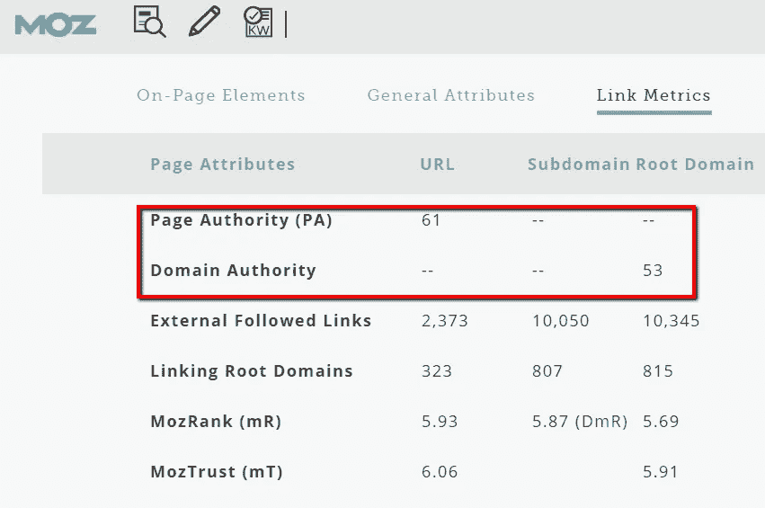
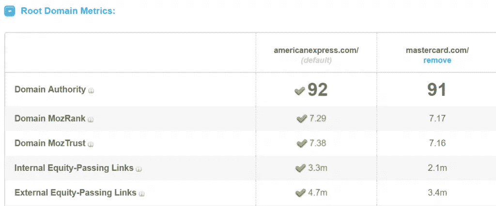
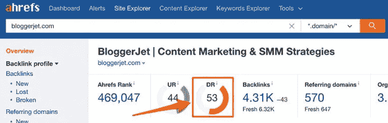
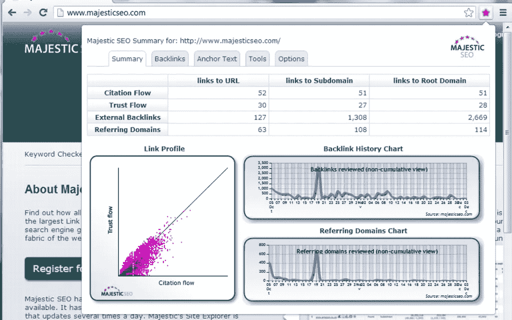

# 如何检查您的域权限

> 原文：<https://medium.com/swlh/how-to-check-your-domain-authority-15f4b71e8038>

## 一些快速告诉你的网站有多少“SEO 排名潜力”的方法。

域名权威(DA)是 SEO 行业中一个方便的启发式指标。简而言之，它根据一个网站拥有的 SEO 权威，提供了对该网站特定关键词排名可能性的洞察。有许多工具可以帮助我们得到这些有用的分数。

**下面，我们总结了一些最准确和直观的方法来查看一个网站的 SEO 净值。**

在一个通常不透明的行业，很少有人了解谷歌的算法如何真正为有机搜索服务，像域名权威这样的指标的诱惑是不言而喻的。

它提供了一个网站 SEO“实力”的一瞥，类似于现在[过时的 PageRank 工具栏](https://searchengineland.com/google-has-confirmed-they-are-removing-toolbar-pagerank-244230)。谷歌仍然在内部使用 PR 算法的一些变体，但它的分数不再对公众可见，也从来没有特别有用。

如果有的话，他们鼓励了一些负面的尝试，通过链接获取来“游戏”谷歌的排名。

然而，许多 SEO 利用域权限来检测其入站链接的质量，并了解这些如何影响他们自己网站的 SEO 健康。

# 什么是域权限？

> “域名权威(DA)是由 Moz 开发的搜索引擎排名分数，用于预测一个网站在搜索引擎结果页面(SERPs)上的排名。域权限分数范围从 1 到 100，分数越高，对应的排名能力越强。
> 
> 通过评估链接根域、链接总数、 [MozRank](https://moz.com/learn/seo/mozrank) 、 [MozTrust](https://moz.com/learn/seo/moztrust) 等来计算域权限。—变成一个单独的 DA 分数。然后，在比较网站或跟踪网站的“排名强度”时，可以使用该分数。”—墨子。

**最终，这是一个有代表性的模型，说明谷歌如何决定哪些页面应该为每个查询排序，以及它们应该以什么顺序排序。**

与“相关性”一词一样，权威涵盖了一个非常广泛的评估领域，可以有多种解释。Domain Authority 旨在通过提供一种基于一致方法的指标来比较不同网站的 SEO 强度，从而消除这种模糊性。

虽然营销人员知道 DA 作为一个指标有其固有的局限性，但它至少是我们 SEO 努力是否获得牵引力的晴雨表。因此，它有一个重要的目的。

例如，在寻找新的链接时，在联系潜在的合作伙伴之前检查外部站点的 DA 是很有帮助的。结合一系列其他指标——定性和定量的——域名权威可以引导品牌做出更有效的搜索引擎优化决策。

> “域名授权”是由 Moz 设计的，他们很自然地拥有了这个名字。他们的工具套件(其中一些将在本文中讨论)将揭示特定领域的权威，但许多其他免费工具也使用 Moz 的 API 来显示这些分数。

然而，一些其他的搜索引擎优化软件包对一个领域的搜索引擎优化能力提供了一个稍微不同的观点。

Moz 的分数是基于它自己的索引中包含的链接，毫无疑问，它比谷歌的 URL 索引要小。

其他 SEO 软件公司，如 Majestic 和 Ahrefs，都有自己的 URL 索引。这些索引将在很大程度上相互重叠，但仍有一些问题需要向您选择的提供商提出:

*   **索引大小**:软件的索引中包含多少个网址？
*   **索引抓取的频率**:索引多久刷新一次？
*   **活动链接**:有没有常见的“误报”情况，即非活动链接被报告有 200 个状态码？
*   **与实际排名的相关性**:简单来说，更高的领域分数就等于更好的排名吗？

这些问题的重要性及其答案的最终意义将取决于品牌的背景。尽管如此，这些都是在评估你的网站得分时值得考虑的要点。

这一领域的每个主要参与者在其方法中都有微妙的区别，这对大多数 SEO 来说都很重要。

我们将从 Moz 工具(其中一些是免费的)开始我们的综述，它将显示任何站点的域权限，然后看几个提供有价值的参考点的备选方案。

# Moz (MozBar，开放站点浏览器)

应该清楚的是，在检查一个域的 SEO 权威时，Moz 是主要的竞争者。我们将 MozBar 列入了我们的最佳搜索引擎优化 Google Chrome 扩展清单[中](https://searchenginewatch.com/2017/08/17/the-15-best-google-chrome-extensions-for-seo/)，它也应该在这个清单中占有一席之地。

MozBar 将突出显示用户正在浏览的任何站点的域权限，以及该特定 URL 的页面权限(PA)。顾名思义，PA 将类似的方法应用于 DA，但是局限于特定的 URL 而不是域。

这在搜索结果页面中也是可用的，使得有可能看到一个站点的域或页面权威是否与特定查询的较高排名相关。

因此，这两个指标结合起来是调查指向一个域的反向链接的质量和数量的一个很好的起点。

然而，营销人员应该意识到，这些分数确实会波动。

这应该被视为一个积极因素，因为分数越来越准确地反映了谷歌如何评估网站。Moz 采用机器学习算法，根据其索引中的链接活动以及特定类型链接的影响，重新校准权威得分。

我们可以认为这是一种将 Moz 指数与谷歌指数挂钩的尝试，我们知道后者每年会被调整数千次。

> 所以，我们要小心从 DA 分数推断出来的因果联系。

当跟踪域权限时，总是以类似的网站为基准，以避免将此视为您表现如何的绝对指标。相反，通过将其视为一个相对指标，我们可以更健康地了解我们的战略是否奏效。

这就是 Moz 拥有的另一个工具 Open Site Explorer 证明其价值的地方。Open Site Explorer 使用一系列专有的 Moz 指标来突出显示特定站点表现不佳或表现不佳的领域。它创建的并排比较是一种直观的方式，可以在更大的范围内发现一个网站的链接档案的优点和缺点。

Moz 的领域权威毫无疑问是有用的——尤其是作为更深入研究的切入点。MozBar 和 Open Site Explorer 为所有营销人员提供了访问这一指标的途径，因此它们应该被视为任何寻求检查其网站 SEO 排名潜力的人的首选资源。

# Ahrefs

Ahrefs 拥有超过 12 万亿个链接的索引和 2 亿个根域的数据，这使得它成为想要了解其网站 SEO 性能的 SEO 的无价存储库。

本文范围内的两个重要指标是 URL 评级(UR)和[域评级](http://ahrefs-domain-rating-768x243/) (DR)。

我们可以考虑将这些 Ahrefs 分别等同于页面权限和域权限，至少就其目的而言。

后者被 Ahrefs 定义为“一个专有指标，显示目标网站的总反向链接概况的强度(就其大小和质量而言)。”

它经常出现在软件界面中，例如下面的屏幕截图:

那么，你为什么要用 Ahrefs 的 DR 分数来代替 Moz 的 DA 计算呢？毕竟，他们的定义看起来惊人的相似。

一如既往，细节至关重要。如果我们回头考虑我们最初的观点，就有可能将 Ahrefs 与 Moz 进行比较:

*   **指数大小**
*   **索引抓取的频率**
*   **实时链接**
*   **与实际排名的相关性**

Moz 和 Ahrefs 都在提高链接数据的大小、质量和新鲜度方面投入了大量资金。一些 SEO 偏爱其中一个，他们的分数有时会有很大差异。

那些喜欢 Ahrefs 的人通常是因为其指数的新鲜度和 DR 与实际排名的相关性。

Ahrefs 方法的清晰性也非常受欢迎，精确到达到特定 DR 分数通常需要的链接数量。

> 简单地说，我们通过以下方式计算给定网站的 DR:
> 
> 看看有多少独特的域名至少有 1 个 dofollow 链接到目标网站；
> 
> 考虑那些链接域的 DR 值；
> 
> 考虑这些网站链接到多少个独特的域名；
> 
> 应用一些数学和编码魔法来计算“原始”DR 分数；
> 
> 用 0-100 的标度(本质上是动态的，会随着时间的推移而“延伸”)来绘制这些分数。
> 
> **DR 0–20:**20 个参考域
> 
> **DR 20–40:**603 引用域
> 
> **DR 40–60:**4212 个引用域
> 
> **DR 60–80:**25，638 个引用域
> 
> **DR 80–100:**335，717 个引用域

Ahrefs 需要每月许可证才能访问其数据；对于那些注册了的人来说，它提供了一个非常有用的健全性检查，可以查看在其他地方看到的域强度分数。

# 宏伟的

Majestic 是作为“全球最大的链接索引数据库”进行营销的，它仍然是任何 SEO 工具箱中值得信赖的组件，因为它的反向链接数据非常全面。

它提供了两个指数选项(新鲜指数和历史指数)，还允许营销人员从不同角度了解他们的领域表现如何。与 Moz 和 Ahrefs 一样，Majestic 对网站实力的评分几乎完全基于入站链接的质量和数量。

选择历史索引将会看到 Majestic 在过去 5 年中搜索了数十亿个 URL，而新索引每天更新多次。

这个软件在它的领域度量的标签上采取了一个稍微不同的策略，它被称为信任流和引用流。

这些是相互关联的指标，它们组合起来形成了一组重要的流量指标。这些都是非常有见地的，因为它们提供了即时评分(从最低 0 到最高 100)，也为进一步挖掘反向链接数据提供了机会。

Majestic 最喜欢的一个功能是分析历史反向链接获取趋势的能力，包括获得的链接和失去的链接。因此，Majestic 的领域优势指标提供了可操作的洞察力，可用于立即制定战略。例如，在一个特定的日期失去了大量的链接可能会提供一个机会，接触到网站管理员，并试图重新获得公平。

Majestic 还配备了一个方便的[工具栏](https://chrome.google.com/webstore/detail/majestic-backlink-analyze/pnmjaflneibolacpepklokkjnakmikmg?hl=en),可以覆盖用户正在浏览的网站的域名指标。虽然在 Majestic 和 Moz 或者 Majestic 和 Ahrefs 之间进行比较是困难的，但是这也没有抓住重点。

所有这些工具都旨在尽可能精确地模仿谷歌的功能；综合来看，它们构成了一幅更全面的画面。

# 概括起来

鉴于反向链接的持续重要性，以及非链接提及提升性能的潜力，搜索营销人员非常正确地寻求领域权威来评估他们的 SEO 潜力。

一个成功的、以客户为中心的企业的核心要素一如既往地保持不变；无论选择监测哪个领域的指标，更高的分数都应该被视为满足现代消费者需求的战略的自然副产品。

## 这篇文章发表在[《创业](https://medium.com/swlh)》上，这是 Medium 最大的创业刊物，有 295，232+人关注。

## 订阅接收[我们的头条新闻](http://growthsupply.com/the-startup-newsletter/)。

