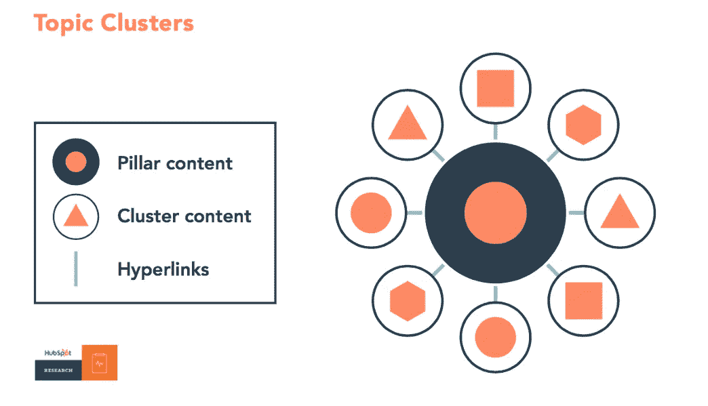
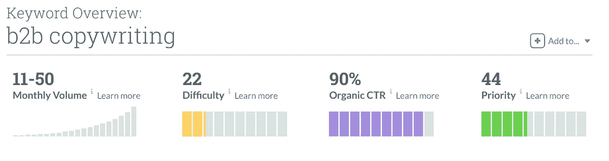

# 如何在 10 分钟内选择一个内容集群主题

> 原文：<https://medium.com/swlh/how-to-choose-a-content-cluster-topic-in-10-minutes-4f0121727ccb>

内容集群被吹捧为结合内容营销和搜索引擎优化的新方式。它们有用吗？简而言之，是的。

尝试在谷歌上搜索“创建一个医疗保健品牌”。如果你在美国，那么第一页应该包括[我们为客户 BrandHoot 完成的这篇博文](https://brandhoot.com/blog/how-to-create-healthcare-branding-thats-meaningful-and-effective/)。这是一个内容集群的支柱。

如果你想知道我们如何选择一个容易排名的主题，那么请继续阅读。这 10 分钟的过程会让你走上创建一个高级职位的道路。

Here’s a topic/content cluster as explained by HubSpot

# 步骤 1:选择服务和难点

理想情况下，您的内容集群应该与您提供的服务或产品相关。毕竟，[内容营销](https://thecontentreactor.com/2017-8-15-following-a-process-for-content-marketing-success/)的目的是获得可能转化为顾客的读者。

同时，你不能只在你的支柱页面上推送你的服务。你需要解决你的潜在客户正在处理的一个真正的难题。然后非常巧妙地告诉他们，如果他们想要，你可以卖给他们一个更好的解决方案。

要选择服务和棘手问题的正确组合，请遵循以下规则:

*   在您的目录中寻找入门服务或产品。例如，你必须先卖给别人一辆车，然后才能卖给他们延长保修期。同样，在你的顾客对你提供的其他东西感兴趣之前，他们需要购买一些服务。
*   确定你的产品/服务解决的痛点。写下人们可能用来描述这一棘手问题的术语，并留到第二步使用。
*   最后，确保痛点足够大，可以围绕它构建 11 篇文章。内容集群的全部目的是在支柱页面中覆盖广泛的主题，然后在集群页面中触及本质。

既然你已经选择了你的产品/服务和痛点，是时候做一些关键词研究了。

# 第二步:找到正确的关键词

你创建一个内容集群而不仅仅是一篇博客文章的原因是为了在谷歌上获得更高的排名和建立你的域名权威。这使得选择正确的关键字对于构建有效的内容集群至关重要。

多亏了 Moz，我寻找关键词的过程非常简单。只需遵循以下步骤:

1.  进入 [Moz 关键词浏览器](https://moz.com/explorer)。
2.  开始输入您发现的不同难点或服务术语。
3.  为了便于以后比较，请将关键词添加到关键词列表中。
4.  最后，是时候对比选择合适的关键词了。

你应该寻找一个有一些流量(10 或更高)，低难度分数(50 或更低)，高点击率(50 或更高)，体面的机会分数(40 或更高)的关键词。

它应该是这样的:

Choosing the right keyword for a content cluster is all about balance.

显然，更多的搜索量将是好的。但是，更重要的是选择一个与你的网站相关的关键词，并带来合适类型的网站访问者。

# 步骤 3:选择您的内容集群主题

现在你有了服务/产品、痛点和关键词，你需要把所有这些变成一个主题。最好是一个当人们在搜索结果中看到它时会点击的主题。

这里有一些“经典”的方法来创造一个引人注目的标题:

*   **如何:**如何为你的网站创作有效的 b2b 文案
*   **必做:**高转化率 b2b 文案必做的 5 件事
*   **错误:**做销售需要避免的 10 个 b2b 文案错误
*   **公式/方法:**打造惊艳 b2b 文案的顶级公式
*   **例子:**在你的网站上使用的 9 个 b2b 文案例子

这是一些想法。如果你需要更多，那么搜索“[博客文章标题创意](https://blog.hubspot.com/marketing/blog-post-title-templates-infographic)”你会发现大量的例子。

模仿这些例子完全没问题。但是，请记住，在它的核心，你的标题作出了承诺。如果你的标题是高转化率 b2b 文案的有前途的提示，那么你需要通过帮助别人来实现这个承诺。如果你做不到这一点，那么排名再高也没有意义。

# 步骤 4:集群帖子及其他

在你写完并发布了你的支柱页面之后，还有很多工作要做。下面是您接下来应该做的事情:

1.  写下你的集群页面并链接回你的支柱页面。
2.  使用 Moz 或其他类似工具追踪你的排名。
3.  通过添加更多的内容、注入关键词和优化你的图片来不断改进这篇文章。
4.  通过在社交网站上推广帖子，从其他相关网站获得反向链接，通过论坛和评论帖子建立链接，建立一些异地 SEO。

在这一点上，你将很好地走上一个高排名，创收的内容集群的道路。

# 您需要帮助启动内容群集吗？

在[内容反应器](https://thecontentreactor.com/)，我们很乐意帮助您构建自己的内容集群。联系我，我们会讨论你的想法和目标，找到适合你的方法。

## 这个故事发表在 [The Startup](https://medium.com/swlh) 上，这是 Medium 最大的创业刊物，拥有 316，638+人关注。

## 在这里订阅接收[我们的头条新闻](http://growthsupply.com/the-startup-newsletter/)。

