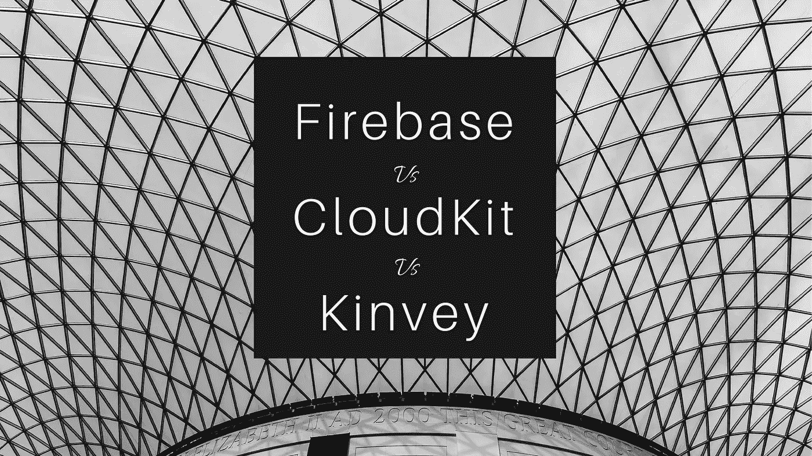
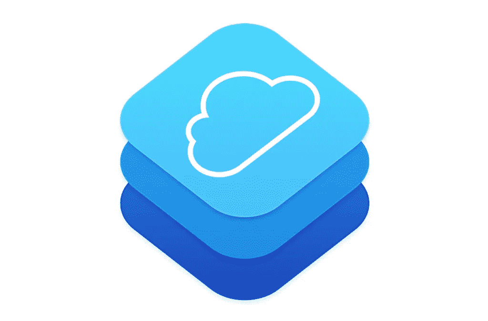
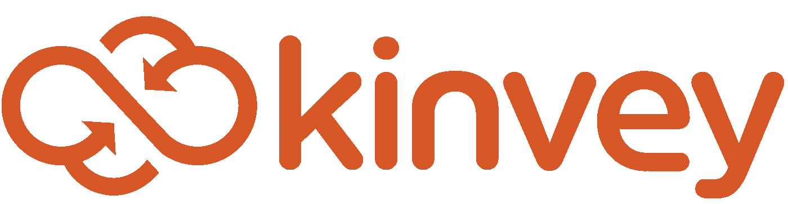
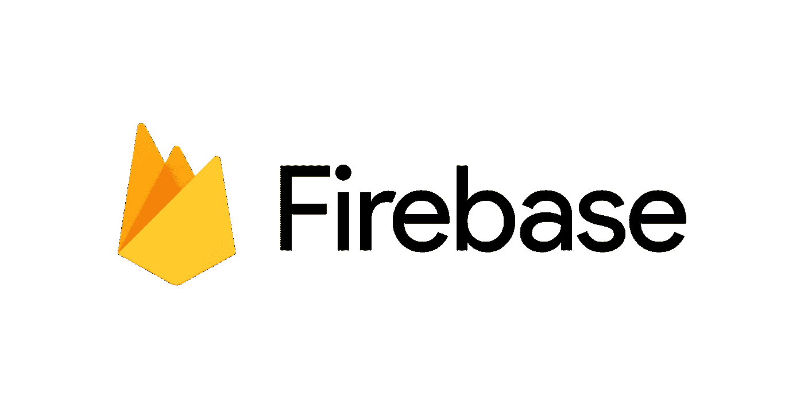

# 如何选择最佳的移动后端即服务(MBaaS)

> 原文：<https://medium.com/swlh/how-to-choose-the-best-mobile-backend-as-a-service-mbaas-5534e1fc33f4>

Firebase vs. CloudKit vs. Kinvey

移动后端即服务(mobile back end-as-a-Service，简称 MBaaS)的诞生是为了让时间紧迫、希望利用移动设备的最新功能构建解决方案以及管理复杂的服务命令的移动开发人员。这个新生领域的早期领导者是 Parse。Parse 为所有 MBaaS 公司奠定了基础，为我们提供了高性价比和易于使用的 MBaaS 工具。今年早些时候，这项服务关闭了。但是 Parse 的势头为其他服务在同一领域的竞争开辟了一条道路。这一领域的三个新兴领导者是 Google 的 Firebase、Apple 的 CloudKit 和 Kinvey。

随着 Parse 的关闭，那些指望它提供后端服务的开发人员被晾在一边。当他们转而寻求更好的替代方案来解析时，他们得到的答案是“你应该构建自己的后端服务和基础设施”或“是时候适应 AWS 了。”也许这一次我们应该更仔细地考虑走捷径的代价。但问题是，大多数独立的应用程序开发者和小型创业公司没有维护专用后端的奢侈。有些还处于生命周期的早期。在投资他们自己的基础设施和服务之前，他们需要快速开发和测试以达到[产品市场适应性](https://www.datadab.com)。他们需要移动后端即服务(MBaaS)。

对于企业而言，MBaaS 提供了一系列解决方案，能够快速开发复杂的移动解决方案。你看，后端不仅仅是一个数据存储。如今，公司无需自行扩展云数据库、托管推送通知服务器或跟踪应用分析。

# 苹果的云套件

*Apple CloudKit*

CloudKit 是一个不错的后端即服务，尽管它有点不成熟。它的成名在于它与苹果开发生态系统的无缝集成。为了让 CloudKit 成为开发者不可或缺的强大工具，苹果还需要做更多的工作。今天，CloudKit 本质上是一个数据存储，有一些基本的 iCloud 身份认证支持，前面还有一个 API。它提供的定价模式会根据应用的活跃用户数量调整免费限额。如果数据持久性是您的首要任务，那么 CloudKit 是非常好的。内置通知对于社交和其他内容共享应用程序非常有用。一旦您的应用程序订阅了某些对象的更改，并且这些记录被修改，CloudKit 将向您的应用程序发送通知。

随着它的易用性而来的是某些警告。不存在用于实现服务器端逻辑的功能。另一个缺点是，用户在保存任何数据时都需要登录 iCloud。如今，大多数现代应用程序使用后端的方式比 CloudKit 提供的功能复杂得多。许多应用程序需要更加灵活和复杂的用户管理功能来管理身份，一套全面的参与功能，如短信、推送、电子邮件等。访问数据存储和文件存储的能力，以及运行定制应用程序逻辑的平台，这些逻辑将一切联系在一起。CloudKit 的设计也存在缺陷。例如，苹果要求开发者在客户端运行特定于应用的逻辑。这是构建应用程序的错误方式。这种方法可能会消耗设备本身的资源，同时迫使开发人员在需要改进这种逻辑时更新应用程序。另一个限制是，CloudKit 只支持 iOS 应用。但大多数应用程序都跨多个终端，需要在其他移动平台和网络浏览器上使用。最近推出的 Webhooks 可能允许您拼凑一个跨平台的解决方案，但 CloudKit 的设计考虑了 iOS、Mac 和 Web 应用程序。也就是说，我们很高兴看到苹果公司引领 CloudKit 的发展方向。

另一方面，CloudKit 是开发人员构建简单应用程序的资产。想想共享列表、基于位置的评论应用、Twitter 克隆等。但是逻辑稍微复杂一点的应用程序需要的不仅仅是一些简单的身份验证和数据存储。他们需要从任何来源访问数据、身份和业务逻辑，无论是在平台提供商上还是在云中的其他地方，特别是对于企业，在现有的本地记录系统上。总的来说，这似乎是这个列表中最弱的服务，但是，与 Firebase 一样，苹果的 CloudKit 更容易集成到 iOS 应用程序中。

# 金维

*Kinvey*

英维在许多方面拥有最广泛的 MBaaS 服务选择。网站上的代码支持 iOS、Android、HTML5 和 Xamarin 的快速开发。其核心服务包括数据库、推送通知、认证和定位服务。还有许多额外的代码片段库。许多其他人也可以发挥作用。查看 Android 列表。Kinvey 确实为员工少于 25 人的个人或初创企业提供了一个免费层。但是，在其他方面，第一层每个应用程序每年 24k 美元的价格令人难以置信。由于他们提供了大量的服务，Kinvey 的文档并不像 Parse 的文档那样简单，Parse 的文档旨在让开发人员快速上手。

Kinvey 非常用户友好，但是他们的定价、支持和服务对于小企业来说并不理想。但由于金威更侧重于企业部门，我想这没什么。

# 谷歌的 Firebase

*Firebase*

irebase 是 Parse 更受欢迎的替代品之一，理由很充分。您可以立即开始保存数据，并且他们的 SDK 易于使用。有了 Firebase，使用谷歌、脸书、Github、Twitter 或电子邮件进行身份验证变得轻而易举，尤其是因为不需要额外的后端。专注于 Parse 的用户会喜欢匿名用户，这是 Parse 的最爱。此外，离线存储类似于解析。Firebase 也可以作为核心数据的替代品。这将为您节省数小时的开发时间。实时数据库非常适合像聊天应用程序这样的东西，或者任何其他数据传输对时间敏感的用例。推送通知碰巧很容易通过仪表板设置和发送。可以为用户订阅预先确定的主题，创建自定义的片段，甚至向单个设备发送通知。Firebase Analytics 也非常强大。它不仅包括自定义事件，还包括高级数据和人口统计数据。只需添加 Firebase analytics，您就可以全面了解您的用户群。存储、托管和远程配置等附加功能是 Firebase 产品的一部分。如您所见，Firebase 为我们提供了一整套功能。结合它的易用性，它是我们最好的解析替代品。

Firebase 是与 Parse 最相似的 BaaS，由一家在大数据领域享有盛誉的大公司支持，可以跨平台工作，功能丰富。此外，Firebase 服务最初是免费的，随着规模的扩大，价格会稳步上升。此外，Firebase 更受欢迎，因此，与不太知名的 BaaS 提供商相比，它的教程要多得多。这使得开发人员可以更容易地加快速度。但是 JSON 树数据架构与传统的数据架构有点不同，需要一些时间来适应。此外，一些开发人员不喜欢 Firebase 的 API，它没有内置对推送通知的支持。Firebase 往往很难使用，当然它很强大，但也很复杂。Firebase 将有一个较长的学习曲线，但它提供了更多。如果你更倾向于谷歌服务，并且你是个人或创业公司，可以考虑 Firebase。

# 你应该选择哪个 MBA？

不要让你的后端成为你应用的瓶颈。此外，还要考虑长寿的风险，或者不如说长寿的缺乏。如果几年后这项服务不存在了，你将不得不寻找另一个替代方案并进行迁移。因此，考虑一下从特定平台迁移数据有多容易。另一件事是，其中一些选项比其他选项需要更多的服务器和开发运维知识，这可能会大大增加复杂性。预先考虑成本是必要的，但也要考虑这些成本将如何随着应用程序的扩展而扩展。一天结束时，使用你已经熟悉的或者你期待学习的技术。

彻底评估提到的服务，看看什么最适合你的需求，但我们的团队越来越倾向于谷歌的 Firebase。最令人印象深刻的是，这项服务从一开始就被设计成跨平台的，不像苹果的 CloudKit 主要以 iOS 为中心。推送服务和免费分析是 Firebase 的额外收获。然而，对于更大规模的数据库，您可能想考虑将您的环境与 Amazon Web Services 混合起来。简而言之，如果你想要一种直接的方式来存储数据，并且只有 iOS，CloudKit 可能是最好的选择。如果您对 Parse 很熟悉，并且想要类似的东西，Firebase 是最好的选择。如果买得起，可以考虑金威。

*原载于*[***cognitive clouds***](https://www.cognitiveclouds.com/insights/how-to-choose-the-best-mobile-backend-as-a-service-mbaas/)***:****Top*[*手机 App 开发公司*](https://www.cognitiveclouds.com/custom-software-development-services/mobile-app-development-company)

## 这个故事发表在 [The Startup](https://medium.com/swlh) 上，这是 Medium 最大的创业刊物，拥有 299，352+人关注。

## 在这里订阅接收[我们的头条新闻](http://growthsupply.com/the-startup-newsletter/)。

