# 实施 6 种不同的信使后，我们学到了什么？

> 原文：<https://medium.com/swlh/how-to-choose-the-right-messenger-for-your-business-1fce5f475429>

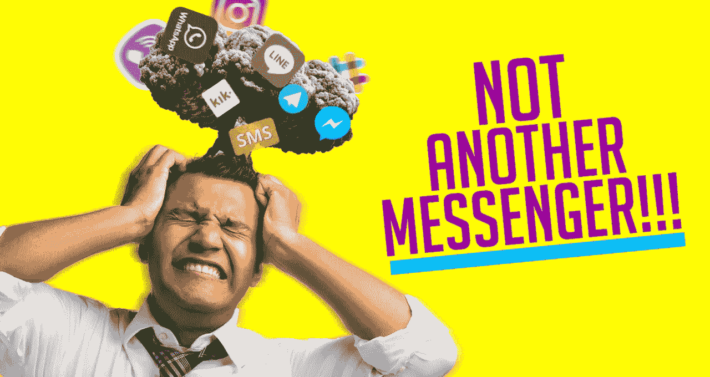

## 让我们从一些历史开始

短信应用作为“传统”短信和彩信服务的可能替代品出现，尽管“传统”短信和彩信服务得到了广泛传播，但其功能非常有限，根本无法满足日益增长的丰富媒体信息需求。在 2018 年，你不仅可以给朋友发送照片，还可以点披萨，分享准确的地理位置，甚至玩游戏。

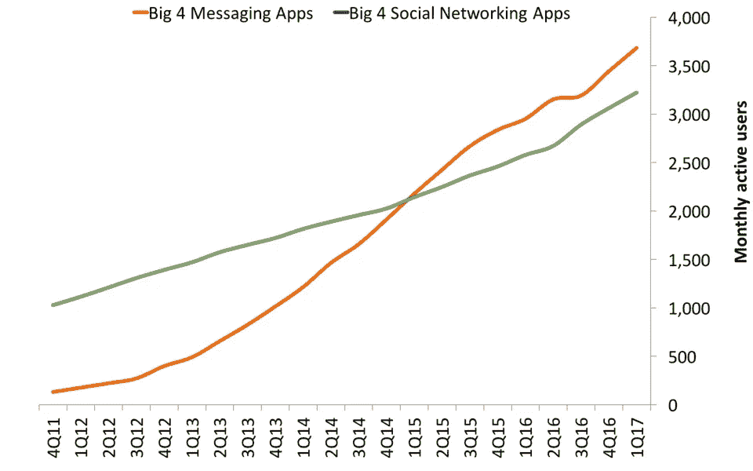

***根据 Business Insiders 的数据，最受欢迎的四大信使的月活跃用户数超过了四大社交网络的月活跃用户数之和。***

庞大的用户基础和用户喜欢通过消息应用与企业互动的事实，是你应该考虑在全渠道战略中采用信使的主要原因。不太明显的原因是——低数据价格和预算设备。

如果我们缩小范围，我们可以清楚地看到整个消息传递行业的两阶段战略。第一个是增长，现在似乎有所放缓，下一个是货币化和提供服务的扩展。领先品牌的营销人员仍在社交网络上投入比信息服务多得多的资源，但我们可以看到，越来越多的公司在不断增加，为客户提供与他们联系的额外渠道。

我想我们已经完成了历史，是时候将所有主要的使者排列起来，看看他们如何比较了。但是首先，看看这个每个国家使用最多的信使的地图。在美国等地设置 Viber 账户毫无意义。

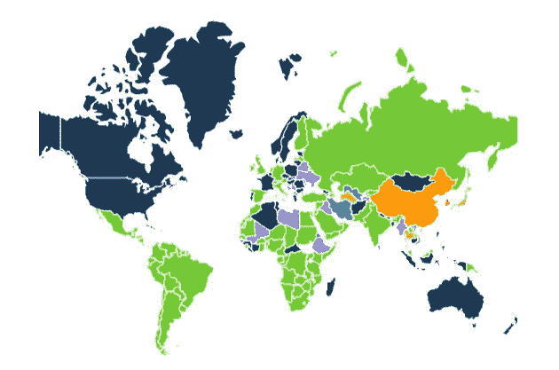

Most popular messengers world map

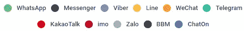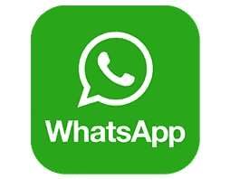

> **快速事实:**
> 
> -发现于 2009 年
> 
> -13 亿用户，其中 70%每日活跃
> 
> -归脸书所有

## 你如何将它用于你的品牌？

你要记住的关键点是，WhatsApp **不卖广告**并且**不允许任何第三方机器人**，这限制了最基本的组件**短信的可能使用。**从创建高度有针对性的营销活动和与客户聊天开始，就像与朋友聊天一样。

1.  **直接发短信**

看看 Hellman's Brazil 在 2014 年用这种有限的功能和非常有限的预算 **900 美元**做了什么。他们创建了一个直播服务，让不知道如何处理冰箱里的食材的年轻人在真正的厨师的帮助下开始烹饪，在看过可用食材的照片后，厨师会亲自指导用户，给他们发短信。这场运动带来了 8000 (！)用户在 **10 天后**。这非常简单，令人印象深刻！

**2。WhatsApp 状态**

对于一些不知道 WhatsApp 状态的人来说，这是一个允许你分享文本、照片或 gif 的功能，只有通讯录中的联系人才能看到，并将在 24 小时内消失。是的。我说的是通过引用激励性信息而被广泛使用的工具。

那么，你能利用 Whatsapp 的地位做些什么来提高参与度呢？

据我所知，WhatsApp 最好的地位属于丰田。看看他们做了什么:

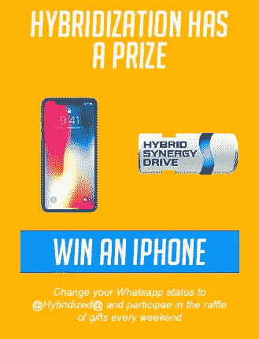

他们要求客户用一个词“**杂交**”更新他们的 Whatsapp 状态，并在他们的网站上注册。他们买了一部 Iphone 作为礼物，并立即意识到他们的混合动力汽车系列。很好的例子！

**状态也可用于显示限时折扣或设置提醒。**

**3。WhatsApp 商业集团**

WhatsApp 允许你将顾客分成 256 人一组，并与他们同步对话，提醒他们某些事件，或者收集对你的服务的意见和反馈。客户可以按兴趣分组，并被批量通知他们的产品或服务。

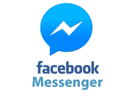

# 快速事实:

> -14 亿用户
> 
> - 80%的开放率
> 
> -超过 10 万个机器人
> 
> 用户和企业之间每月交换 20 亿条信息

Facebook Messenger 目前是即时通讯的“鼻祖”。想想看— **差不多 12%的电流！世界人口！每个月都用它**。这就是为什么如果您的目标客户遍布全球，那么它是您应该考虑的最佳平台。

那么，使用 FB Messenger 与客户互动的最佳方式是什么？—当然是创建一个[聊天机器人](https://chatbotslife.com/)。Messenger 拥有最大数量的第三方在线服务，可以帮助您更上一层楼。我推荐检查 [Chatfuel Team](https://medium.com/u/24c8bd036411?source=post_page-----1fce5f475429--------------------------------) 、 [Octane AI](https://medium.com/u/330683129d24?source=post_page-----1fce5f475429--------------------------------) 和 [ManyChat](https://medium.com/u/fe9090f0ccbd?source=post_page-----1fce5f475429--------------------------------) 。

# 您如何为您的品牌使用 Messenger？

## 1.内容交付系统

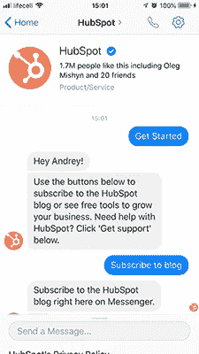

集客营销之王 HubSpot 使用 Messenger 将他们的精彩内容直接发送给用户。根据他们自己的研究 **Messenger 的表现远远超过了 Email(打开率高出 224%和 619%！**点击率更高。

## 2.活动指南

如果举办活动是你业务的一部分，那么一个很好的主意是停止强迫你的与会者填写带有一般信息的表格。相反，我建议利用 FB 功能，只需点击“开始”按钮即可注册。

如果你对你的客人有一个清晰的行动计划——设置友好的提醒，分享活动计划，在一个渠道回答与会者的问题。活动结束后，你可以发送带有照片或视频的后续消息，以防有人错过演讲。

## 3.脸书广告

尽管 Messenger 有其强大的一面，但有一个问题——要和某人聊天，你必须先让客户和你联系起来。脸书的广告可以加速这一过程。

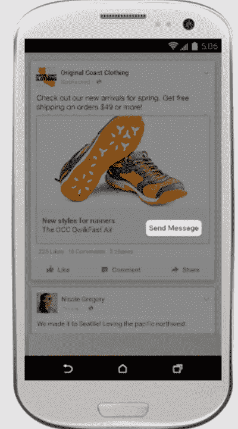

目前有两种选择:

1.  **赞助信息** —允许你与任何曾经联系过你的 FB 商业页面的人开始对话。
2.  **点击发送广告** —在新闻提要的广告下方显示一个“发送消息”按钮。

我想先从第二个选项开始。

**Feldman AG** 利用点击即时广告**推动汽车销售**。这是他们如何做的。首先，用户点击广告。然后他被带到一个有机器人连接的信使应用程序。机器人功能非常简单——确认销售线索，如果销售线索准备好了，只需将其传递给完成交易的同事。这个简单而有效的技巧，导致了**额外的 50 个月销售额。**

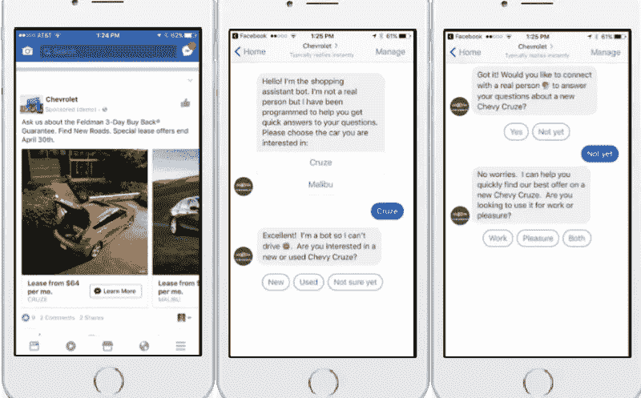

> Brent Csutoras 提供的专业提示:
> 
> 尊重退订者
> 
> 当一个人给你发短信时，你有 24 小时的时间来回复你想要的信息。用户的每个回复都会重置时钟
> 
> 如果你的业务的一部分是发送新闻或跟踪信息——申请例外。

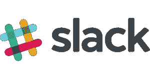

> **快速事实:**
> 
> -110 万每日活跃用户中有 30 万人使用付费版本
> 
> -平均每天登录 10 小时

Slack 是一个工作场所聊天平台，被美国的中型公司(10-50 人)广泛采用。它给你一个团队交流的单一窗口，但同时也允许你 DM 一个队友。这是一个建立专业社区的完美工具。让我们看一些例子:

## 潜在客户社区

畅销书 *7 天创业*和*内容机器*的作者丹·诺里斯利用 slack 创建社区，帮助他的成员快速解决他们的问题。因为他们中的大多数人都使用了 Slack，这成为了他的平台选择，因为会员有一个专门的渠道来寻找答案，并且永远不会离开 Slack。除了为专业人士提供一个渠道，Dan 还分享见解、数据和指南来帮助他的会员。

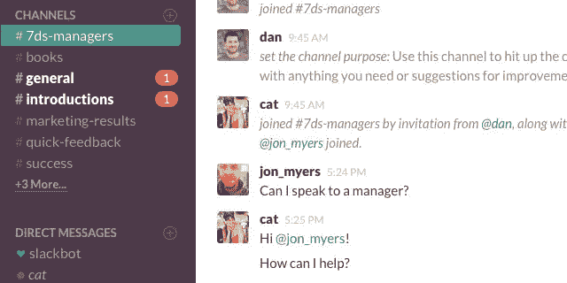

image from [https://wpcurve.com/slack-communities/](https://wpcurve.com/slack-communities/)

## 现有客户的社区

[Buffer](https://medium.com/u/245d5483fb27?source=post_page-----1fce5f475429--------------------------------) 是一个让社交媒体管理变得简单的平台，允许在一个地方安排帖子、分析他们的表现并管理每一个帐户，它使用 Slack 通过以下方式与客户建立更牢固的关系:

1.  帮助客户解决他们的问题
2.  让现有客户分享想法和技巧
3.  就潜在的新功能展开公开讨论

如果你是一个现有的缓冲用户，我强烈建议加入社区 [**这里**](https://buffer.com/slack)

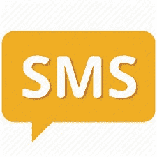

当然，发短信不能像其他现代信使一样给你的客户提供丰富的视觉体验，而且你必须付费，但是尽管有这两个缺点，短信仍然是营销人员的一个重要武器。

首先，它可以在任何设备上运行，不需要互联网连接。但对营销人员来说，最大的好处是，当你收到企业发来的短信时，几乎总是会产生一种重要性和紧迫感。

# 为什么您应该为您的公司使用短信？

## 提醒

任何 B2C 企业都可能遇到这样的问题:由于各种原因，客户会迟到，甚至错过他们的约会。一个简短友好的提醒将减少错过会议的机会。

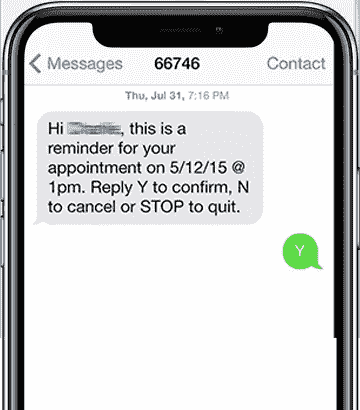

## 促销闪电战-活动

在一天中的某些时段，传统餐馆经常因缺少顾客而遭受损失。让我们以周二发布为例。一个非常基本而有效的吸引人群的方法是在发布前给你的客户发短信。

“只有今天！买一片——免费获得任何饮料”——应该能解决你的问题。

*提示:尽量让每条信息都个性化。*

# 让我们总结一下

每一个提到的信使都有它自己占主导地位的地理和人口特征。不要拘泥于单一渠道。实验！

如果你愿意完成预期的结果，尝试你的预算和人力资源允许的每一个可能的选择。

> ***我写了几篇关于 FB Messenger 及其隐藏“宝石”的文章。你可以在这里查看他们****(FB Messenger 作为网站直播聊天)和 [**这里**](https://chatbotslife.com/building-a-chat-contact-center-with-fb-messenger-and-chatbots-part-1-of-3-b008a8b8a4d5) (与 FB Messenger 建立联络中心)****

# ****附:如果你觉得这篇文章有趣，请考虑检查我的研究:****

# ****🔥[客户决策过程](http://bit.ly/2CGEiNq)🔥****

****[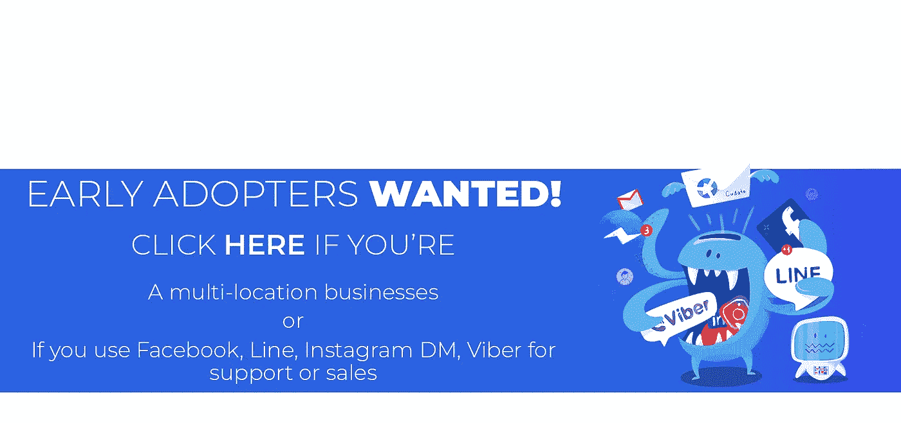](http://bit.ly/2CGC9kL)****