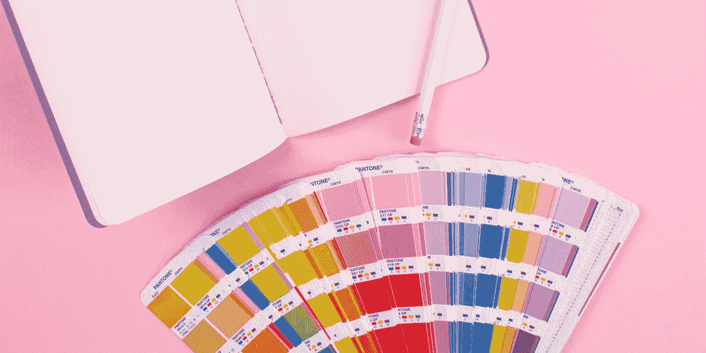
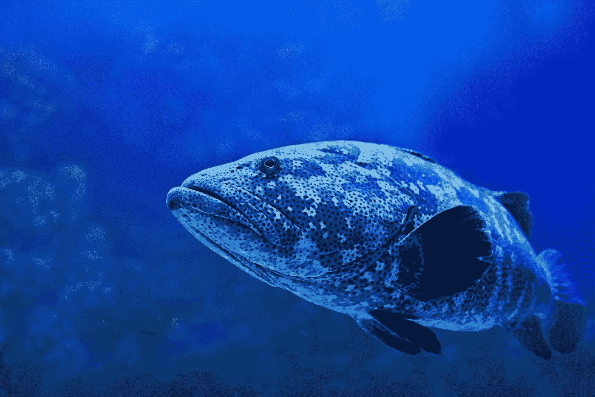

# 如何选择自己的第一家品牌代理公司？

> 原文：<https://medium.com/swlh/how-to-choose-your-first-brand-agency-1884621fe138>

如何选择自己的第一家品牌代理公司？给你的建议是，当你开始创业时，你已经有了一些预算，你需要开始与品牌代理商和设计师建立关系。

# 介绍

如何选择你的第一家品牌代理机构，对于任何创始人或营销负责人来说都是一个巨大的决定。在这篇博客中，我总结了我的经历和我一路走来学到的教训，来帮助你为你的事业做出正确的决定。

# 一个重大的决定…

当资金紧张，你在数着每一分钱的时候，在品牌代理上花钱可能会让人望而生畏。这个预算很难证明是合理的。尤其是你业务的其他领域，那些为不同的项目(通常是技术团队)竞争资金的人。这个博客将帮助你做出决定。我会给你一个过程和资源，以帮助你找到合适的机构，并开始与他们的长期关系。

# DIY 品牌还是从零开始自己的品牌？

无论你是已经有了一个 DIY 品牌，还是完全从零开始，第一步都是创建一个你可以合作的创意和设计机构的长长的名单。如果你以前经历过这些，也许你有什么要补充的。一定要联系 hugo@pilcro.com。

Photo by[Jess Watters](https://unsplash.com/photos/Bg3qkPDpopY?utm_source=unsplash&utm_medium=referral&utm_content=creditCopyText)on [Unsplash](https://unsplash.com/search/photos/branding?utm_source=unsplash&utm_medium=referral&utm_content=creditCopyText)

# 研究阶段——研究最佳代理商的 5 种方法

# 博客

先看一些博客，(包括这篇)。这样做将有助于你扩大可供选择的范围。你会开始意识到你喜欢什么，老实说，你不喜欢什么。问问你自己，你最喜欢的品牌在 2018 年是如何适应他们的市场的，这很好。是通过重塑品牌，还是吸引不同的用户群。有很多很棒的博客，但这里有我们最喜欢的 8 个:

# 2018 年最值得阅读的 8 个品牌博客

[Logo 极客](https://logogeek.uk/logo-design-blog/)

[我只是有创意](https://imjustcreative.com/blog)

[可爱的包](http://lovelypackage.com/)

[Logo 设计爱情](https://www.logodesignlove.com/)

[身份专](https://identitydesigned.com/)

[正在考虑](https://www.underconsideration.com/brandnew/)

[BP & O](https://bpando.org/)

[模具线](http://www.thedieline.com/blog/)

# 谷歌

# 搜索搜索搜索

带上谷歌。谷歌一下你最喜欢的品牌。看看他们的标志，他们的品牌身份。

*   是否有文字标记(品牌名称作为一个风格化的词)，一个标志，或两者的混合？他们如何交流他们的语调？
*   他们如何将自己的品牌与市场相匹配？
*   他们的品牌是小众品牌还是大众市场品牌？

这些问题可以帮助你在搜索时开始使用谷歌搜索。

# 他们是本地人吗？

如果一个机构能在谷歌上排名很好，这是一个好迹象！如果你想和你的设计师面对面，你可能需要考虑一个代理机构对你来说是如何定位的。举行视频通话完全没问题，但这是个人喜好。

# 萧条的社区

加入相关的 slack 社区。slack 上有很多非常活跃的社区。Slack 社区的人消息灵通，并且真心愿意帮助你。不过要小心。小心浪费时间的人或那些只是自我推销而不给你客观观点的人。

# 奖励网站

品牌的伟大之处在于有丰富的颁奖现场。最新的作品被展示出来。这是一个很好的研究方式，因为奖项会为你做大量的工作。每个不同的奖项都会为你找到最佳设计师，最佳代理机构。甚至给你分类。这里有几个网站可以帮你入门

[前进](https://www.awwwards.com/)

[D & AD](https://www.dandad.org/)

# 询问您的网络

试着在你的关系网中找一个从事品牌工作的人。试着找另一个已经为他们的企业或他们工作的创业公司做过一些品牌工作的人。从双方的角度来看都是好的。有客户端，和代理/设计师的观点。当客户和设计师很好地合作时，最好的创意工作就完成了。所以，提问很好。不要问他们哪里可以找到最好的设计师。也问问他们你应该怎样做才能在设计过程中获得最大收益。一定要问他们一些试探性的问题，例如

*   “过程是怎样的”？,
*   “它如何为您的业务增加价值”？和
*   “您是如何选择代理商的”？

# 在社交网站上关注他们

现在你已经开始建立一个代理商和设计师的名单，这是令人兴奋的一步。现在你需要与他们中的每一个保持同步。看到他们在做什么真是超级令人兴奋。这样做很容易。在运球、推特、pinterest 等网站上关注他们。这是非常重要的一步，因为你可以在日常生活中了解你最喜欢的设计师。额外的好处是，你的社交反馈被最新最棒的设计所覆盖。双赢。

# 列出一份绝对不合适的代理公司名单

时间是最宝贵的商品，你最不想做的事情就是浪费自己的时间，或者其他人的时间。有时候你只是知道什么时候不合适。记得记下这些机构，这样你就不会重复老一套了。

# 下一步，创建一个短名单

做得好，完成了你的研究。很明显，外面有太多的代理机构，你不可能和他们都谈。最好的方法是列出一份 4-5 名设计师和代理商的候选名单。伸出手和他们每个人开始对话。

> 我建议在着手一个项目之前与任何潜在的新客户会面，并尽早打电话讨论概要和目标。
> 
> 这样你就能很好地感受到客户的氛围、想法和方向，反之亦然。你还可以在会议或视频通话中涵盖很多内容，并建立更牢固的关系，这对我们 Macki 工作室来说非常重要。【麦基工作室的艾玛·麦科尼】

# 天涯何处无芳草

无论你在大公司还是小公司工作，对你来说都是一个有趣且极其重要的考虑因素。和大公司合作会很棒。另一方面，你不太可能成为他们业务的重要组成部分。不像小机构，你可能会得到额外的专业和过程。另一方面，如果他们的大客户对你有要求，你可能会被忽视，或者你的项目可能会被推迟。在较小的代理公司，你可能会得到定制的待遇，你可能会发现自己更接近实际做品牌工作的创意团队。这枚硬币还有另一面。如果你是他们最大的客户，你不想最终有效地支持他们的其他小客户。你要问自己的问题是

Photo by[David Clode](https://unsplash.com/photos/5TlDAKapwyQ?utm_source=unsplash&utm_medium=referral&utm_content=creditCopyText)on [Unsplash](https://unsplash.com/search/photos/plenty-more-fish?utm_source=unsplash&utm_medium=referral&utm_content=creditCopyText)

> “你是想做小池塘里的大鱼，还是更大池塘里的小鱼”？

# 大机构对小机构

如果你发现你正试图在大公司和小公司之间做出选择，那么考虑每家公司能在广告上花多少钱是很重要的。解决这个问题的最好方法是，事先同意为推销工作支付一小笔费用。通常一家代理公司会在推介阶段做一些品牌推广工作。这是为了赢得你的支持，让你清楚地知道他们前进的方向。大型广告公司有能力在宣传方面走得更远。这并不一定意味着最终产品会更好或更差。你希望建立一个长期的关系，因此奖励人们投入的工作可以成为一个很好的起点，并产生最好的最终产品。

# 谁在你的垂直领域做得很好

问问你自己，在你的目标市场或垂直市场中，有没有哪个机构做得特别好。也许他们专门在你的特定领域建立品牌。

# 谁做了你竞争对手的品牌

最后，这实际上是一种感觉检查。谁做了你竞争对手的品牌。也许他们已经为你做了所有这些工作，并找到了一个非常适合你的利基市场。

# 伸出手并关闭

# 预算预期

你不想与财务人员进行讨论，但是，事先确定你准备花费的最低和最高金额总是一个好主意。有时代理机构会公布他们的客户支出情况，否则你可以直接问。在这件事上跟着他们走。

# 他们的流程是什么

一定要搞清楚他们的流程是什么。这符合你的期望和时间表吗？你能放弃你公司的资源来全力支持这个过程以获得最大的价值吗？一定要问这些问题。虽然你不想对他们的设计过程产生太大的影响，但你也要确保在需要的时候你能支持他们。

# 你将和谁一起工作

弄清楚你是否会直接与设计师合作，或者是否会有客户经理或其他相关人员，这一点非常重要。同样重要的是，你方谁将领导这个项目。最好的情况是发现所有的人格都匹配。并且看到在项目组周围有一种兴奋和兴奋。最好的创造性工作通常始于一定程度的兴奋，甚至是歇斯底里。

# 有持续的关系吗

对于一个创意者来说，最糟糕的情况是在没有任何持续关系的情况下，以很小的预算向世界索取。试着去寻找那些你会一次又一次回到身边的人。

# 做决定

是做决定的时候了。你已经收集了所有你需要的信息。您已经进行了初步讨论，并看到了一些推介。我将以一个项目列表结束，以帮助您做出完美的选择。

*   找到合适的
*   跟着你的直觉走
*   建立持久的关系
*   奖励人们投入的工作

祝你好运！

## 这篇文章发表在 [The Startup](https://medium.com/swlh) 上，这是 Medium 最大的创业刊物，有+ 375，985 人关注。

## 订阅接收[我们的头条](http://growthsupply.com/the-startup-newsletter/)。

