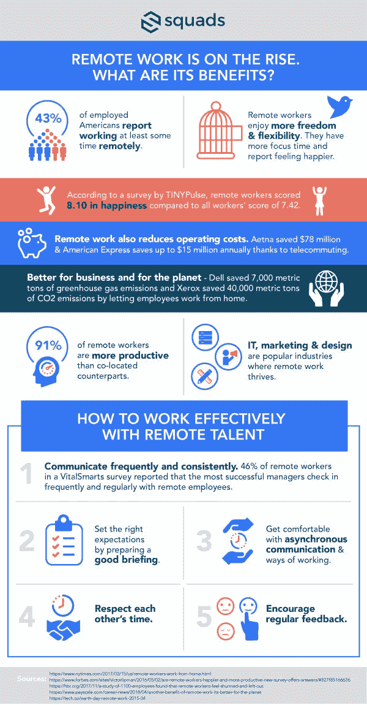

# 如何与远程同事有效协作

> 原文：<https://medium.com/swlh/how-to-collaborate-effectively-with-remote-colleagues-a5ef2b356fd1>

Photo by [Bonnie Kittle](https://unsplash.com/photos/GiIZSko7Guk?utm_source=unsplash&utm_medium=referral&utm_content=creditCopyText) on Unsplash

今天的工作场所是全球化和虚拟化的。越来越多的人选择远程工作，尤其是在美国和欧洲。根据去年发表的盖洛普报告，参与研究的 15000 名美国员工中有 43%至少花了一些时间远程工作。这代表着自 2012 年以来[四个百分点的增长](https://www.nytimes.com/2017/02/15/us/remote-workers-work-from-home.html)。对员工来说，远程办公吸引力显而易见:更大的灵活性，不用长途通勤，更少的干扰。但是雇主呢？如果你正在考虑创办一家新公司，你可能会对与远方的人共事有所顾虑。如果您的公司一直以协同定位的方式做事，情况也是如此。我与[小队](https://squads.com/?utm_source=blog-remote-collab)社区中成功的数字游民和自由职业者交谈，以消除一些关于远程工作的神话，并记录最佳实践。

# 远程工作。游牧生活。它们实际上是什么意思？

首先，让我们弄清楚定义。远程办公，或称远程工作，是指在传统办公室之外的地方与同事共处一地工作。并非所有远程工作者都是游牧者。根据维基百科中的[说法，数字游牧者使用电信来谋生，并且*以游牧方式过着他们的生活*。你可以说做一个流浪者就像服用类固醇做远程工作。随着世界各地网速的提高，游牧的吸引力在远程工作者中有所增长。大城市的高房租等社会经济因素也促使许多年轻人考虑这种生活方式。公司认识到这一趋势很重要。](https://en.wikipedia.org/wiki/Digital_nomad)

**数字游牧和远程工作在自由开发者、设计师和营销人员中很受欢迎。**

# 如何有效地与远程员工一起工作

在任何远程工作关系中，建立信任很重要。如果您的团队主要不是远程的，适当地整合远程员工也很重要。2017 年的一项研究发现，数量惊人的远程工作者感到被回避和冷落。为了避免这种情况，请确保遵循以下最佳实践:

## **沟通就是一切**

使用 Skype、Zoom 和 WhatsApp 等工具保持联系，定期签到。增长黑客、北极星增长公司(Polaris Growth)创始人埃伍德·厄普霍夫(Ewoud Uphof)使用 WhatsApp 与客户交流。这使得客户可以在旅途中使用语音消息跟踪任务，因此会议不会影响他们的日程安排。除了 WhatsApp，我采访过的大多数自由职业者更喜欢用 Slack 和电子邮件进行持续交流。

## **不要微观管理**

比利时的开发商 Emma Delescolle 提醒客户不要强加人为的时间表。

> “远程工作的主要好处之一是能够更好地管理你的时间表，”艾玛说。“如果你的客户试图确保你一整天都在办公桌前，这会造成一种不好的氛围，远程工作人员和客户都不会从中受益。”

## **牢记时区**

当你在不同的时区工作时，很难做到“一直在线”或随时可用，所以，设定好你们沟通的时间，评估一下如果没有预约会发生什么。我之前写过， [*通过守时*](https://articles.squads.com/how-to-built-trust-when-you-work-remotely-61539629685e) 来尊重对方的时间。像[每个时区](http://everytimezone.com/)这样的工具可以帮助你计算出会议的时差。

## **管理您的期望**

另一个关键是为工作或任务设定正确的期望值。

“我想告诉公司的是，花时间写一份简报，”埃伍德说。“清楚你在问什么。进行适当的简报可以确保你管理你的期望。这为自由职业者的成功奠定了基础。让他们知道什么是好的，什么是不好的。”

## **文件有效**

> “远程工作最重要的一点是，一切都必须有一个 url”如果它没有 URL，它就没有发生。"

使用像 Trello 这样的工具来跟踪任务。在 Google Drive 或 Dropbox 等服务上为作业和可交付成果保留一个共享空间。

Infographic via [Squads](https://squads.com/?utm_source=blog-remote-collab)

## **考虑学习曲线**

正如我认识的一位设计师常说的，“远程工作是一种后天的技能。”不要太轻易放弃。如果你有一个客户和一个供应商都是新客户，你可能需要几个月的时间来掌握它。要么花时间寻找有经验的远程工作人员，要么花时间学习并教您的远程工作人员如何做。

我与之交谈过的其他远程工作者建议，你应该考虑到学习曲线，可能的话，在签署合同之前做一次“测试”。

## 确保你雇佣了最好的员工

不用说，你也要找有好推荐的专业人士，或者通过某个平台审核过的人。寻找已经投资的人来学习交易技巧。如果你是作为一名远程工作者开始的，那就去寻找可以帮助你快速学会这些技巧的社区。从寻找你身边的客户开始。

> “如果你不能很快得到客户，不要气馁，”罗马尼亚的营销人员和虚拟助理爱丽丝说。“给它时间，继续寻找。记住，建立良好的声誉极其重要，你的大部分业务可能来自推荐，要么通过你自己的客户，要么来自现有的社区。”

“作为一名远程工作者，你必须证明自己，”埃伍德说。“这就是我们关注客户满意度的原因。这是对我们公司至关重要的一个指标。我已经这样工作了 5 年。有时，如果我们不能保证客户满意度达到 8 分或以上，我们就会拒绝他们。”

底线是，如果你关注质量，远程工作将会为雇主和自由职业者带来回报。

## 这篇文章发表在《初创企业》杂志上，这是 Medium 最大的创业刊物，有 322，555 人关注。

## 订阅接收[我们的头条](http://growthsupply.com/the-startup-newsletter/)。

