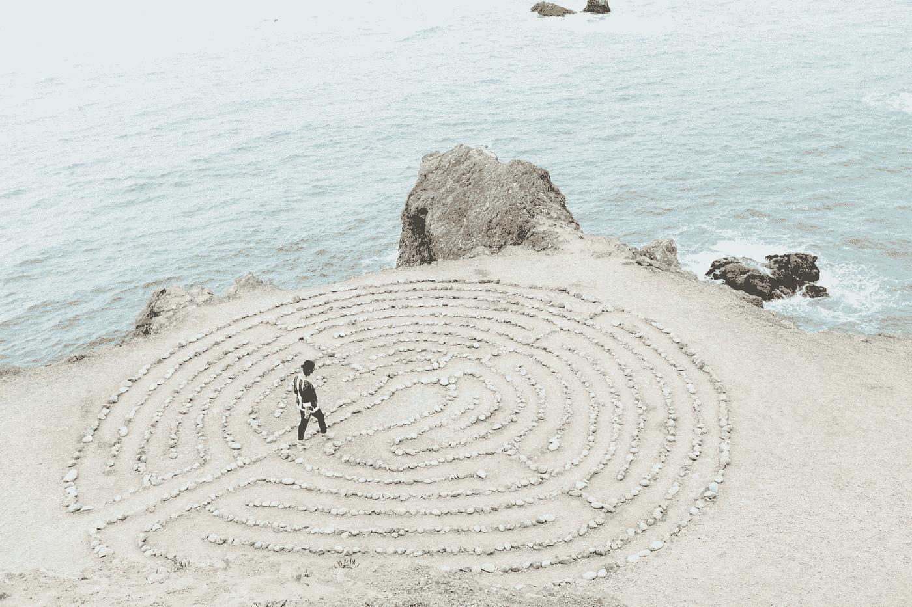

# 如何对抗你自己的心理

> 原文：<https://medium.com/swlh/how-to-combat-your-own-psyche-2eb4161647a1>

大多数人不会谈论的是他们生活中的低谷。大声说出这些想法是一个禁忌话题。在达尔文主义的世界里，为什么要让自己在情感或身体上显得脆弱呢？无论是情感上还是身体上，都不应该是那样的。将这一点与今天的世界相提并论，在今天的世界里，一切都被做得看起来很好，很时髦，越来越难以表达一个人有多不开心或不满。像脸书和 Instagram 这样已经迅速成为生活方式的应用程序，似乎只是在传播一个乌托邦的神话，在这个乌托邦里，发布内容的人似乎在享受生活。不幸的是，大多数人解读这些内容的方式似乎是将那个时间段外推到一生的事件中。仅仅因为有人去过旅行，比如说美丽的澳大利亚内陆，并不意味着那就是他们的生活方式。我当然希望如此，但 9/10 的情况并非如此，这就是事实。我们人类，有时会超越自己的方式自我贬低，或者更多地关注消极面而不是积极面。

我当然不会对消极的想法免疫。在非常原始的层面上，偏执和恐惧构成了我们人类心理和生存的前提。也许在更高的智力轨道上的人运作方式根本不同，但对我来说，接受我自己的现实就像一个正弦波。有波谷和波峰，它们不一定是等时的。

当我处于低谷时，有各种各样的负面想法；这些想法大多集中在我迄今为止取得的成就上，无论是职业上还是个人上。与此相反的观点是，我并没有取得多大的成就，我已经取得了相当大的成功。当然，头脑可以是理性的，但在这种情况下，它往往会陷入非理性。像上面陈述的那些事实实际上没有多大意义。探究不确定性的深度要比发现事物的意义容易得多。一旦你滑入这个迷宫，你实际上有两个选择；你要么振作起来，要么去面对你的牛头怪。

这时，信念和信仰的力量开始发挥作用。我把过去帮助我走出困境的事情列了一个清单，没有特别的顺序

1.  你需要一种真正的使命感。无论你在生活中做什么，你都需要重新思考你在做什么，或者带着新的活力去做你正在做的事情。
2.  你需要现实的方向。要么你通过向别人询问来弄清楚这个问题，要么深入了解你在做什么，弄清楚你为什么要这么做。知道你真正的目标是什么以及你真正追求的是什么是非常重要的。
3.  你需要非凡的注意力来排除噪音。这与《拿着油的男孩》的故事非常相似，毫不夸张地说是《幸福的秘密》的故事。
4.  你需要一个无私地帮你摆脱困境的朋友。你需要有人直截了当地说话，而不会让你觉得自己一事无成。你需要一个和你不在[同一个参照系](http://www.physics-chemistry-interactive-flash-animation.com/mechanics_forces_gravitation_energy_interactive/frame_of_reference_motion_child_ball_train.htm)的人，以不同的眼光看待事情，澄清是非。不要害怕寻求帮助。互相帮助是让系统向前发展的一种方式。
5.  你需要利用别人的积极性。这确实不是嫉妒别人的好运或目标的时候(如果有的话)。抓住这种积极性，就像冲浪者抓住波浪一样，你未来的自己会为此感谢你。
6.  不要拿不切实际的期望来衡量自己。你将功亏一篑，这只会让你对自己感觉更糟。不要不必要地加剧局势。
7.  你不需要的是更多的消极。关闭你头脑中的声音。对诋毁者和让你分心的事情说不。此时此刻，有太多的事情试图阻止你去你需要去的地方。打倒那些让你陷入困境的无止境的事情，引领你到达目的地，继续前进。

每个人都会经历怀疑和不确定。如果你认为像埃隆·马斯克、杰夫·贝索斯之类的人不会经历这些，我可以毫不含糊地说，你大错特错了。正是这种没有足够成就的感觉，加上一种动力感，导致了人类的伟大。优秀和平庸的区别在于能够超越这些想法，专注于他们认为有意义的事情，而不管这些事情的范围有多大。这个过程结束的时候你会毫发无损的出现吗？很可能不会，但你肯定会学到一些关于你自己的东西，这些东西会让你在未来变得更强大。

*“你有能力控制你的思想——而不是外部事件。认识到这一点，你就会找到力量。”* —马可·奥勒留

免责声明:我并不自称是自助大师。这篇文章纯属个人经历。

*想了解我更多，请在 www.arjunrao.co***顺道拜访并问好！或者在 Twitter 上关注我* [*@raoarjun*](https://twitter.com/raoarjun)*