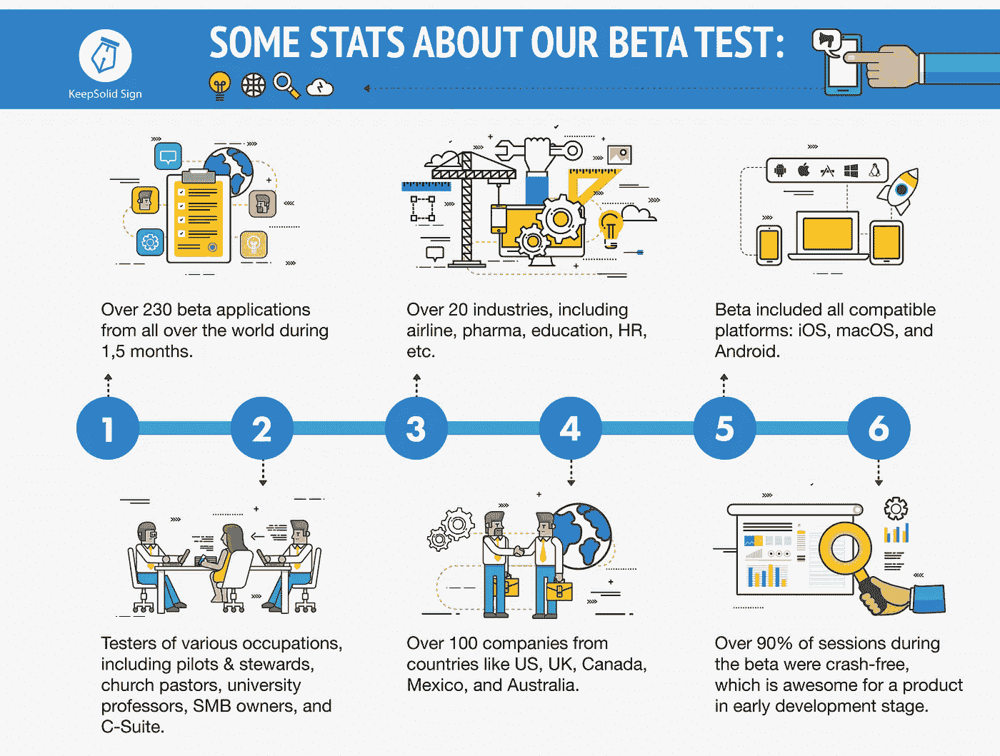
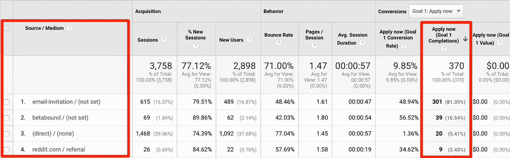
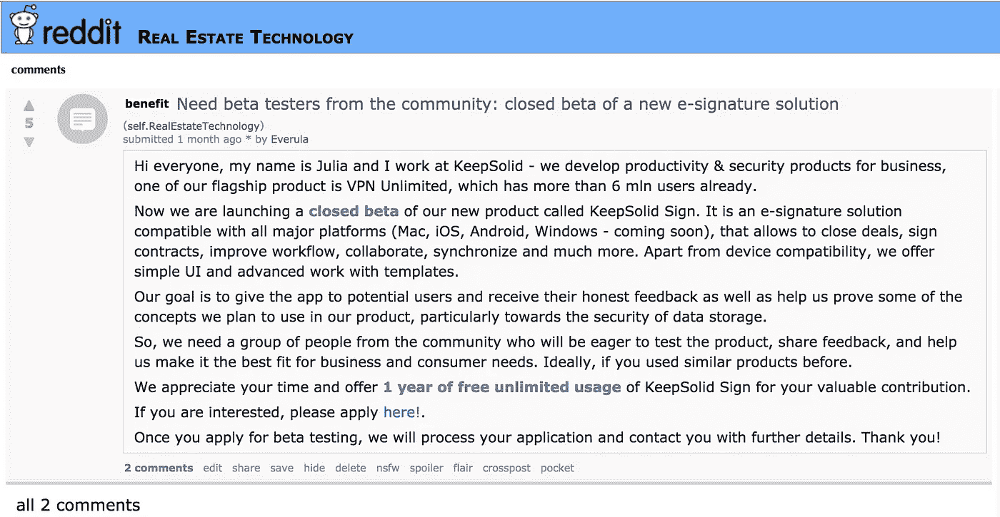
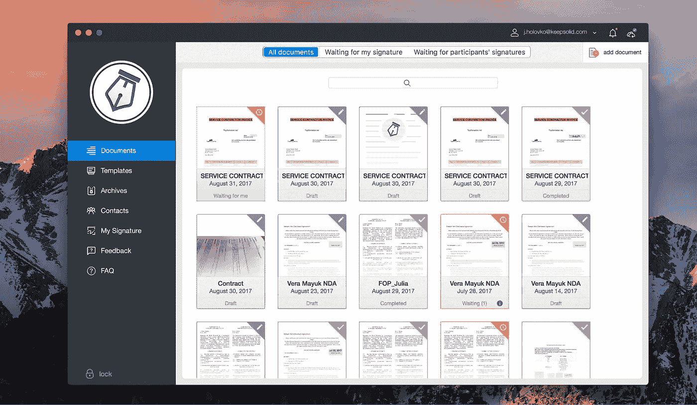
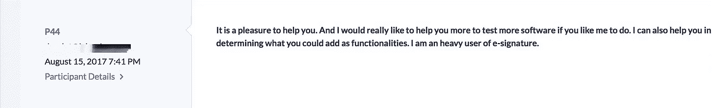
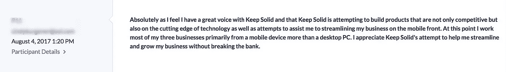
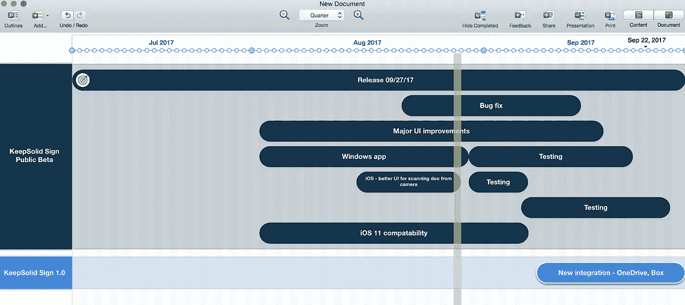
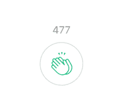

# 如何在零预算的情况下进行封闭测试

> 原文：<https://medium.com/swlh/how-to-conduct-a-closed-beta-testing-with-zero-budget-acd19c2de43>

## ***1.5 个月，100+家公司，20 个行业——keep solid Sign 故事。***

**这篇文章的目标:**逐步展示我们如何在有限的时间和有限的资源内，从头开始对 [KeepSolid Sign](https://www.keepsolid.com/sign/) 进行封闭测试。因此，如果你是一个创业者、营销专家或企业家，对把你的 MVP 或 beta 产品交给第一批用户感兴趣，请留下来听一听。

Photo by [Japheth Mast](https://unsplash.com/photos/Ls3yexjyRpk?utm_source=unsplash&utm_medium=referral&utm_content=creditCopyText) on [Unsplash](https://unsplash.com/?utm_source=unsplash&utm_medium=referral&utm_content=creditCopyText)

当开发自己的产品时，像 Hotjar 做的那样做任何事情肯定会很酷。

但是，如果您的时间、人力、资源和预算更加有限，该怎么办呢？

如果，尽管如此，你仍然想让第一批用户测试你的产品，从他们那里收集有价值的反馈，而你仍然在开发阶段？

这正是我们在深入开发我们最新的应用程序***keep solid Sign***时遇到的情况。

对于电子签署合同和其他文件来说，这是一个很酷的服务。在那一点上，我们在三个平台——MAC OS、iOS 和 Android——上的 MVP 稍多一点，所以我们决定是时候进行一次 ***封闭独占测试*** 。

我们只有 2 个月的时间(实际上只花了 1.5 个月)来完成它，因为我们计划在 9 月底之前对 4 个平台(包括 Windows)和一个 web 应用程序进行公开测试。

A short summary of KeepSolid Sign beta

因此，这里是我们如何设法一步一步取得这些适度而体面的结果。

# **准备阶段**

首先，我们**确定了本次封闭测试的目标**,如下所示:

1.  将产品交给第一批用户，并获得关于当前产品外观和感觉及其优缺点的反馈。
2.  了解用户现在如何处理签署文档和文件——他们使用什么解决方案，当前解决方案的优缺点是什么，等等。了解我们如何应对他们现在使用的解决方案。
3.  更好地了解未来的产品开发，并制定路线图。
4.  为我们的产品建立客户角色。

设定目标后，我们开发了一个测试的计划或概念。我们仔细考虑了测试的各个阶段，决定了如何采访参与者，创建了登陆页面和其他内容，并开发了通信系统。更多细节在前面。

完成测试概念和计划阶段后，我们开始邀请用户。为此，我们使用了**三个通道**:

*   ****像 Betabound 这样的专业化服务(约 18%)。*** 我们在这个 [google doc](https://docs.google.com/spreadsheets/d/1adsTxhjG0yBIZmVWOjvjY7U82JJkRYh68mzxc243pbU/edit?usp=sharing) 中收集了一个完整的列表，请随意使用它，添加其他服务或分享它。*
*   ****Reddit (~2%)****

**

*Our top sources*

*这导致了 232 名 beta 测试者的巨大数量(从那些完成我们的介绍性调查的人到那些申请的人有 62%的转换率)。*

*虽然前两个来源不言自明，但我们将稍微解释一下 Reddit 部分。*

*需要注意的是，我们选择了能够吸引我们正在寻找的那类受众的子区域——小企业主、房地产经纪人、金融专家等。我们没有对 beta 测试人员的子主题进行优先排序，因为我们需要广泛的反馈，而不是专业的反馈。然后，在征得他们管理员的同意后，我们发布了封闭测试版的邀请。*

*以下是此类帖子的一个示例:*

**

**One of the posts inviting to join our beta test**

*此外，我们选择了**合适的仪器:***

*   *为了创建测试版的登陆页面，我们使用了 [Tilda](https://tilda.cc/?lang=en) 服务。我们选择它是因为它有一个免费的残缺版本(我们实际上最终购买了订阅，因为我们需要一些额外的功能)，更重要的是，它允许创建漂亮的页面，并且执行起来很快。*
*   *对于调查本身，我们使用了[调查行星](https://surveyplanet.com/)。这是一个体面的解决方案，尽管它有某些缺陷，我们可能会在另一篇文章中讨论。*
*   *我们使用[日历](https://calendly.com/)(免费 2 周试用)来安排与同意此类调查的测试人员的通话。顺便说一下，结果并不太好，但我们稍后会回到这个话题。我们用 Skype 打电话，很意外=)*
*   *对于群发邮件，我们使用 [reply.io](https://reply.io/) 。同样，仅仅因为它有一个为期两周的免费试用。事实证明这是一个非常好的服务，我们正在考虑订阅它。*
*   *我们使用的另一个工具也是用户特别喜欢的工具是 Zendesk，一个基于票据的客户支持软件。显然，我们的测试人员最常使用它来给我们发送错误报告等等。但他们也非常感谢有机会通过应用程序联系我们。*

# ***正事***

*因此，在全副武装和充满危险之后，我们开始了测试。*

*起初，我们计划指派两名团队成员担任测试经理——一名负责电话调查，一名负责在线调查，但是……请继续阅读，了解发生了什么。*

*我们开始向所有参与者**发送申请表和介绍性调查**。在那里，我们问了一些一般性的问题，如职业和工作职位。这里最重要的问题是参与者可以使用哪些平台进行测试。由于当时我们只有适用于 macOS、iOS 和 Android 的 KeepSolid Sign，我们不得不要求所有 Windows 用户等待我们即将到来的公开测试版。*

*在用户填写应用程序后，我们授予他们**免费 1 年订阅【KeepSolid Sign。***

**

**KeepSolid Sign macOS interface**

*接下来，我们让他们下载应用程序并使用 1.5 周。*

*之后，我们给测试者提供了一个选择:他们是想通过在线文本调查，还是通过 Skype 通话。这就是我们犯错误的地方。*

*用户还是太冷淡了，他们不太了解我们或我们的应用。因此，尽管他们中的一些人同意打电话，但大多数人后来改变了主意，倾向于在线调查。*

*所以，从经典的说服心理学来看，如果你喜欢一个用户做一个特定的动作(填写调查，如果这是你的真正目标)，给他/她提供一个更差的替代方案(比如和你通话)。如果你设法让人们和你一起打电话，确保你在每个电话后都跟进，并总结你一直在谈论的内容。*

*顺便说一句，给你的用户录音是个好主意(如果你用 Skype 打电话，试试 [Callnote](https://www.kandasoft.com/home/kanda-apps/callnote-skype-call-recorder) ),但是要事先问清楚你是否可以这样做。通常情况下，人们不介意你录下对话，礼貌的做法是在你的跟进中把录音发给他们。*

***第一次在线调查** (25%的客户对#应用程序)包括关于参与者和他们使用我们应用程序的方式的各种问题——多久一次，出于何种目的，诸如此类。在测试人员通过调查后，我们会尽快阅读结果，这样如果需要的话，我们可以联系他们获取更多的信息。*

*之后，我们让他们再使用这个标志一周半。*

**

**One of the replies to the survey**

*在**第二次也是最后一次在线调查** ( > 23%的客户对#应用程序)中，我们询问了测试人员关于我们产品的问题——他们喜欢什么，不喜欢什么，反馈等等。我们还要求通过我们网站上的特殊表格对我们进行评级，因为他们已经使用 Sign 一段时间了，可以给出一个平衡的评论。*

**

**Another reply**

*在两次调查中，我们都有很多必问的问题。我们知道一些营销人员害怕他们，但是我们的测试人员反应积极。我们还以各种形式多次提问，以确保答案涵盖我们感兴趣的所有方面。两次调查的平均时间为 11-12 分钟。*

*测试结束后，我们制作了一个简短甜蜜的感谢视频，由我们的测试经理亲自拍摄，并发送给我们的用户，并要求提供推荐；)这个简单的小技巧引发了用户的积极反馈，我们现在可以将其用于我们的网站。*

# ***吸取的教训***

*我们得出结论，beta 测试是成功的，我们**设法达到了我们的目标。***

1.  *我们已经了解了很多关于**用户如何看待我们的产品**，他们喜欢什么，他们理解什么，以及他们希望在其中看到什么。例如，我们意识到用户真的很喜欢 Sign 是各种平台的原生应用程序，而不仅仅是一个浏览器解决方案。由于更好的性能速度和离线可用性，仅这一点就增强了他们的体验。*
2.  *关于用户如何签署他们的文档，我们已经有了很多深入的了解。例如，超过 30%的受访者表示，他们仍然使用手动“打印—扫描—签名—发送”方式。尽管电子签名和数字签名的接受程度在很大程度上取决于行业和州/政府法规，但与波兰相比，美国和英国的电子签名和数字签名接受程度要高得多。*
3.  *没有足够的测试人员来建立一个合法的统计抽样，并在此基础上绘制一个可靠的路线图，所以我们期待公开测试版来解决这个问题。然而，我们清楚地理解了**应该为我们的核心功能**添加什么(比如添加更多制作和编辑签名的选项，或者添加数字签名证书)。*
4.  *我们已经设法**定义和描述了三种角色**:小企业主、IT 主管和自由职业者。*

**

**Backlog and plans for KeepSolid Sign open beta (drafted with* [*Roadmap Planner*](https://www.roadmap-planner.io/)*)**

*但我们最终确定的最重要的事情(让我们松了一口气)是，Sign 实际上在商业上是可行的，并且能够应对竞争。这可以说是你从测试中学到的最重要的一课！*

*在**较小的课程中**:*

*   ***永远不要过早提出电话调查**，这可能会吓跑你的听众。*
*   *但同时**——**不要忽视电话调查。尽管我们只接到了几个电话，但它们真的很有帮助，提供了很多信息，我们强烈推荐这种方法。*****
*   ***随时准备编辑您的调查。当我们开始收到第一个答案时，我们意识到用户并没有以我们期望的方式看待我们的问题，因此我们不得不调整我们的问题。***
*   ***你的测试人员越少，你应该包括的量化问题就越少，因为答案没有足够的代表性。***

***总的来说，这是一个令人兴奋的测试版，肯定是一个有益的。***

***正如我们之前提到的，我们计划很快进行公开测试(在 9 月底在所有平台上发布应用程序，顺便说一句，你可以在这里[注册我们的发布列表](https://www.keepsolid.com/sign/sign-up)。)我们期待着在测试版完成后再写一篇关于它的文章。所以把这篇文章看作是开发者日记的开始，我们从一开始就用 Sign 描述我们的工作。***

***你有安排测试的经验吗？哪一部分对你来说最具挑战性？如果你不知道，你想知道更多关于我们的经历吗？***

***你的***

******

***…分享会鼓励我们为您写更多。❤***

****在*[*Twitter*](https://twitter.com/keepsolidinc?lang=en)*[*脸书*](https://www.facebook.com/keepsolidinc/) *和我们的* [*博客*](https://blog.keepsolid.com/) *上跟随我们，踏上为企业创造最佳生产力和安全解决方案的旅程。*****

********

## ****这篇文章发表在 Startup 上，这是 Medium 为企业家和初创公司发行的领先刊物。****

# ****你可以订阅[在这里获取头条](http://growthsupply.com/the-startup-newsletter/)。****

********