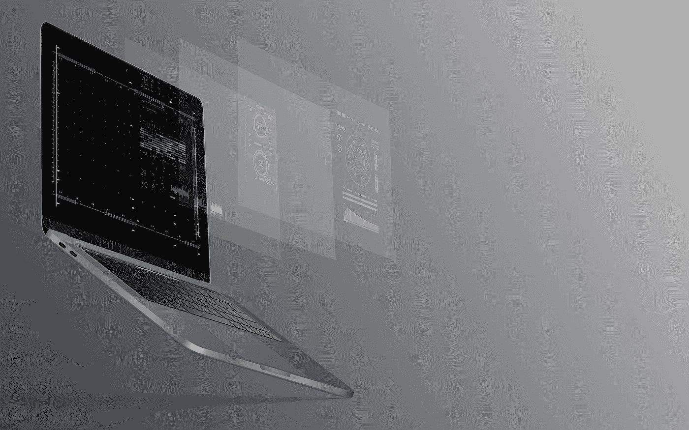

# 如何征服电子邮件:马上采用 9 种有效的电子邮件生产实践

> 原文：<https://medium.com/swlh/how-to-conquer-email-9-powerful-email-productivity-practices-to-adopt-right-now-2729908d1bf3>

在我们这个时代，掌握电子邮件[生产力](http://oneproductivity.com/?ref=medium_email_productivity)是知识工作者的一项关键技能。这与团队合作、沟通和解决问题一样重要，如果不是更重要的话。

我们花了[工作日的一半时间](http://www.cmo.com/adobe-digital-insights/articles/2016/9/30/adobe-email-survey-2016.html#gs.aH6W9d4)查看电子邮件。它从一种异步的通信形式转变为一种“永远在线”的技术，通过…