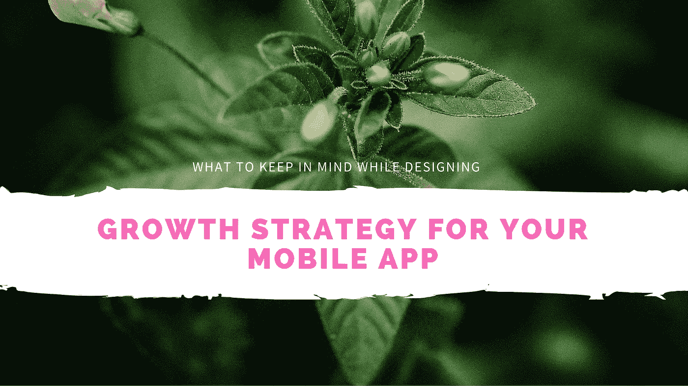
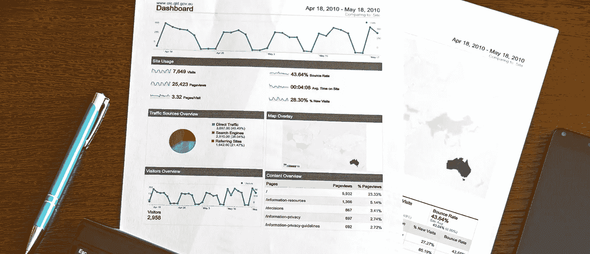

# 如何为你的移动应用创建一个增长策略？

> 原文：<https://medium.com/swlh/how-to-create-a-growth-strategy-for-your-mobile-application-2be2b59d1184>

通常，当开发人员构建应用程序时，感觉就像是整个项目本身。然而，一旦你的应用程序被开发出来并在应用商店上发布，很快就会发现，创建应用程序只是旅程的开始。开发者是创造者，他们发现构建一个应用程序的[过程令人兴奋，而运输的快乐不会持续太久。但是你看，真正令人兴奋的部分应该是把你的应用程序带给那些从中找到快乐的用户，并确保他们定期回到你的应用程序。](https://www.cognitiveclouds.com/insights/what-are-the-various-phases-of-mobile-app-development/)

一旦完成了应用程序的构建，开发团队的两个主要任务就是制定用户获取和保留策略。在收购方面，市场营销扮演着重要的角色。这包括应用商店优化、付费和有机收购等。而留住用户更多的是确保产品和营销团队在用户体验、再次参与和绩效方面合作。在这里，分析将被证明是一个有用的工具，可以准确地确定什么对你的用户有效，并了解如何保持吸引力。通过将所有这些工具投入使用，新的可能性就会出现，帮助您扩大您的用户社区，并确定新颖的想法，从而为您带来制胜优势。下面列出了一些在设计你的发展战略时要记住的事情。

*   不要过度教育你的用户。对于**的入职流程**，太多的应用程序打开了一组屏幕，用户必须在这些屏幕上滑动才能获得应用程序的功能。通常情况下，这些屏幕除了看起来很漂亮之外，并提供更多关于产品功能的信息。避免这个。制定一个平稳直接的[入职流程](https://www.cognitiveclouds.com/insights/mobile-app-onboarding-best-practices/)。有足够多的方法来简化应用程序用户的入职体验，其中大部分都不难实现。从包含长期入职流程的可视化进度指标开始。它可以是屏幕底部划分剩余页数的点，也可以是屏幕顶部的细条，当你接近结束时，它会填充颜色。不管怎样，以某种方式引导你的用户，让他们意识到并接受他们需要投入多少工作来使用你的产品。当你消除了入职过程中的所有摩擦，整个体验应该只需要你的用户几秒钟就能完成。
*   **设计**将决定用户的整体体验，因此对增长至关重要。优先考虑设计，你就有更大的机会给用户带来超出他们预期的体验，同时推动你的应用增长。从留意意外的摩擦源并消除它们开始。在添加更多功能、选项或迎合边缘情况之前，先这样做。确保你的应用程序的每个屏幕上都只有一个清晰的主导动作。排除任何意外按错按钮的可能性。不要假设你的用户已经阅读了你提供的任何说明。此外，确保所有行动号召的外观和感觉在表面特征上是一样的，比如颜色、措辞、字体和位置。此外，考虑所需的手部动作。让你的用户突然伸手去触摸屏幕的右上角，而他们一直在点击屏幕底部的按钮，这是不体贴的设计。人们的眼睛也以类似的方式追踪。记住，每次你把用户带出他们的舒适区时，你都有失去他们的风险。
*   **推荐**由于其病毒性质，有能力帮助你的应用程序规模更快增长。在早期，推荐是你最强大的增长来源。记录每个用户的推荐人以及每个推荐人发送给潜在新用户的邀请。现在，根据哪些渠道产生的邀请量最高，对渠道进行优先排序。确保推荐是双赢的。推荐量最大的通常是那些对推荐人和接收者都有价值的推荐。请记住，它们必须与产品的核心体验紧密相关。通过这种方式，推荐你产品的非用户将能够直接体验你的应用程序的有用功能。当你的产品没有明确的社会性时，这可能很难做到，但这仍然是可能的。找出机会的一个方法是观察用户在你的应用程序之外和周围做了什么。
*   持续的价值是让大多数用户回到你的应用程序的原因。及时添加新功能会增加这一价值。不断分析您的用户数据，以确保您添加了有价值的功能，从而在竞争中保持领先。**频繁的应用更新**是一种有效的以增长为中心的策略。当用户看到你致力于应用程序的开发时，他们会增加对你的忠诚度和信心。

**Analytics**

*   **分析**是关于你的产品运行良好。不要过分解读下载量。相反，投资了解你的应用程序使用数据。这将有助于您的应用程序更快地发展。一旦你了解了你的应用的增长杠杆，你就可以让你的计划符合这个标准。此外，即使收入是你的应用程序成功的一个很好的指标，也不要认为它意味着持续的收益。为了保持领先，不断衡量哪些功能吸引人们？用户从哪些部分离开？用户每天使用你的应用的频率是多少？跟踪这些参数对于持续改进你的应用和保持用户参与度至关重要。
*   作为一名应用营销人员，你必须**试验你所掌握的每一个工具。**推送通知、应用内消息和新闻卡片都是你可以用来提高应用参与度的渠道。参与度的提高最终会转化为增长。
*   利用一切机会对**进行正面强化**。今天，让用户做出哪怕是很小的努力都是一项艰巨的任务。所以确保你对他们的每一个微小的、边缘的行为都给予奖励。从账户创建表单中的在线验证绿色复选标记，到感谢卡和小折扣，专门感谢用户采取高摩擦行为，如购买。发现并专注于你的最佳推荐渠道。
*   **停止依赖标准的社交媒体分享。**我们今天在应用程序中遇到的最常见的错误之一是社交分享按钮占据了应用程序太多的屏幕空间，而社交甚至不是产品的核心。在用户体验中看到这些按钮是如此的平常，没有任何特别的意图或动机。最多，他们给我们一点点关于用户有机地做什么的洞察力，但是他们经常只是浪费空间。如果你真的想增加这些功能，确保它是你产品核心流程的一部分。在概念上简单的方法中加入标准的分享按钮已经变得如此普遍，以至于许多用户已经训练自己完全忽略它们。在每一步，你都应该寻找你的应用程序不需要的东西，这通常是首先要做的事情之一。

# 结论:

成长的科学中有艺术。它是产品、市场、用户体验、运气、时机和许多其他变量，所有这些都包含在内。如果你打包的这个包起作用了，它会看起来不真实，这就是产品爆炸的方式。即便如此，通过应用上面提到的某些策略，应用营销人员可以显著提高用户获取、参与和保留率，这是决定移动应用增长的三个关键因素。

随着当今应用生态系统的不断发展，营销人员需要保持领先。为了增加你成功的机会，在你的应用程序发布前和发布后的阶段，保持警惕以避免经常被忽视的陷阱。制作一份清单，在每个阶段检查一遍。弄清楚你的用户关心什么，并对他们的反馈做出回应。及时的更新可以确保你不会因为竞争而失去一个有价值的客户。说到应用营销，你很快就会意识到每个小细节都很重要。

*原载于* [***CognitiveClouds 博客***](https://www.cognitiveclouds.com/insights/what-to-keep-in-mind-while-designing-a-growth-strategy-for-your-mobile-app/) ***:置顶*** [***手机 App 开发机构***](https://www.cognitiveclouds.com/custom-software-development-services/mobile-app-development-company)

## 这个故事发表在 [The Startup](https://medium.com/swlh) 上，这是 Medium 最大的创业刊物，拥有 291，182+人关注。

## 在这里订阅接收[我们的头条新闻](http://growthsupply.com/the-startup-newsletter/)。

