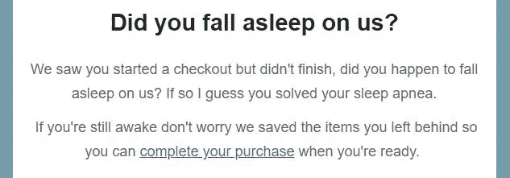

# 如何为 Shopify 打造高转化率自动化弃车邮件系列

> 原文：<https://medium.com/swlh/how-to-create-a-high-converting-automated-abandoned-cart-email-series-for-shopify-e8241b8348db>

如果你读过我的博客文章，你可能知道我是多么强调为你的电子商务商店实施一个好的电子邮件营销策略。如果做得好，电子邮件营销可以为你的企业带来大量的销售，而且由于电子邮件自动化，它也不需要做很多工作。在最近的一篇博文中，我谈到了如何为你的商店创建一个高度吸引人的欢迎系列，这非常重要，但对你的电子邮件营销策略同样重要的是拥有一个高转化率的废弃购物车系列。每个人都知道(或者电子商务领域的每个人)顾客总是会往购物车里添加商品，然后不买就离开。看看下面的图表，它显示了一年中被顾客丢弃的购物车的百分比。

Average % of shoppers that leave site without a purchase.

废弃购物车系列的目标是通过提醒、支持和激励措施来跟进潜在买家，试图挽回一些损失的收入。当客户将商品添加到购物车，进行结账并输入其电子邮件地址，但随后停止结账时，即被视为废弃购物车。客户可能会放弃购物车的原因有很多，例如，客户可能在移动设备上开始购物，结账时遇到了困难，所以他们停止了购物，可能他们正要购物，午休时间结束了，或者可能他们去购物，但将信用卡忘在了某个地方。

人们没有完成购买的原因有无数种可能性，但这并不意味着他们不想从你这里购买。这就是为什么跟踪他们是非常重要的，因为它提醒他们购买，让他们回到你的商店。根据我的经验，一个自动化的 3 部分废弃购物车系列总是被证明是最好的转换方式，所以我将向你介绍我的策略和每封邮件的结构。

# **对于系列中的所有电子邮件**

在制作这三封电子邮件中的任何一封时，要记住的主要事情(我怎么强调都不为过)是根据你的品牌对它们进行个性化处理！如果你发出无聊的普通废弃购物车邮件，你的打开率和点击率将会大受影响。让主题行对品牌来说是独一无二的，让客户想打开邮件看看里面有什么。如果客户看到“您落下了一些东西”或“您是不是把这个忘在购物车里了”，他们会马上知道这封电子邮件是关于什么的，他们可能不会点击它，因为他们可能会收到很多类似的电子邮件。举个例子，我的一个客户卖 CPAP 机器(它们能帮助你入睡)，所以我们用“你在我们面前睡着了吗？”。这与他们的品牌有关，也产生了一些好奇和疑问，这封邮件是关于什么的。这是这封邮件的统计数据。

就像主题行一样，你也想在邮件正文中个性化信息，以符合你的品牌。如果你花了很多精力写了一个完美的主题来让客户打开邮件，不要因为一封非常无聊和结构不良的邮件而失去他们，邮件中说“这是你留下的东西，回来完成你的购买”。再次提到我的客户，销售 CPAP 机器检查我们在这封电子邮件的开头段落。

看到了吗，那感觉更像是针对你的？这就是你想要的目标。你想确保你的电子邮件充满了所有的最佳实践，以最大限度地提高你的转化率，下面我将解释这一系列中所有三封电子邮件的最佳实践。

# **电子邮件#1(购物车被放弃后 1-3 小时发送)**

我看到许多商家做错的一件事是在他们废弃购物车的第一封邮件中给出折扣，这不是你能做的最糟糕的事情，但你可能会让自己损失一些美元。在电子邮件一中，主要的焦点是提醒顾客他们丢弃的物品，并提供顾客服务。你要确保邮件有一点介绍(不要太长)，然后显示他们留下的项目和行动号召(CTA)。在电子邮件中显示商品的下方，写一两句话，告诉顾客如果对购买有任何疑问，如何联系你的商店(如电话、实时聊天、电子邮件)。您希望避免在这封电子邮件中出现任何会让客户离开购物车的链接，比如相关商品或推荐产品。会让顾客离开购物车的链接只是起到分散注意力的作用，这封邮件的目的是让他们回到购物车，就是这样。

# 电子邮件#2(在第一封电子邮件发送 24 小时后发送)

邮件 2 与邮件 1 分享了许多相同的最佳实践，但有一些小的补充。首先，你要确保你的电子邮件是个性化的品牌再次(没有马虎以下电子邮件)。第二件事是，现在是时候给你的废弃购物车电子邮件系列打折了。就我个人而言，我最喜欢的策略是在第二封邮件中给他们 10%的优惠券，以吸引他们购买。你还想在第二封邮件中制造紧迫感，当你给他们提供折扣时，这很容易做到。制造紧迫感的最佳做法是给他们一个折扣到期的时间限制(通常是 24 小时)。

第二封邮件也是介绍一些社会证明的好时机。就像第一封邮件一样，你想用几句话做介绍，但这次在介绍下面，马上给他们一个 CTA，让他们回到购物车。在 CTA 之后，添加留下的项目，然后添加一个关于支持的句子(就像电子邮件#1 一样)。但这一次，在邮件底部添加一些来自你的 Instagram 账户的图片，或者添加一些评论，这会让你的客户更加信任你。顾客放弃购物车的一个重要原因是缺乏对品牌的信任，所以向他们展示一些使用该产品的人的图片或一些评论可能正是他们想要的。

# 电子邮件#3(在第二封电子邮件后 2-3 天发送)

这封邮件是一系列废弃购物车邮件中的最后一封，就我个人而言，我的策略是让折扣比邮件#2 高一点。这是你让客户转化的最后机会，所以你要尽你所能打击他们，并在这封电子邮件中真正推动紧迫性，即这是你打折的最后机会，你的购物车将在 24 小时内到期。这封邮件的结构与邮件#1 和邮件#2 不同，在这一点上，您可以假设客户可能已经看到了前两封邮件中的一封，因此第三封邮件要直截了当。写几个关于折扣的句子，强调紧迫性，给他们一个 CTA，让他们立即点击，回到他们的购物车。通过在电子邮件中包含最少的内容，这意味着当电子邮件在收件箱中打开时，CTA 将是可见的，这为客户点击它提供了更好的机会(滚动到 CTA 越少越好)。

作为这篇博客的结尾，我想补充一点，我上面列出的策略并不是废弃购物车系列的唯一策略。这个策略是我发现最适合我合作的大多数品牌的一个，但是有很多方法可以调整这个策略来最适合你的需求。这也是大多数人容易遵循的更直接的设置之一，您可以添加无限量的条件和细分，以获得废弃购物车的最大转化率。您还可以为之前已经与您一起购买的客户建立第二个废弃购物车系列，这样他们就不会再次获得相同的折扣。看看我为一个客户设计的这个更精致的废弃手推车系列。

像往常一样，如果你有任何问题，请随时留下评论，或者你可以随时联系我在 brent@onlygrowth.com，我很乐意给你一个免费的 30 分钟的电子邮件审计，并帮助为你提供一些策略。

或者在[https://onlygrowth.com](https://onlygrowth.com/pages/audit)报名参加免费的现场审计

## 这篇文章发表在[《创业](https://medium.com/swlh)》上，这是 Medium 最大的创业刊物，有+399，714 人关注。

## 在这里订阅接收[我们的头条新闻](http://growthsupply.com/the-startup-newsletter/)。

