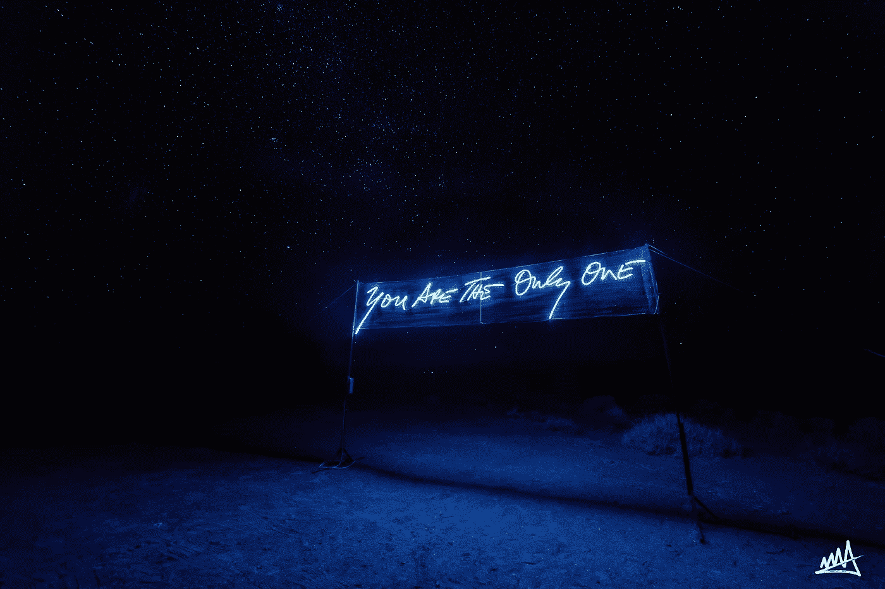
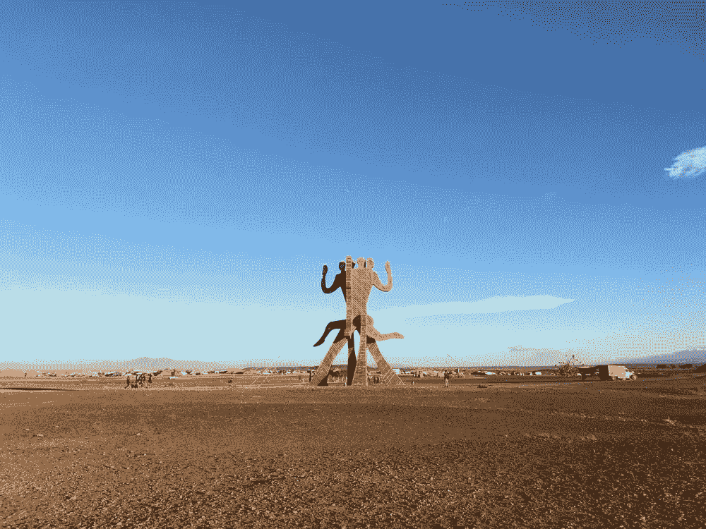
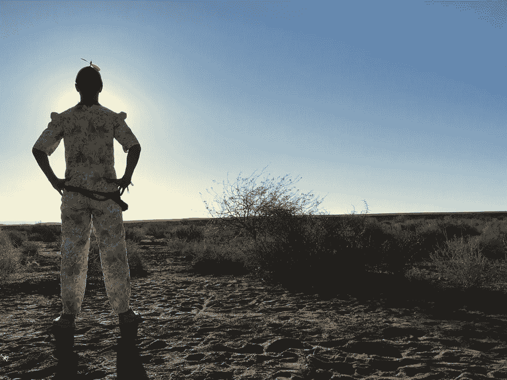
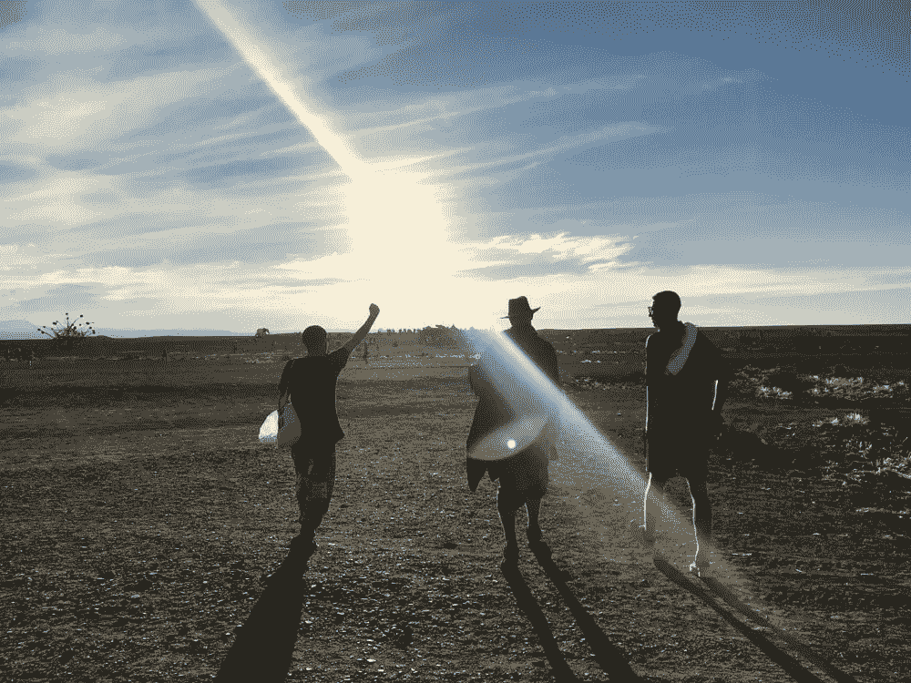

# 如何在短短 7 天内对你的生活产生有意义的影响

> 原文：<https://medium.com/swlh/how-to-create-a-meaningful-impact-in-your-life-in-just-7-days-cb7366a53f52>

## 我从有史以来最充实的生活经历中学到了什么

[第二年**连续两年对我影响最大的人生经历之一**](https://www.afrikaburn.com/)Afrika Burn。我在坦桑尼亚写这篇文章；我需要一些时间坐下来写下我的感受…

在 Afrika Burn 的第一年是一种更加共享的经历。一次关于友谊和团队价值观的经历，与最好的朋友和我们认识的人分享，他们与我们联系更紧密(你可以 [**点击这里**](https://www.youtube.com/watch?v=IUOC0qeoxiI) 看微型纪录片)。就像一个你爱的人的聚会。

第二年是非常私人和亲密的，但同时更加开放，与人和环境联系更加紧密。与去年相比，我的朋友群变得更小了，更多了，尽管我遇到了更多我认识和不认识的人(很棒)。主要是我和营地里的每个人(乌布兰提，还有每个人，我重复一遍，每个人都是独一无二的了不起的人)，每个人都给整个事情增添了一些魔力。就我个人而言，我经历了我一生中最激烈的转型和精神生活经历之一；我甚至可以说是最。今年比去年紧张多了。不一样，没有比较。今年是过去的结果。

# 《非洲燃烧》、《燃烧的人以及类似的生活经历

今年，我几乎不认为这是一个节日或聚会，更像是一种变革性的生活体验，我将在各个层面断开连接。非洲烧伤是一个地方，你不能工作或搜索，但找到。我决定流动，放开自己，超脱，孤立自己，臣服于探索之外的极限。我可以说我做到了。

首先是因为我所属的阵营和今年巧合的变革代理人部落。能够与埃里克·格罗特费尔德这样不可思议的人会面和交流，我在很短的时间里学到了很多。有像贾维这样的人，然后还有像肯德尔、丽贝卡、埃利纳、何塞、道格、胡安、朱丽叶或福斯塔、切马等其他人，我与他们有过交谈和神奇的时刻。

第二，因为沙漠和自然的智慧，因为知道如何去看它，欣赏它，并与它融合。我一个人在沙漠里呆了 11 个小时，从下午 4 点到下午 2 点。我走了大约 38 公里，然后我醒着躺在那里——我不知道有多久。在那 11 个小时里发生的事情是我个人经历过的最有趣的事情。这是我自己的一次冒险，在那段时间里，一次与自己高谈阔论的谈话。

我重温了我的一生，这 35 年的大部分时间，最好的时光和不太好的时光，以及正常的时光。我找不到一个遗憾，没有一个“但是”，没有什么可以抹去。一切都是理所应当的。我拥抱了自己 11 个小时。我接受了我必须忍受的一切，即使我再也没有从那个沙漠回来。去想想。

第三，打破常规，消除任何义务或责任。原谅我自己什么都不做，并借此更加清醒地意识到可能发生的事情。

第四，因为我有这样做的倾向，也因为像非洲烧伤这样的地方的倾向。本质的经验已经仅仅通过它们的本质给你打上了标记。

# 绝对投降

最后，我放弃了。为此，我不得不把我的自我带到一个我完全置身事外的地方。你无法做出反应的地方。我来到了一个没有理解和推理的地方。在那里我牢不可破的自律瘫痪了。一个地方，一个时刻，一个空间，一个时间，在那里我与我的整个存在、感觉、呼吸和超意识联系在一起，不是来自我的头脑，而是来自感觉。我觉得我身体的每一部分都是非凡的事件。我的思维中断了几个小时，这是我在内观和死藤水时都没有做到的。

最棒的是(对我来说)，我独自一人躺在沙漠中的某个地方，身上裹着一条毯子。没有仪式，没有说明书，没有巫师。

其余的我自己留着。我明白了，这种改变人生的经历不能，也不应该，也不需要被告知或解释。主要是因为有些东西必须为我们的灵魂保存，而且只能为我们的灵魂保存。

# 极度脆弱

我不记得有过像 2 月 28 日星期六和华伦天奴在一起时那样爆发和向某人敞开心扉的时刻。大约 4 点钟，我们在沙漠里，看着月亮，我们离开了贾维表演的舞台，我不记得汪妮说了什么。这是一个让多年来有内容的一切都展现出来的时刻。我哭了，就像一个孩子拥抱他说“我们必须实现的，我们已经实现了。”脆弱，真实，也是我多年来感觉最舒服的一次。

# 我在之前、期间和之后学到了什么

我可以说一些我在非洲学到的东西:

*   当你承诺某事时，你不能三心二意。
*   直到今天，瓦伦蒂诺是我与之最合拍的人。
*   [**迷幻药**](https://es.wikipedia.org/wiki/LSD) 让你对人敞开心扉。而[的 **Psilocybin** 的](https://en.wikipedia.org/wiki/Psilocybin_mushroom)有助于自己开启。
*   我生活在我的泡泡里，有好的也有不太好的。
*   我是我最好的朋友。
*   当然，我可以和自己聊上几个小时，就好像它是我最好的朋友一样。
*   身体是有记忆的，如果你经历了很多次，它会让你带着更多的包袱去回应、抗拒、反应。
*   探索正确边界的唯一方法是“失去理智”，这意味着你必须超越我们的理解和控制。
*   不管是什么，我准备好了，我投降，我不反对任何无用的抵抗。
*   我的生活对我来说是完美的，无论它是什么，无论发生什么，它都是美丽和完美的。
*   尊重我的人格和我的真实性高于一切。
*   (感情上)少打我。
*   前所未有的开放。
*   看得更多更好。
*   对我宽容一点。

# 我意识到了什么？

除了学到了上述的一些东西，我还注意到了其他一些东西:

*   没有比我们自己更好的朋友了。
*   我们是我们的萨满；我们是我们的书。
*   你需要在接受之前先给予。
*   我已经得到了我想要的一切；现在只是偶然。
*   我不得不接受我不喜欢接受的。
*   冥想(有声和无声)、迷幻(自然)和沙漠中的音乐，是体验变革生活的最佳组合。
*   当我不知道什么的时候，我不得不去问它。当我想不起来的时候，寻求帮助。
*   都搞定了；你要享受更多。
*   明天不重要。今天很重要。现在更好，比找到方法更好。
*   只要我们努力，就没有极限。不说比说更重要。
*   无条件支持移山。
*   你得经常脱衣服。
*   自然是我们最初的形式；我们必须更经常地回到这个问题上来。
*   我们是我们生活和经历的总和。
*   它不是优化一天或一个人，而是得到一个人的最佳版本。
*   没有必要有一个目的，一个使命，一种方式，也许它是一个目的或目标，它没有它。

# 我取得了什么成就

根据我所学到的和我所意识到的，这是我从 Afrika Burn 的道路经历中获得的最大收获:

*   完成 [**募捐挑战**](https://www.justgiving.com/fundraising/ridetoburn) 。
*   在 [**挑战**](https://isragarcia.com/extreme-challenge-positive-impact) 中收集 100%的预期。
*   信任一个你不了解的团队。
*   与某人分享我最深刻的脆弱。
*   抱着自己走了很久。
*   自言自语，好像我是我最好的朋友。
*   不要想任何人或错过任何人。
*   睡在沙漠里。完全臣服于这种体验。
*   打开 [**龚沉思**](http://mindworks.org/meditation-knowledge/what-is-gong-meditation-and-how-is-it-practiced/) 。
*   告诉我你要告诉我什么。
*   展现我真实漫画的一面。
*   与世隔绝八天。
*   做我该做的，不管你喜不喜欢。

# 重要的经历会让你脱离正常状态

带你去一个新的地方。

让我们害怕的事情是让我们成长的事情。

我们拒绝的东西是我们最需要学习的东西。

我们不理解的东西是我们需要学习和不断成长的东西。

一切相反的东西在精神上都是一样的。

谁会告诉我，在一个“节日”，如非洲燃烧，你可以提取这么多？

多去体验生活。摇滚起来。

【本帖最早出现在 isragarcia.com

# 只有当你觉得值得的时候，才让这个故事震撼吧！如果你发现任何有价值的东西，请鼓掌。

> Isra Garcia = 53 个客户，48 家企业，400 次演讲，3.504 篇帖子，24 个项目，6 本书，380 场讲座，6 家公司，17 次冒险，25 次实验，∞失败。到目前为止…
> 
> [有一手](https://isragarcia.com/wp/marketer)。顾问。扬声器。作家。教育家。经理。在 [IG](http://thisisig.com) 的负责人。博主。企业家。颠覆性创新。数字化转型。高绩效者和生活方式实验者。

# 行动号召>>点击[此处](http://feeds.feedburner.com/isragarcia)订阅更多类似的文章！

## 这个故事发表在 [The Startup](https://medium.com/swlh) 上，这是 Medium 最大的创业刊物，拥有 325，521+人关注。

## 在这里订阅接收[我们的头条新闻](http://growthsupply.com/the-startup-newsletter/)。

