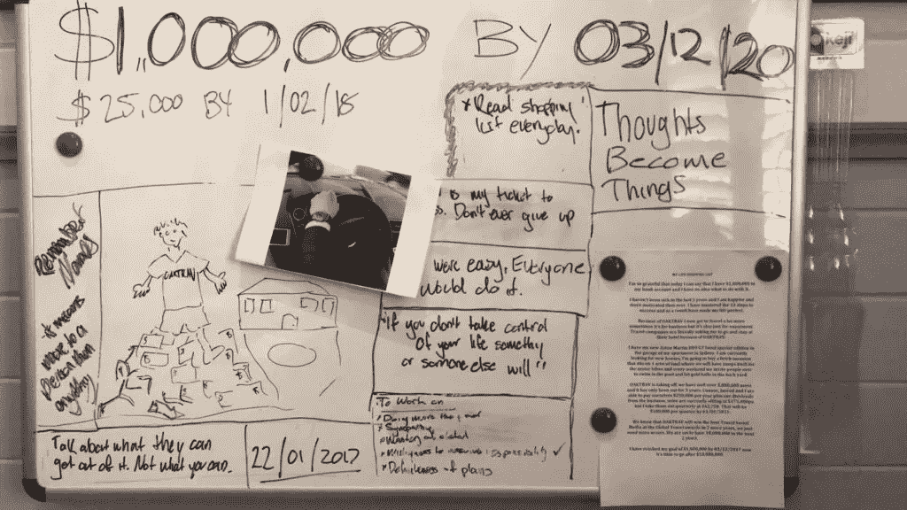
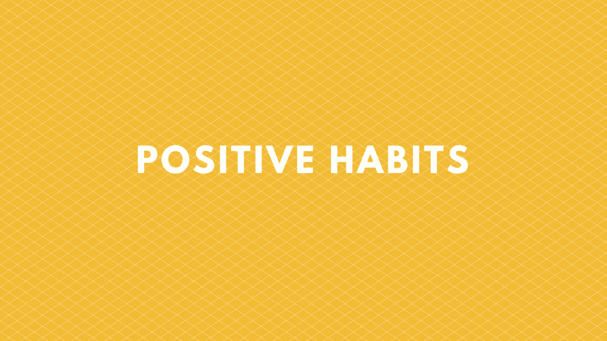

# 如何建立积极的心态并实现你的目标

> 原文：<https://medium.com/swlh/how-to-create-a-positive-mindset-and-achieve-your-goals-3efe2f0950f3>

设定目标对取得成功至关重要。

他们给你方向，给你目标。不幸的是，并不是每个人都明白这一点。在地球上的 70 亿人中，只有 3%的成年人真正写下了他们的目标。

如果你正坐在一群已经写下目标的人当中，那么恭喜你，你已经领先于大多数人了！下一步是创造一个积极的心态，给自己达到这些目标的最高概率。

如果没有积极的心态和想要实现目标的动力，你肯定会失败。

任何制定了半吊子新年计划的人都会知道这一点。你从人们想要实现的事情中挑选一个目标，努力几个星期，然后放弃。

这种情况一次又一次地发生，这是因为人们错过或不知道在追逐他们的目标时需要的一个关键阶段。

这叫做培养积极的心态。

如果没有积极的心态，你会在追求目标的起伏中挣扎。

积极的心态让你坚持下去。它能让你看到所有情况的积极面，帮助你想象你的目标，最终实现目标。

**为什么人们会错过这一步？**

这是我经常思考的问题，当我回顾自己设定目标的历史时，答案就变得很明显了。

我花了 4 年时间才真正实现我的目标，并决定不懈地追逐它们，但什么改变了呢？

当我思考这四年的时候，我会想到两件事:

1.  我变得厌倦了无处可去，以至于实现我的目标成了一种需要，而不是欲望。我需要摆脱我所陷入的困境。我需要做出一些改变，我需要停止做一个弃子。在我决定追逐我的目标之前，我几乎每天都喝酒，把所有的钱都花在派对上。所以，对我来说，说我要设定目标，然后生活在幻想中，想着有一天我会实现这些目标，这很容易。酒精很擅长制造虚假的现实。所以我意识到自己没有任何进步，完全是在自欺欺人，这只是时间问题。
2.  我准备好了。它归结为达到一定的成熟水平。当我第一次提出我的目标时，我还年轻，不成熟。正如你从第一点可以看出的，我只想年轻和无忧无虑。包括所有的聚会和休假。我一周都在工作，这就是我所能做的一切。如果你要做出改变，你需要达到一定的成熟水平。这包括做出一些巨大的牺牲，这是阻止人们进入下一个阶段的原因。如果你真的认为你可以实现你的目标，而不做任何改变或牺牲，你会惊讶一千倍。达到你的目标意味着牺牲，直到 2017 年初，我才准备好或愿意这样做。以下是我所做的事情，来创造你所需要的积极心态，来帮助你实现你的目标。我们将从头开始。

# 你的目的是什么？

为了创造一个积极的心态，你需要做的第一件事就是首先弄清楚为什么你需要一个积极的心态。这意味着，你猜对了，创造目标。

正如我已经提到的，没有他们，你将缺乏任何形式的方向，也没有必要改变你的心态。

## 1.发展你的目标

你的目标决定了你想去哪里。因此，它们需要是可衡量的和具体的。

举个例子，我的主要目标是:

> *到 2020 年 12 月 3 日达到 100 万美元*

注意我有一个确切的数量和确切的日期。这给了我努力的方向。它告诉我想要多少，什么时候想要。

从那以后，我制定了这个目标，并对它做了一些修改，减少了对金钱的关注，增加了对回报的关注，但出于本文的目的，让我们保持简单。

*如果你需要帮助找到你的目标，这里有几条建议要记住:*

*   你的目标必须是你真正想要的。而不是你认为你有能力做什么，或者你认为你应该做什么，或者别人想从你身上得到什么。如果这不是你想要的，你会对这个过程失去兴趣并失败。
*   *让你的目标聪明起来(去掉‘A’)。*

> ***S****——****具体*** *:写出你想要的东西。*
> 
> ***M****——****可衡量*** *:你打算如何衡量进度，确定里程碑？*
> 
> ***A****——****Achievabl****e:我不喜欢这个。我认为这迫使人们给自己能达到的目标设定界限。你可以做任何事情，看看埃隆·马斯克就知道了。*
> 
> ***R****——****Relevan****t:对于个人目标设定来说，这意味着建立一个让你在生活中达到你想要的目标。回到制定一个你真正想要的目标。做对这件事很重要。举个例子:如果你想在 X 日之前存下一定的钱，就不要设定一个想环游世界的目标。你的目标需要一致。*
> 
> ***T —时间有限*** *:这对于达成目标至关重要。没有设定你想实现它的时间，你就允许自己拖延。有了确切的日期，你就被锁定了。*

## 2.找到你的原因

砰！你已经有了目标，但你为什么要选择它呢？

你为什么要那么多钱？

为什么要减肥？

许多人认为他们的*为什么*是他们的目标，但不是。这是早上起床的根本原因。这是他们不断努力的原因，也是他们想要特定目标的原因。

正如我提到的，我已经制定了上述目标。那是因为我发现我的目标是空心的。它没有任何深度。它没有目的。

朝着这个目标努力一开始很有趣，最终改变了我的生活，但随着时间的推移，我开始失去兴趣，因为我没有情感依恋。

我没有一个*为什么*。

经过长时间的头脑风暴，我终于想出了我真正的*为什么*。

当我第一次开始写作时，我想激励患有慢性疾病的人，并告诉他们，仅仅因为他们有这些健康问题，他们的生命不必结束，他们不必放弃他们的目标。但对我来说，与世界分享我的病情并不容易。

这意味着我将不得不完全公开我所有的慢性病经历。我还担心，如果我分享我的故事，我会很难找到工作，或者人们会评判我，把我当成一个将死之人。

所以我退出了，写作很快就失去了优势，我想通过写作达到 100 万美元的目标的愿望也开始慢慢消退。

最终，我与几个人交谈，他们说服我分享我的故事，正如我所料，我找回了我的火花。

我有我的*为什么*。

我想通过我的故事和写作来帮助人们。

我的目标是钱。我的*为什么*是帮忙。

## 3.做决定

现在你已经有了你的目标和你的*为什么*，是时候跳跃了。

在你考虑制定计划之前，你需要做出关键的决定去追求你的目标。

这是每个人都卡住的地方，也是大多数人放弃的地方。

借口开始源源不断，你说服自己不要这样做。我将列出 3 个最常见的借口，并给出我的答案:

*   现在不是时候。永远都不是实现目标的最佳时机。你总能找到借口。工作承诺，家庭问题，积蓄不够，还没有掌握你需要的技能。给你一个提示。没有所谓的最佳时机。在某些时候，你需要承担一些风险，现在就开始。
*   **别人会怎么想？当你第一次决定追逐自己的目标时，对判断的*恐惧*是巨大的。我将完全诚实地告诉你，我以前没有得到它，但我知道它影响了许多想做一些不同事情的人。我要告诉你们，当我要做一些不同的事情时，我会参考一些东西。作为警告，这是相当残酷的。 ***无人问津！没人在乎你在做什么，也没人在监视你。人们表现得好像他们高高在上，每个人都在监视他们的一举一动。令人惊讶的是，如果你继续跟风，没有人会看，也永远不会有人看。你甚至还没有做任何值得关注的事情，就已经认为自己是关注的焦点了？不要担心别人怎么想，开始关注什么会让你快乐。*****
*   **失败了怎么办？回到我七年级的时候，我经历了一个所有考试都不及格的阶段(持续了高中的大部分时间)。在一连串的失败之后，我爸爸坐下来问我为什么不努力。我的回应？我害怕我会失败，所以为什么还要尝试？我爸爸看着我，说这是他听过的最愚蠢的借口，完全是胡说八道。他是对的，从那天起，我再也不用它做借口了。想象一下，如果你投入 100%，你无论如何都会失败？现在回想起来，这是愚蠢的，任何以此为借口的人都不是真的想要他们的目标。**

## 4.制定计划

咆哮结束，现在是时候制定你的计划了。

你已经完成了所有的思考，并进入了制定目标的最后阶段。

现在是时候弄清楚如何到达那里了。

在这个阶段，你需要把你的主要目标分解成小目标。

我把它分解成这样:

*主要目标、年度目标、6 个月目标、季度目标、月目标、周目标、日目标*

*通过将我的主要目标分解这么多，它做了两件事:*

1.  它确切地告诉我，为了达到我的目标，我每天想要完成什么。让我的待办事项清单变得更加容易和快捷。
2.  这让我的目标看起来可以实现。如果我着眼于我的主要目标，到 2020 年 3 月 12 日达到 100 万美元，这似乎是不可能的，但分解一下，我每天的目标是“写一篇博客”。更容易实现。

现在你已经建立了你的基础，是时候创造你需要的积极心态了。

# 创造积极的心态

为了创造积极的心态，你需要考虑 2 个因素:

1.  你的物理环境
2.  你的思想

他们一起工作，如果没有一个健康的 100%的平衡，你的目标会受到影响。

这正是最近发生在我身上的事。我有一个积极的心态，但自从离开我的全职工作，我的物理环境是消极的。我在我的卧室工作，放松和工作之间的界限模糊了，它们都混淆了。我分不清这两者。

更不用说它变得非常无聊和孤独。

这导致了精疲力竭。

如果你要达到你的目标，你需要这两个因素都是积极的。

# 1.自然环境

在消极的环境中培养积极的心态要难得多。所以你需要先从你的物理环境入手。当你开始改善你周围的空间时，你会发现你的心态会随之改变。

所以这是一场胜利，从这里开始。

在我们进一步讨论之前，我还想指出，如果你认为你已经为前面的观点做出了牺牲，那么你甚至还没有触及表面。你觉得这不容易吗？

这些变化是巨大的，也是艰难的，需要一段时间，但最终，它们是值得的。

当你到达那里的时候，你会感谢你自己。

我保证。

## 从人开始

跳进深水区，从你将要做出的最困难的牺牲开始。

你周围的人。

你是和你相处时间最长的 5 个人的产物。

我相信你听过这句话，但是有多少人真正把它付诸实践了呢？

谁真正摆脱了他们生活中的有毒的人，用弥补他们弱点和赞美他们优点的人来代替他们？

我花了很多年才做到这一点，当我最终做到时，我的生活改变了。

我已经告诉过你这个故事，在 2017 年初，我决定不懈地追逐我的目标。这包括做一次“朋友清理”,让我摆脱掉生活中所有有害的人。

当时，这几乎是我的整个朋友群。

我不再和他们所有人说话。就这样。没有警告，没有借口。我只是停下来。我不欠他们任何东西。

是的，这很难，是的，他们开始造谣，但这并没有影响我，因为我正在朝着更大的目标努力。

这是你在追逐目标时首先需要做的。仔细检查你周围的人，决定他们是在帮助你还是让你失望，然后除掉那些没有价值的人。

你周围的人会毁了你。

是时候向前看了。

## 你周围的环境

既然你已经完成了最困难的事情，是时候做一些更轻松和更有创造性的事情了。

你需要改变你的环境，这样它们才能激励你。

我说的是你的卧室，你的房子，你的车，你的办公室，甚至你经常去的地方。

它们都很重要。

整个周末坐在卧室里工作会对你的心态产生负面影响。我发现这不健康。

你需要出去做些积极的事情。

至于你的工作和放松区域，考虑一下这些建议，它们会帮助你改善你的环境:

*   把你的目标放在每一个地方。这是我写的地方。我床边的软木板，我书桌上的白板，我钱包里的卡片上，这样我无论什么时候买东西都能看到它，我的桌面背景和我的手机背景。不断地看到它将它嵌入到我的潜意识中，这帮助我养成了一种无法停止思考我的目标的心态。
*   **明亮的光线**——无论你在哪里工作，都要确保光线充足。昏暗的照明区域令人沮丧，会让你情绪低落。
*   **一个** [**愿景板**](https://jessekerema.com/vision-board-guide/)——在我的卧室里，我有愿景板。我把所有对我重要的东西都放在这里。目标，名言，我在豪宅里的画像。它提醒我想去哪里。

*   **清洁** —确保你的区域是干净的。没有什么比在自己的污秽中工作更令人沮丧的了。给自己一点尊重，清理干净。

**做这两件事对于创造积极的环境和最终实现目标的正确心态至关重要。**

# 2.头脑

你的思想是你拥有的最重要的工具。它决定了你的感受，你做什么，你去哪里。

所以，如果你想看到你的目标变成现实，拥有一个积极的目标是至关重要的。

当你建立积极的心态时，你需要做两个方面的工作:

1.  *积极的习惯*
2.  *目标定位潜意识*

一个在你头脑的行动方面工作，一个在你的思想中嵌入你想要的东西，以确保最好的结果。

## 创造积极的习惯

培养积极的习惯是实现任何目标的关键。它们让你走上正轨，让你远离旧的生活方式。

人们说养成一个新习惯需要大约 60 天。我觉得这是扯淡。如果你非常想养成一个习惯，你可以从第一天开始就养成它。

以我戒烟的时候为例(我不是一个铁杆烟民，只是偶尔会这样)。我总共花了 1 天时间才戒掉。一旦我决定我不想再做了，我就再也不回去了。我没有渴望。我没有副作用。这是因为我清楚地知道我想要什么，也清楚地知道我为什么要辞职。

当人们戒烟(或养成任何习惯)时，他们认为这是一个巨大的障碍，是一个巨大的成就，但事实并非如此。那些复吸的人没有原因，他们不想戒烟。

如果你有自己的理由，就很容易养成习惯。

还有一个就是早醒。如果你有那个目标或者让你一天都兴奋的事情，那就很容易。如果你有人生目标，你会早早醒来为之努力。

这一切都归结为一致性。

继续做下去。继续早起。不要再抽烟了。保持储蓄而不是消费。

如果你知道你为什么要这样做，那么培养积极的习惯是很容易的。

不要盲目地进去。弄清楚你的*为什么*。然后弄清楚你需要养成什么习惯才能达到目的。

## 创造成功的心态

这是培养积极心态的最后一步，需要大量的重复和坚持。你需要在这里培养一些习惯来滋养你的潜意识。

我之前简单地提到过，你需要不断地阅读你的目标，这样它们就会成为你思考的全部

思想变成了事物

如果你一直在想你的目标的[，你就会一直努力工作并寻找实现它们的方法。](http://www.hikenow.co)

这就是为什么你需要把它们写在每个地方。

就像我说的，我把它们放在这些地方:

*   我的卧室
*   我的办公室
*   在我的钱包里
*   在我的车里
*   在我的电脑上
*   在我的手机上

这些是我大部分时间呆的地方。不断的提醒迫使我总是想着我的目标，并且总是在寻找实现目标的新方法。

另外，我把它们写在一张纸上。我每天醒来和上床睡觉时都会看，所以它们是我每天看到的第一件也是最后一件东西。

加班，你就不需要看了。你只会一直想着他们。它会吞噬你。我现在可以清楚地想象我的目标了。我能感觉到当我实现它们时我会有什么感觉。我看得如此清楚。

你会成功的。你只需要投入一些工作。

创造积极的心态对实现你的目标至关重要。没有它，你将永远无法实现它们，但是就像任何过程一样，你必须实际去做。看完这个帖子就此打住是不够的。仅仅在某些问题上采取行动也是不够的。

在你到达那里之前，你必须做所有的事情并且坚持很长一段时间，但是最后，这一切都是值得的。

## 如果你喜欢这篇文章或者觉得它有帮助，按下那个按钮让其他人看看！更好的是，在你的想法上留下评论。

## 喜欢这个故事？[在这里和我联系](https://hunchmetrics.co/blog/)

## 这个故事发表在 [The Startup](https://medium.com/swlh) 上，这是 Medium 最大的创业刊物，有 297，332+人关注。

## 订阅接收[我们的头条](http://growthsupply.com/the-startup-newsletter/)。

