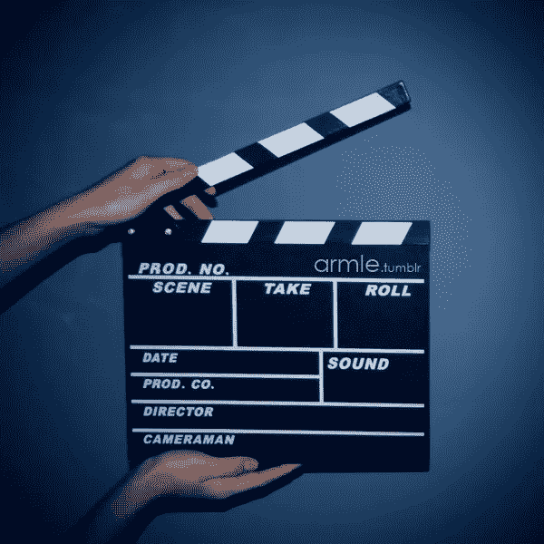
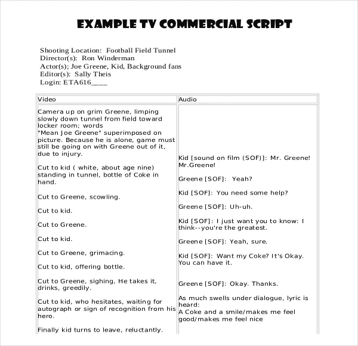
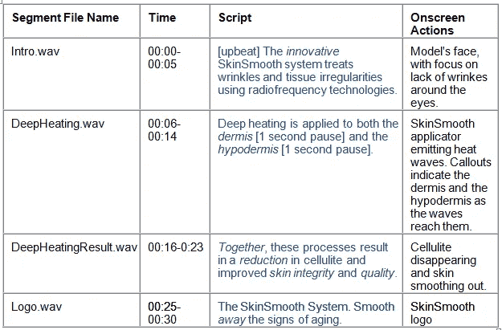
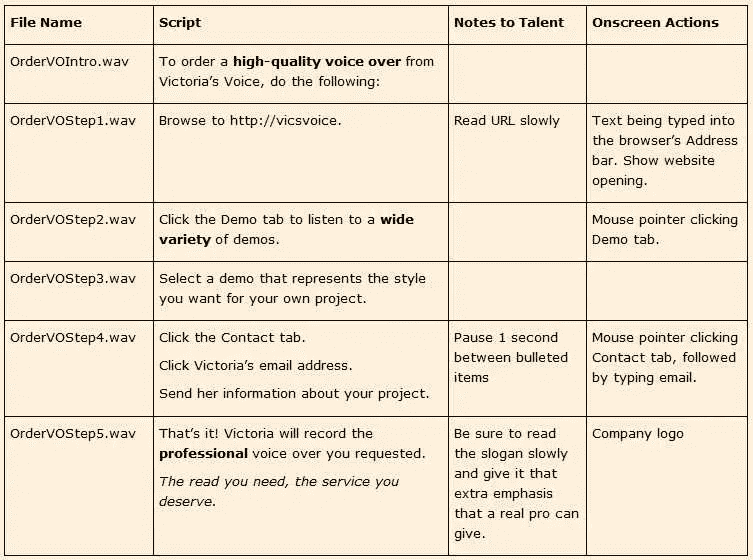
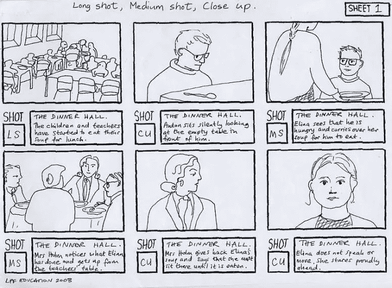
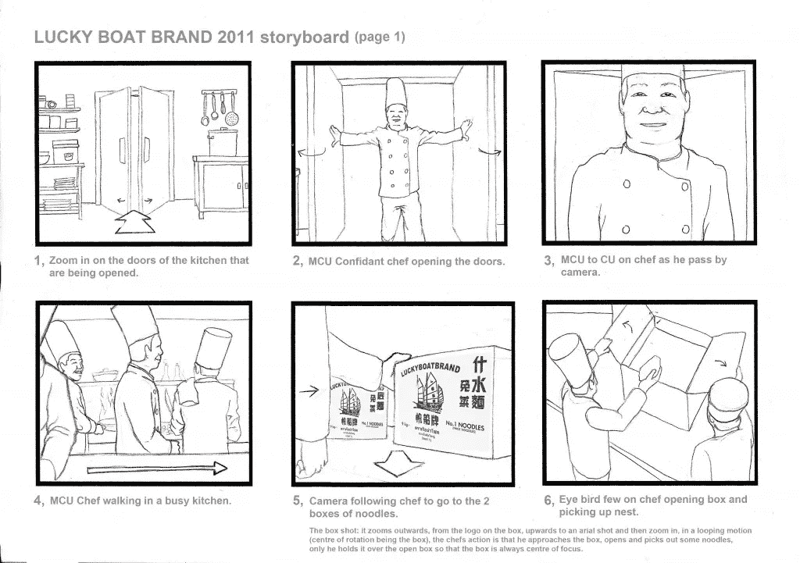

# 制作促销视频的 8 个步骤

> 原文：<https://medium.com/swlh/how-to-create-a-promotional-video-707fa7a63019>

[http://www.fuelingnewbusiness.com/](http://www.fuelingnewbusiness.com/2012/11/30/10-reasons-to-use-video-for-ad-agency-new-business/clapper-board/)

你有没有想过创作一个宣传视频？

毕竟，视频内容可以有很多用途，从社交媒体帖子和广告到电子邮件和营销网站。

但是你如何从“想要制作一个视频”到实际的脚本和制作呢？看起来很复杂，对吧？

其实挺简单的！

现在，我已经为三星和 Visa 这样的大客户写了价值百万美元的广告，也为 StartupThreads 和 Amino 这样的 SaaS 公司写了一些视频。

不管是哪家公司，预算，还是制作视频的原因，从最初的想法到最终的剪辑，每个视频都有一个非常基本的格式。

下面我列出了 8 个步骤，我希望这能帮助你把你的视频想法从脑子里拿出来，放到观众的屏幕上！

# 第一步:确定你的目标

在你坐下来为你的视频写脚本之前，你会想要后退一步，考虑一下*为什么*你首先想要创建一个视频。

视频的制作成本可能会很高，所以在开始写对话之前，明确你的目标是很重要的。

例如:也许你是一家新公司，你想要一个视频向网站访问者介绍你的品牌/使命。或者你有一个新的产品线，需要进一步向潜在的买家解释。也许你只是在进行销售，需要一个视频来推动人们采取行动。

以下是许多公司制作宣传视频的一些常见原因:

*   品牌知名度
*   推动销售
*   推动交通
*   提高客户参与度
*   教育客户

有一点要注意:如果你有多个目标，你可能要考虑创建多个视频。你试图塞进一个视频(尤其是一个短片)的目标(或想法)越多，你就越有可能让剧本变得复杂，让观众困惑。

> 如果你有多个目标，你可以考虑制作多个视频。

一旦你确定了*为什么*你想要制作一个视频，是时候开始寻找如何让你的视频变得生动的潜在方向了。

# 第二步:选择方向

既然你有了“为什么”，就方向而言，确定什么是有意义的应该会容易一点。

例如，假设你是一家新公司，想在你的网站上为主页英雄制作一个介绍视频；视频的目标是介绍品牌，让人们注册。

在这种情况下，你可能会选择一个更像是“介绍性”或“解释性”的视频。你甚至会发现几个方向的结合是有意义的。

例如，也许你是一家新公司，但是你面临着很多竞争。也许一个带有“问题/解决方案”角度的“介绍性”风格的视频将是理想的(显示“旧方式”为问题，“新方式”[指您的公司]为解决方案)。

为了给你一些建议，这里有一个你可以尝试的方向列表:

*   介绍性的:告诉你的听众你是谁，解释你的使命，等等。
*   **解释性**:解释某样东西是如何工作的(比如你的产品或某个特定的功能)
*   **问题/解决方案**:展示老方法/新方法以及你的产品是如何解决问题的
*   叙事:使用故事元素(如情节、冲突、解决方案等)巧妙地介绍或解释某事
*   **推动行动**:让观众做点什么(例如，立即购买)
*   **以产品为中心的**:介绍或展示特定的产品或功能
*   **客户评价**:围绕特定话题或主题对客户的采访、报价、声音字节等
*   **代言**:使用名人或影响者的认可/肖像
*   **信息性的**:教育你的听众一些具体的、教程式的东西，等等。
*   娱乐:用故事、幽默等来取悦或激励你的观众。

一旦你的目标和方向最终确定，是时候通过为你的视频设定基调来进一步完善你的方法了。

# 第三步:定下基调

语气被定义为某事物的“总体特征或态度”。但是简单来说，你可以把它想象成你的视频会让你的观众有什么感觉。

比如你是想让你的观众笑还是想让他们感动？你是想让他们觉得自己见多识广，还是想给他们讲个故事？

请记住，创意方向(在第 2 步中选择)应该与你决定采用的任何基调相匹配。例如，如果你决定为你的主页英雄创建一个“介绍性”风格的视频，使用“紧急”的语气可能没有意义，因为这最适合销售之类的事情。

(当然，将一个特定的创意方向与一种意想不到的基调结合起来并不一定是一件坏事——它只是归结为正确的执行)。

以下是一些不同的基调，你可以探索你的概念和创作方向:

*   戏剧性的——感动你的情感。*举例:* [*P & G 奥运商业*](https://www.youtube.com/watch?v=uGJGQQVNqjg)
*   直截了当/信息丰富 —清晰简洁。*举例:* [*gumroad*](https://vimeo.com/39302830)
*   **会话式**——随意而真实。*举例:* [*Glossier《和我一起准备》视频*](https://www.youtube.com/watch?v=D-Ameu6p02c)
*   紧急 —敦促你采取行动，就像现在。*举例:* [*梅西百货假日特卖*](https://www.ispot.tv/ad/7smj/macys-holiday-preview-sale-save-storewide)
*   **有趣/好玩**—使用有趣的创意装置(例如，拟人化)。*举例:**[*松弛*](https://www.youtube.com/watch?v=d2o3shroj7U)*
*   *幽默的 —喜剧的；让你开怀大笑。 [*举例:老香料*](https://www.youtube.com/watch?v=owGykVbfgUE)*
*   *古怪的——用奇特或意想不到的东西来说明问题。*举例:* [*Zazzle*](https://www.youtube.com/watch?v=L2Z0ENFJBZg)*
*   *可爱——让你“哇哦”的东西。*举例:*[*Cheerios*](https://www.youtube.com/watch?v=Z01qH-jqGBY)*
*   ***招待** —旨在通知*和*招待。超级碗广告通常属于这一类。*举例:* [*书呆子护肤*](https://www.youtube.com/watch?v=1KP5jpxTG0I)*
*   ***鼓舞人心的**—利用鼓舞来推动行动(宣言通常以这种风格完成)。*举例:*[*Squarespace*](https://www.youtube.com/watch?v=DhRbGkfPkGo)*
*   *艺术感/时尚感/酷感 —感觉年轻、时尚、潮流等。*举例:* [*匡威*](https://www.youtube.com/watch?v=n2CCz4x2xGE)*
*   *奢华——闪亮、花哨、浮华、性感、富有。想想豪华汽车广告、高端连锁酒店等。*举例:* [*拉斯维加斯酒店商业*](https://www.youtube.com/watch?v=Ch-IaE63l3I)*

*当然，你还可以探索更多的色调和方向，但希望这能给你一些想法，让你的视频变得生动起来。*

# ***第四步:决定持续时间***

*这会是一个 30 秒的视频吗？60 秒？一分多钟？五分钟？*

*你可能在想:“我怎么知道视频的长度，直到我把它脚本出来？”*

*相信我，我听到了！但事实是，如果不使用某种类型的时间参数，你的视频可能会太长，可能会不集中。*

> *如果不使用某种类型的时间参数，您的视频可能会太长，并且可能会不集中。*

*请记住，你的想法应该和它展开的时间一样大，所以对你的概念加以限制只会有助于使它更强大和更有效。*

*这也将帮助你避免令人沮丧的情况，比如强迫自己将两分钟的脚本缩短到 30 秒(顺便说一句，这就像是酷刑)。*

*如果你不确定你的视频应该有多长，你需要考虑以下因素:*

*   ***您的目标**(即品牌知名度、点击量等)*
*   ***广告将出现在哪里**(即电视、社交媒体、网站等)*
*   ***全面预算**(即——低、中、高、无限制等。*

*例如，如果你的目标是促销你的假日销售，一个 30 秒的广告可能足以让你明白你的意思。然而，如果你想让你的观众感动得流泪，你可能需要 1.30 分钟，甚至 2 分钟以上来完成这项工作。*

*为了得到一个标准，回想一下你的目标方向和语气。接下来，检查使用类似语气的现有视频，看看它们有多长，因为这可能有助于指导你(例如，如果所有视频都至少有一分钟长，这可能是一个很好的起点)。*

*第二件要考虑的事情是广告将出现在哪里。*

*例如，30-60 秒的商业广告在有线电视上很常见，而更长的视频在网上更常见。还有在线广告收购、脸书/Instagram 视频广告、前置广告等，所有这些都有自己的一套限制和最佳实践指南。*

> *你的视频在哪里出现并不重要，你只需要确保在计划时考虑到了**位置**。*

*最后，还有你的预算。如果你是低端用户，你可能只能买得起一个剪辑(或一个版本)的视频，这就是为什么步骤 1-3 对于第一次“做对”如此重要。*

*如果你在预算范围的高端，你可以削减许多不同的版本(例如，90、60、30 和 15 秒的广告位)，这将在视频位置、用不同的焦点/角度修改故事情节等方面给你更多的回旋空间。*

*一旦你确定了时长，就该考虑你的视频会是什么样子了。*

# ***第五步:选择视频风格***

*此时，你应该已经想好了你的目标、方向、基调和持续时间。*

*接下来要考虑的是视频的视觉风格，也就是说**它会是什么样子。***

*视频的视觉风格可以通过许多不同的方式变得栩栩如生，但这里有一些关于如何做到这一点的一般想法:*

*   ***动画**——通过动画(2D、3D 等)生动形象地展示(或“类似卡通”)。*
*   ***真实的人**——比如扮演你创造的角色的演员；这可能包括也可能不包括对话(取决于你的脚本)。*
*   ***B- roll**——通常用于“主镜头”之间或用作背景、动作或闪回式场景的补充或替代镜头。*
*   *股票 —你可以购买股票视频来创作你的故事(通常很少使用，而整个视频都是股票)。*
*   ***真人动作**——将真人镜头与动画或特效元素相结合。*
*   ***截屏** —计算机屏幕的数字记录，通常包含动作、音频或某种类型的演示。*
*   ***白板** —这类似于截屏，除了想象一只手拿着一支记号笔在白板上书写(它可以是任何类型的书写工具/书写介质)。这通常用于书写信息(用可视文本引导故事)、创建图形等。*
*   ***手机/平板电脑/应用**——同样，这有点类似于截屏，但你在设备上显示特定的东西(比如滚动网站、点击图标等动作)。*

*许多视频是这些视觉风格中的一些(或全部)的组合。例如，与动画角色对话的人类演员(真人表演)或使用主镜头*和* b-roll 镜头组合的叙事风格视频。*

*组合是无穷无尽的，真的。*

*为了决定什么对你的视频有意义，回想一下步骤 1-4(你的目标、创作方向、基调和持续时间)，因为所有这些因素最终都会影响你的视觉风格。*

*好了，在这一点上，你已经做了大量的前期规划工作，这将有望为你的成功奠定基础。现在终于是时候开始规划你的想法了！*

# ***第六步:概述想法***

*假设你对你的视频有一个大致的想法，现在是时候开始充实细节了。*

*要做到这一点，我建议你从高层次开始，然后从那里开始。*

*例如，在我开始设计剧本和所有细节之前，我通常会写一段话，从高层次的角度总结这个想法。这一段应该把重点放在概念本身上，这样当你开始构思的时候，你总是有一些可以参考的东西(脚本不可避免地会变得有些模糊)。*

*为了向你展示我的意思，我将与你分享一个我一直想为跑步应用程序编写的**假** **脚本**[RunKeeper](https://runkeeper.com/)(概念是“跑步将我们联系在一起”):*

*从有史以来到最后一次纽约马拉松，跑步一直是我们的一部分。虽然许多人认为跑步“只是一种爱好”，但我们 Runkeeper 知道它远不止如此:它是一种永不满足的冲动，一种原始的欲望，一种难以形容的动力。跑步对于生活本身来说是必要的，而且一直如此。穿过世界，穿过最深的森林，到达最高的山峰，穿过尘土飞扬的小径，奔跑流淌在我们的血管里。就像我们的 DNA 本身一样，跑步将我们联系在一起，从古代野兽到现代人。*

*现在这个“概述”并不完美或完整，但它只是为了确保你(作为编写脚本或负责制作视频的人)对这个视频有一个清晰的了解(当然，如果你能看到我脑海中的脚本，这个例子会更有意义，但也不错)。*

*既然你已经有了高层次的概述，是时候开始考虑故事的细节了。例如:*

## *景色*

*会有多少不同的场景？需要多少个位置？*

## *特性*

*多少个字符？他们是谁？他们的故事情节是什么？他们长什么样？*

## *音频/画外音/文本覆盖*

*视频会设置成某人的声音吗？会有背景音乐吗？为了传达信息，需要在屏幕上显示任何文本吗？*

## *产品*

*产品如何融入故事？产品会出现多少次，何时/如何出现？*

## *小道具*

*让你的故事成功所需的任何主要道具(例如，iPhone、汽车、桥梁、大象等)？*

## *最终 CTA*

*我们留给观众的最后一条信息是什么？我们想让他们感觉/做什么？*

*这里真的有无数的细节需要考虑，你想出的每一个答案都可能引出另一个问题。*

*我们的想法是尽可能多地找出细节，这样当你开始写剧本的时候，所有的部分就会开始组合在一起。*

*说到这里，是时候拿出你的钢笔和铅笔了——是时候写剧本了，宝贝！*

# *步骤 7:编写脚本*

*每个作家、创意总监、导演等等，可能都有他们自己写剧本的方式。还有数不清的“脚本模板”来指导如何安排一切(虽然这些看起来有些自命不凡，但实际上非常有用)。*

*不管它看起来像什么，你想要在你的布局中确定的主要事情是:*

*   *场景编号(第一、第二、第三场景等)*
*   *时间戳(精确到秒，这一刻是什么时候发生的？)*
*   *音频、对话或画外音(又名:此刻我们听到了什么？)*
*   *场景描述、角色列表、位置、特殊道具、表情或动作，或者任何其他特定时刻需要的细节*

*为了给你展示一些你如何布置你的脚本的例子，这里有一些我在谷歌图片搜索上找到的模板:*

**

*[https://www.template.net/business/letters/sample-script-writing/](https://www.template.net/business/letters/sample-script-writing/)*

**

*[http://vicsvoice.com/resources/how-to-write-a-voiceover-script.htm](http://vicsvoice.com/resources/how-to-write-a-voiceover-script.htm)*

**

*[http://vicsvoice.com/site/SampleScript.jpg](http://vicsvoice.com/site/SampleScript.jpg)*

*你可以很容易地使用谷歌文档或任何程序，用你认为对你的拍摄最有帮助的任何信息重新创建这些网格。*

> *如果没有别的，布置你的剧本将迫使你把你的想法变成可执行的格式，当你涉及到其他人(演员/导演)、设备(灯光、道具)、地点等时，这是必要的。*

*它还将帮助你删除任何不必要的东西，并有望作为一种“保障”，确保你在没有忘记的情况下获得任何产品镜头、CTA 等(因为相信我，当你在凌晨 4 点进行拍摄时，因为你有一个“黎明”场景，很容易忘记很多事情)。*

# *第八步:故事板*

*好吧，你已经写好了你的剧本，你现在完成了，对吗？不完全是。*

*现在是时候与艺术家、插画师或设计师一起创作与你的剧本相匹配的视觉效果了。*

*这个想法是与视觉艺术家合作，帮助将你的剧本和想法变成现实，确保你将要拍摄的任何东西在电影上看起来都很好(并且有意义)。*

*与你一起工作的艺术家的类型将取决于你在其中拍摄的媒介——例如，如果你正在创建一个动画视频，你可能想要与一个插画师/动画师(最好是将创建你的最终视频的那个)一起工作来制作故事板。*

*故事板不仅对你和你的团队来说很重要，对艺术家、演员和导演来说也非常重要，这样他们就能很好地理解他们想要再现的视觉效果。没有人说故事板必须与场景中发生的事情完全吻合，但它应该起到指导作用。*

*如果你对故事板不熟悉，这里有一些我在谷歌图片上找到的例子:*

**

*[https://sites.google.com/site/digitalmedia11atcalc/assignments/unit-6-movie-maker/storyboard-examples](https://sites.google.com/site/digitalmedia11atcalc/assignments/unit-6-movie-maker/storyboard-examples)*

**

*[http://www.beaucoupfilms.com/2012/11/storyboard-for-lucky-boat-noodles-by-chris-lee/](http://www.beaucoupfilms.com/2012/11/storyboard-for-lucky-boat-noodles-by-chris-lee/)*

*正如你所看到的，每张图片都对应着脚本中的某种描述或对话。你应该能够把剧本和故事板并排放在一起，以确保它们匹配，没有任何遗漏或看起来不对。*

*好了——你已经完成了你的剧本和故事板。在拍摄、编辑和/或制作视频之前，您可能需要事先考虑一些最后的细节。*

# *最终细节*

*现在，我不是制作人，所以关于你的最终细节列表，最好是咨询实际的制作专家，但是在拍摄/制作你的视频之前，你可能需要考虑以下一些事情:*

***生产***

*   ***雇佣制片人和/或制作公司**:如果你打算和演员、导演等合作，最好雇佣制片人和/或制作公司来帮忙。不是说你自己不能做，但有时有专家在你身边会有帮助。如果你在寻找一位伟大的制片人，我会推荐希拉里·雅各布斯。*
*   *如果你使用演员，你需要选择合适的人选。这可能会变得相当疯狂，尤其是如果你正在寻找一种特定类型的“外观”和表演风格(例如:“既是合群演员又是歌手的非裔美国人”)。确保列出你正在寻找的演员的所有细节，以便于你自己、制作团队和演员自己。*
*   ***外景**:如果你在室外、室内等地方拍摄，你需要安全的外景，这通常需要许可证。再说一次，这是制片人/制作公司可以帮忙的。当然，有一些零碎的方法可以做到这一点(例如，在自己家里拍摄，等等)，但是你也要考虑其他成本，比如照明设备、背景等等。*

***后期制作***

*   ***后期制作编辑**:有一个熟练的后期制作编辑是超级重要的。这个人基本上是负责把最后的创意活起来的(不管摄制组剪了什么)。这个人将加入画外音(这需要精确的时间安排)，也可能在颜色和最终外观上工作。这是个大工程。我和这些人中的一些人一起工作过，我可以自信地推荐达里奥·比奇。*
*   ***配音**:这和选角非常相似，尤其是如果你想要一个听起来特别的声音。你可能会认为某人在声音方面“看起来很像”，但一旦你让他们进入音频室阅读你的剧本，结果可能不是你想的那样。这也是制片人和/或制作公司可以派上用场的地方。*
*   ***音乐/音频**:你可能在想“哦，我为这个视频想到了一首完美的歌曲！”但事实是，音乐是要花钱的(好的音乐要花很多钱)。这并不是说你不能为你的视频获得一个很好的声音，但你也必须现实地看待这个声音会是什么样子(这意味着，如果你想让“单身女士”作为你的背景歌曲，这可能不会发生)。很抱歉听起来有些多余，但是制片人和/或制作公司可以在这方面提供帮助。*
*   ***文本叠加:**这是后期制作编辑会做的事情，但你要确保如果你需要某种类型的文本出现在屏幕上(例如，“立即购买！”)拍摄时你需要考虑到这一点。例如，如果你需要文本出现在一个特定的镜头中，你需要确保场景有足够的负空间让你添加文本，而不会看起来太拥挤或怪异。这可能听起来像是一个微小的细节，但是如果这个镜头是*为什么*你首先要做这个视频，提前规划这些细节是很重要的。*

# *开始！*

*我很想知道你正在做的视频项目——欢迎在下面的评论中分享。如果你有问题，你可以随时联系:annie1maguire@gmail.com。祝你好运！*

**安妮是一名纽约的产品文案，专门为初创公司和小企业服务。要想在你的收件箱里收到这样的文章，在这里注册安妮的每周时事通讯:*[https://learn.anniemaguire.com/copy-that-converts](https://learn.anniemaguire.com/copy-that-converts)*