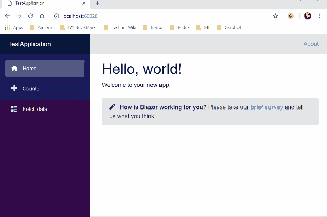
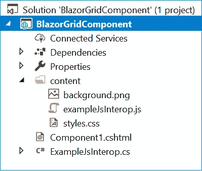
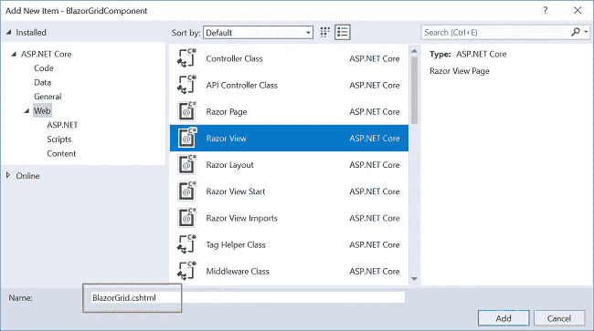
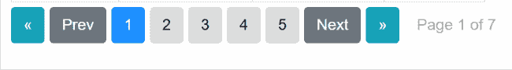
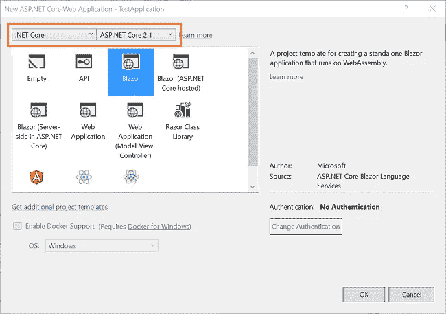
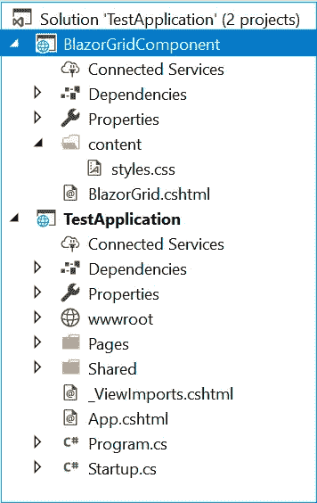
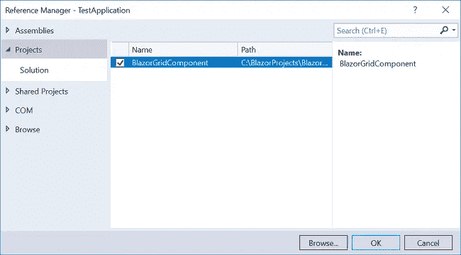
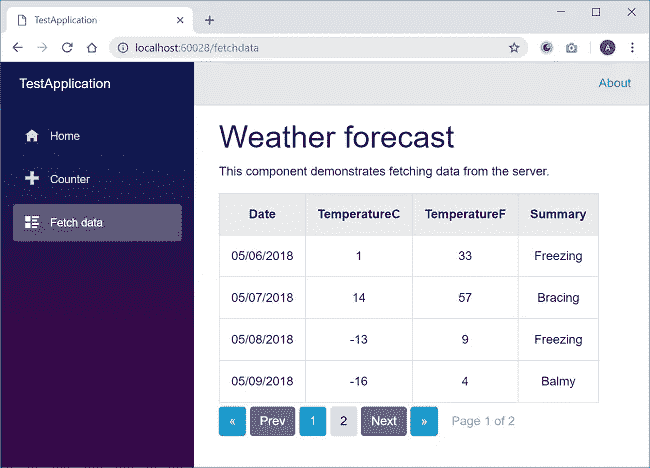

# 如何为 Blazor 创建一个可重用的网格组件

> 原文：<https://medium.com/swlh/how-to-create-a-reusable-grid-component-for-blazor-9de4b7a669d9>

# 介绍

在本文中，我们将为 Blazor 创建一个名为`BlazorGrid`的可重用网格组件。它将在一个网格中显示用户数据，并支持客户端分页。

看一看最终的应用程序。



要了解如何将 BlazorGrid 组件发布到 nuget gallery，请参考[将 Blazor 组件发布到 Nuget Gallery](https://ankitsharmablogs.com/publishing-blazor-component-to-nuget-gallery/)

# 先决条件

*   安装。NET Core 2.1 以上 SDK 从[这里](https://www.microsoft.com/net/learn/get-started-with-dotnet-tutorial#windowscmd)
*   从[这里](https://www.visualstudio.com/downloads/)安装最新版本的 Visual Studio 2017
*   从[这里](https://marketplace.visualstudio.com/items?itemName=aspnet.blazor)安装 ASP.NET 核心 Blazor 语言服务扩展
*   使用以下命令在命令行上安装 Blazor 模板:

```
dotnet new -i Microsoft.AspNetCore.Blazor.Templates
```

# 源代码

从 [GitHub](https://github.com/AnkitSharma-007/BlazorGrid) 获取源代码

# 创建 Blazor 库项目

要创建 Blazor 库项目，请遵循以下步骤:

1.  导航到要创建项目的文件夹。
2.  以管理员身份打开命令提示符或 Windows PowerShell。
3.  运行以下命令:

```
dotnet new blazorlib -o BlazorGridComponent
```

它将创建一个名为`BlazorGridComponent`的 Blazor 库项目。

使用 Visual Studio 打开此项目。您将看到如下图所示的文件夹结构:



这个项目中提供了一些预定义的文件。我们将删除 Component1.cshtml、ExampleJsInterop.cs、exampleJsInterop.js 和 background.png 文件，以使我们的解决方案干净。不要删除 styles.css，因为我们将把自定义组件的 css 定义放在这个文件中。

# 正在创建 BlazorGrid 组件

现在我们将组件视图页面添加到我们的项目中。

右键点击`BlazorGridComponent`项目，然后选择>添加>新项目。将会打开一个“添加新项目”对话框，从左侧面板中选择“Web”，然后从模板面板中选择“Razor View”并将其命名为`BlazorGrid.cshtml`。单击添加。参考下图。



打开`BlazorGrid.cshtml`文件，将下面的代码放入其中。

```
@typeparam TableItem

<table>
    <thead>
        <tr class="jsgrid-grid-header">@GridHeader</tr>
    </thead>
    <tbody>
        @foreach (var item in ItemList)
        {
            <tr class="jsgrid-row-item">@GridRow(item)</tr>
        }
    </tbody>
</table>
<div class="pagination">

    <button class="btn pagebutton btn-info" onclick=@(async () => SetPagerSize("back"))>&laquo;</button>
    <button class="btn pagebutton btn-secondary" onclick=@(async () => NavigateToPage("previous"))>Prev</button>

    @for (int i = startPage; i <= endPage; i++)
    {
        var currentPage = i;
        <button class="btn pagebutton @(currentPage==curPage?"currentpage":"")" onclick=@(async () => updateList(currentPage))>
            @currentPage
        </button>
    }

    <button class="btn pagebutton btn-secondary" onclick=@(async () => NavigateToPage("next"))>Next</button>
    <button class="btn pagebutton btn-info" onclick=@(async () => SetPagerSize("forward"))>&raquo;</button>

    <span class="pagebutton btn btn-link disabled">Page @curPage of @totalPages</span>

</div>

@functions {
int totalPages;
int curPage;
int pagerSize;
int startPage;
int endPage;

[Parameter]
RenderFragment GridHeader { get; set; }
[Parameter]
RenderFragment<TableItem> GridRow { get; set; }
[Parameter]
IEnumerable<TableItem> Items { get; set; }
[Parameter]
int PageSize { get; set; }

IEnumerable<TableItem> ItemList { get; set; }

protected override async Task OnInitAsync()
{
    pagerSize = 5;
    curPage = 1;

    ItemList = Items.Skip((curPage - 1) * PageSize).Take(PageSize);
    totalPages = (int)Math.Ceiling(Items.Count() / (decimal)PageSize);

    SetPagerSize("forward");
}

public void updateList(int currentPage)
{
    ItemList = Items.Skip((currentPage - 1) * PageSize).Take(PageSize);
    curPage = currentPage;
    this.StateHasChanged();
}

public void SetPagerSize(string direction)
{
    if (direction == "forward" && endPage < totalPages)
    {
        startPage = endPage + 1;
        if (endPage + pagerSize < totalPages)
        {
            endPage = startPage + pagerSize - 1;
        }
        else
        {
            endPage = totalPages;
        }
        this.StateHasChanged();
    }
    else if (direction == "back" && startPage > 1)
    {
        endPage = startPage - 1;
        startPage = startPage - pagerSize;
    }
}

public void NavigateToPage(string direction)
{
    if (direction == "next")
    {
        if (curPage < totalPages)
        {
            if (curPage == endPage)
            {
                SetPagerSize("forward");
            }
            curPage += 1;
        }
    }
    else if (direction == "previous")
    {
        if (curPage > 1)
        {
            if (curPage == startPage)
            {
                SetPagerSize("back");
            }
            curPage -= 1;
        }
    }
    updateList(curPage);
}
}
```

让我们来理解这个代码。

在代码的 HTML 部分，我们定义了一个表。表格的`<thead>`部分将显示 GridHeader 参数中定义的网格标题。类似地，< tbody >部分将遍历 GridRow 参数的内容，以显示行中的数据。

我们还定义了分页部分的 HTML。它包含“下一页”和“上一页”按钮，用于浏览页面。我们还定义了导航到下一组页面的按钮。默认的寻呼机大小设置为五。这意味着页面按钮将显示在一组五个按钮中。

在函数部分，我们为 BlazorGrid 组件定义了四个参数:

*   **Items** :供应给 BlazorGrid 的物品清单。
*   **PageSize**:BlazorGrid 每页的大小。
*   **grid Header**:blazor grid 的表头。
*   **grid row**:blazor grid 的行。

在`OnInitAsync`方法中，我们将 pagerSize 初始化为 5，并将 curPage 设置为 1。我们将计算总页数，并将数据绑定到网格的第一页。

当我们点击一个页面按钮时，就会调用`updateList`方法。它会将数据绑定到网格的当前页面。

`SetPagerSize`方法将设置每个寻呼机集合中的页码。页面按钮将显示在一组五个按钮中，如果页数超过五页，页面按钮将显示在下一个寻呼机组中。该方法将接受字符串参数，并基于该值为下一组或上一组五个按钮设置页面按钮。传呼机的演示如下所示:



点击下一步或上一步按钮将调用`NavigateToPage`方法。它会将用户导航到网格中的下一页或上一页。

# 为 BlazorGrid 组件添加 CSS

打开`/content/styles.css`文件，将以下代码放入其中:

```
.jsgrid-grid-header {
    text-align: center;
    border-collapse: collapse;
    background: #ebebeb;
}

.jsgrid-row-item:hover {
    background: #9fcdf4;
}

th, td {
    padding: 15px;
    border: 1px solid #d1d1d1;
    text-align: center;
}

.pagebutton {
    margin-right: 5px;
    margin-top: 5px;
}

.currentpage {
    background-color: dodgerblue;
    color: white;
}
```

在这个文件中，我们已经为 BlazorGrid 组件定义了样式。

现在我们将在一个 Blazor 项目中使用这个组件。

# 创建 Blazor Web 应用程序

打开 Visual Studio 并选择文件>>新建>>项目。

选择项目后，将会打开一个“新项目”对话框。选择。NET Core 里面的 Visual C#菜单从左侧面板。然后，选择“ASP。NET 核心 Web 应用程序”。将项目名称设为`TestApplication`,然后按 OK。

单击 OK 后，将打开一个新对话框，要求您选择项目模板。您可以在模板窗口的左上角看到两个下拉菜单。选择”。NET Core”和“ASP。NET Core 2.1 英寸。然后，选择“Blazor”模板并按下 OK。请参考下图:



# 将 BlazorGrid 组件添加到 Blazor 项目中

要将 BlazorGridComponent 项目包含在这个 Blazor 项目中，请遵循下面提到的步骤:

1.  右键单击解决方案并选择添加>>现有项目。
2.  浏览到 BlazorGridComponent 库，选择`BlazorGridComponent.csproj`文件，然后点击 Add **。**

这将包括当前解决方案中的 BlazorGridComponent 项目。请参考下图:



下一步是添加对共享组件的引用。右击“TestApplication\Dependencies”。选择`Add Reference...`，然后选择`BlazorGridComponent`项目，点击确定。请参考下图:



最后一步是将下面一行添加到`TestApplication\ _ViewImports.cshtml`文件中。

```
@addTagHelper *,BlazorGridComponent
```

这将允许我们在 TestApplication 项目中使用共享的 BlazorGridComponent。

# 使用 BlazorGrid 组件

打开`TestApplication\Pages\FetchData.cshtml`文件。在代码的 HTML 部分，将下列行放入 else 块中。

```
<BlazorGrid Items="@forecasts" PageSize="4">
    <GridHeader>
        <th>Date</th>
        <th>TemperatureC</th>
        <th>TemperatureF</th>
        <th>Summary</th>
    </GridHeader>
    <GridRow>
        <td>@context.Date.ToShortDateString()</td>
        <td>@context.TemperatureC</td>
        <td>@context.TemperatureF</td>
        <td>@context.Summary</td>
    </GridRow>
</BlazorGrid>
```

HTML 标签的名称将与组件的文件名相同，在本例中是`<BlazorGrid>`。我们正在将 Items 参数的值设置为 forcasts。我们将 PageSize 设置为 4，这意味着网格将在每个页面中显示四个项目。网格的标题在`<GridHeader>`中定义。

在`<GridRow>`中，我们已经使用隐式参数“context”声明了网格的行项目。Blazor 框架提供了这一点，我们需要用它来初始化类型`RenderFragment<T>`的参数，在本例中是 GridRow。

# 执行演示

运行应用程序并导航到“获取数据”页面。您将看到数据以网格方式显示，如下图所示:



# 结论

我们创建了一个共享的 Blazor 组件— `BlazorGrid`。它在网格中显示用户数据。该组件还提供客户端分页。我们学习了如何在 Blazor 应用程序中引用和使用共享组件。

请从 [GitHub](https://github.com/AnkitSharma-007/BlazorGrid) 获取源代码，并四处播放，以便更好地理解。

获取我的书 [Blazor 快速入门指南](https://www.amazon.com/Blazor-Quick-Start-Guide-applications-ebook/dp/B07K4PG9NY/ref=sr_1_1/130-5369337-3592069?ie=UTF8&qid=1544270769&sr=8-1&keywords=blazor+book)以了解更多关于 Blazor 的信息。

# 请参见

*   [了解服务器端 Blazor](https://ankitsharmablogs.com/understanding-server-side-blazor/)
*   [使用服务器端 Blazor 的单页面应用](https://ankitsharmablogs.com/single-page-application-using-server-side-blazor/)
*   [在 Azure 上部署 Blazor 应用](https://ankitsharmablogs.com/deploying-a-blazor-application-on-azure/)
*   [使用 Blazor 和 MongoDB 进行 CRUD】](https://ankitsharmablogs.com/crud-using-blazor-with-mongodb/)
*   [了解角度 6 动画](https://ankitsharmablogs.com/understanding-angular-6-animations/)
*   [ASP.NET 核心—使用 EF 核心和 Highcharts 的费用管理器](https://ankitsharmablogs.com/asp-net-core-expense-manager-using-ef-core-and-highcharts/)

最初发表于[https://ankitsharmablogs.com](https://ankitsharmablogs.com/)

[](https://medium.com/swlh)

## 这篇文章发表在 [The Startup](https://medium.com/swlh) 上，这是 Medium 最大的创业刊物，拥有+397，714 名读者。

## 在此订阅接收[我们的头条新闻](http://growthsupply.com/the-startup-newsletter/)。

[](https://medium.com/swlh)