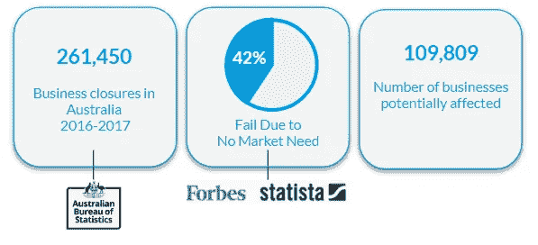
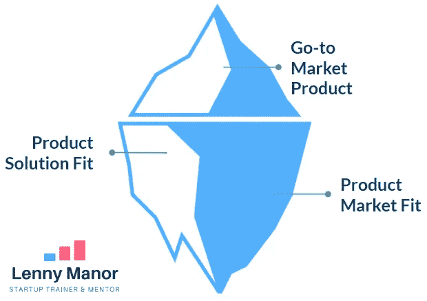
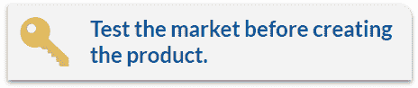
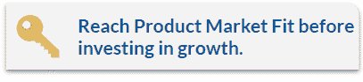
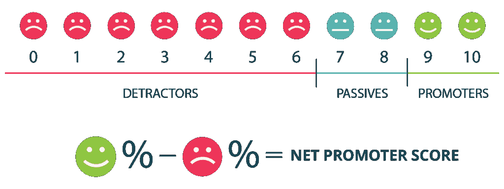

# 如何围绕真实的客户问题创建一家创业公司

> 原文：<https://medium.com/swlh/how-to-create-a-startup-around-a-real-customer-problem-77f9b3d5b25a>

## 在你陷得太深之前，这些是你需要采取的必要步骤。

我的使命是帮助你避免创业失败的最大原因之一，缺乏适合市场的产品。

作为一名创业培训师和导师，**我已经培训了 100 多家创业公司**，我很痛心地看到每年都有这么多企业失败，因为他们创造了一种**他们认为很棒的产品，但实际上，几乎没有市场需求。**

我将详细说明创建一个有实际市场需求的企业所需的关键步骤。

# 内容

1.  **这是您业务的最大风险**
2.  **这是你一直缺少的东西**
3.  **现在，创造人们真正想要的东西——以下是方法**

# 这是你的企业面临的最大风险

How many businesses fail each year because they’ve created something without a big enough market need?

仅在澳大利亚，去年就有 261，000 家企业倒闭😲根据澳大利亚统计局的数据。福布斯和统计学家已经确定，大约 42%的创业公司失败是因为他们创造了一个没有市场需求的产品😱。

这意味着大约有 109，000 家企业可能会关闭，因为它们创造了人们不想要的东西……这不仅仅是疯狂的，也是可以避免的，这是我试图通过像这样的课程来解决的问题。

> 如果你有避免早期失败的知识和工具会怎么样？

# 这是你错过的

**Underneath the surface of every great business is the solution to a real pain point that a big enough group of people share.**

**你的任务**，发现给定细分市场的真正挑战、动机和潜在问题，并制造出满足他们需求的产品。

## 从哪里开始

首先，我们需要确保我们正在创建一个值得追求的解决方案，我们首先要达到***【PSF】*=验证一个真正的问题是否存在并定义它。**

## 人们只购买他们实际拥有的问题的解决方案，问题必须通过市场来验证，因为没有市场需求，供应就不可能存在。

如果你在做生意，那么你很清楚，如果没有客户和足够多有相同需求的人，一个企业就无法生存。

这是等式的第一部分，接下来是达到 ***产品市场适合度**【PMF】*=验证理想解决方案的时候了。**

> 成功直接归因于对你的想法的确认。
> 
> 确认问题和验证解决方案是成功的关键。

创业的生命可以分为产品适应市场之前和之后，你最不想做的事情就是开始投资和成长 [**一项不能满足真实市场需求的业务**](https://rebrand.ly/medium-a1-a0) **，**你将永远试图说服而不是参与你的市场，你将处于一场持续的艰苦斗争中。

这是一个如此普遍的问题，以至于我决定组织 [**这个课程**](https://rebrand.ly/medium-a1) 来指导你到底需要做些什么来避免投资错误的生意。

# 现在，创造一些人们真正想要的东西——方法如下

首先，我们找到问题的解决方案，然后我们寻找愿意购买该解决方案的人群。

以下是一些例子，说明在每个阶段你可以向目标市场提出什么要求。

## 产品解决方案适合度=验证问题

*   真正的问题是什么？
*   解决[问题]对你来说有多重要？
*   你目前用什么来解决这个问题？
*   你想要解决方案吗？
*   解决方案应该做/不做什么？

**一旦有了解决方案，就跟进问题；**

*   这个解决方案在多大程度上解决了这个问题？(1-5 级)
*   你喜欢它的什么？(开放式)
*   你不喜欢它的什么？(开放式)
*   你会给它添加什么？(开放式)
*   如果现在有这款产品，您会购买/使用它吗？“(是/否)
*   你愿意出多少钱？(范围在$X 和$X 之间)
*   您向朋友推荐该产品的可能性有多大？(1-5 级)

**在这个阶段，给自己提几个问题:**

*   是谁的问题？
*   市场有多大？
*   竞争对手是谁？
*   我的独特销售主张(USP)是什么
*   我如何制作一个最小可行产品(MVP)，即开始测试的最基本的原型

## 产品市场适合度=验证解决方案

一旦我们有了一个实际的解决方案，我们就有了[优势，一些前景](https://rebrand.ly/medium-a1-a01)(来自我们上一轮的反馈)可以给我们进一步的洞察力。

了解我们是否达到产品市场适合度的方法之一是对我们的客户进行以下调查，这些被称为领先指标。

**产品市场契合度调查**

*   如果您不能再使用[产品]，您会有什么感受？"(由[肖恩·埃利斯](https://medium.com/u/8ee94400f4fb?source=post_page-----77f9b3d5b25a--------------------------------)创造和推广)，你可以在他的博客上了解更多关于它是如何开发和如何使用的信息。)

**净推介值(NPS)**

Source: [https://medium.com/@smiller_60282/how-to-put-net-promoter-score-to-work-for-you-95ae315530ab](/@smiller_60282/how-to-put-net-promoter-score-to-work-for-you-95ae315530ab)

*   **您向朋友或同事推荐我们公司/产品/服务的可能性有多大？** ( [这里有一个链接](https://www.netpromoter.com/know/)，可以完整解释如何创建和分析你的 NPS 调查结果。)
*   上述两个领先指标调查的问题在于，你实际上需要先拥有一些客户。

# 以下是我们了解到的情况:

*   如何避免启动失败的最大原因
*   告诉你是追求还是扼杀一个想法的关键问题

**实现产品与市场的契合只是创建成功创业的第一步，**一旦你到了那里，你需要找到如何在破产之前**获得牵引力并扩大你的业务；)**

这是一个很大的话题，所以如果你准备好学习解决产品市场适应性的确切步骤，我已经创建了 [**本课程**](https://rebrand.ly/medium-a1) **和一堆免费的** [**营销资源**](https://rebrand.ly/medium-tools-a1) **来帮助你。**

[**下一篇阅读:像老板一样设定商业目标！**](/swlh/business-goal-setting-2f5a54e97789)

感谢阅读。通过鼓掌或推荐来传播消息，帮助他人避免早期创业失败，**按住**👏表示感谢。

 [## Lenny Manor ★ |在 LinkedIn 上与我联系

### 在世界上最大的职业社区 LinkedIn 上查看 Lenny Manor ★ (4k)的个人资料。

www.linkedin.com](https://www.linkedin.com/in/lennymanor/) 

## 这篇文章发表在 [The Startup](https://medium.com/swlh) 上，这是 Medium 最大的创业刊物，拥有+ 377，008 读者。

## 在这里订阅接收[我们的头条新闻](http://growthsupply.com/the-startup-newsletter/)。

