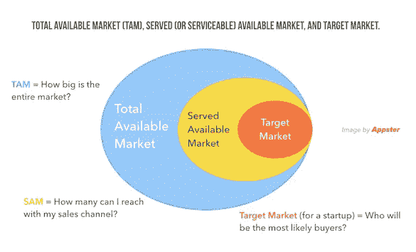
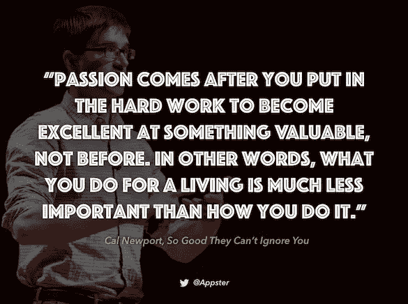
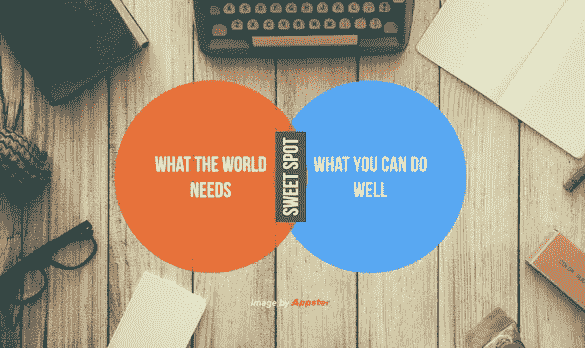
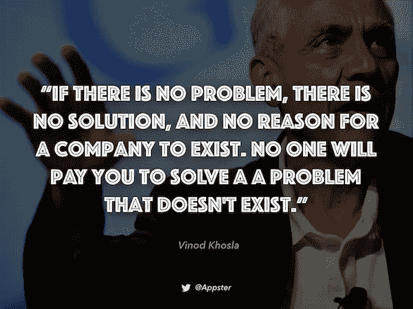

# 如何创建一个成功的应用程序:发现值得解决的问题的艺术

> 原文：<https://medium.com/swlh/how-to-create-a-successful-app-the-art-of-finding-a-problem-worth-solving-7e6cf0b0a2a5>

Originally published on [http://www.appsterhq.com](http://www.appsterhq.com/?utm_source=CP&utm_medium=Medium)

M 大多数成功的产品都有一个共同点:都是 [*高效止痛药*](/swlh/for-early-stage-entrepreneurs-a-5-step-mini-guide-to-launch-a-profitable-startup-def60d1c0402) 。为了让你的应用程序获得市场份额并盈利，它*必须*理想而有效地解决一个大的客户难题。

*大客户的痛苦等于大的创业机会*因为[没有人会付钱给你去解决一个无关紧要的问题](https://youtu.be/K6Jrt6A_Bzw)。

但是你如何找到下一个需要解决的货币化问题呢？本指南将尝试为您指路。

# 1.从市场开始

成功的产品是能有效解决严重的客户问题的产品。然而，如果没有市场，即使是世界上最大的问题也不会产生有利可图的解决方案。

从创业的角度来看，一个问题的*重要性*(即价值)取决于其所属[市场](http://www.appsterhq.com/blog/trillion-dollar-markets)的**规模**和**增长**。

为了取得成功，一个应用程序需要在一个有巨大消费者需求的大市场中解决一个大问题。

没有市场=没有生意。

确定你的产品是否有足够大的市场需求需要区分*总可用市场*(TAM)*可用市场* (SAM)和*目标市场* (TM):

评估你的产品要解决的问题的价值需要收集数据:

*   你所在的特定市场的规模，
*   你可以通过营销接触到多少人，
*   以及最有可能购买你的产品的人数。

当你从 TAM 过滤到 TM 时，这些数字必然会变小，但是如果它们太小，那么你的初创公司将永远不会盈利。

企业家、投资者和软件工程师马克·安德森清楚地阐明了为什么一家初创企业的潜在成功最终取决于其所处市场的健康:

市场是创业公司成败的最重要因素。

*为什么？*

在一个伟大的市场——一个拥有大量真实潜在客户的市场——市场从创业公司中获取产品。

*市场……总是会被……第一个出现的可行产品所满足。产品不需要特别伟大；它只需要基本上工作。而且，市场不在乎团队有多好，只要团队能生产出那个可行的产品。*

当你认真对待这件事时，你几乎可以忽略所有其他事情(除了市场)。我并不是说你一定要忽略其他一切——只是从我在成功的创业公司中看到的情况来看，你可以做到。

*一个成功的创业公司……是一个已经达到产品/市场契合度的公司……通常在这个过程中，它会搞砸各种各样的其他事情，从……渠道发展战略到营销计划，从公关到薪酬政策，再到首席执行官与风险投资家上床。*

*并且启动是* ***还是*** *成功。*

*相反，你会看到数量惊人的运营良好的初创公司，它们的运营各方面都完全到位——人力资源政策到位，出色的销售模式，深思熟虑的营销计划，出色的面试流程，出色的食物，为所有程序员配备 30 个显示器，董事会中的顶级风投—* ***由于从未找到产品/市场*** *。*

马克在这里本质上是说，企业家不应该忽视创建公司的所有那些与市场不直接相关的方面，而是说，如果没有尽职调查来确保真正的产品/市场匹配，这些方面都没有意义。

当然，关注市场的规模和增长并不意味着你必须放弃通过治愈疾病或追求其他利他项目来努力让世界变得更美好。

事实上，许多盈利的公司都是建立在利他主义的基础上，或者与利他主义有着千丝万缕的联系。

相反，关键是要绝对肯定你打算提供的解决方案确实存在市场——否则，你的初创公司永远也赚不到它在这个世界上做好事所需的钱。

# 2.定义你的技能，然后评估你的热情

这里有另一种方法来找到一个值得解决的问题。

在我之前的文章中，我试图解释技能和激情之间的平衡:

“激情对于建立一个成功的企业来说绝对是至关重要的，但它不是一切的全部。事实上，激情本身经常被高估，它的重要性也被高估。

在大多数情况下，真正的激情是随着你开始积累成功而产生的。因此，当考虑公司的重点时，不要完全集中在你此刻最感兴趣的事情上，而是包括那些随着时间的推移有可能给你带来满足感和成就感的领域。

*你真正擅长的是什么？你有什么独特的天赋或能力？你能比别人做得更好的是什么？*

*不可否认，你拥有一些特殊的技能、天赋和知识，你有潜力在初创企业中脱颖而出，这些是你首次创业时应该考虑的。”*

因此，在商业中，技能先于激情。许多人对多种事物都有激情，但这一事实本身并不意味着所有这些激情都应该作为潜在的业务来追求。

仅仅因为你热衷于去健身房，这本身并不意味着健身一定应该是你的下一个商业目标。

史蒂夫·乔布斯一生都对禅宗和冥想有着真正的热情，但如果他将这种热情转化为商业，那么这个世界可能永远不会见证苹果电脑的诞生(至少就我们现在所知)。

真正的激情伴随着真正的进步:不管是什么，你做得越多，你就会做得越好，你就会越喜欢它。

为了在某件事情上快速变得优秀，加倍努力你的技能，也就是说，通过追求你知道你能做得很好的事情来发挥你的实际优势和能力。

所有这一切的关键点是，在定位特定市场或利基市场中需要解决的大问题时，让你现有的专业知识成为指南是很重要的。

利用你现有的知识和能力，专注于消费者害怕的特定类型的痛苦，以及他们想要和需要立即帮助的痛苦。

但是，不要完全忘记激情。

据报道，年轻的埃隆·马斯克(Elon Musk)在一次聚会上遇到了一个女孩，当时他还是一名学生:据称他向女孩介绍自己时说:“我对电动汽车有很多想法。

你会考虑电动汽车吗？"*这种*是一种你可以用来帮助你发现主要问题的热情，它将引导你找到主要的商业机会。

没有人能永远做自己讨厌的工作，所以对工作充满激情至关重要——只要确保你不会因为对初创公司的热爱而看不到它成功的客观机会。

如果你正在努力将你的技能与你的激情联系起来，想知道如何成功地将你的才能与你的兴趣结合起来，那么试着问自己以下几个问题:

*   我想因为什么而被记住？
*   我最想解决的问题是什么？
*   如果钱不是问题，我的生活该怎么办？
*   人们经常告诉我我擅长什么样的事情？

如果你对这些问题的回答没有一个让你感到激动或兴奋，不要惊慌。如果发生这种情况，那么相信你成为企业家的愿望，开始调动你的技能，让你的激情从你的能力和现有的知识中迸发出来。

有时候，发现如何将你的技能与你的激情完美结合的最佳方式是开始一个项目，也就是说，投入到一些需要你“亲自动手”的事情中，并将想法带入生活。

不要被吓得“跳”。

# 3.定义问题

你花了大量的时间研究市场，以确保消费者对你打算出售的产品有需求。

你已经考虑过你不同技能和激情的多样性和适用性。

现在是时候定义你的应用应该关注的确切问题了。

事实上，所有行业都包含许多不同的业务方面，从客户获取和客户服务到销售和运营。

你需要获得尽可能多的关于你计划推出未来产品的特定行业的信息。

尽可能多地与专业人士交谈；问很多问题，记录他们的答案，寻找新的模式。

设计新商业理念的一种常见方式是从相关但不同的市场中获取现有解决方案，并将其应用于您的特定行业(或世界上的特定地区)。

另一种常见且通常非常有效的方法是，在现有问题解决方案的基础上进行重大改进，这种方法可以发现真正的问题，并为盈利的初创企业奠定基础。

我们看到这种情况在技术领域一直都在发生。

例如，脸书是 Friendster 的重大改进，Friendster 在扎克伯格出现之前已经存在多年。

谷歌代表了一个比在它之前存在的大约 13 个其他搜索引擎好得多的平台。

前一种情况，Friendster 崩溃很多，留不住用户；在后者，谷歌完全不像用户在其他搜索引擎上的缓慢和混乱的体验。

当然，还有很多其他的例子。苹果在牛郎星之后，特斯拉在普锐斯之后，AirBnB 在 Couchsurfing 之后，等等。

企业家、风险投资家和作家彼得·泰尔说得好:“忘掉先动优势:做最后一个动作要好得多。”

如果你所在市场的现有产品实际上满足了消费者的所有需求，那么就不会有像你这样的其他企业家渴望将他们的解决方案送到他们所在市场的用户手中。

> 最初发表于[http://www.appsterhq.com/](http://www.appsterhq.com/?utm_source=CP&utm_medium=Medium)

