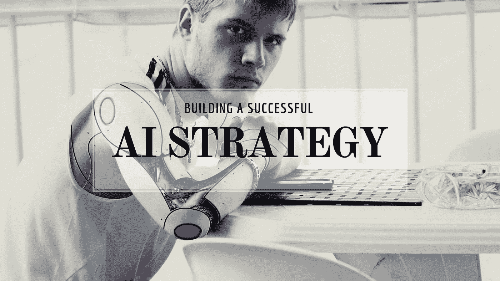

# 如何创建一个成功的人工智能战略

> 原文：<https://medium.com/swlh/how-to-create-a-successful-artificial-intelligence-strategy-44705c588e62>

就像每个企业都是数字企业一样，每个企业很快都会成为智能企业。如果他们不变得聪明，他们将简单地停止存在。人工智能是一个革命性的技术集群，是游戏规则的改变者，有可能从根本上改变我们的运作方式。然而，一个人工智能策略，如果它只是一个人工智能策略，不会带你走得很远。人工智能战略仅仅是一个人工智能战略，这是一个奇怪的管理概念，通过将这种神奇的人工智能酱洒在一切事物上，会使一切变得更加神奇和可怕。

首先抵制这种投入事物的诱惑。相反，先看看你的优势，然后再引入人工智能。你需要人工智能应用程序智能地工作，利用你的数据，了解并改善你过去的表现。你不需要人工智能成为你还不理解的新事物。你需要人工智能建立在你已经拥有的优势上，并从你已经拥有的东西转变，但要更好。在这个过程中，如果你遇到了扰乱你当前实践和行业的产品和想法，那太好了。

# 从哪里开始？

你到底在找什么？你想要更好的内部流程吗？您是否希望[改善客户体验](https://www.datadab.com)？你的产品中有哪些功能会从人工智能中受益，或者你需要一些对产品设计的见解？有没有重复的、容易出错的、基本上很无聊的特定任务，或者一点点帮助就能让你的员工更有效率的任务？人工智能是一种工具，可以帮助你做所有这些事情，甚至更多，就像凿子可以用来建造任何类型的雕像。但要想成功，人工智能战略必须是总体商业计划的一部分。无论你是在改善你目前的业务还是建立一个新的业务，人工智能都应该为你的业务计划服务，而不是相反。

# 在我进一步深入之前，我需要了解什么？

人工智能可以做惊人的事情。但是在你的团队可以用它做惊人的事情之前，你需要现实地看待它，理解它的挑战。例如，人工智能已经被证明非常擅长对图片进行分类，但它真的不能告诉你这些图片中有什么。从商业角度来看，人工智能应用程序可能能够告诉你用户在看到新产品设计时是否看起来很高兴，但他们无法回答更大的问题，比如产品是否会成功。

# 你如何定义人工智能？

有足够多的博客和文章在定义人工智能和机器学习。所有的定义可能看起来有点脱节，但它们都有重叠。此外，无论好坏，我们已经养成了交替使用人工智能和机器学习的习惯。现在，让我们抛弃这些术语，称之为自动化。当你有效地自动化一个过程时，你用什么技术来自动化都没关系，是一个更老、更简单的技术还是一个神经网络。

然而，从人工智能的定义开始仍然很重要。这是我们的。人工智能以其输出而闻名，它不需要特别依赖于输入或算法，而是程序学习如何执行其任务的训练过程。训练是人工智能与数据分析和其他传统软件应用的区别。

# AI 擅长什么？

*   人工智能非常擅长解决特定的、定义明确的问题。想想由特斯拉、优步和其他公司开发的无人驾驶汽车。驾驶汽车似乎不是一个具体的、定义明确的问题。但是它可以被分解成特定的、明确定义的问题，例如识别路标和信号，包括其他车辆和行人，规划路线，识别障碍物，管理刹车，检测打滑，等等。这些问题都不容易解决，但这并不意味着它们无法解决。把那个大问题分解成更小更容易解决的问题。这个过程就是工程的全部。
*   人工智能可以有效地用于帮助和增强人类，而不是取代他们。将智能机器仅仅视为削减成本工具的公司可能会将它们推到所有错误的地方。人工智能消除了工作中重复、枯燥的部分，但这并不总是意味着你需要更少的员工。事实上，你可能需要更多训练有素的员工来从事更有创造性的、不太常规的工作。

# 是什么让采用 AI 如此艰难？

AI 产品是数据产品。训练你的 AI 产品需要数据，大量的数据。有效数据。如果您的组织中还没有可靠的数据实践，残酷的现实是您不太可能拥有有用的数据。您需要识别数据源，构建数据管道，清理和准备数据，识别数据中的潜在信号，并测量结果。随着人工智能蓬勃发展的组织将在战略性地获取数据方面变得熟练。他们不仅仅只有数据。他们会明白在哪里以及如何获得更多。大多数渴望人工智能的公司没有正确的数据实践，尽管他们认为他们有。仔细并怀疑地看看你目前如何使用数据作为创建你的人工智能策略的一部分。

# 你准备好人工智能了吗？

在所有这些兴奋面前，我们不想成为一个扫兴的人，特别是当我们分享这种兴奋时，但更多时候，公司还没有为人工智能做好准备。也许数据素养不是你文化的核心，或者也许你雇佣了你的第一个数据工程师，但结果并不理想。但最典型的情况是，你还没有奠定必要的基础设施，来播种和收获最简单的数据科学操作和算法的优势，更不用说机器学习了。

# 雇佣部署人工智能战略所需的合适人才

人工智能方法大致有三个部分:生成数据、解释数据和对数据做出判断。记住这一点，一个人工智能团队至少需要三个独立的角色:组织这些信息的数据工程师，调查这些信息的数据科学家，以及实现应用程序的软件工程师。

在吸引具有构建人工智能软件经验的研究人员、数据科学家和软件工程师方面，招聘会变得更加困难。要么接受积极的挖墙脚，要么采取长期路线，通过培训你已经拥有的工程师来进行自下而上的开发。有时，这种方法可能比引进外部人才更快，因为新员工通常不会成功。如果你是一个小公司，记住，你不需要自己做研究。骑在别人的背上。鉴于此，我们仍在关注人工智能世界的 Ruby on Rails，然而，随着更多获得开源许可的公司发布自己的工具，我们已经越来越接近了。

# 培养

现在，AI 项目需要经过训练，才能做任何有用的工作。所谓训练，我们是指在一堆已知数据上运行应用程序，并允许它创建一个模型。换句话说，自动调整内部限制，直到测试数据得到令人满意的结果。之后，您在一组不同的测试数据上运行它，一组它以前没有见过的数据，以确定结果是否足够。培训与编写和调试软件同时进行。可能在培训上会比在剩余的开发过程中投入更多的精力。所以，如果你正在计划一个人工智能项目，就要考虑培训时间。

你还需要了解培训是如何出错的。如果你在训练数据上获得百分之百的准确性，你的应用程序可能已经记住了训练数据，并且很可能在真实世界的数据上表现糟糕。这就是所谓的过度拟合。这是一个永无止境的问题。另一方面，如果您的应用程序在训练数据上不是百分之百准确，那么它在真实世界的数据上也不会百分之百准确。太糟糕了。然而，一些应用程序需要比其他应用程序更高的准确度，对于自动驾驶汽车来说，99%的准确度不够好，但对于向用户推荐产品的应用程序来说，60%的准确度是可以的。其次，如果你的训练数据有偏差，你的应用程序的结果就会有偏差。这是显而易见的，但偏见可能会悄悄潜入。例如，[人工智能系统](https://www.zibtek.com/blog/9-ways-ai-influences-e-commerce/)倾向于不向女性展示技术职位，因为从事技术工作的女性较少。偏见会产生法律后果。

最后，很容易认为训练是一次性的，做完就忘了。它不是。业务条件变化、客户变化、产品变化、环境变化都会影响您的应用。随着时间的推移，它的性能会逐渐下降，即使您可能没有注意到。如果你在计划一个人工智能项目，你需要考虑再培训。

# 结论

你能承受不上 AI 列车吗？你不能。但是不要盲目地跳上马车，在上路之前先规划好你要去的地方。将人工智能视为让所有事情变得更好的神奇成分将导致代价高昂的错误。了解你在做什么，为什么要做，以及你面临的限制。既有 AI 本身的局限性，也有你所在组织的局限性。

> 最后，如果做人工智能的挑战没有吓走你，开始规划你的人工智能项目。人工智能确实带来了一些巨大的挑战。但是，这些都是你可以面对的挑战，前提是你没有盲目地开始你的项目。建立一支优秀的数据团队，并开发使用数据的良好实践。留出足够的培训时间。时刻意识到你在前进的道路上会遇到的问题。提醒你自己，人工智能没有什么神奇的，同样，什么会出错也没有什么神奇的。

*原载于 Product Insights 博客来自*[*cognitive clouds*](https://www.cognitiveclouds.com)*:Top*[*物联网应用开发公司*](https://www.cognitiveclouds.com/custom-software-development-services/internet-of-things-iot-application-development-company)

## 这个故事发表在 [The Startup](https://medium.com/swlh) 上，这是 Medium 最大的创业刊物，有 286，184+人关注。

## 订阅接收[我们的头条](http://growthsupply.com/the-startup-newsletter/)。

