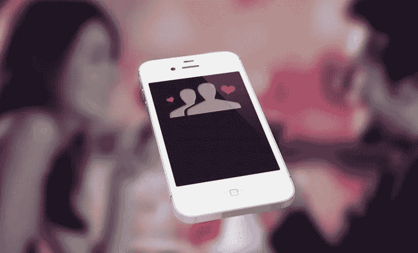

# 如何创建类似 Tinder 的应用程序

> 原文：<https://medium.com/swlh/how-to-create-a-tinder-like-app-e9e1f1ae537c>

所以你想制造下一个火绒？这是一个不错的投资市场，目前的估值估计在线约会市场价值约 22 亿美元，移动约会市场收入在 2009 年至 2016 年间从 4300 万美元增加到 3.81 亿美元。超过 15%的美国成年人是移动约会应用的注册用户和活跃用户，80%的人说他们觉得这是认识人的好方法。

良好的..恭喜你，你选择了一个充满可能性的新兴市场。这篇文章将概述一些主要的功能和基本的“如何做”,这是你在创建约会应用时需要考虑的。

在我们着手制作自己的手机约会应用程序之前，请注意，这并不是一开始最便宜的尝试。即使是最有经验的公司也可能需要 12 周到 12 个月的时间，这取决于功能的数量和客户的需求。在 6 个月的时间里，当合计设计、开发和测试的总成本时，它将花费您大约 60，000 美元，因此在开发过程中要记住您的预算，并相应地选择您将托管的功能。

# 黑仔特色

我们将从您的移动约会应用程序成功所需的功能开始。

其中大多数要求你通过脸书或 Instagram 登录，上传关于你自己的信息，如你的就业、你的学校，也许会让你列出关于你自己的基本信息(如你的姓名、年龄、你住在哪里)，并让你设置你的性别、年龄和位置偏好(通常在 1-200 公里之间)。

约会应用程序让用户通过向左或向右滑动来喜欢/不喜欢某人，每天至少可能“超级喜欢”一个人(如果你想表现出*浓厚的*兴趣)。该应用程序本身的工作原理有点像 Whatsapp，可以让你向你选择的人发送消息、表情符号、礼物等。通过内置的聊天系统。

以下是您应该考虑实现的基本功能列表:

*   通过脸书注册/登录
*   管理用户资料和设置发现偏好:例如，考虑制作一个扩展的个人资料，让人们更好地了解他们在刷什么
*   滑动以喜欢/不喜欢个人资料
*   当两个用户都喜欢对方的个人资料时的实时聊天功能
*   推送通知(发现新匹配时通知用户)
*   地理定位/地理标记
*   语音聊天
*   匹配算法:哪个更好地定义了匹配参与者的谁、什么、哪里、何时以及为什么
*   社交分享:对于那些通过社交媒体分享的人来说，这可能会像一个积分系统一样(例如，让他们获得优质比赛)。
*   游戏化:这可能包括让用户相互玩虚拟游戏，以更好地联系他们。保持计时或最多 3 轮，并为更多比赛收费)
*   通过社交媒体平台和社交网络整合进行注册:在" [Hinge](https://www.hinge.co/) "的案例中，这已被证明是成功的。这款应用很大程度上依赖于脸书朋友(把你和你朋友的朋友联系起来)，通过人们做的事情和他们认识的人来匹配他们。

# 创建令人兴奋的设计和应用程序结构

记住这些约会应用程序的功能，然后你需要考虑你要创建什么样的*应用程序。它会像 [Tinder](https://www.gotinder.com/) 或 [Bumble](https://bumble.com/) 一样通过 GPS 围栏功能进行地理定位吗？还是会依赖像 [Eharmony](http://www.eharmony.com/) 这样基于匹配性格偏好的算法？*

当然，集成这两种功能是可能的，但一般来说，你希望你的应用程序是特定的，以特定的方式针对特定的群体。Tinder 在 general meet 和 greets 上有市场，所以这是你签名的时候了。

在这个阶段，你需要具体化 4 个关键特性，因为这将决定你的手机约会应用的成本和极简主义或包容性水平:

*   你的约会应用程序的名字:不言而喻，你想要一些吸引人的东西，人们会记住并与他们的朋友分享。
*   你的目标受众:你的受众是谁？18-24 岁的人，工作年龄的专业人士，还是特定的民族或种族群体？您在这里的位置和搜索功能应该根据您的群体量身定制。因为现在有许多类型的约会应用程序，所以选择一个特定的地区或小众社交群体作为关注点不失为一个好主意。这将有助于你脱颖而出，并获得可靠的客户。看看联盟，它只搜寻年轻且精力充沛的职业人士，或者 [Bristlr](http://www.bristlr.com/) ，它(用公司自己的话说)“把有胡子的人和想捋胡子的人联系起来”。这可能看起来像一个噱头，但人们喜欢利基价值。
*   整体**界面&设计:**因为没有人愿意用一个界面笨重的 app。事实上，简单可以说是当今移动应用开发和设计的最大趋势之一。你的应用程序看起来是人们首先会注意到的，所以你的应用程序的最初视觉印象是关键，它不仅定义了用户的体验，还定义了你的应用程序的未来和成功。创意设计在移动应用开发中的作用有了新的标准——比如，看看苹果。它的成功很大程度上是因为 iOS *比竞争对手看起来*更好，功能也更强。因此，保持你的界面有趣而简单。将明亮的色彩、有趣的按钮和纹理与完美、无缝的简约设计融为一体。在移动应用程序开发的背景下，“少即是多”不是陈词滥调，而是行业标准。
*   最后，你的**营销计划:**成功的关键是制作一个视觉上美观、具有高用户能力的互动约会移动应用，但也要确保你的客户群不断增长！你想让你的客户对你的应用保持忠诚，所以保持品牌忠诚。

# 应用程序开发和功能实现

在这个阶段，你可能会进一步考虑你将用来实现实时聊天的技术(C++ Socket 编程，XMPP 服务器集成，例如通过微信托管的第三方聊天，对于那些预算有限的人来说是一个更好的选择)。你的成本很大程度上与你构建应用的平台成正比，所以要明智。

一般来说，具有最少功能的应用程序更容易编程，也更便宜，但是具有更多全包功能的应用程序(见上面的列表)将真正吸引用户使用你的应用程序。你还必须考虑在什么平台上开发你的应用，最流行的两个平台是 iOS (iPhone，iPad)或 Android。根据您想要使用的平台，编码可能会完全不同，所以请仔细考虑这一点。

当然，你必须考虑如何赚钱。对于约会应用来说，最流行的赚钱方式是通过:

*   奖励/积分系统是一个很好的例子。一旦你设置了你的偏好，应用程序每天会给你发送一个“百吉饼”(匹配)，这样你就有 24 小时的时间来喜欢或传递你的百吉饼。如果你和你的百吉饼彼此喜欢，你将被连接到一个私人聊天，8 天后过期，给用户施加压力交换号码。您上传到个人资料的 9 张照片中的一张将作为第一条消息发送，以解决“谁先发消息”的老问题。你可以通过向朋友推荐该应用来进一步赚取“豆子”。
*   各种**应用内购买**:这可能包括限制每天的火柴数量，从而让人们多购买 10、20、30 根火柴。
*   广告:但是不要在这一点上走极端，过多的攻击性广告会激怒你的用户。
*   建立一个**付费**和**免费版本**的应用程序:但要清楚，这都是同一个品牌的一部分，因此用户保持忠诚。

# 结论

有一个创建你自己的移动约会应用的简单指南。这个故事的寓意是，你的约会应用程序不需要做所有的事情，但无论你想用它完成什么，它都必须做得很好，让你的约会应用程序与众不同。

看看我们最近的一个项目，一个约会应用 [Limeet。](https://octodev.net/portfolio/limeet/)一个模仿 Tinder 的约会应用的真实例子——当然，有它的主要不同之处。让它如此有效的是简单、具体的商业模式。

以法国市场为目标，注册用户可以看到他们所在地区的用户资料，点击喜欢他们的内容。用户可以浏览其他注册用户的个人资料，聊天，并查看各种不同的个人资料过滤器(例如，流派，年龄，距离当前位置)。简单是其有效性的关键。

你也可以查看[我们在这个市场开展的其他项目](https://octodev.net/)，了解我们的应用开发经验。如果你发现你可能有兴趣投资创建一个 Tinder 克隆，不要犹豫，联系我们，询问技术方面的问题，或者寻求创造性的支持。我们可以为您的创新想法提供意见，并乐意与您合作。[立即联系我们](https://octodev.net/contact-us/)免费咨询和调查符合您创意愿景、需求和预算的约会应用克隆解决方案。

*本文原载于* [*Octodev 博客*](https://octodev.net/creating-a-tinder-like-app/) *。*

如果你喜欢这篇文章，请点击下面的拍手图标告诉我！

## 这个故事发表在 [The Startup](https://medium.com/swlh) 上，这是 Medium 最大的创业刊物，拥有 275，554+人关注。

## 在这里订阅接收[我们的头条新闻](http://growthsupply.com/the-startup-newsletter/)。

