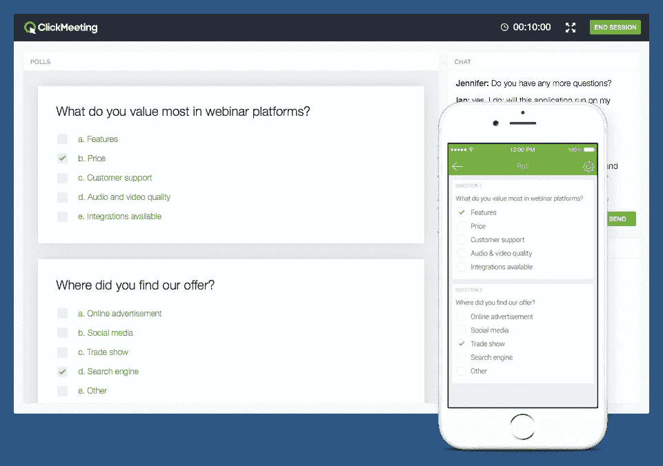
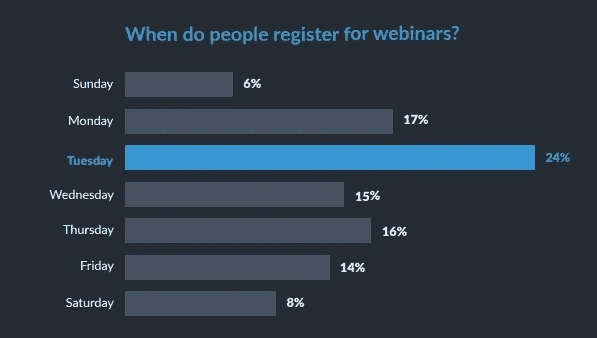

# 如何用 10 个简单的步骤从零开始创建网上研讨会

> 原文：<https://medium.com/swlh/how-to-create-a-webinar-from-scratch-in-10-simple-steps-56464d96117a>

这些年来，我注意到越来越多的人使用网络研讨会来吸引 B2B 受众。事实上，[内容营销研究所的一项研究](http://contentmarketinginstitute.com/wp-content/uploads/2016/09/2017_B2B_Research_FINAL.pdf)发现，58%的 B2B 营销人员在他们的内容营销策略中实施网络研讨会。这并不奇怪，因为网上研讨会非常吸引人，而且制作或分发费用也不高。

随着网络使用的快速增长，消费者开始要求即时的知识。你的产品应该被有效地推广，这样它们才能更快地到达正确的受众手中。网络研讨会有助于向潜在客户展示您的产品和专业知识。他们还提供完整的信息，所以那些潜在的客户对你提供的东西有一个清晰的了解。

由于网上研讨会对 B2B 营销人员非常重要，我收集了以下建议来帮助你从头开始创建网上研讨会。

# 1.选择你的团队

网上研讨会通常有三个主要参与者。会议的成功取决于他们，我建议您在选择以下选项时仔细考虑您的选择:

*   **组织者:**组织者或主持人是负责开发网上研讨会内容的关键人物。他们还负责寻找合适的发言人和宣传活动。他们负责注册，并在网上研讨会开始和结束时与参与者沟通。
*   **演示者:**演示者或主题专家应专注于开发和交付网上研讨会演示文稿。他们负责网上研讨会编程和故障排除、活动注册和其他细节，以帮助他们进行引人入胜的演示。
*   **助手:**助手帮助回答演示者和主持者没有太多时间回答的问题。他们通过回答技术问题来提供帮助。(比如“音频和视频不同步！”或者“没有声音！”)观众众多的网络研讨会通常需要助手。

# 2.决定网上研讨会的形式

下一步是决定网上研讨会的形式。我建议你选择一种在吸引观众的同时最能传递你的信息的形式。您可以考虑以下四种网上研讨会形式:

*   **单个演讲者:**顾名思义，这涉及到单个演讲者与出席者的交流。演讲者还将演示网上研讨会的内容，并回答与会者提出的所有问题。如果你的观众不多，我推荐这种类型的网上研讨会。
*   **面试形式:**这涉及到一个演讲者扮演一个面试官，向主题专家提出一系列预先确定的问题。这种类型的网上研讨会非常吸引人，与会者观看中小企业回答问题。这也鼓励他们提出问题，使之变得有趣。
*   **主持式小组讨论:**与小组讨论一样，小组网络研讨会也有几个演讲者，他们围绕一个预先确定的主题展开讨论。主持人需要促进这种类型的网上研讨会。
*   **问&答:**与采访形式类似，这种类型的网上研讨会也允许演讲者回答问题，但这一次，问题直接来自听众。我建议你事先收集问题。这将确保你按计划进行，并审查来自观众的问题。问& A 部分通常会添加在所有网络研讨会形式的末尾。

# 3.规划网上研讨会的视觉效果

作为一个基于网络的研讨会，网络研讨会主要依靠音频和视频材料来展示其内容。充满文字的幻灯片不会有这种效果。我建议你在准备下一次网上研讨会的视觉材料时考虑以下几点:

*   准备一张介绍性幻灯片，介绍开始时间和网上研讨会要讨论的要点等信息。
*   接下来应该用额外的幻灯片介绍演示者和专家，以及他们的头衔、关系和照片。
*   之后，准备一张幻灯片，展示网上研讨会将涉及的主题概要。
*   包括一张幻灯片，其中包含流程中会用到的工具和网站。我建议您在网上研讨会期间实时使用这些工具和网站，以便对观众产生更好的影响。

# 4.选择网上研讨会工具

市场上存在许多网络研讨会服务，包括像 [Adobe Connect](http://www.adobe.com/products/adobeconnect/webinars.html) 、 [WebEx](https://www.webex.com/webinars/) 等流行平台。但是我个人最喜欢的是 [ClickMeeting](https://clickmeeting.com/) 因为它非常好用，价格实惠，而且很全面。

除了创建定制的网上研讨会会议室，您还可以在会议结束后使用该工具进行投票和调查。这将有助于您获得宝贵的见解，从而进一步改进您的网络研讨会。

我准备了几个问题，在选择网上研讨会工具进行投资时，你应该问自己:

## 你的网上研讨会的目标是什么？

在选择网上研讨会服务之前，你应该考虑网上研讨会的目标。如果这是一个产品发布会或你的业务推广，你的目标受众可能会更多。在这种情况下，你需要一个网上研讨会服务，帮助你与大量与会者互动。

## 产品的用户友好程度如何？

由于网上研讨会有时间限制，因此您必须选择正确的服务工具，以便在网上研讨会分配的时间框架内充分利用它。如果你计划一个单一演讲者形式的网上研讨会，你将寻找最简单的软件，这样你就可以成功地向与会者展示你的业务内容。

## 这要花多少钱？

市场上有如此多的网上研讨会服务工具，在为您的网上研讨会选择正确的网上研讨会服务工具时很容易感到困惑。我发现在考虑成本的时候最好考虑目标受众。例如，如果你的目标群体很大，你就需要一个企业包。然而，对于中小规模的观众，你可以很容易地选择高级版。

这三个问题的答案将决定您应该在维修工具上花多少钱。

# 5.设置合适的设备和空间

你需要一个安静的地方来进行网上研讨会。考虑一个没有背景噪音和干扰的会议室或任何其他地方。

选择合适的设备对网上研讨会也至关重要。考虑座机和耳机麦克风，因为它们不太可能在您与观众互动时切断通话。

我总是试着**保留一台充满电的备用笔记本电脑**，所有的数据都被复制并存储在里面。这将确保一切顺利进行，即使你的主要计算机系统遇到任何技术困难。

选择合适的设备和空间不仅能提高网上研讨会的质量，还能确保给观众带来良好的体验。

# 6.宣传和推广你的网上研讨会

为了确保你的网上研讨会获得[最大的参与度](http://www.convinceandconvert.com/content-marketing/growing-webinar-attendance/)，提前尽可能多的宣传是至关重要的。以下是我建议你推广的方式:

*   首先创建一个登录页面，介绍网上研讨会主题、演讲人、日期和时间，以及让人们注册参加活动的行动号召。
*   在你的网站主页上制作横幅或展示广告，让访问者了解即将到来的活动。
*   使用像脸书和推特这样的社交媒体网站来传播消息。创建一个专门的原创标签来宣传这一事件。这个标签将在活动期间对你有益，因为你将使用它与参加者互动。
*   发送多封提醒邮件，展示活动倒计时。45%的营销人员表示，电子邮件是推动注册最有效的方式。
*   活动当天，请确保发送电子邮件，直接链接到您的网上研讨会。
*   [GoToWebinar 的一份报告显示，周二](https://assets.cdngetgo.com/e7/73/cbeb606b4f9295747b31e0442f24/gotowebinar-2017-big-book-of-webinar-stats.pdf)通常是推广网上研讨会的最佳时间。

# 7.选择正确的日期和时间

你应该记住，不是所有的观众都来自同一个地方。网上研讨会应在特定的日期和时间举行，以便尽可能多的人出席。如果你的目标受众在洛杉矶，而你在纽约，在下午 6:00 开始网上研讨会可能不是一个好的选择，因为这对住在洛杉矶的与会者来说太晚了

为网上研讨会选择正确的日期和时间非常重要。举办网上研讨会的最佳时间取决于目标人群，但由[于 24 日](http://communications.on24.com/rs/848-AHN-047/images/ON24_Webinar-Benchmarks-Report-2017_EMEA.PDF?aliId=322029540)进行的一项民意调查显示**举办网上研讨会的最佳时间是周二和周三上午 10 点和上午 11 点(格林尼治标准时间**)。

我总是使用[谷歌分析](https://www.google.com/analytics/#?modal_active=none)来定位世界上我的大部分在线流量来自的地区。您还可以向潜在与会者发送调查问卷，询问他们参加网上研讨会的最方便时间。

这些是不仅应该考虑而且应该优先考虑的主要因素。应该对它们进行大量的研究和规划，这样你就可以从网上研讨会中获得最大的收益，促进你的业务发展。

# 8.选择一个感兴趣的话题

如果你的主题不能引起潜在观众的兴趣，你就很难吸引他们参加你的网上研讨会。由于网络研讨会通常长达一小时，您可以选择模糊地谈论许多主题，也可以谈论单个主题并深入探讨。

这就是为什么我总是建议你在选择网上研讨会的主题时要非常具体。例如，不要简单地谈论一般的数字营销，你可以谈论数字营销的趋势，或者数字营销的预算等等。

在搜索感兴趣的主题时，您应该考虑:

*   **之前制作的内容:**在搜索一个感兴趣的话题的同时，可以考虑把自己已经制作好的内容过一遍。它可以是博客帖子、社交媒体帖子或一篇文章。搜索这些帖子和文章，找到最受关注的那篇。这将有助于你了解你的听众对哪些话题感兴趣。现在你可以深入到你选择的特定主题，这样你就可以向观众提供深入的理解，并在这个过程中，保持他们的参与。
*   **参加其他网络研讨会:**开始参加你所在领域的各种其他网络研讨会。这不仅有助于你从竞争对手的话题中获得新的想法，也有助于你了解正在讨论的各种话题的趋势。通过这些洞察，你可以决定一个可行的课题，并通过研究完善它。

一旦你选定了主题，你需要问自己以下几个问题:

*   你的客户和潜在观众经常会问什么问题，你可以在网上研讨会上回答吗？
*   你的优势是什么，什么对你来说是真正有趣的教学？
*   在 40 或 60 分钟内，你能提供的最有价值的东西是什么？

如果你找到了这些问题最合适的答案，那么恭喜你！您刚刚找到了即将到来的网上研讨会的主题。如果是反过来，继续找，直到找到更好的。

# 9.继续练习

我总是在网上研讨会开始前几天练习，以确保一切顺利进行。

**开始做预演**，这将有助于参与网上研讨会的每个人了解其整体情况。检查所有设备，确保它们正常工作。在线研讨会开始前两到三天的最后一次预演将确保:

*   确认每个人是否都熟悉网上研讨会软件技术和网上研讨会的内容。
*   最终确定演示幻灯片以防止最后一刻的更改。
*   选择最适合团队的沟通方式。
*   给每个人分配网上研讨会期间需要监控的活动，如投票、问答、小组聊天等。
*   根据详细信息(如与会者姓名、他们各自的行业等)审查最终注册。主人应该完全了解这些信息。

# 10.跟进与会者

我注意到一些营销人员没有跟进网上研讨会的与会者。这可能是一个严重的错误，因为你错过了继续吸引观众的机会。

向他们发送一封电子邮件表示感谢，并附上一份调查问卷，请他们分享反馈并对自己的体验进行评分，并呼吁他们在未来的网络研讨会中采取行动。确保向注册参加网上研讨会但未能参加的人发送一封后续电子邮件以及网上研讨会的录音。**跟进将大大有助于鼓励观众参加未来的网络研讨会活动，甚至** [**参与贵公司**](http://www.convinceandconvert.com/digital-marketing/converting-your-webinar-audience/) **。**

一旦你成功举办了网上研讨会，开始评估你的努力。在后续电子邮件中使用与会者提供的反馈。考虑这些因素并做出调整，以确保您未来的网络研讨会更加成功。

优秀的网络研讨会是由一个紧密团结的团队精心策划、组织和执行的。您应该花足够的时间来计划和测试程序，以消除任何缺陷。

你觉得我在这里提供的步骤怎么样？你有什么想补充的建议或想法吗？请在评论中告诉我。

*帖子最初发表于*[*convinceandconvert.com*](http://www.convinceandconvert.com/digital-marketing/%E2%80%8Bcreate-a%E2%80%8B-%E2%80%8Bwebinar/)*。*

**关于作者**

[谢恩·巴克](https://shanebarker.com)是[内容解决方案](https://contentsolutions.io/)和 [Gifographics](http://gifographics.co/) 的创始人兼首席执行官。你可以在[推特](https://twitter.com/shane_barker)、[脸书](https://www.facebook.com/ShaneBarkerConsultant/)、 [LinkedIn](https://www.linkedin.com/in/shanebarker/) 、 [Instagram](https://www.instagram.com/shanebarker/) 上和他联系。

## 这篇文章发表在 [The Startup](https://medium.com/swlh) 上，这是 Medium 最大的创业刊物，有 312，822+人关注。

## 在这里订阅接收[我们的头条新闻](http://growthsupply.com/the-startup-newsletter/)。

