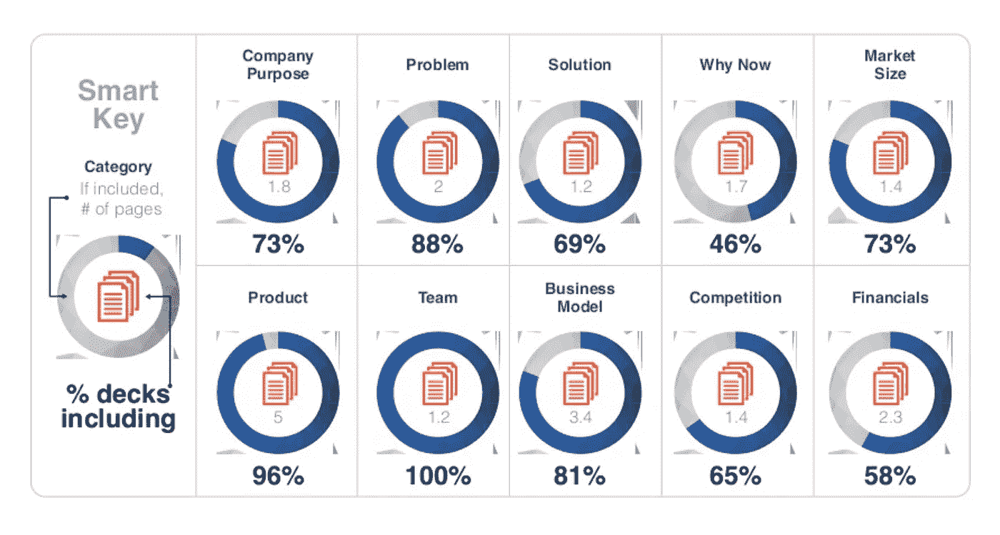
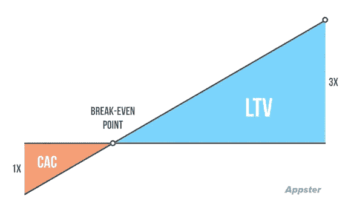
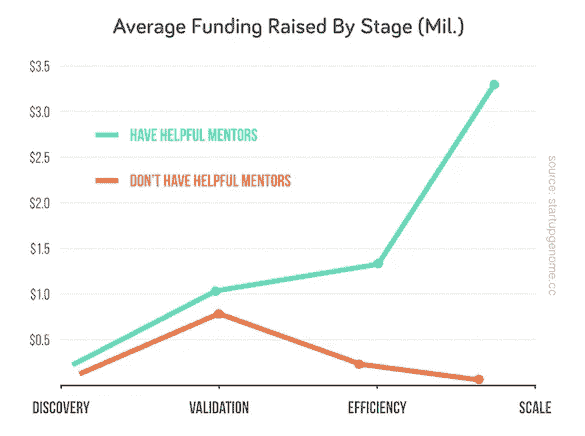

# 如何创建一份成功的投资者推介材料

> 原文：<https://medium.com/swlh/how-to-create-a-winning-investor-pitch-deck-794022ac4c59>

Originally published on [http://www.appsterhq.com](http://www.appsterhq.com/?utm_source=CP&utm_medium=Medium)

根据 DocSend 对 200 个初创公司的最新研究,投资者平均花费 **3 分 44 秒**来阅读一份材料。

时间不多了。

分秒必争。好的资料应该简单明了，有 10-15 页。

在这篇文章中，我将基于一个被包括红杉资本、[和](https://www.sequoiacap.com/article/writing-a-business-plan/)在内的许多人视为理想标准的结构，来解释推介材料的十个核心页面。

[Source](https://www.slideshare.net/DocSend/docsend-fundraising-research-49480890/6-Designing_a_Successful_Seed_DeckThe)

# 1.公司宗旨

这应该是你的一句话来解释你的企业存在的原因和它的重要性。

正如 Simon Sinek 在他广受欢迎的 TED 视频中所认同的，成功的公司总是有其存在的强大理由。

例如，Warby Parker 不仅仅是一家卖眼镜的商店，Asana 不是一个项目管理工具，Airbnb 也没有将自己定位为一个短期租赁应用程序。以下是他们的使命陈述:

*   沃比·帕克想要一个每个人都能看得清楚、时尚、价格合理的世界。
*   Asana 的使命是通过让所有团队毫不费力地一起工作来帮助人类繁荣。
*   Airbnb 旨在通过一个社区市场将世界各地现实生活中的数百万人联系起来，这样你就可以属于任何地方。

# 2.问题

一些最好的产品是止痛药(当然你也可以[制造维生素](http://www.appsterhq.com/blog/early-stage-entrepreneurs-launch-profitable-startup))。

在这张幻灯片的上，你想要展示你正在解决[一个巨大的客户难题](http://www.appsterhq.com/blog/build-successful-mobile-app-startup)。你想表明，痛苦如此之大，客户愿意把自己的信用卡明细交给一个不知名的创业公司。

> “问题越大，机会越大。没有人会付钱给你去解决一个无关紧要的问题。”—维诺德·科斯拉

换句话说，你需要证明你要解决的痛苦是重大的，也是可以赚钱的。此外，一定要解释客户现在是如何解决这个问题的，以及为什么它很糟糕。

# 3.解决办法

一旦你概述了问题，你要展示你将如何解决它。

在这里，您可以解释您产品的[独特价值主张](https://unbounce.com/conversion-glossary/definition/unique-value-proposition/) (USP)是什么，以及为什么您的解决方案会让客户的生活变得更好。

你要强调为什么它是一个可行的解决方案，为什么客户会使用它，而不是目前可用的任何解决方案。

这也是关于绘画的。光说是不够的，要展示人们从你的产品中受益的具体案例。

# 4.为什么是现在？

这是我们 Appster 的大多数企业家[最纠结的地方。](http://www.appsterhq.com/?utm_source=CP&utm_medium=Medium)

时机对于创建一个伟大的创业公司至关重要。有些公司有时间和地点来取得成功。

例如，如果你看看过去十年中的许多太阳能创业公司，大多数都过早上市并最终失败。油价正在下跌，太阳能电池板仍然更加昂贵。

你可能发现了一个很好的机会，但是如果你不得不等待市场太久，最终你会把钱花光。

最成功的创业公司也是如此。iPhone 在 PalmPilot 之后出现，它的成功也是因为技术和电池足够好，可以制造出消费者实际使用的产品。

脸书是在 Friendster 和 Myspace 失败后出现的。社交网络的市场和需求是存在的，但解决方案却缺失了。

确保列出所有重要的理由来解释你的“为什么是现在”

# 5.市场

除了确定你的公司的重点并集中在它将解决的具体问题上，你打算创造的解决方案的市场确实存在也是很重要的。

T 这张幻灯片在你的推介材料中起着关键作用，对许多企业家来说也是最重要的幻灯片。投资人、软件工程师[马克·安德森坚持](http://web.stanford.edu/class/ee204/ProductMarketFit.html):

> “市场是创业公司成败的最重要因素。为什么？在一个伟大的市场，一个有很多真正的潜在客户的市场，市场把产品从创业中拉出来。第一个可行的产品[出现时，市场需要满足，市场也将满足。”](http://www.appsterhq.com/blog/mvp-faster-launch-app)

当然，理想的市场是一个拥有许多愿意支付高价的富裕客户的大市场。这也是一个不断增长的市场，而且非常分散。

如果市场是分散的，这意味着没有一个明显的赢家有更好的解决方案。谷歌、苹果、脸书、Spotify、优步、Airbnb，所有这些都是高度分散市场的主导力量。

然而，你不会过来说我们的目标是赢得整个 X 万亿美元的市场。展示最有可能购买你的产品的细分市场，并展示你如何赢得它。

例如，优步和 Airbnb 最初专注于湾区，脸书最初赢得了哈佛，贝宝主导了易贝生态系统，特斯拉专注于科技行业的富裕客户。

# 6.竞争

列出你的竞争对手和你的竞争优势。

处理这张幻灯片的最佳方式是创建一个图表，显示您在市场中的位置，如下图所示。另一种方法是制作一个简单的对照表。

# 7.产品

在这张幻灯片上，你需要解释产品的细节。

什么是功能、架构、设计、[知识产权](http://www.appsterhq.com/blog/reasons-why-startups-dont-need-patents)？您处于什么开发阶段，离发布测试版或发布版还有多远。

强调你决定采用某种特定技术或设计的好处。是否快速、直观等？

# 8.商业模式

找不到合适的商业模式是大多数创业公司最终失败的原因。

在[我之前的一篇文章](http://www.appsterhq.com/blog/app-monetization-models)中，我写了九个应用程序盈利策略，你可以用它们来选择正确的商业模式。

这里有几件事你想演示一下。

*   你将如何获得收入，定价是多少？
*   你凭什么认为你能收这个价？
*   到目前为止，你的衡量标准是什么？

[两个最重要的指标](http://www.appsterhq.com/blog/4-financial-metrics-startups-measure)是客户获取成本(CAC)和客户终身价值(LTV)。

你希望 LTV 比 CAC 高得多。如果你还不知道这些价值是什么，看看你所在行业的一些数据或者研究一下你的竞争对手。

# 9.组

投资者[投资于人](http://www.appsterhq.com/blog/strategies-building-start-team)，而不是想法。

一个有坏主意的伟大团队比一个有好主意的糟糕团队更有可能成功(并筹集资金)。

Airbnb 被认为是一个荒谬的想法，但该团队展示了如此令人难以置信的坚持，以至于 Y Combinator 创始人[保罗·格拉厄姆说](http://www.paulgraham.com/jessica.html):

> “我们认为 Airbnb 是个坏主意。我们资助它是因为我们真的很喜欢创始人。”

这张幻灯片不是展示你标准简历的地方。投资者希望看到把事情做好的人。

不仅能开始而且能完成的人。这才是企业家真正的 DNA。

重点展示你过去是如何成功的例子，你是如何把事情做好的，以及你是如何在面对挑战时保持冷静的。

没人关心你的爱好或你在公司的实习，那与你的想法完全无关。

如果你有市场经验，那就炫耀一下。如果你有一些经验丰富的导师和/或顾问，也一定要向他们炫耀。推销你自己，因为在你推销的这个时候，胆怯是不对的。

# 10.金融

以下是关于财务的真相。大多数人都知道你的现金流预测可能是一个谎言。然而，它证明了几件事。首先，它显示了你是多么的雄心勃勃和现实。

风投的工作是寻找独角兽，而不是做得好的好企业。同样，如果你的数字完全不切实际，你会失去一些对潜在 CEO 的信任。

其次，也是最重要的一点，[你的财务状况](http://www.appsterhq.com/blog/4-financial-metrics-startups-measure)证明了你的企业是多么的可行。

从你的支出和利润率可以学到很多东西。换句话说，你的数字可能看起来很棒，但如果结果证明你完全依赖于病毒式营销或不切实际的高平均订单价值，你不会说服任何人。

所以，花时间确定你的财务状况，因为这是投资者花最多时间研究的[幻灯片](https://techcrunch.com/2015/06/08/lessons-from-a-study-of-perfect-pitch-decks-vcs-spend-an-average-of-3-minutes-44-seconds-on-them/)。

//

## 感谢阅读！

# 如果你喜欢这篇文章，请随意点击❤下面的心形按钮，帮助其他人找到它！

> 最初发表于[http://www.appsterhq.com](http://www.appsterhq.com/?utm_source=CP&utm_medium=Medium)

