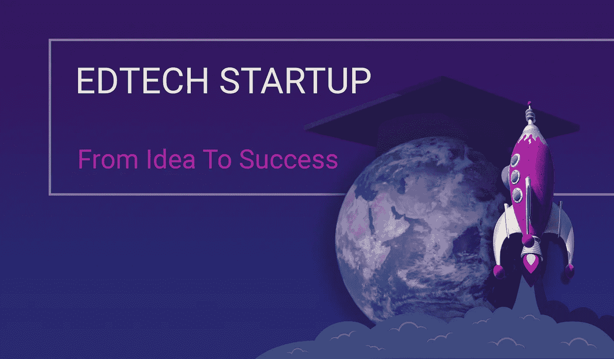

# 如何创建 EdTech 创业公司？从一个想法到赚钱的教育技术网络应用

> 原文：<https://medium.com/swlh/how-to-create-an-edtech-startup-from-an-idea-to-a-money-making-edtech-web-app-f35679a2c486>

教育科技创业公司每天都在涌现，尽管并不是所有的公司都收支平衡。今天，我们将分享我们参与 EdTech 行动，从一个想法到一个 MVP 再到一个赚钱产品的主要步骤。

# 现在进 EdTech 还来得及吗？

[在过去的几年里，教育技术市场呈爆炸式增长](https://freshcodeit.com/freshcode-post/is-edtech-the-next-big-thing-in-it)。据 EdTechXGlobal 称，到 2020 年，由于 17%的年增长率，教育技术将成为 2520 亿美元的产业。除了谷歌、苹果和微软，成千上万的初创公司也加入了教育软件货币化的竞赛。为了脱颖而出并取得成功，新产品必须解决未满足的需求，并为未解决的问题提供答案。

已经有了成熟的领导者，但这不应该阻止雄心勃勃的初创公司进入这个市场。相反，我们应该向最优秀的人学习，超越他们的成功。

*   **Coursera** 是领先的 MOOC 平台，拥有数千门任何主题的课程。它对用户友好，大部分内容是免费的，除非用户希望获得一个可共享的证书或获得专业化。
*   **可汗学院**为每个人提供免费的世界级教育，并帮助学习者、他们的父母和老师。学校的每个科目都有课程、辅导和测验。该学院是一个非营利组织，依靠志愿者的帮助和捐赠生存。
*   Science360 从专家和机构那里收集和组织先进的科学内容，并让每个人都能获得。学习者可以看视频，阅读最新的科学新闻，听广播。国家科学基金会支持这个项目。
*   **Big Think** 是一个由全球 2000 多名顶尖思想家和实干家组成的知识论坛。它们涵盖了应该成为人类关注焦点的关键话题。文章、视频和播客可供每个人使用，而 Big Think Edge 为愿意投资团队职业发展的企业主提供优质内容。
*   **Kahoot！**是一个基于游戏的教育平台，供教师、教授和管理人员以有趣和吸引人的方式介绍新知识。直观的界面有助于为教室和办公室环境创建令人兴奋的游戏。大多数功能是免费的，而商业软件解决方案是高级的。

# 如何创建教育科技创业公司？

仅仅加入战斗并创建自己的应用程序是不够的；您需要对您的应用程序开发有一个逐步的计划。你不能忽视这四个里程碑:

1.  识别客户端和用户。当你为孩子开发一个教育应用程序时，他们的父母将会购买它。同样的，学校管理者决定是否为你的解决方案付费，即使它是针对教师和学生的。确定所有利益相关者，进入下一阶段。
2.  了解用户的需求。你在教室里呆了很多年，但这并不意味着你知道老师和学生需要什么。所以，市场调研还是必须的。与你的潜在客户交谈，研究他们的问题，采访他们，创建用户角色来更好地满足客户的需求。
3.  创建一个 MVP。你的想法在纸上或脑海中可能看起来不可思议，但只有现实生活中的测试才能验证它们。一个最小的可行产品可以是一个模型，一个粗糙的应用程序，甚至是一个登陆页面。这将有助于评估潜在受众的规模，并在你在一个注定失败的项目上花费太多时间和金钱之前对产品进行微调。
4.  [选择定制软件开发公司](https://freshcodeit.com/freshcode-post/choose-a-perfect-outsourcing-software-development-company-in-six-steps)。选择外包开发团队是一个漫长的过程，需要定义需求并确定其优先级，研究市场并收集信息，创建潜在合作伙伴的候选名单，并对每家公司进行面试。尽管如此，这一步对你的项目的成功至关重要，所以你不想偷工减料。

# 如何从零到一个 EdTech MVP？

一旦你找到了你的[网络开发公司](https://freshcodeit.com/) , [开始着手 MVP](https://freshcodeit.com/freshcode-post/what-is-mvp-and-why-every-startup-needs-it) 。你需要经历四个主要阶段:

*   **研究和分析。再次强调，你需要关注目标用户及其需求。创建移情图，快速识别客户的优先事项和动机。利益相关者地图是另一个有用的工具，可以集中关注受项目影响的人。**
*   **范围界定。在这个阶段，你需要关注你的项目能给用户带来的主要好处，而不是主要的竞争对手。基于研究阶段开发的目标人物角色的电梯间推介和创建故事板有助于最初的设计工作。**
*   **原型制作。**不要在精心设计上浪费宝贵的时间，从线框原型和流程图开始，大致了解产品的外观和用户交互，引导客户实现他们的目标。
*   可用性测试。你不需要一个 app 开发者在早期测试可用性。相反，使用纸张原型，可以模拟点击和过渡，而不需要额外的费用。向外部观察者介绍该概念，以确保界面直观且用户友好。

MVP 不是未来项目的残缺版本。相反，它是一个成品，具有足够的客户价值和愿景来吸引第一批采用者。你可以通过任何可用的方式来寻找他们，比如在热门博客上发布客座文章，类似于初创公司，在 Product hunt 和其他平台上创建一个帐户，或者将测试版用户导向一个登录页面。

MVP 的主要目标是确定产品的概念是否值得进一步开发。要做出决定，你需要顾客的反馈。收集真实的用户评论和反馈将指导项目的发展。

即使用户喜欢，MVP 也不是最终产品。虽然早期采用者已经准备好处理小故障和有缺陷的功能，但您的 EdTech 产品在上市之前应该没有错误并且功能齐全。将 MVP 开发看作是一个实现增量改进的迭代过程，它将最终导致最终的产品。使用最小可行产品的概念，你会更快地达到这个目标，而且花费更少。

# 如何从一个 MVP 变成一个赚钱的产品？

在 MVP 为你提供了足够的反馈和用户数据之后，让你的团队中的 [web 开发服务](https://freshcodeit.com/services)参与进来，从概念验证进入成品阶段。使用客户评论和行为分析来改进项目，使其更易于使用，添加客户发现缺少的功能。一步一步地遵循 MVP 现代化计划，直到您的 beta 用户对产品满意为止。

新的教育网络应用面临许多反对和挑战，所以要仔细计划发布以增加成功的机会。在将产品推向市场之前，概述营销策略，并关注针对目标受众的正确推广渠道。整个世界可能都在脸书上，但并不是所有的教师都有账户并愿意采用社交媒体。

仍有时间利用教育技术赚钱。虽然教育创业发展可能是一个缓慢而痛苦的过程，但潜在的收入是非常值得的。模拟成功的教育科技创业公司的最佳策略，使用值得信赖的公司的软件开发服务，享受项目的成功！

访问我们的公司 [*FreshCode.blog*](https://freshcodeit.com/blog) 获取更多有趣的文章。

请随时联系我们的[*fresh code . website*](https://freshcodeit.com/)

关注 fresh code on[*LinkedIn*](https://www.linkedin.com/company/freshcode-it/)*，* [*脸书*](https://www.facebook.com/freshcodeit/) *，*[*Twitter*](https://twitter.com/FreshCode1)*，*[*insta gram*](https://www.instagram.com/freshcode_it/)*，*[*Behance*](https://www.behance.net/freshcode)*，* [*Medium*](/@FreshCodeIT)

原文[条*此处*条](https://freshcodeit.com/freshcode-post/from-an-idea-to-a-money-making-edtech-web-app)

## 这篇文章发表在 [The Startup](https://medium.com/swlh) 上，这是 Medium 最大的创业刊物，拥有 307，871+读者。

## 在这里订阅接收[我们的头条新闻](http://growthsupply.com/the-startup-newsletter/)。

