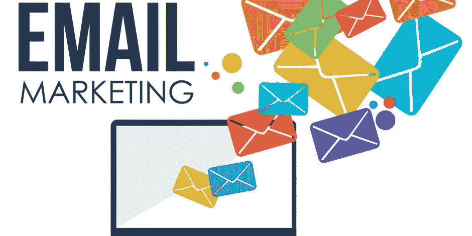
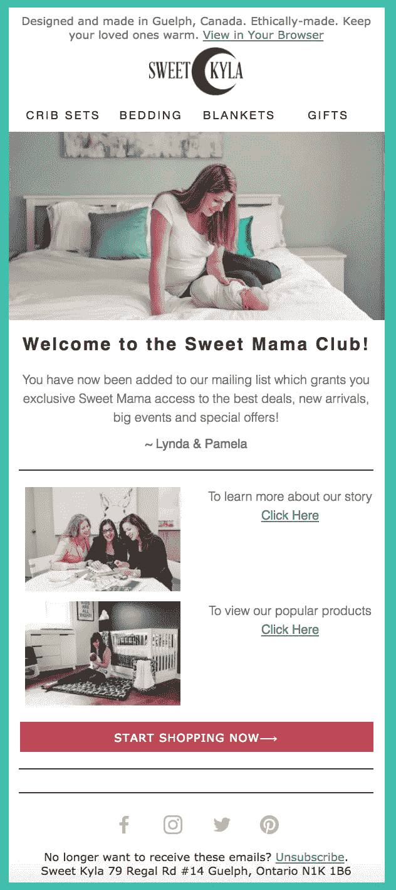
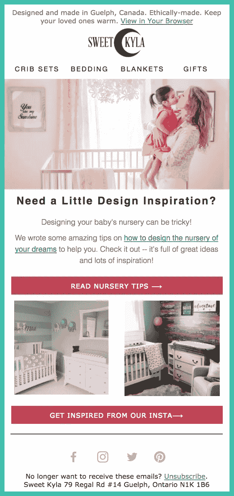
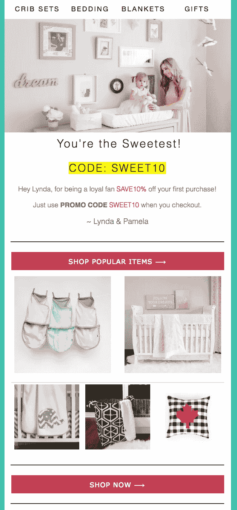
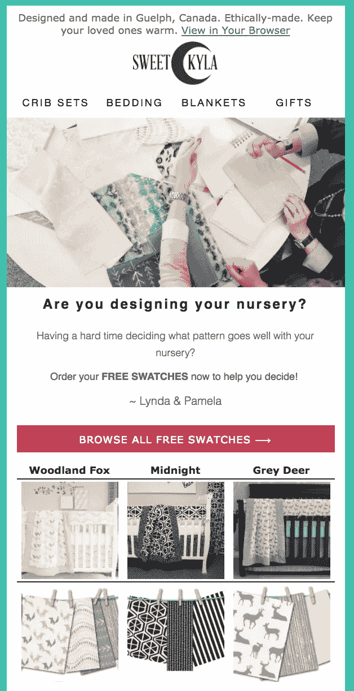

# 如何使用 Klaviyo 为您的 Shopify 商店创建引人入胜的欢迎电子邮件系列

> 原文：<https://medium.com/swlh/how-to-create-an-engaging-welcome-email-series-for-your-shopify-store-using-klaviyo-cd1dd80f6070>

许多数字营销人员在创建一个实际上转化为销售和狂热粉丝的电子邮件活动方面存在问题。因此，这里有一些关于如何确保你的客户和追随者真正期待你的消息的想法。

太多的营销人员会立刻进行销售或“杀戮”，这很烦人，而企业主只会显得贪婪和绝望。你想提供帮助，让顾客自己决定是否向你购买。这里有一个电子邮件欢迎系列的布局，可以帮助他们更快地做出决定。

**电子邮件 1:**

一旦有人订阅了你的名单，邮件 1 就应该发出去，而且应该相当简单。首先，你应该感谢他们订阅了你的邮件列表，并给他们一个简短的描述，告诉他们可以从你这里得到什么，以及他们将会收到什么内容。

**电子邮件 2:**

电子邮件 2 应该在该人订阅你的电子邮件列表后 3 天左右发出。这封邮件应该是对客户有帮助的，而不应该是销售导向的。如果在线商店和电子邮件列表与婴儿床上用品和配件有关，那么这封电子邮件可以是关于帮助婴儿睡眠的托儿所的舒缓颜色或托儿所的室内设计技巧。

**邮箱 3** :

邮件 3 应该在一个人订阅了你的名单后 10 天左右发出。在这封邮件中，你应该试着收集更多关于这个人可能在寻找什么的信息。这样你就可以向他们发送更多相关的内容，这意味着你的营销更有针对性。再次使用婴儿床上用品的例子，你可能会问这样的问题，电子邮件收件人是在期待，有一个新生儿，还是在为朋友购物。

通过使用电子邮件中的按钮自动收集客户信息可能是 Klaviyo 最未被充分利用的功能之一。这真的很神奇，可以让你更好地个性化电子邮件。你应该在这里查看一下[——https://help . klaviyo . com/HC/en-us/articles/115005255248——使用电子邮件中的按钮来收集关于你的收件人的信息](https://l.facebook.com/l.php?u=https%3A%2F%2Fhelp.klaviyo.com%2Fhc%2Fen-us%2Farticles%2F115005255248-Use-Buttons-in-an-Email-to-Collect-Information-About-Your-Recipients&h=ATMSKqM94-meqIbp6clYgwj83kprxfMGpjkep1aQlUBRxisf5i79XuyGXMlyqUB5TSqv4yX8FJqW8cxzIY54H2KvNOj5LHOhJW4OLRgD1g-L2htPWEzVxvb4NcMDVPMeid1pJ-juN1I)

**电子邮件 4:**

电子邮件 4 可以在第 14 天左右发出。这是你可以开始发送你的潜在客户折扣代码，这将使他们考虑实际购买的东西。在此之前的其他电子邮件已经让他们对购买的想法产生了兴趣。

**电子邮件 5:**

邮件 5 应该在订阅邮件列表 20 天后发出。这是你可以试着让他们点些东西的时候。它不一定是一种产品，但可以是增加他们购买产品可能性的东西。继续我们的例子，我们可以提供订购免费样品的机会，这样潜在客户就可以看到它们是否与他们的苗圃相匹配。

如果你带一个人通过这些步骤，他们更有可能成功地将他们转化为顾客甚至粉丝，这也是非常有价值的。你必须考虑如何接收电子邮件。如果有人只是想把产品塞进你的喉咙，你可能会变得很烦，再也不买任何东西，也不想再听到他们的消息。给注册的人一些对他们有用的相关信息，即使这些信息与你销售的产品没有直接关系。然后他们会很高兴收到你的来信，更有可能购买。

**以下是我在构建自己的欢迎邮件系列时的 5 大技巧:**

1.  尝试建立一个持续 3 个月的欢迎系列(12-15 封电子邮件)。这样，新用户就不会变得冷淡。
2.  让他们对你的品牌产生好感，而不是直接销售。
3.  通过获取年龄范围、性别等信息，尝试更多地了解您的客户。
4.  分享博客内容(如果你有博客的话)。
5.  让他们更多地了解你。

**需要帮助打造自己的欢迎系列吗？给我发邮件到 brent@onlygrowth.com，获得 30 分钟的免费咨询。或者在[https://onlygrowth.com](https://onlygrowth.com/pages/audit)报名参加免费咨询**

有其他技巧来建立一个有效的电子邮件欢迎系列吗？请在下面的评论中分享:)

## 这篇文章发表在 [The Startup](https://medium.com/swlh) 上，这是 Medium 最大的创业刊物，拥有+396，714 名读者。

## 在此订阅接收[我们的头条新闻](http://growthsupply.com/the-startup-newsletter/)。

