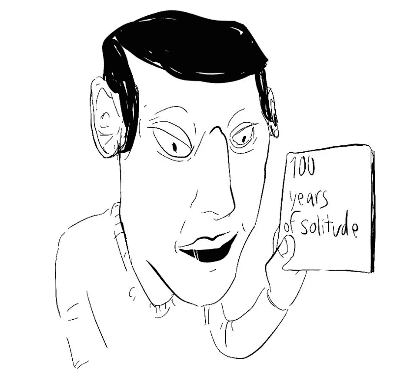
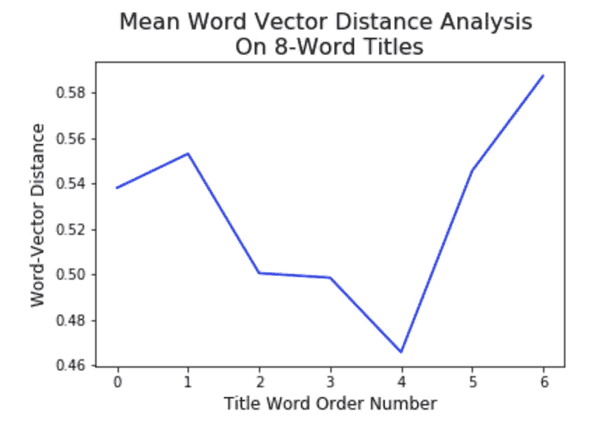
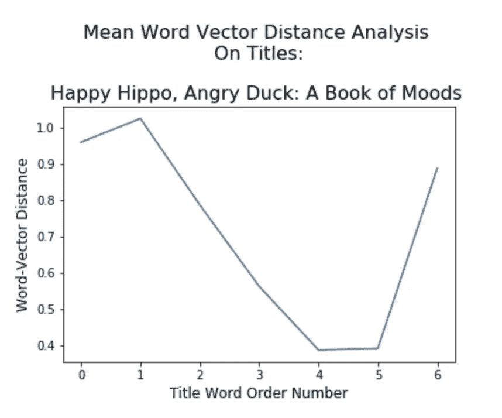
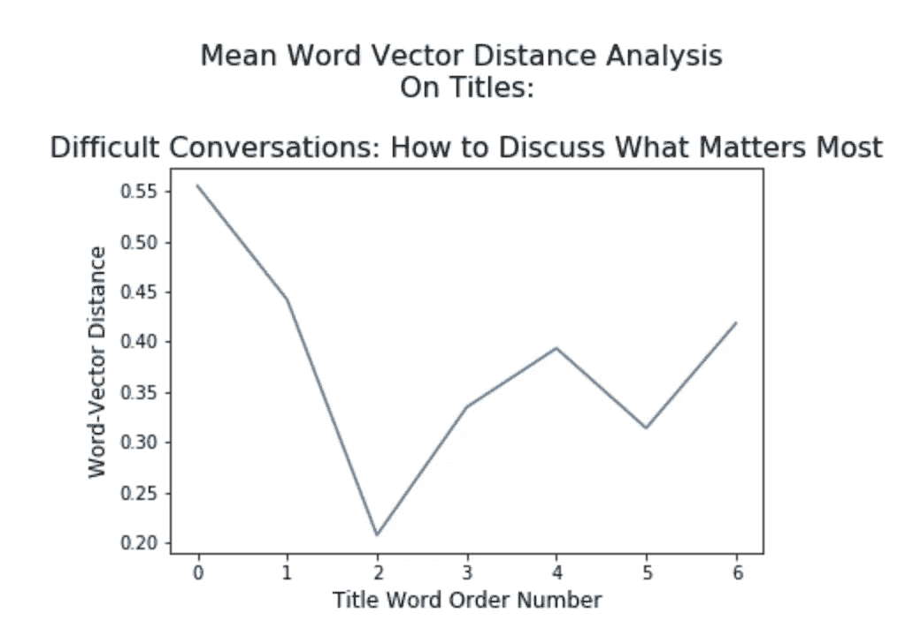
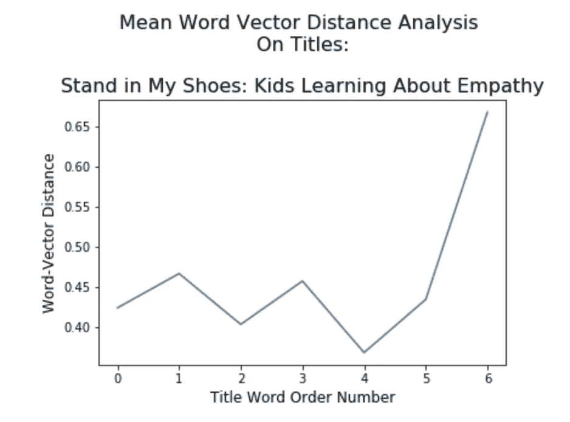
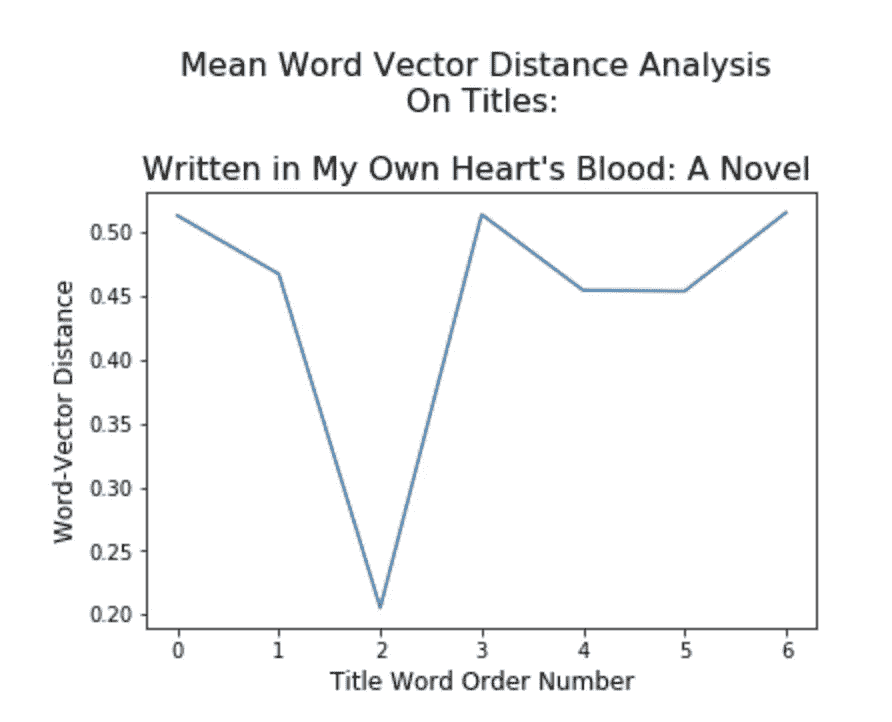
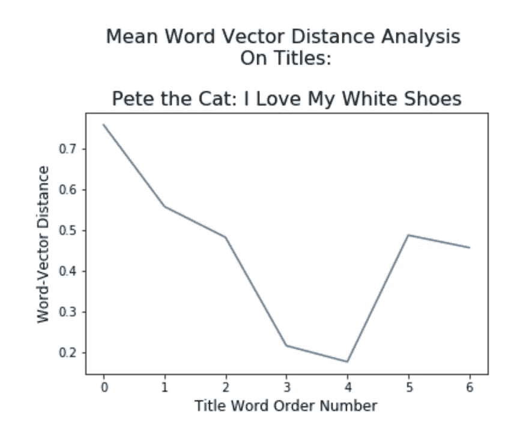
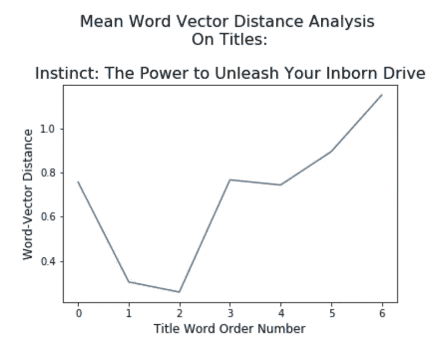

# 如何创作畅销书——向亚马逊畅销书学习

> 原文：<https://medium.com/swlh/how-to-create-best-selling-titles-learning-from-amazon-bestsellers-897aed1ade43>

Source: Lucas Amunategui

你的博文标题是微笑吗？亚马逊上最畅销的书籍是，而且不止一种。当然，他们微笑是因为他们正在从书架上飞下来，但当你测量和绘制每个单词之间独特性的距离时，他们也会微笑。无论你是为一本书、博客还是视频写标题，同样的选词原则也适用。

> 一个成功的标题有一个特定的节奏。

# 微笑标题倾斜

在期权交易行业，有一个技术指标叫做“[波动率微笑](https://www.investopedia.com/terms/v/volatilitysmile.asp)”。这表明，价内和价外期权的价值比原价期权更昂贵。绘制时，倾斜形成一个微笑。当我将成功书名的单词距离平均并绘制出来时，我被相似的形状所震惊。我在这里使用 8 个单词的书名，因为这是高排名亚马逊书籍的常见字数统计(我在以前的一篇文章中讨论了这个概念背后的理论:[畅销与滞销的书名，定量分析](/swlh/titles-that-sell-versus-those-that-dont-a-quantitative-analysis-1809c5e8a14))。

我们都知道，标题对于快速传达一本书的内容并说服读者进一步参与至关重要。一个成功的标题有一个特定的节奏。如果我们分析足够多的亚马逊销售排名靠前的书籍，我们会注意到以下模式，它们以遥远的词开始，以遥远的词结束，但被更近的词联系在一起。换句话说，一个好的标题开头和结尾的同义词最少，而中间的同义词更多。

这可以在上面的图表中看到，其中 y 轴测量单词距离(数字越小，一个单词与下一个单词同义越多，越大，同义最少)。x 轴显示标题中的单词(更准确地说，是两个单词之间的一个点)。当使用每个单词之间的单词嵌入向量距离绘制时，这种微笑模式在标题的开头和结尾都是可见的(我在以前的一篇文章中讨论了这一概念背后的理论:[畅销与滞销的标题，定量分析](/swlh/titles-that-sell-versus-those-that-dont-a-quantitative-analysis-1809c5e8a14))。简单来说，这意味着标题开头和结尾使用的单词比中间的单词距离更远。

# 一个例子

以下是亚马逊销量排名前六的书籍。这些图案不像上面的平均图案那样干净简单，但总体形状保持不变(我确实挑选了它们——不要评价我)。

在上图《**快乐的河马，愤怒的鸭子:一本心情的书**》中，我们看到“**河马**”和“**愤怒**”之间的距离非常大，**和“**心情**”之间的距离也非常大，坐在题目的两端。**

# 更多示例

# 结论

我不会说我完全理解这一点的重要性，但如果从总体上来看足够多的成功图书，这种模式是存在的。无论是关于在一个标题中捆绑至少两个主题，包装尽可能多的含义，还是它创造的音调节奏，我可以肯定的一件事是，我们都喜欢微笑…确保你的也在微笑。

如果你想看看你自己的标题和内容与专业人士相比如何，可以在 ViralML.com 的实验性多点写作分析仪上测试一下。要深入了解标题写作的可见性和排名，请参见[如何写出完美的标题](http://www.viralml.com/how-to-create-a-perfect-title)。

看看我最新的电子书([增长你的网络品牌，知名度&流量有机:5 年的 amunategui.github.io](https://www.amazon.com/Brand-Visibility-Traffic-Organically-amunategui-github-io-ebook/dp/B07KVQHVK7) ):

感谢阅读并在 [amunategui.github.io](https://amunategui.github.io) 或[ViralML.com](http://www.viralml.com)注册我的简讯。

曼努埃尔·阿穆纳特吉

amunategui@gmail.com

推特:@amunategui

*作者* [货币化机器学习](https://amzn.to/2CRUOKu)和[增长你的网络品牌，知名度&流量有机结合](https://www.amazon.com/Brand-Visibility-Traffic-Organically-amunategui-github-io-ebook/dp/B07KVQHVK7)。*amunategui . github . io 的策展人*和 [ViralML](http://www.viralml.com/)

## 这个故事发表在 [The Startup](https://medium.com/swlh) 上，这是 Medium 最大的企业家出版物，拥有 358，974+人。

## 在这里订阅接收[我们的头条新闻](http://growthsupply.com/the-startup-newsletter/)。

