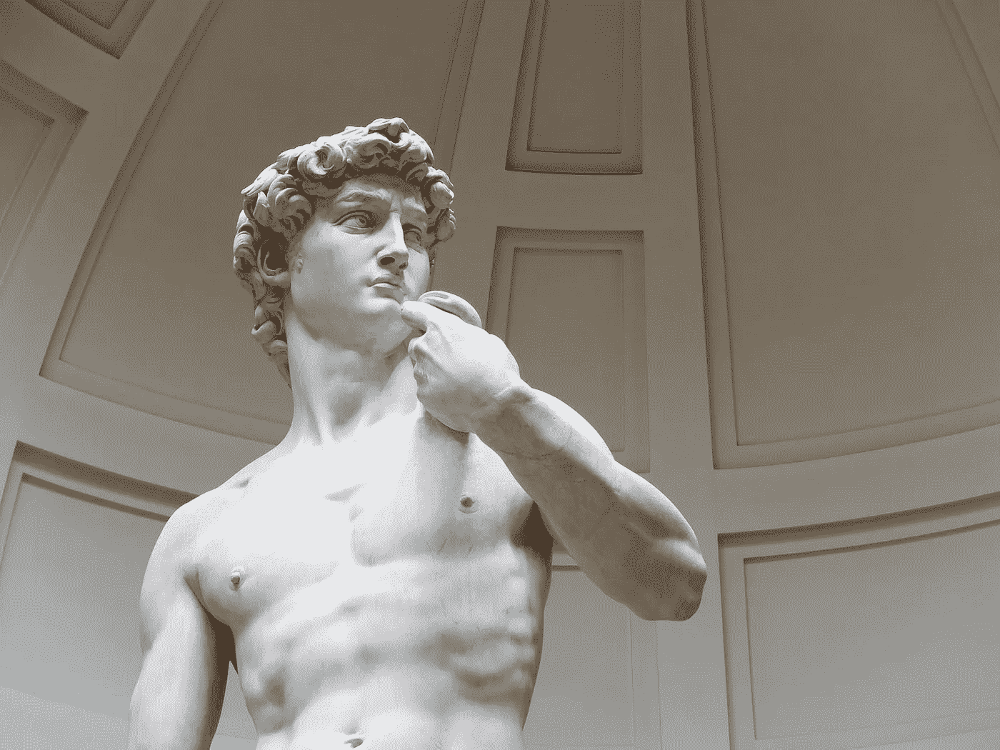
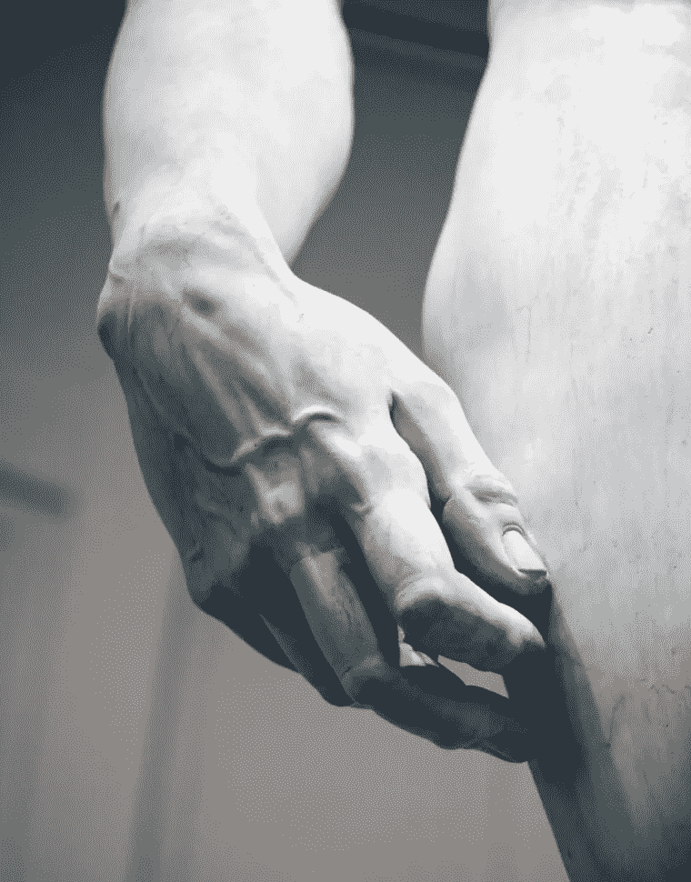
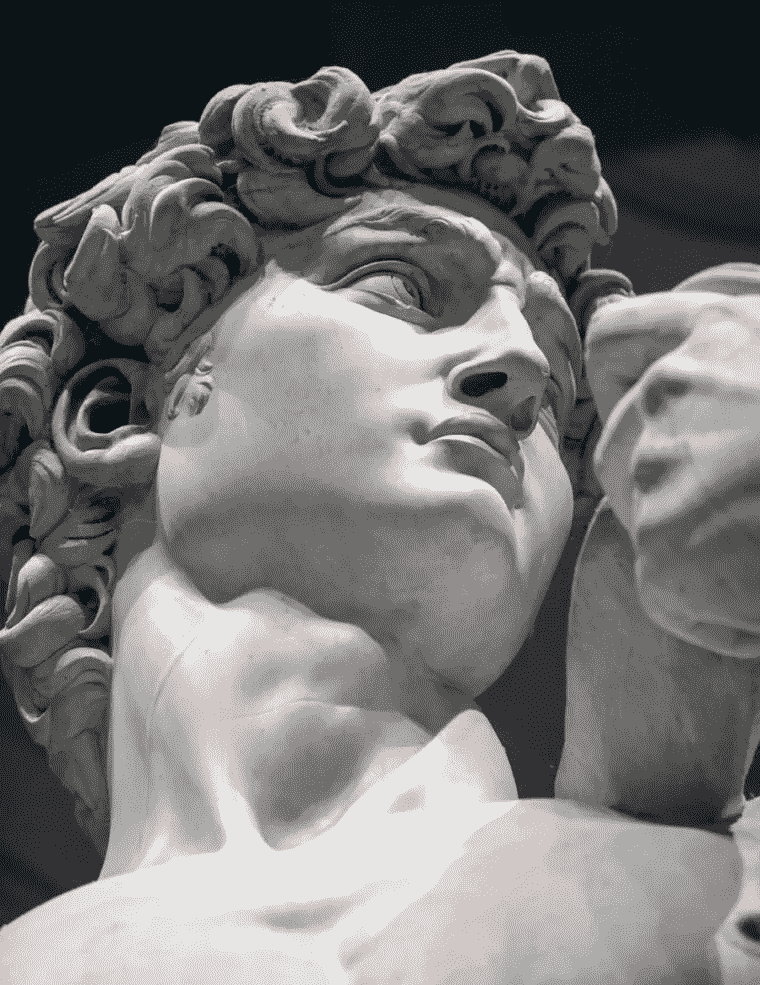

# 如何从废品中创造杰作

> 原文：<https://medium.com/swlh/how-to-create-masterpieces-from-rejects-6ced019d574f>

Photo: Saniba

据说米开朗基罗用一块大理石创作了大卫的雕像。

不是普通的大理石——而是一块被另外两位雕塑家拒绝的大理石。

第一个拒绝使用这块石头的人是阿戈斯蒂诺·迪·杜奇奥，他曾计划将这块近 17 英尺长的卡拉拉大理石用于佛罗伦萨的一座大教堂。他放弃了这个项目——有人认为是因为他没有处理那么大雕塑的经验。

在闲置了 10 年后，第二位雕塑家安东尼奥·罗塞利诺“捡起”了这块石头。我不严格地使用“捡起”这个词，因为这块石头超过 6 吨重。罗西里尼很快就放弃了它，因为它太难合作。

他声称它有太多的缺陷。

将近 40 年后，米开朗基罗接受了这块石头，然后开始了他的杰作。

他 25 岁的时候开始制作《T2》大卫。

他首先制作了一个蜡模。他把它浸入水中，然后一边工作一边慢慢降低水位。他雕刻了他能看到的浮现出来的东西。

在接下来的两年里，他在户外的一个开放的院子里对这块石头进行了研究，但他对自己的工作保密，直到他准备好展示自己的杰作。

这座雕像原本打算高高地安放在大教堂里。但所有人都同意，把它放在这么远的地方太完美了。

在接下来的 369 年里，它最终在 Signoria 广场找到了自己的家。

你能想象没有*大卫*的世界吗？

# 我们可以从这个拒绝的故事中学到

## 观察#1:尽管大理石有瑕疵，米开朗基罗还是融入了新的细节层次

你注意到右手的细节了吗？脉动的血管，指关节上的酒窝，穿过皮肤的骨头。

Photo: Accademia di Belle Arti

当别人看到石头上的瑕疵时，米开朗基罗看到了机会。通过处理这些“瑕疵”，他在雕塑中融入了新的细节层次。

大教堂委员会意识到这些细节为雕塑增添了前所未有的完美。

这件作品原本打算展示在大教堂的天花板附近，然而在那个高度，细节会被阴影所掩盖。

雕塑需要放在可以看到和欣赏细节的地方。

## 观察#2:米开朗基罗对当时的一个流行主题有了新的看法

这块石头的形状和特征为艺术家揭示了一个新的机会。

大卫与圣经中描述的大卫和歌利亚是同一个人。

大多数艺术家描绘大卫在击败歌利亚后的样子——当他如释重负，欢欣鼓舞，胜利的时候。

米开朗基罗选择在战斗之前创作他的杰作《大卫》*——当他焦虑、专注、沉思的时候。*

视角的改变——或者说事件发生的时间——给了米开朗基罗一个机会。他能捕捉不同的情感——在石头里。

Photo: Wikipedia

研究一下米开朗基罗在思考即将到来的战斗时捕捉到的他脸上、眉宇间的紧张。

然而，他的姿态显得轻松而自信——表明他相信他的上帝会支持他。

米开朗基罗在美丽的细节中捕捉到了这种强度。

Photo: Accademia di Belle Arti

结果:米开朗基罗给了我们世界历史上最鼓舞人心的杰作之一。

这一切都是从拒绝开始的。

两次。

# 如何培养你的拒绝者

我沉浸在创造性的努力中。

我是一名营销顾问，这需要源源不断的创造力。

我的爱好是写小说和博客文章——这需要一种不同但同样强烈的创造力。

所以我把一个创意笔记本放在手边。我捕捉我的思想、想法、观察、概念、措辞得体的句子、无意中听到的对话。我收集令人惊叹的艺术品、漂亮的设计、有趣的产品、巧妙的广告、网页和应用程序的图片。

我画素描。

我写作。

我修补。

但是我的想法没有一个是完全成熟的。

当我从事一个涉及创造力的项目时——无论是为了我的工作还是我的爱好——我会像儿时的朋友一样一遍又一遍地翻开我的创意笔记本。

我的一些草稿可能会出现在手稿或客户项目中。

有些可能只会激发新的想法。

有些，我暂时拒绝。

如果你愿意的话，我的想法笔记本是我最初拒绝的收集。但它也是我创造力的孵化器。

我珍惜这些拒绝，因为我总是期待着下一个场景，下一篇手稿，下一篇博客文章，下一个客户项目。

他们可能会像星座一样以意想不到的组合走到一起。

它们可能会焕发生机。

> 我的经验之谈: ***暂时拒绝，但不要丢弃。***

# 从废品中创造杰作的 3 个步骤:

## **1。在创意笔记本中收集不合格品**

在创意笔记本或手机上记录下你随机的、不完整的想法和主意——起初你可能倾向于拒绝的东西。

我称这些想法为**想法种子**。

我不组织他们。我喜欢把它们放在一起——不管它们是关于工作、爱好、家庭还是空闲时间的想法。

让它们保持无组织状态给了它们孵化的机会。

## **2。琢磨想法种子**

不是要和他们快速做点什么。但是他们身上的某些东西引起了你的注意。

他们让你兴奋。

你觉得他们有潜力。

当你需要新的想法时，回顾它们。

给他们一些想法。

发挥他们的潜力。

## **3。将它们用作首选列表**

当你需要项目或问题的解决方案时，当你准备创造新的东西时，当你想改进你正在做的东西时:**回顾你的拒绝列表**。

考虑他们。

塑造他们多一点。

将它们与其他想法种子配对。

让汁液流淌。

灵感不是一下子就来的，充分烘焙，随时可以使用。它经常是一点一点来的。

即使在接受了整块大理石之后，米开朗基罗还是花了 4 年时间才完成*大卫*。因此，收集沿途的点滴，然后看看会出现什么。

这才是真正的乐趣所在！

## 这篇文章发表在 [The Startup](https://medium.com/swlh) 上，这是 Medium 最大的创业刊物，有 270，416+人关注。

## 订阅接收[我们的头条新闻](http://growthsupply.com/the-startup-newsletter/)。

