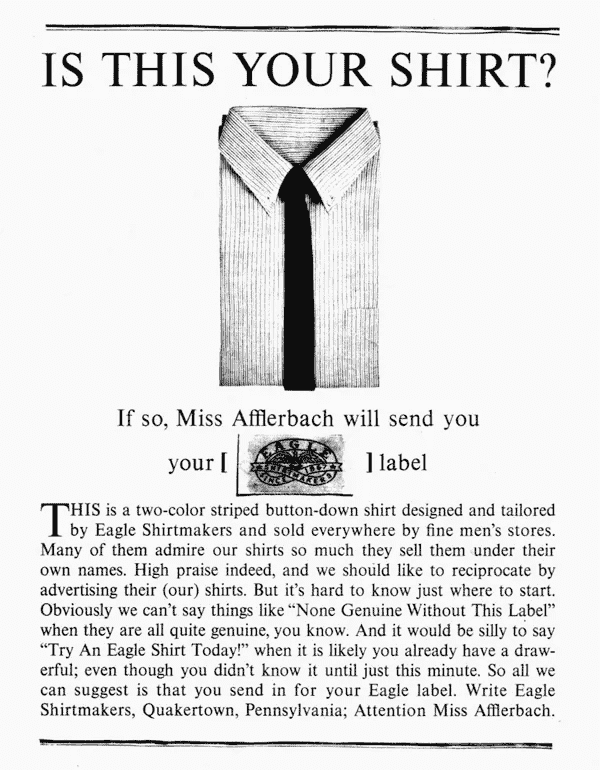
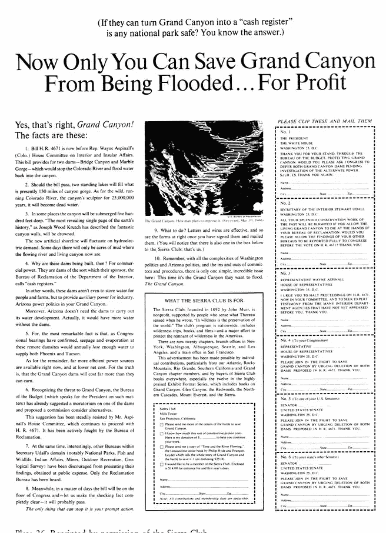
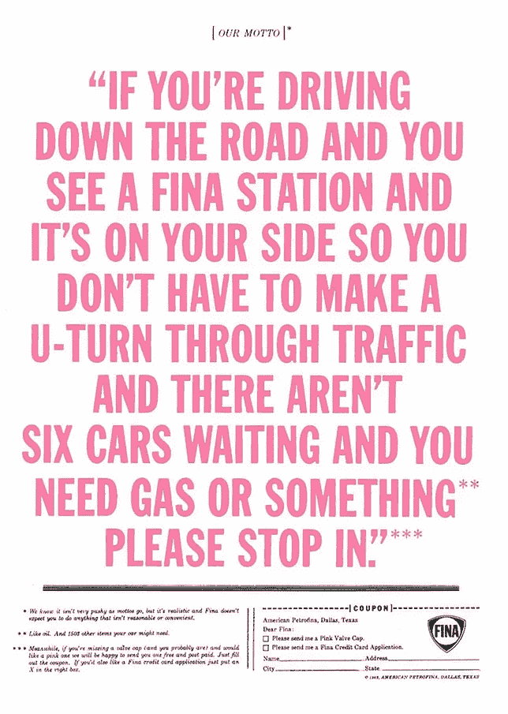
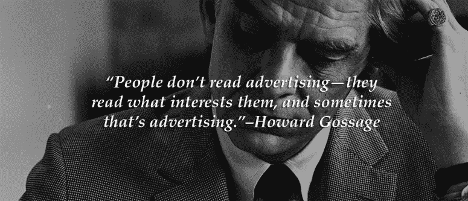

# 如何创造销售的现代广告

> 原文：<https://medium.com/swlh/how-to-create-modern-advertising-that-sells-c9f37c8a4b38>

## 在广告业的生存危机中，我们能从一个广告传奇中学到什么:

# 旧金山的苏格拉底是谁？

霍华德:运气戈萨奇是个不寻常的人。他是广告铁器时代的革新者和伟大思想家。

*他被称为“旧金山的苏格拉底”*

他的公司位于旧金山市中心的一座旧消防大楼里。他雷鸣般的笑声和不断涌入的伟大思想使旧消防站保持了喧闹和热烈。他自己就是火。

消防站将成为那个时代许多有影响力的思想家的沙龙:从约翰·斯坦贝克到斯坦·弗雷贝格，再到巴克明斯特·富勒。

> "我渴望有一天广告会成为成年人的生意。"
> 
> 汞

Long form copy is vastly underrated in today’s world of pop up and banner ads.

但是，我两周前才听说过霍华德·戈萨奇。

**我敢打赌这也是你第一次听说他。**

大多数人终其一生都不会知道他的名字，但如果你偶然看到他的作品，他的见解将改变你看待商业的方式。

在过去的一周里，我翻遍了美国最大的图书馆之一的特别收藏，尽我所能挖掘关于这位伟人的信息。

以下是我的发现:

# 人们不看广告

霍华德最著名的名言是他最简单但最重要的一句:

> 事实是没有人看广告。人们阅读他们感兴趣的东西，有时是广告。”

这是一个非常令人愉快的陈述——但是是这个陈述的**应用**使世界变得不同。

例如，大多数广告商和营销人员会问自己这样一个问题:

*“我怎样才能让这个广告转化好，完成我们的目标？”*而不是*“观众会发现什么有趣和有价值？”。*

创造一个伟大的广告不是创造一个伟大的广告。

人们不看广告。你最后一次点击横幅广告是什么时候？人们点击他们感兴趣的东西。

广告商的角色是创造引人注目的内容，建立品牌资产，并为他们服务的受众提供价值。

一个伟大的广告迫使读者对某种提议采取行动。一个真正与他们相关并能让他们生活得更好的提议。一个伟大的广告不应该感觉像广告。

> 内容营销是唯一剩下的营销。
> 
> ——塞思·戈丁

伟大的广告就像狙击枪。即使你的潜在市场很大，你也只能一次吃掉一条鲸鱼。

# 横幅广告的死亡

回想一下早期电视的时代。

没有人真正有逃避广告的自由。但更重要的是，那时电视上的一切都很有趣。

这是一个闪亮的新平台。

由于消费者现在拥有绝对的自由，没有人会耐着性子看完电视广告。没有人会点击横幅广告。

弹出式广告存在，所以我们可以看到我们可以多快退出。

苹果将广告拦截器引入其有围墙的 iOS 花园是懒惰广告和懒惰营销的直接结果。

横幅广告让手机上的网页变得过时。

消费者的注意力已经转移到具有有趣内容的新平台上。Snapchat、Instagram、微信、Medium、脸书&新的小众平台每天都在涌现。

洞察力不是在这些平台上做广告(但是是的，做)。

这里的关键是创造相关内容，抓住并保持读者的注意力，并迫使他们对报价采取行动。

而且报价应该很少直接面对消费者。

你如何帮助他们做他们想做的事情，而不是像今天这样成为障碍？

# **原生广告**

## &全栈广告客户的崛起

脸书的业务是向用户展示相关内容。**有时候，这是一个广告。事实上，脸书让广告商为不相关的广告支付更多费用。**

无论你用什么平台来吸引和营销你的受众，你都必须学会如何为特定的环境制作内容。

6 秒视频。信息图表。登陆页面，所有的东西。

**全栈广告商的崛起**

在营销界，术语“增长型营销者”、“全栈营销者”和“内容营销者”在过去几年中被越来越多地使用。

这些术语来自现代营销人员的问题。大多数现代营销人员和广告商都无法创造出影响、诱惑和转化的优秀媒体内容。但将所有这些称为“内容营销”的危险在于，它意味着你所需要的只是生产“内容”。

事实上，这只是广告做得好。

现代广告客户需要能够销售，并且能够以令人信服的方式在相关的技术媒介中进行创作。

今天的企业真正需要的是有能力在现代媒体中创造的广告商。

他们需要能够建立静态页面供读者登陆，为脸书视频即时编辑视频，并在 Instagram 上撰写文字说明，迫使读者点击你简历中的链接。

不管媒介是什么，想法都是一样的:

# 人们阅读他们感兴趣的东西。

# 有时候，是广告。

# 我们能拿走什么？

1.  创造一个优秀广告的关键是深刻理解是什么让观众在他们过度关注的媒体中打勾。
2.  研究老派广告商。他们能清楚地表达是什么让人们感兴趣，如何让人们采取行动。
3.  记住:**好的内容不产生结果。伟大的内容产生好的结果。非凡的内容产生伟大的结果。**

旧金山的苏格拉底于 1969 年初去世。

> “向广告人解释责任就像试图让一个八岁的孩子相信性交比巧克力冰淇淋甜筒更有趣。”
> 
> 霍华德·戈萨奇

霍华德·戈萨奇无法从自身拯救今天的广告业。

但是，也许我们可以帮助它成为一个最终值得追求的行业。

# 如果你喜欢这篇文章，请推荐给其他人看:)

## 如果你对更多类似的内容感兴趣，请点击这里关注我: [*现代职业&传统简历*](https://medium.com/u/872e01284299#.zcagektso)*   [*任其摆布:为什么我的个人品牌战略在 16 年‘被回邮件*](/@mitchrobs/at-thier-mercy-why-my-personal-brand-strategy-in-2016-is-going-back-to-email-2506e1ccd0f#.p3ov7e20q)*   [*穿上队长球衣到底意味着什么？*](/keep-learning-keep-growing/what-does-it-really-mean-to-wear-the-captain-s-jersey-62a84cae9260#.idl0xp6vq)*   试图在你所做的事情上做到最好？(你可能有这个盲点 *)*