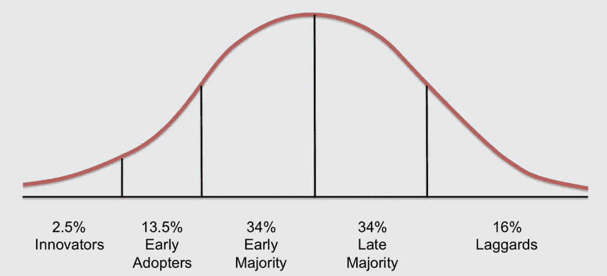

# 创造顾客喜欢的产品的 3 个步骤

> 原文：<https://medium.com/swlh/how-to-create-products-your-customers-will-love-5209c38afd18>

Photo by [Will van Wingerden](https://unsplash.com/photos/cZVthlrnlnQ?utm_source=unsplash&utm_medium=referral&utm_content=creditCopyText) on [Unsplash](https://unsplash.com/collections/1584622/success?utm_source=unsplash&utm_medium=referral&utm_content=creditCopyText)

## 创业成功几率 10 倍的终极指南。

你是企业家吗，你想:

*   比你的竞争对手走得更快？
*   发现最佳市场机会？
*   最小化不确定性的混乱？
*   了解你的客户？
*   降低风险 1000%？

那么这篇文章就送给你了。

# 客户需求和创新

作为一个企业家，你会说创新是生还是死？

你认为创新取决于解决真正的客户需求吗？

如果你和我一样，你会想大喊**是的**，因为你——和我一样——读过一本或两本创业书籍…

恭喜你！你已经远远领先于大多数企业家了！大多数人认为创业就是要创造一些创新。

> 那些往往做得不太好…

在红杉，他们有完美的比喻来解释客户需求的重要性。

想象有人“头发着火了”这是一个相当大的问题。

这个人不在乎她是否刚刚被解雇。她不在乎她的前任是否要和她最好的朋友结婚。她不在乎他们是否刚刚弄丢了她的彩票，上面有很多钱。

最重要的是灭火。

你的头发着火了，你根本不在乎解决方案。你会用一桶沙子灭火，甚至用一桶蛇。

**这就是为什么你需要为你的客户找到一个大问题，以至于他们甚至会使用你的 V0.1 解决方案。**

这之所以如此重要是因为反馈。

你需要客户对你的 V0.1 给出反馈，它可能看起来有点像蛇的桶。开发第二个、第三个和第四个解决方案至关重要——所以你最终会得到软管，

**产品不是最大的机会。**

**是顾客的问题。**

# 问题是

大多数企业家都认为，他们企业的成功取决于解决未被满足的需求。然而，只有少数人有能力表达它。

在与企业家的会谈中，我总是会问一个后续问题:

> 你的客户的需求是什么，这如何适应她试图完成的更大的图景？

这种时刻往往很尴尬。我们在这里，和一群想要改变世界的人在一起，他们刚刚投入了一年多的时间。

在三个问题之后，我们来到了这里，这个团队感觉就像有人从他们脚下踢了一脚。

几乎所有人都很难具体表达他们客户的需求。

对我来说，这种脱节一直占据着我的头脑。

**我如何帮助企业家发现客户的烦恼，确定要追求的正确的烦恼，并不断努力开发产品，以比竞争对手更好地解决这些烦恼？**

所以你想:

*   发现竞争对手不知道的深层客户难题？
*   开发解决方案来解决客户的问题？
*   定义合适的机会？
*   建立一个繁荣的企业？

然后继续读下去。

# **发现客户难题**

*“初创公司最常犯的错误是解决没有人解决的问题。”——保罗·格拉厄姆*

抓住客户的痛点是**的关键:**

*   创始人需要它来对公司进行战略定位。
*   **营销**需要它来创建与客户一致的信息。
*   **工程**需要 it 部门拿出能够真正解决现有问题的特性。

如您所见，这是创新的基础，也是发展的根本。然而，把它做好是困难的...

这就是为什么在制造产品的过程中，有一条法则应该成为你每一个决定的基础:

> ***我们以为自己了解客户，其实不然。***

这种思维方式的转变是我所知道的创业公司最好的诀窍。

你可以选择。

要么你假设自己是错的，并积极地试图否定你的想法和假设。或者你认为你知道他们需要什么，但从不检查。你很可能会在某些事情上出错。

在与 40 多家初创公司合作后，最常出错的是:

*   创始人过于关注解决方案，而很少关注问题。
*   客户的需求不会让公司为客户衡量价值。
*   客户的需求不一定来自客户的语言。
*   目前客户的需求无关紧要。

但是你怎么做才是正确的呢？

这可能看起来很复杂。但是，像所有复杂的事情一样，它只是一堆你需要采取的独立的块和步骤。

这样，解决复杂的问题只是一个开始的问题。就像马克·吐温说的:

> 取得成功的秘诀是开始行动。开始的秘密是把你复杂的压倒性的任务分成更小的可管理的任务，然后从第一个开始。

所以，让我们把这个复杂的任务分成更小的步骤，这样你就可以从第一步开始。

## 第一步。假设客户结果

你上一次说*“你知道吗，我今天可能会出去买‘应用/软件/服务’”是什么时候？*

你从来没有做过，但如果你做过，你并不是为了产品。

就像上面的红杉比喻，人们不买产品。他们为自己的问题购买解决方案。

他们购买结果。

> *说真的，当你头发着火的时候，你会怎么做？*
> 
> 你可能会尖叫，然后在地上打滚或者跑到附近最近的水源。你可能会把你的头伸进任何能灭火的东西里。
> 
> *你想要的结果不是水源。* ***再也不用让头发着火了。*** *那是你心里唯一的想法。*

如果你不了解客户想要达到的结果，你就无法设计出他们喜欢的产品。

Intercom 的创始人 Des Traynor 对此做了精彩的解释:

> 如果你在开发一个新产品，那是因为你相信你(…)会带来更好的结果。对客户想要的结果的深刻理解(…)对于产品开发的成功至关重要。

你想帮助你的客户认识到他们的“新我”——一个更好的自己——一个通过你的产品成长的人。

但是你是怎么想出这个的？

很简单。

问问你自己:什么能让我的顾客成功？为什么？

我总是试着用下面的方式来回答这个问题:

> 作为一个 _______________ _ _ _ _ _(客户细分)，我想 _ _ _ _ _ _ _ _ _ _ _ _ _ _ _(结果)。

有问题吗？

从这个问题开始:“对你来说，成功是什么样的？”，然后应用 5 个为什么技巧。

例如，当应用于早期创业者时:

这样，语句应该是这样的:

> 作为一名早期创业者，我想解决一个巨大的问题，但没有人能以正确的方式解决这个问题。

你可以想象如果你帮他们解决这个问题，他们会超级开心。

另一种理解方式是这样的:

Illustration by [Samuel Hulick](https://medium.com/u/ae1d1c7cf0b6?source=post_page-----5209c38afd18--------------------------------)

你现在的顾客是普通马里奥。当前客户想要的方式是令人敬畏的扔火球的马里奥。

如果你不明白扔火球的马里奥是什么样子，就很难(不可能)设计出合适的产品。

最酷的是，你可以把这句话放在你的潜在客户面前，问他们是否有共鸣。

在这之后，我们继续步骤 2。

## 第二步。确定流程和障碍

最好的产品有什么共同点？

我分享一个秘密:很少是创作者的技术专长。

大多数企业家犯的一个错误是，一开始就深度关注他们解决方案的特点。

好产品的共同之处在于，它们源于对客户问题的透彻理解。

所有客户问题有什么共同点？

它们的共同点是都发生在一个过程中，这个过程有开始、中间和结束。从头到尾都是一个人的旅程。

几乎每个人都知道 J.R.R .托尔金的史诗故事《指环王》。它包含了想象的语言，大量的角色，一大堆的冒险和无数的子情节。这个故事写得非常好，但也非常复杂。

幸运的是，托尔金支持你，因为在书的开头有一张整个 LOTR 世界的地图。这样，就更容易理解和破译所有正在发生的事情。它允许读者跟踪所有的复杂性。

这同样适用于新产品:你必须将复杂的过程解构并简化成简单的过程。

这样工作有几个好处:

1.  可视化过程使其具体化。有了这个，你对客户现状和世界观的了解就能得到更准确的反馈。
2.  当你错了，你很快就会知道，因为你的客户可以看到你的想法。这将为你节省大量的工作，为一个没有人解决的问题建立一个解决方案。

这让我想到了第 2.1 步。

**步骤 2.1:可视化当前流程**

每个新产品的开始应该是确定你的潜在客户目前采取的确切步骤。一旦你知道了步骤:

*   你可以用它来把你的视野缩小到一个特定的目标。
*   你可以将你的解决方案与具体问题相匹配。
*   你可以跟踪所有东西是如何组合在一起的。

了解人们当前工作方式的最好方法是询问潜在客户他们过去的经历。

例如，你可以问这些问题:

*   能说说你上一次(活动，*举例:试图联系投资人*)的情况吗？
*   你能告诉我你目前(活动)的情况吗？
*   你完成工作的步骤是什么？

可以这样想:进程总是在'之前有一个'*，在'*期间有一个'*，在'*之后有一个'*。哪里会发生什么？*

就拿给你洗衣服来说吧。

对于这个例子，我用一台洗衣机和一台烘干机采访了 8 个人，并把一切总结为以下过程:

这是第 2.1 步。一旦你知道了这一点，你就可以放大。

**步骤 2.2:确定障碍物**

第 2.2 步是确定主要难点。

与上一步类似，我简单地询问了人们关于每一步的问题:

*   最难/最烦的部分是什么？
*   现在，我们可以看到所有这些步骤，您对此有何感想？—鉴于您已经在上一个步骤中画出了流程，您已经有了一些具体的东西可以向受访者展示，让他们进行反思。
*   为什么这对你来说是个问题？—一定要多次问这个问题，以找到意想不到的金块。

通过这 8 次面试，我发现主要的困难出现在过程的后半部分:

看着这个过程，我发现主要是*【晾衣服】**【除皱】*这些步骤让人很沮丧。这是因为受访者非常不喜欢把时间花在洗衣服这样无聊的事情上。

一旦你知道了过程和痛苦，你就可以进入第三步。

# **步骤 3:** 定义机会和早期采用者

那么你如何优先考虑最大的机会呢？

是什么将成功的产品与不成功的产品区分开来？

问题的一个方面使他们与众不同:

它的重要性。

这让我想到了第 3.1 步，倒数第二步。

## 步骤 3.1: **确定机会**

我的创业失败了，因为我没有解决一个足够大的市场中“必须解决”的问题。我并不孤单: [42%](https://www.cbinsights.com/research/startup-failure-reasons-top/) 的创业公司失败是因为他们没有解决市场需求。

给创业公司最著名的建议之一是“挠自己的痒”

你知道一些让我发痒的事吗？

*   我背包的拉链有时会卡住。
*   我在隧道里没有网络。
*   在火车上坐在我旁边的人在用扬声器打电话…

这些构成了值得解决的问题吗？我会花大价钱去修理它们吗？

你可能猜到了:

> 绝对没有。

为什么？因为它们对我来说没那么重要。

你知道对我来说什么最重要吗？

*   和女朋友共度宝贵时光。
*   在工作和友谊中成长。
*   提高我的攀岩技巧。

当你看到成功的创业公司时，他们从来不会解决一个不重要的问题。

*   Zipline 是世界上第一个商用无人机送货服务。但这还不是最酷的部分。最酷的是，他们把救命的医疗物资送到难以到达的地区。我的意思是，无法获得医疗用品是一个相当大的问题，对不对？
*   SoFi 有助于揭开金融的神秘面纱，降低学生和年轻专业人士的贷款成本。它们让学习变得更实惠，既吸引了更多人接受教育，也让年轻专业人士的生活变得更轻松。
*   Robinhood 让股票交易从你的手机上免费而直观。以前，股票交易非常复杂，因此排除了许多人。获得金融增长手段是一个相当重要的问题。

那么，你如何找出对你的客户来说最重要的问题呢？

还是那句话:你只要问他们。

我问过的对我最有效的问题:

*   解决[问题]对您来说有多重要？
*   这个问题对你有什么影响？
*   你做了什么来解决这个问题？

有了你的困难列表，你就可以开始找出哪一个代表了最大的机会。

有了这些信息，你就对自己最大的机会有了清晰的认识。

## 第 3.2 步。确定早期采用者

每种新产品都有非常特殊的顾客类型。

他们被称为早期采用者。他们是你首先需要争取的人。

为什么它们如此重要？

因为创新采用曲线，如下图所示。

Diffusion of innovation curve

在埃弗雷特·罗杰斯最著名的创新书籍之一《创新的扩散》中，罗杰斯认为新产品是以连续的方式被采纳的。

这意味着如果没有早期用户，你将永远无法达到早期多数。因此，你的整个成长过程取决于你的早期采用者。

鉴于此，你需要找出的是谁的问题最大。

在理想情况下，它们有这四个特征:

1.  他们有一个问题
2.  他们知道他们有问题
3.  他们有解决问题的预算
4.  他们已经找到了某种形式的解决方案

你需要回答这个问题:

> *哪个客户群的问题是必须解决的？对谁来说是头等大事？*

但是你怎么找到他们呢？

我在第一步已经暗示过了:

客户购买的不是产品，而是结果。他们购买问题的解决方案。

根据步骤 1-3 中的所有信息，您将清楚地了解不同类型的客户在曲线上的位置。

然后以此为起点，从这里开始迭代。

如果你想了解更多关于这一步的内容，我也在这里写了。

 [## 创业成功必不可少的前 7 步。

### 成功所需的基础

medium.com](/swlh/the-essential-first-steps-to-startup-success-2f133f2c6741) 

# 结论

如果你想从这篇文章中得到什么，请告诉我们:

《创始人》中的天才不是把 1.0 版的想法搞对了，而是把问题搞对了。

打造顾客喜爱的产品需要你理解顾客和他们的问题。

如果你想制造你的客户喜欢的产品，你需要了解他们此时的流程是什么样的，以及他们在流程中面临什么样的障碍。

但是做到这一点很难！

花在研究上的时间等于没花在建设上的时间。这需要你放下自己的世界观，完全接受客户的世界观。这会导致想要退出。

但是如果你能花时间比竞争对手更好地了解你的客户，你就领先了一大步。它将:

*   让你的团队走上通往愿景的正确轨道。
*   给你一个非常清晰的想法去解决什么问题。
*   让你在竞争中遥遥领先。

这就是你和你的团队与众不同的地方。

# 行动呼吁

所以你想:

*   发现最佳市场机会？
*   组织不确定性的混乱？
*   与您的客户保持一致？
*   动作快点？
*   降低风险？

然后和你的团队坐在一起，回答这个问题:

> 我们认识 10 个可以交谈的人吗？

马上联系我们。

# 喜欢这本书吗？鼓掌，这样其他人也可以阅读它，或者关注更多像这样的故事。

## 这个故事发表在[的创业](https://medium.com/swlh)上，这是 Medium 最大的创业刊物，有 328，729+人关注。

## 订阅接收[我们的头条新闻](http://growthsupply.com/the-startup-newsletter/)。

