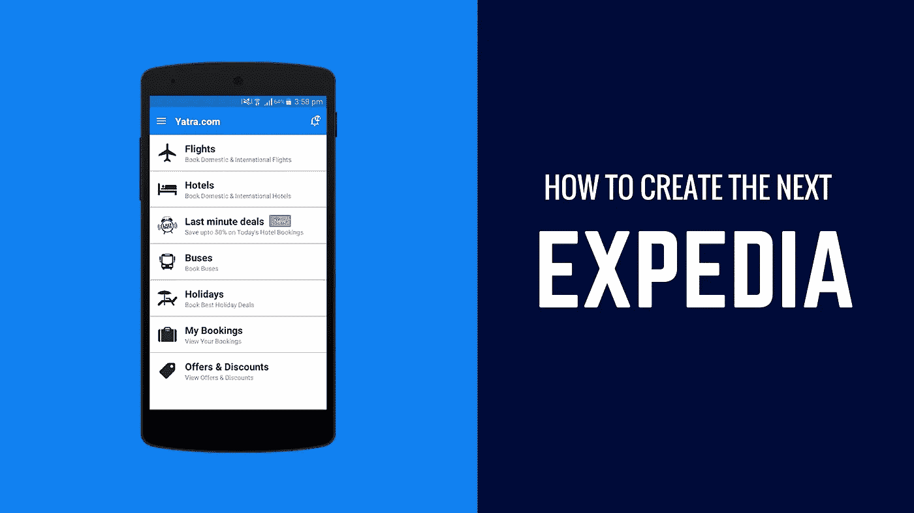

# 如何打造下一个 Expedia？

> 原文：<https://medium.com/swlh/how-to-create-the-next-expedia-8738d42cf5bb>

How To Create The Next Expedia?

数字革命是所有度假者都欢迎的运动。在今天的市场上，旅游业的真正赢家已经理解并接受了个性化服务的重要性。过去，计划一次旅行需要拜访当地旅行社，或者为更自信的旅行者购买一本好的旅游指南。今天，数字化给我们带来了选择。我们是自助旅行者的一代，寻找更便宜、更个性化的旅行方式。

对于旅游品牌来说，这意味着随着消费者期望的提高，你必须适应并变得更聪明。由于旅行本质上是移动的，您的用户会喜欢丰富他们旅行体验的移动应用程序。仅仅接近一家雄心勃勃要推出下一个 Expedia 的[旅游应用开发公司](https://www.cognitiveclouds.com/software-product-development-portfolio/mobile-travel-application-development-yatra)是不够的。这篇博客的标题在某种意义上有误导性。你不应该专注于创造下一个 Expedia，而是要建立你的品牌。思考是什么让你脱颖而出，你带来了什么价值？换句话说，考虑一下有助于你的旅游应用脱颖而出的特性。下面，我们写下了一些需要记住的事情，以及一些你可能想在应用程序中包含的特性。

# 需要考虑的事项:

# 1.了解你的目标用户

您创建旅游行业最佳应用程序的热情可能会影响您识别用户需求的能力。仔细看看你的人物角色的需求。这些人是谁？他们的收入是多少？他们更喜欢标准的旅游景点还是更喜欢探索未知的地方？在这里，你需要找出你的想法如何与你的客户的需求保持一致。你越了解你的听众，你的提议对他们就越有价值。

# 2.竞争对手研究

你的目标市场已经相当繁忙了。但是好消息是，关键的参与者通过提供他们的资源和数据库，已经把你从大量的工作中解放出来。例如，猫途鹰应用编程接口可以让你访问包括照片和评论在内的海量 UGC(用户生成内容)数据库。所以，确保你不会做额外的工作。

# 3.[选择合适的开发团队](https://www.cognitiveclouds.com/insights/how-to-build-an-offshore-software-development-team-with-an-outsourcing-partner/)

在与构建您的应用程序的团队的最初会议中，除了通常的研究，您在团队中做，观察交付团队如何帮助您基于市场趋势定义概念。他们如何确定项目里程碑？他们在帮助您找到最佳解决方案方面贡献了多少？所有这些都会让你很好地理解他们是否是合适的合作伙伴。

# 4.旅游应用货币化

通常情况下，旅游应用程序通过使用它们提供的服务来获得收入，如交通、住宿和旅游费用。除此之外，你还可以考虑更多的选择，比如直接流量佣金、广告、内置购买、订阅等等。

# 功能列表:

# 1.旅行路线生成器

这是最重要的特性，并且在某种程度上决定了你的应用程序的基调。所有的旅行应用程序都带有一个行程生成器。是什么让你的与众不同？一个有效的路线生成器只要求用户提及他们想去的地方，并根据用户的历史自动创建一个旅行计划。这就是个性化发挥巨大作用的地方。

实现所需的复杂算法是耗时的，并且必须正确完成，但这是一项有价值的任务。有了行程，用户应该能够添加自定义目的地，设置时间表，并存储电子机票和二维码。将您的预订服务与旅程相关联，尽量不要让您的用户手动将详细信息填入旅程。在一个应用程序中内置交通工具、酒店入住和忠诚度计划的选项是很好的。您的用户可能会有不同的应用程序来实现不同的目的，但是使用一个旅行组织者应用程序来实现所有这些目的要方便得多。

# 2.地理跟踪服务

不要在 GPS 定位服务的成功整合上妥协。你的旅行应用应该能快速获得 GPS 锁定，追踪你的位置，并快速获取结果。旅游应用程序导航服务的一个重要方面是它的离线工作能力。本地应用开发将确保您的应用即使在没有 wi-fi 的情况下也能运行良好。这个特性甚至在 MVP 和 beta 版中都是必要的。考虑添加基于位置的紧急服务，包括紧急电话号码和基于用户当前位置的服务。或者，他们可以推出一个像 HelpMe 这样的应用程序来应对紧急情况。

# 3.行程回顾和建议

允许你的用户回顾他们游览的地方，并在你的应用程序中与其他游客分享他们的经历。感谢对你申请的审查，没有什么比在一个非旅游景点发生更好的了。你促成的这些时刻有助于建立品牌认知度。这个市场的主要参与者之一是猫途鹰，他们为开发人员提供他们的 API，这意味着您可以考虑将这项服务集成到您的应用程序中。

# 4.语言翻译员

这是一个很难实现的功能，但是如果你能让它工作，你的旅行应用程序将会立刻成为你的最爱。在许多情况下，你的用户不会熟悉一种地区语言，如果它不是游客习惯的目的地，他们会很难沟通。像谷歌翻译这样的应用程序可以让旅行者扫描文本进行视觉翻译，翻译实时语音数据和书面文本。此外，如果你有时间和预算，可以更进一步，比如增加一个增强现实功能，可以翻译所有的街道标志。

# 5.天气预报

整合实时气候预报是个好主意。当旅行者创建他们的旅行路线时，它可以方便地提醒他们需要期待什么样的天气。看看像 AccuWeather 这样的应用程序，它可以显示世界各地大量地点的天气报告。它允许用户在计划旅行之前检查风速、云的形成模式、湿度和其他几个重要因素。你的应用程序甚至可以建议打包什么样的衣服。像这样的小接触能帮助你脱颖而出。您的开发团队可以随时利用任何一个免费的开源 API 将这一特性集成到您的移动应用程序中。

# 6.旅游杂志

在这里，我不仅仅是在谈论书面笔记，还包括照片和视频内容，甚至是音频记录。你的旅行日志甚至可能变成一个精彩的旅行者博客。

# 7.货币转换器

你的用户不应该只看你的旅游应用程序就能知道汇率。XE Currency 跟踪当前和过去的所有汇率变化，考虑将此功能集成到您的旅行应用程序中。

# 8.当地出租车和交通

考虑与当地的出租车服务合作，这对你的用户来说可能比优步更便宜。根据用户的预算建议公交路线、地铁服务和时间。此外，与当地出租车服务合作可能会成为另一个收入来源。事实上，优步为你推荐的每个用户支付稳定的费用，这对于一个成功的商业模式来说是一个非常好的主意。

# 9.洗手间定位器

像 SitOrSquat 和 Toilet Finder 这样的应用程序在旅行者中非常受欢迎，可以帮助他们在紧急情况下找到洗手间。考虑集成这些服务。

# 10.整合社交媒体应用

脸书、推特、Instagram 等实时社交媒体。让游客与他们的朋友和追随者互动，分享快照，体验，也让他们知道自己在哪里。

祝你好运。

## 这个故事发表在 [The Startup](https://medium.com/swlh) 上，这是 Medium 最大的企业家出版物，拥有 294，522+人。

## 订阅接收[我们的头条](http://growthsupply.com/the-startup-newsletter/)。

