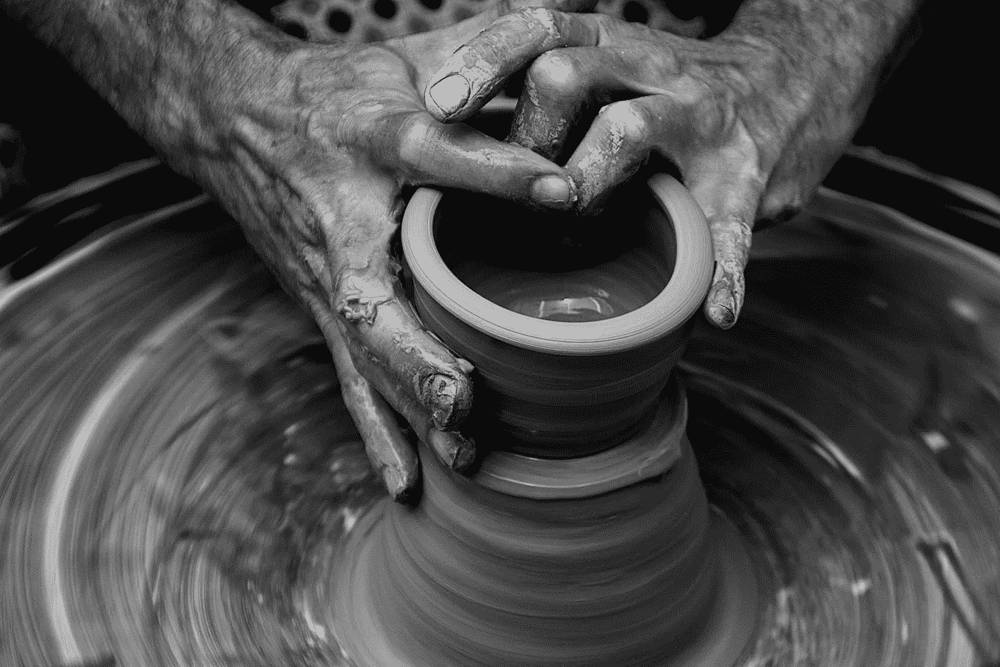
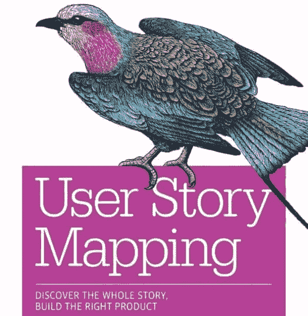
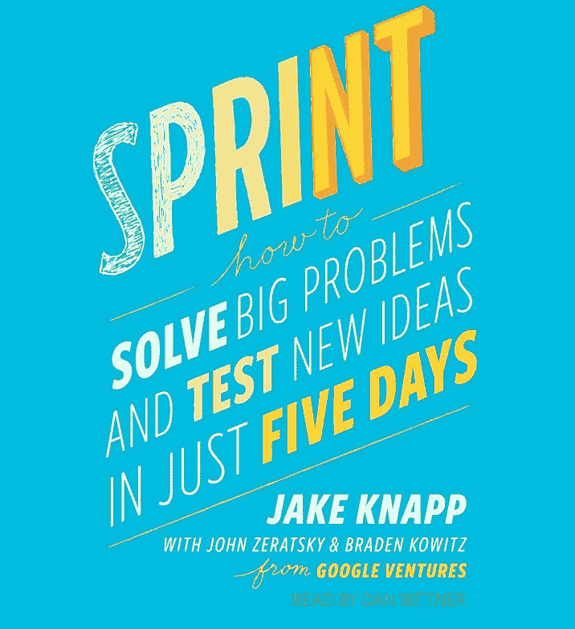
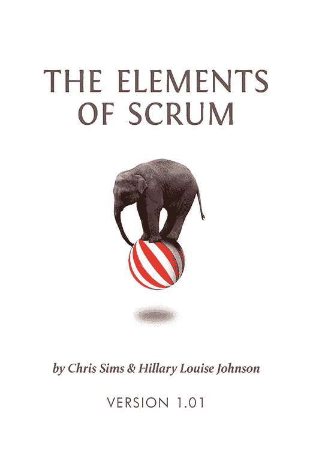

# 如何创建完美的产品开发流程

> 原文：<https://medium.com/swlh/how-to-create-the-perfect-product-development-process-2e6d3b72ce38>

## 打造一流产品开发实践的技巧和资源

您遵循的过程决定了您和您的团队开发产品的速度和质量。它包括所有的会议、规则、JIRA 会议、站立会议、仪式和其他构建，以确保项目在方向和进度上的一致性。它们有许多形状和大小——精益、Scrum、瀑布、XP 和看板——仅举几例。

完美的过程可以清除障碍，让每个人都集中注意力，并帮助根据项目在更广泛的战略中的位置来构建项目。

糟糕的过程会分散团队对工作的注意力，用过于严格的规则限制创造力，最终导致项目不成功。

记住这一点，关于完美的产品开发过程，首先要知道的是

> 没有完美的产品开发过程

没有一个过程会对每个项目、团队或团队成员都有效。完美是难以捉摸的，你能做到的最好就是更好。

那么，我们如何确保我们正在实施的流程按照我们的想法运行呢？

# 听听专家的意见…

如果说我在管理产品的过程中学到了什么的话，那就是我从来没有真正把握住自己真正知道的是多么少。

有大量关于各种产品方法的资料，了解一些基本知识很重要。我喜欢把工具和技术称为产品人员工具带中的工具——你建立的工具带越多，你就越有可能拥有应对特定挑战的工具。

敏捷宣言简要介绍了“敏捷”软件开发的起源。迭代、快速移动&打破常规、MVP——这些都是敏捷运动的产物。

从那里，你可能会去看看 Jeff Patton 的 [*用户故事映射*](https://www.amazon.com/User-Story-Mapping-Discover-Product/dp/1491904909/ref=sr_1_3?s=books&ie=UTF8&qid=1524150080&sr=1-3&keywords=user+story+mapping)*之类的东西，它精彩地阐述了团队可能使用的一些工具，以确保产品讨论围绕使用产品的人进行。*

*Jake Knapp(和 Google Ventures 的其他团队成员)的《冲刺》 ,是一个很好的例子，展示了一个团队在寻找你的产品的第一个版本时可以遵循的过程，这个版本将回答你关于产品/市场适合性的重大基础问题。*

# *…然后知道何时忽略它们*

**

*Photo by [Paula May](https://unsplash.com/photos/Ith2hdCBavo?utm_source=unsplash&utm_medium=referral&utm_content=creditCopyText) on [Unsplash](https://unsplash.com/search/photos/book?utm_source=unsplash&utm_medium=referral&utm_content=creditCopyText)*

*最终，有很多好书会告诉你产品**可以**发生的一些好方法。最终，产品**应该**如何发生并不是你能从书中学到的东西。没有哪本书知道你的团队、你的产品和你的组织的所有细微差别。*

*我们以 Scrum 为例。这是一个奇妙的方法论，我推荐克里斯·西姆斯的《Scrum 的元素 [*，但是它涉及了大量的仪式**(会议的花哨说法)。在实践中，我发现大多数团队认为“教科书式的 Scrum”不适合他们，他们找到了更精简的版本，更适合他们团队的风格。***](https://www.amazon.com/Elements-Scrum-Chris-Sims/dp/0982866917/ref=sr_1_1?ie=UTF8&qid=1524150662&sr=8-1&keywords=elements+of+scrum&dpID=41aevQHffWL&preST=_SY291_BO1,204,203,200_QL40_&dpSrc=srch)*

***成功最终源于对产品开发原则的理解，以及知道何时偏离这些原则。***

# ***实验和迭代***

***所以你决定实现一个特定的产品开发方法。你怎么知道它起作用了？你怎么知道它能正常工作呢？***

***当我们构建软件时，我们不断地支持迭代、观察、测量和重复的想法。这些相同的原则也适用于我们为创建软件而精心设计的过程。如果我们希望为我们的团队创建完美的流程，我们需要进行实验。***

***有很多很好的方法可以让你对你的过程做一些小小的改变，从而带来改变。我和我的团队已经尝试了结对编程，消除了票证分配、小型冲刺和 100%的便笺。有些成功了，大多数没有，这没关系！***

***关于我和我的团队所做的每个实验，我可以说的一点是，它们有助于让团队参与到关于我们当时实施的流程的优点的高质量讨论中，这提醒了我…***

# ***和你的团队谈谈！***

******

***回顾是产品人员工具箱中最强大的、未被充分利用的工具之一。用它！***

***在我作为产品经理的有限时间里，与我的用户交谈是一个产品成功或失败的最大决定因素。这看起来是显而易见的，但是你对用户了解的越多，你对他们如何体验你产品的各个部分的疑问就越少。***

***就像你的客户和用户消费你的团队创造的用户体验和产品一样，你的团队消费你创造的产品开发过程，如果你不与他们交谈，你永远也不会确定它是否得到了积极的体验。***

***面对现实吧，你的团队可能会比你有更好的想法，知道一个过程如何为他们工作。***

***感谢阅读！我是杰克·摩尔，我喜欢写关于产品的文章。***

******

## ***这篇文章发表在[《创业](https://medium.com/swlh)》上，这是 Medium 最大的创业刊物，有 318，983+人关注。***

## ***订阅接收[我们的头条新闻](http://growthsupply.com/the-startup-newsletter/)。***

******