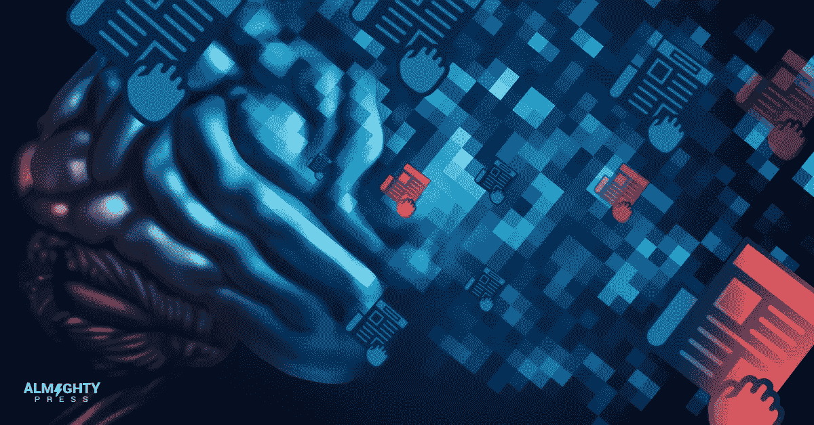
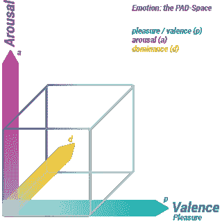
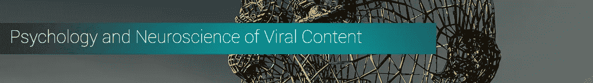
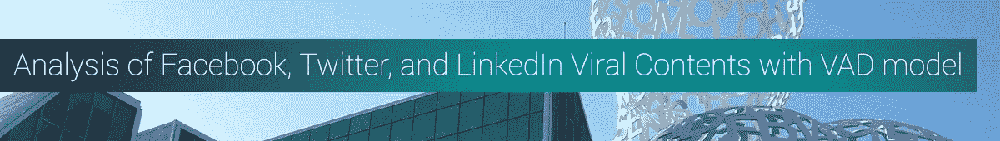
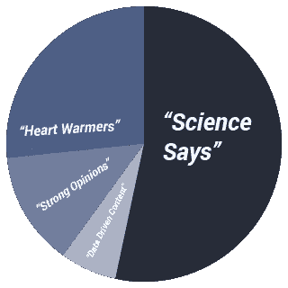

# 如何利用神经科学研究和过去的数据创建病毒内容

> 原文：<https://medium.com/swlh/how-to-create-viral-content-with-studies-in-neuroscience-and-past-data-d573eb7163eb>

斯坦福大学的市场营销教授、病毒专家乔纳·伯杰认为，病毒内容的关键在于情绪唤起，尤其是那些能唤起高度兴奋情绪的情绪，比如快乐或恐惧。然而，索邦大学的雅格布·斯塔亚诺和特伦托·罗斯大学的马尔科·古里尼的一项新研究发现,[价和优势](https://arxiv.org/pdf/1503.04723.pdf)在病毒内容中也起着重要作用。因此，不是只有“唤醒”，病毒的最新框架是价-唤醒-支配(VAD)模型。

斯塔亚诺和古里尼的研究发现，个体情绪对唤起感觉很重要，但可能不会导致病毒式传播。相反，这些情绪必须是属于 VAD 模型的情绪的良好组合[。其特点是:](https://hbr.org/2016/05/research-the-link-between-feeling-in-control-and-viral-content)

1.  效价:情绪的积极(如快乐)或消极(如恐惧)。
2.  唤起:从兴奋(如愤怒)到放松(如悲伤)。
3.  支配:屈从(如恐惧)于控制(如钦佩)。

该研究进一步揭示，有大量评论的文章很可能引发高唤起情绪(愤怒或快乐)，并与低支配情绪(恐惧)或高支配情绪(钦佩)配对。这三个特征中的两个或两个以上之间的配对是病毒式传播的关键要素，这是许多内容创作者经常忽视的。仅仅让一段内容引起愤怒或快乐是不够的，它还必须引起或多或少的控制感，以及它是否引起恐惧或钦佩。

**这是原理:**

化合价(正对负)

唤起(兴奋到放松)+支配(屈服于控制中的感觉)

在本文中，我们将使用 VAD 框架分析脸书、Twitter 和 LinkedIn 上十个最热门的帖子，该框架基于基于科学的病毒内容心理学，并有更深入的数据支持。最后，我们将提供如何应用这些研究成果来改进新的和可重复使用的内容的步骤。

**因此，本文的三个部分是:1)病毒内容背后的心理学和神经科学，2)使用 VAD 模型的分析，以及 3)应用发现来改进内容。**

**一:病毒内容的心理学和神经科学**

人类是有感情的生物。不管你多么相信你是基于理性做出决定的，你的感觉最终会引导你采取行动。

如果你认为“用心思考”是一个弱点，它不是。事实上，这实际上使我们[成为优秀的决策者](https://qz.com/922924/humans-werent-designed-to-be-rational-and-we-are-better-thinkers-for-it/)。

为什么？根据著名心理学家丹尼尔·卡内曼和阿莫斯·特沃斯基的说法，我们人类用[认知偏差](https://people.hss.caltech.edu/%7Ecamerer/Ec101/JudgementUncertainty.pdf)思考，意味着我们系统地做出违背清晰逻辑的选择。“不理智”不是弱点。相反，这是一个积极的特征，因为我们的大脑不局限于衡量事实。

我们的大脑基于我们过去的经验创造模式，这导致基于旧模式的构建、重建和解构的复杂的新模式。由于个人特征、过去的经历和性情，这些新的模式对每个人来说都是独特的和特定的。当这些信息被检索出来立即使用时，它将以“直觉”或“本能”的形式出现。这解释了为什么我们的“感觉”经常是正确的，并使我们成为更好的决策者。

然而，人类的这一特性使我们倾向于那些引起我们兴趣的事情。营销人员意识到了这一点，这也解释了为什么他们总是试图用各种营销策略来吸引我们的注意力，并把“击中我们的弱点”作为他们的目标一旦我们对某样东西感兴趣，我们就会追求它，这对他们来说意味着转变。

在内容营销中，理解转化为病毒式传播的故事是最终目标。越多的人接触到某种病毒式的想法，他们就会收到越多的流量，这最终会导致转化，增加他们的底线。因此，这种知识对企业来说是非常宝贵的。

最近的神经科学研究发现，人类的大脑是为故事[而生的](https://blogs.scientificamerican.com/guest-blog/it-is-in-our-nature-to-need-stories/)似乎可以回答每个营销人员的梦想。最后，我们确切地知道如何进行活动点击，这可以方便地用实时指标来衡量，如份额、RTs、视图、印象等。

人类需要故事主要是因为我们是社会动物，我们依赖他人生存和幸福。神经经济学研究中心的创始人、克莱蒙特研究生大学经济学、心理学和管理学教授保罗·j·扎克(Paul J. Zak)在他的书《信任因素:创建高绩效公司的科学》中写道，通过使用能激发他人善良、同情和移情的叙事，“黑客”让人们产生“信任激素”催产素。

很明显，讲好故事是我们生存和进化的关键。作为穴居人，我们依靠营火故事来了解我们的祖先、哲学、精神和生活技能。有了故事，我们被激励以特定的方式行动和表现，包括与他人合作，这对生存至关重要。同样的事情仍然发生在今天，互联网就像“营火”

[故事改变大脑](https://greatergood.berkeley.edu/article/item/how_stories_change_brain)，这是毫无疑问的。我们阅读的故事越多，我们在大脑中看到的变化就越多。

当我们被一个故事改变时，我们会改变我们的行为，这将改变我们的习惯。一个恰当的例子是，在麦当劳长大的孩子很可能一生都渴望麦当劳汉堡。这就是讲述正确故事的力量。

故事让我们建立新的神经元，最终改变大脑结构。有一项研究是关于小说或小说如何改变大脑中的连接性。

根据埃默里大学神经政策中心的神经科学家格雷戈里·伯恩斯的说法，“故事塑造了我们的生活，在某些情况下有助于定义一个人。”

战略营销人员将利用讲故事的最新神经科学发现来创造病毒式故事。随着内容营销中的讲故事已经进入主流，这一点已经很明显。我们经常意识不到一段 Youtube 视频实际上是在推广一种产品，因为我们已经被这个故事深深吸引了。

现在，我们来讨论一下内容营销和讲故事这种唤起情感和效价的碰撞在哪里。

斯坦福大学的营销学教授 Jonah Berger 提出了“6 个步骤”，这是“口碑营销”成功的关键。病毒式传播是“口口相传”的新面孔，是互联网的自然结果。

[STEPPS](https://curatti.com/viral-success/) 是社交货币、触发器、情感、公共、实用价值、故事的缩写。这六个元素必须存在于一个内容中，这样它才能“迅速传播”然而，病毒式传播的最佳标志不是这六个要素，而是第三个要素，即“情感”

**社交货币:**确保你的内容可以在脸书、推特、LinkedIn、Reddit 和其他社交媒体平台上轻松分享。在每一部分内容的战略位置和大小上共享按钮会有很大帮助。

**触发:**每一条内容都必须有你的品牌签名，以立即触发关于你的细节的记忆。渡渡鸟在他们的 Youtube 视频底部有渡渡鸟，Buzzfeed 有红色闪电标志，Christian Louboutin 鞋有红色鞋底，Lacoste 有鳄鱼标志。

**情绪:**乔纳·伯杰认为[高兴奋情绪](http://jonahberger.com/wp-content/uploads/2013/02/ViralityB.pdf)，如喜悦或恐惧，将是使内容病毒化的关键，因为大多数人会分享他们认为其他人必须知道的任何事情，无论是高度积极或高度消极的事情。九种有效的情绪是兴奋、敬畏、悲伤、愤怒、恐惧、惊讶、满足、快乐和厌恶。然而，索邦大学的雅格布·斯塔亚诺和特伦托·罗斯的马尔科·古里尼最近的研究发现,[化合价和支配地位](https://arxiv.org/pdf/1503.04723.pdf)在创造病毒内容方面也发挥着重要作用。因此，修改后的病毒框架将是价-唤醒-支配(VAD)模型。

**公开:**将您的内容公开，发布后立即分享给您的联系人。让你的品牌无处不在，包括各种社交媒体和其他在线平台。强大的个人品牌，比如加里·维纳查克、盖伊·川崎、卡戴珊和其他品牌，可以被商业品牌搭载，这将带来丰厚的回报。

**实用价值:**一个品牌或者一段内容要想成功，必须要有实用价值。出于内容营销的目的，亚里士多德的哲学是行不通的，除非你把它分解成实用的块，用真实的例子来完成。例如，一个关于索伦·克尔凯郭尔哲学的内容可能不会像病毒一样传播。然而，如果它的标题是这样的“索伦·克尔凯郭尔的 11 条生活经验会让你过上快乐和更充实的生活”，它就更有可能被广泛传播。

**故事:**最后，故事在传递情感内容方面发挥了重要作用，使其值得观看、阅读、分享、转发和链接。内容营销人员意识到了讲故事的力量，我们的大脑是如何适应它的，以及如果做得好，它将对品牌产生的影响。

**本部分的要点:**

1.  人类的大脑天生会讲故事，这是人类进化的一部分。
2.  催产素密封了大脑中的信任。因此，任何触发这种荷尔蒙流动的内容都有更高的成功几率。
3.  高唤醒情绪必须与优势混合在一起才能产生效价，从而导致病毒式传播。
4.  一条内容“准备好传播”有六个要素，但这些要素不是病毒传播的指标。

**二:用 VAD 模型分析脸书、Twitter 和 LinkedIn 的病毒式内容**

在这次分析中，我们使用了 BuzzSumo 在 2016 年收集的关于脸书上分享最多的帖子的数据，时代周刊在 Twitter 上有史以来最受欢迎的 10 条推文，以及 LinkedIn 自己关于 2016 年观看次数最多的 10 篇 Pulse 文章的数据。它们根据故事的类型和引发的情感类型来分类。

**脸书**

[BuzzSumo](http://buzzsumo.com/blog/go-viral-lessons-shared-content-2016/) 确定了 2016 年最受分享的 15 个帖子。

1.  [新的老年痴呆症疗法完全恢复记忆功能](http://www.sciencealert.com/new-alzheimer-s-treatment-fully-restores-memory-function)(600 万股)
2.  "[你的 OCD 雷达有多灵敏？](http://www.playbuzz.com/monicawoods10/how-sensitive-is-your-ocd-radar)(340 万股)
3.  科学认为第一个出生的孩子最聪明(280 万股)
4.  "[致支持唐纳德·特朗普的朋友的公开信](http://www.huffingtonpost.com/jeremy-nix/an-open-letter-to-my-frie_2_b_9293694.html)(220 万股)
5.  科学研究表明，秃顶男人更性感、更阳刚
6.  “[有偏见的陌生人带 DNA 检测](http://en.newsner.com/biased-strangers-take-a-dna-test-the-results-show-why-we-shouldn-t-judge-others-on-their-looks/about/family)”(210 万股)
7.  "[聪明的人往往更邋遢](http://www.businessinsider.de/intelligent-people-tend-to-be-messy-stay-awake-longer-and-swear-more-2016-8)(200 万股)
8.  "[女性需要更多的睡眠，因为她们的大脑工作更努力](http://twentytwowords.com/women-need-more-sleep-than-men-because-their-brains-work-harder-according-to-science/)(190 万股)
9.  "[这是斯坦福大学受害者大声读给袭击者的一封强有力的信](https://www.buzzfeed.com/katiejmbaker/heres-the-powerful-letter-the-stanford-victim-read-to-her-ra)(180 万股)
10.  杂货店里 4 岁的孩子称孤独的鳏夫老了(150 万股)
11.  "[科学家可能发现了一种能杀死 98%癌细胞的根](http://healtheternally.com/1562/dandelion-weed-can-boost-your-immune-system-and-cure-cancer/)(140 万股)
12.  旧音乐的销量有史以来第一次超过了新音乐(130 万股)
13.  这家充气爱尔兰酒吧把你的后院变成了酒吧
14.  "[这款黄油山核桃芝士蛋糕会让你的感恩节更加精彩](http://www.awesomehomerecipes.com/butter-pecan-cheesecake/)(130 万份)
15.  企鹅每年游 5000 英里，与救了它命的人重聚

病毒式传播的文章类型大多是以“科学说”的故事、数据驱动的内容、强烈的观点和政治文章以及暖心文章的形式撰写的。它们以数据支持的“观点”和“希望和灵感”叙述的形式传递。还有“给他们想要的”的励志故事。

**《科学说》**故事:1、2、3、5、6、7、8、11

**数据驱动内容:** 12

**强烈的意见和政治棋子:** 4、9

**暖心片:** 10，13，14，15

**有数据支持的观点:**

“科学表明第一个出生的孩子最聪明”(280 万人分享)

“科学研究表明，秃顶男人更性感、更阳刚”(210 万股)

“聪明的人往往更邋遢”(200 万股)

“女性需要更多睡眠，因为她们的大脑工作更努力”(190 万人分享)

“旧音乐的销量有史以来首次超过了新音乐”(130 万股)

**有数据支撑的希望和鼓舞:**

“新的老年痴呆症疗法完全恢复记忆功能”(500 万股)

“这是斯坦福大学受害者大声读给袭击者的一封强有力的信”(180 万份)

“杂货店里的 4 岁小孩称孤独的鳏夫老了”(150 万股)

“科学家可能发现了一种能杀死 98%癌细胞的根”(140 万人分享)

“企鹅每年游 5000 英里，与救了它命的人团聚”(88.9 万股)

**给予人们他们所期望的:**

“这家充气爱尔兰酒吧把你的后院变成了酒吧”(130 万股)

“这款黄油山核桃芝士蛋糕会让你的感恩节更加精彩”(130 万股)

现在，让我们分析一下被分享最多的内容，标题是“新的阿尔茨海默氏症治疗方法完全恢复记忆功能”，它被分享了五百万次。使用相同的框架，您可以分析任何内容，以衡量其可能的病毒式传播。

**VAD 分析:**

唤起(兴奋到放松)x 主导(屈服于控制中的感觉)=效价(积极到消极)

这篇文章引起兴奋吗？是的。

这让你觉得一切尽在掌握吗？是的。

它让你感觉积极吗？是的。

“是”的程度越高，它就越有可能像病毒一样传播开来，事实也确实如此。阿尔茨海默病的治愈给人类带来了很多希望。因此，兴奋程度和控制感达到最高水平。可以理解为什么它会像病毒一样传播。

**推特**

以下是根据[时间](http://time.com/4263227/most-popular-tweets/)统计的有史以来的十大推文。

1.  艾伦·德詹尼丝

1.  卡特·威尔克森

1.  路易斯·汤姆林斯

1.  丹尼·贾

在总统候选人佐科“佐科维”维多多期间，他的推文总共收到了 250 万条即时消息。

1.  卡米拉·卡贝洛

1.  巴拉克·奥巴马

1.  奥巴马总统

1.  亚当·萨利赫

1.  哈里·斯泰尔斯

1.  安德鲁·马尔科姆

现在让我们来分析一下艾伦·德杰尼勒斯最热门的推文。

艾伦·德詹尼丝

@TheEllenShow

要是布拉德利的胳膊长一点就好了。史上最佳照片。#奥斯卡

收到 343.98 万 RTs

**VAD 分析:**

唤起(兴奋到放松)x 主导(屈服于控制中的感觉)=效价(积极到消极)

这篇文章引起兴奋吗？是的。

这让你觉得一切尽在掌握吗？是的。

它让你感觉积极吗？是的。

“是”的程度越高，它就越有可能像病毒一样传播开来，事实也的确如此。为什么？显然，看着这么多明星看起来轻松愉快，这张自拍给了很多欢乐。尽管一条 tweet 只有 140 个字符，但 VAD 框架也适用于 Twitter。

**领英**

根据 [LinkedIn](https://www.linkedin.com/pulse/linkedin-top-voices-most-memorable-posts-2016-caroline-fairchild) 收集的数据，Pulse 的文章是 2016 年观看次数最多的前十名。这些文章大多是观点文章，由高管、创始人和专业人士撰写。

1.  [致客户的公开信:我们的武器政策作者:李维斯公司总裁兼首席执行官奇普·伯格](https://www.linkedin.com/pulse/open-letter-customers-our-weapons-policy-chip-bergh)
2.  [说到年龄偏见，科技公司甚至懒得撒谎](https://www.linkedin.com/pulse/when-comes-age-bias-tech-companies-dont-even-bother-lie-dan-lyons)，科技记者、Hubspot 研究员丹·莱昂斯
3.  伯尼·桑德斯说我们正在“摧毁美国的道德结构”。他错了。通用电气董事长杰夫·伊梅尔特
4.  [我的白人老板谈到了美国的种族问题，这就是所发生的事情](https://www.linkedin.com/pulse/my-white-boss-talked-race-america-what-happened-schumacher-hodge)作者曼德拉·舒马赫-霍奇，Kapor Capital 创始投资组合服务总监
5.  [为什么高盛鼓励员工在工作中谈论种族——为什么作为一名黑人女性，我认为这很重要](https://www.linkedin.com/pulse/why-goldman-sachs-encouraging-employees-talk-race-work-edith-cooper)作者:高盛人力资本管理全球主管伊迪丝·库珀
6.  我对亚当·格兰特《纽约时报》专栏的回应:除非你是奥普拉，否则“做你自己”是休斯顿大学研究教授布伦·布朗的可怕建议
7.  我离开了一个人们拍我马屁的职业——我对此再高兴不过了
8.  我知道你爱我，现在让我去死吧。
9.  彼得·泰尔违反了硅谷的核心原则
10.  [elle vest 首席执行官兼联合创始人莎莉·克劳切克在特朗普时代写给年轻女性的一封信](https://www.linkedin.com/pulse/letter-young-women-age-trump-sallie-krawcheck)

让我们来分析一下 LinkedIn 上被浏览 65 万次的最有影响力的文章:[致客户的公开信:我们的武器政策](https://www.linkedin.com/pulse/open-letter-customers-our-weapons-policy-chip-bergh)，作者是李维斯公司总裁兼首席执行官奇普·伯格

**VAD 分析:**

唤起(兴奋到放松)x 主导(屈服于控制中的感觉)=效价(积极到消极)

这篇文章引起兴奋吗？在一定程度上。

这让你觉得一切尽在掌握吗？在一定程度上，这种信息加强了对个人空间的控制。

它让你感觉积极吗？是，不是，以及两者之间的任何地方。

这篇文章的发表是为了回应一把枪在一家李维斯商店意外走火，打伤了一名顾客，这名顾客就是枪的主人。首席执行官向顾客保证，在他的店里买一条牛仔裤是安全的，因此不应该带武器。他尊重当地各种枪支管制法律，因此他只是“建议”而不是“命令”。总的来说，这是一篇有争议的固执己见的文章，引发了对枪支管制法、枪支安全法和公司武器政策自由裁量权的进一步讨论。枪支拥有和控制在美国一直是一个持续的争论，所以这篇文章来的正是时候

**本部分的要点:**

1.  关于脸书的病毒式故事是这些类型:“科学说”，数据驱动，强烈的意见和政治，以及暖心。
2.  关于脸书的病毒式数据支持的故事可以分为观点，“希望和灵感”，以及“给人们他们所期望的”
3.  Twitter 上转发最多的帖子是那些与大多数人相关的，给读者带来很多欢乐和希望的，强烈的观点，以及捐赠的 RTs。
4.  LinkedIn pulse 上点击率最高的文章是关于争议问题、性别问题、种族问题和核心原则的强烈观点。

**三:应用神经科学研究和过去的数据来改进新的和可重复使用的内容**

创建病毒式内容需要“为病毒式传播的机会准备好内容”的要素，以及高唤醒情绪、支配和效价(VAD 框架)的内在成分。六个“准备好”要素包括步骤(社交货币、触发器、情感、公共、实用价值和故事)。讲故事本身已经作为一种进化中的生存工具嵌入了人类的大脑。

内容营销人员的工作是在包含高 VAD(效价=唤醒+支配)水平的内容中准备 STEPPS 框架。

下面是七个步骤，你可以用来准备一个新鲜的或可重复使用的内容，增加病毒传播的机会。

1.  大多数人更喜欢看起来好(积极的)而不是坏(消极的)，因此你需要准备好积极的内容。因此，内容片段需要具有这种内在价值。这解释了为什么脸书测验通常会让人“看起来不错”分享积极的内容会增加分享者的正面形象，因此在创作内容时要记住这一点。
2.  不管你的产品形象是什么，把它和上面的第一点联系起来。换句话说，形象和价必须是积极的，都必须创造一种强烈的情感。例如，耐克、可口可乐、迪斯尼和苹果都是情感品牌。它们会引发成就感、喜悦感、幸福感和棒极了的感觉。耐克的病毒内容之一是关于 80 岁的[姐姐麦当娜·布德](http://news.nike.com/news/unlimited-youth-sister-madonna-buder)，她是一名铁人三项运动员。这个 [Youtube 视频](https://www.youtube.com/watch?time_continue=3&v=UEhKxszMd70)提醒人们去尝试，就像这位资深修女所做的那样“去做”。
3.  认识到从内容中唤起的感情。询问几个人，记下他们的感受。真的能唤起快乐吗？或者，也许是敬畏？
4.  计划如何公开您的内容。最简单的方法是在你的公司网站上创建一个博客板块或登陆页面。接下来，你将如何传播博文或登陆页面？
5.  确保内容有实际的实用价值。例如，学术期刊上的理论和研究成果对教授和研究生来说意义重大，但对街上的杰克或吉尔来说可能意义不大。你的工作是确保重要的信息可以立即用于改善某人的生活、职业或业务。
6.  确保内容以故事的形式呈现，这些故事可以是数据驱动的、坚持己见的、温暖人心的、给人希望的或任何有价值的东西。当然，要构思一个好故事，需要[精通讲故事。](https://hbr.org/2003/06/storytelling-that-moves-people)
7.  只要有可能，就创作反映个人经历的故事。因为找不到更好的词:让它听起来像是针对个人的。请记住，人类是讲故事的动物，当信息以故事的形式呈现时，他们的大脑工作得更好。越私人越好。

在他们的[期刊文章](https://www.jstor.org/stable/pdf/40575201.pdf)“通过压制保密

两位研究心理学家 Adam L. Alter (NYU)和 Daniel M. Oppenheimer(普林斯顿)发现，人们倾向于在网上分享很多东西，以此来治愈自己，阅读这些自白的人也会感到有所帮助，因为他们可能会感受到宣泄的品质。

**本部分的要点:**

1.  人类首先是人类，不管技术有多先进，包括互联网。
2.  人们通过故事与他人联系，这也是一种宣泄。
3.  使用 STEPPS 和 VAD 框架开发病毒内容。

总之，任何拥有正确框架和讲故事技巧的人都可以开发病毒式内容。将病毒元素与强烈的情感品牌相结合将会产生爆炸性的病毒内容。通过正确的实践，创造病毒式内容的技巧对于内容营销者和所有作家来说都是无价的。

来源: [http://blog .全能. press/how-to-create-viral-content-with-studies-in-neuroscience-and-past-data/](http://blog.almighty.press/how-to-create-viral-content-with-studies-in-neuroscience-and-past-data/)

## 这个故事发表在 [The Startup](https://medium.com/swlh) 上，这里有 258，400 多人聚集在一起阅读 Medium 关于创业的主要故事。

## 订阅接收[我们的头条新闻](http://growthsupply.com/the-startup-newsletter/)。

