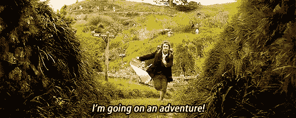

# 如何培养你最重要的关系:与自己的关系

> 原文：<https://medium.com/swlh/how-to-cultivate-your-most-important-relationship-the-one-with-yourself-735da199a59c>

我最崇拜的榜样之一黛安·冯·芙丝汀宝，这位传奇的时装设计师和女商人，在她的[大师班](https://www.masterclass.com/classes/diane-von-furstenberg-teaches-building-a-fashion-brand/enrolled)课程中分享了以下建议:

# “你生命中最重要的关系是你和自己的关系。因为无论发生什么，你都会一直和自己在一起。”

—黛安·冯·芙丝汀宝

和自己的关系，就像任何关系一样，是艰难的，充满了许多起起落落。然而，如果不小心照料它，过上充实的生活是不可能的。为什么？

1.  **只有你自己才能弄清楚你想要什么，一旦你知道了，没有人能把它从你身边夺走。**

Figure out how the best badass version of yourself feels in the future: work towards that

尽管很难，但理解我们想要用我们被赋予的生命做什么是一项极其重要的任务，我们要对自己负责。我们很多人指望其他人，比如我们的老师和父母来告诉我们应该做什么，或者我们允许社会压力和我们感知的才能把我们推向一个或另一个方向。

事实是，没有人知道你应该做什么——也不一定在于你天生擅长做什么。

你的工作是弄清楚你想从生活中得到什么。这可能是广泛的，并将随着时间的推移而演变，但它可能基本上是不变的。如果你知道你真正想要的是什么，你可以一直朝着那个方向努力，并在你的旅程中检查自己。

弄清楚你想从生活中得到什么:一百万美元？对你的社区产生影响？一个家庭？

这对你来说意味着什么？哪些是你优先考虑的？

然后，问问自己如何采取措施实现它。假设你想治愈癌症或者成为下一个伟大的说唱歌手。也许你今天不会找出理想的医疗仪式，但你可以开始研究如何解决这个问题。明天你可能不会在麦迪逊广场花园表演，但是你可以从今天开始写第一首说唱或者联系制作人。

迈出第一步后，如果你不断地问自己是否在朝着你想要的方向前进，你就能让自己保持在正确的轨道上。

一旦你知道你想要什么，并且坚信你正在努力实现它(不要欺骗自己，确保你在正确的轨道上)，没有人能把它从你身边夺走。你会感到与你的欲望和工作有着难以置信的联系。很难被毒品和酒精成瘾之类的恶习分散注意力，陷入错误的工作或行业等等。当你知道自己想要什么的时候。

别人的评论和观点不会有影响，因为他们不是你，你走的是自己的路。

**2。不先爱自己，就没有健康的关系。**

Preach.

除非你理解并与自己建立起爱的关系，否则你无法体验到爱的真正美丽。

一旦你这样做了，你就有了正确的理由去爱，你选择只把你的爱给那些能够接受它并促进你幸福的人。

当我们与自己的关系不好时，我们经常会发现自己处于虐待或不健康的关系中。当我们自己没有成就感时，我们可以(有意识地或下意识地)合理化这些关系是我们应得的，或者它们是好的。

此外，当你接近自己时，你在与人交往时会更真实——家庭成员、朋友、重要的人等。这让你关心的人因为你而爱你*，而不是因为你对自己的身份感到不舒服而产生的一种想法。*

***3。我们独自来到这个世界，也将独自离开。(病态却真实。)***

**

*我真心希望你死的时候身边有你爱的人真心珍惜你。这并不能抹杀这样一个事实:无论多么幸福或悲惨，我们都会在生命中的某个时刻死去。当我们离开这种生活的时候，你不会后悔没有善待自己，没有善待自己的需求。*

*更进一步，我们永远不知道此生会失去什么。我们的父母总有一天会离开我们，我们的宠物会离开我们，我们所知道的很多东西会在一瞬间消失。通过这一切，你必须为自己建立一种强烈的爱，以度过每个人都将面临的困难时期。*

*其他人可以帮助安慰你，但在一天结束时，你有责任振作起来。*

***4。你和自己的关系决定了你变得多无私***

**

*当你与自己不和时，你真的很难专注于积极影响他人和向世界传播善意。*

*全心全意爱自己是一种服务行为，因为它会立即转化为世界上的正能量。*

*你会希望对人更友好，回报你的社区，尽可能多地服务。*

*你服务的越多，得到的回报就越多！这是一个双赢的局面。*

*怎么才能开始培养自己和自己的关系？*

1.  ***独自做事。***

**

*独自做事这个简单的行为具有难以置信的力量。当你独自完成一项任务或一项伟大的成就时，你与自己建立了联系，就像你与一个有着美好共同经历的人建立了联系一样。更进一步，你变得更强大，更自信，更明白自己是谁，这感觉很神奇。*

*这里有两件事我恳求你试着独自去做:*

***公共场合独自吃饭:***

*很多人对独自在餐馆或自助餐厅吃饭有负面的偏见。如果你避免一个人吃饭，我建议你多吃点。变得适应，让你独自吃饭的时候感觉像和朋友一起吃饭一样有趣和正常。*

*我喜欢在约会时带自己出去吃饭。周六晚上去餐馆，为自己点餐，享受安静的时光是我的强项——尽管我也喜欢和我的男朋友、朋友和家人在一起。*

*在大学里，我更喜欢一个人吃午饭。它给你时间清理你的头脑(赶上你自己！)并反思。*

***独自旅行:***

*我喜欢一个人坐飞机去一个新地方的感觉。这是令人难以置信的解放，这是一个强烈的提醒，当动荡发生时，你作为一个人是多么自给自足，你必须安慰自己。*

*一个人在一个新的地方也是令人振奋的。当你只有自己可以依靠的时候，保证你能克服新的挑战，有新奇的体验。*

*如果你不能出远门，试着自己在家附近进行短途旅行。独自去博物馆、花园或附近的城市。你会很高兴自己有了发现新事物的经历。*

***2。变得经济独立。***

**

*在经济上独立于你的父母、配偶或其他任何有钱人是令人难以置信的。如果你也能在经济上独立于传统工作，那就更令人兴奋了。*

*当你在金钱上依赖别人时，你依赖他们不仅是为了你的幸福，也是为了投资你的未来。经济独立让你觉得自己的生活在你的掌控之中:你可以让自己得到庇护、安全、食物和温暖。*

*此外，你拥有的任何额外的钱都是你的，你可以花掉，存起来，或者投资于未来。你可以随心所欲地使用自己的钱，而且，显而易见，这是一项成就，它将帮助你每天都感到更加自信。*

*你怎样才能在经济上独立？努力工作。获取一技之长。推销你的服务。打造产品。卖掉它。找份好工作。搞清楚什么才是适合自己的(回到文章顶部)。*

***3。为自己设定意图。***

**

*你应该为自己设定目标，并每天提醒自己。写下来。记住它们，像念咒语一样在脑海中重复。*

*没有我们正在做的事情的意图，我们看不到我们是谁，我们为什么做我们正在做的事情，以及，听起来很悲伤，我们为什么活着。*

*有一个燃烧的目标会帮助你起床，在困难时期坚持下去，并给你为你想要的东西而努力的焦点和动力。*

***4。学习如何自我保健和抚慰。***

**

*还记得我说过的孤独的出生和死亡吗？因为这个原因，你学会如何照顾自己是很重要的。*

*一些自我保健项目应该是习惯:每周锻炼几次，为你的身体吃得好，经常写日记，等等。制定一个自我保健的程序，帮助你在一周内持续不断地重新启动自己。*

*第二部分是自我安慰。每个人都应该为自己制定一个危机管理计划。*

*如果发生了不好的事情怎么办？你失去了一个朋友，你的老板随机解雇了你，你失去了一条腿——但愿不会如此，或者你感到沮丧——你将如何处理这些情况？*

*为这种可怕的时刻制定一个行动计划。通过采取行动，而不是让危机吞噬你，这将有助于你专注于自我安慰。*

***5。挑战自我。***

**

*为了更好地了解自己，不断挑战自己。*

*通过将自己置身于不舒服的新环境中，你会比总是做同样的事情更彻底地了解自己的需求和痛点。*

*历史上伟大的企业家和其他英雄总是挑战自己。甘地通过禁食和放弃物质欲望做到了这一点。埃隆·马斯克让他的公司的目标越来越大。塞雷娜·威廉姆斯从未满足于她目前的网球精准水平。*

*挑战你自己，坚持多锻炼几分钟，为你喜欢的事情多工作一小时，一周不吃糖，等等。*

*这些挑战自我的小行为积累起来会让你对自己有更多的了解，让你成为一个更强大、更坏的人。*

*感谢您的阅读。*

*如果你喜欢你读的东西，想成为 badass 社区的一员，请在 Instagram 和 Twitter 上关注我:@jackieo_nyc，并在 YouTube 上订阅我的频道。*

*请在下面的评论中让我知道你在做什么来改善你和自己的关系！*

**

## *这篇文章发表在[《创业](https://medium.com/swlh)》上，这是 Medium 最大的创业刊物，拥有 277，994+读者。*

## *在这里订阅接收[我们的头条新闻](http://growthsupply.com/the-startup-newsletter/)。*

**