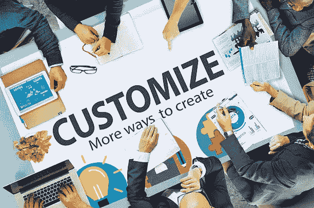
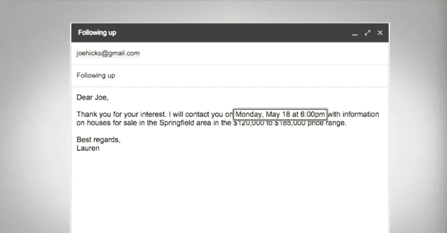

# 如何定制体验以提高业务绩效？

> 原文：<https://medium.com/swlh/how-to-customize-experience-to-improve-business-performance-28a97f392852>

为什么咖啡师在你开口之前就知道你要点什么。

Photo by [Brooke Cagle](https://unsplash.com/@brookecagle?utm_source=medium&utm_medium=referral) on [Unsplash](https://unsplash.com?utm_source=medium&utm_medium=referral)

> 定制的体验让人们想成为你的顾客。

多年来，个人接触的概念一直是非常有效的销售策略。研究表明，知道并使用顾客的名字，了解他们的偏好，将有助于你完成销售。

幸运的是，今天的数字世界为营销人员提供了大量数据，并为营销人员提供了比以往更多的方式来个性化客户的购买之旅。

以下是定制后续沟通的一些技巧。

# 分割

根据客户信息，将你的营销列表分成几个部分。

你的细分应该包括:**地理、兴趣、性别、收入和销售线索来源。**

这些只是一些例子，因为细分实际上取决于您的业务、您从销售线索表格中收集的数据以及您随着时间的推移从客户那里收集的信息。

**一旦你将你的列表分组，你就可以根据他们的个人资料创建有针对性的内容。**

假设你是一家电子商店。你可以发送有关相机的信息给某个最近搜索过的相机。您可以将最新的手机信息发送给之前对手机感兴趣的人。

> 通过细分定制体验只是一个开始。通过以全新的方式使用您的数据，您可以进一步实现个性化。

# 动态/智能内容

电子邮件主题或邮件正文中的个性化信息。

最简单的例子可以是更改人名。这里有一个更复杂的问题。

Screenshot from Lynda.com

这封电子邮件使用智能内容通过包括这些信息:**姓名/联系日期和时间/城市/价格范围**。

当然，你需要改变或定制的具体部分取决于你的行业、产品和许多因素。

使用智能内容的另一种方法是只改变邮件的一部分，其他部分保持不变。这样的话，你只需要发一封邮件，而不必一次又一次地做同样的修改。

> 随着你的业务增长，这是一个很好的方式来提供个性化的内容，而不必扩大你的营销团队太多。

因此，我们练习了根据潜在客户数据和兴趣定制跟进活动，**但为什么要经历这么多麻烦呢？**

> 总之，个性化是有用的。研究表明，它将电子邮件的点击率提高了 14%，转化率提高了 10%。

我不能否认这些数字。

# 在这里找到更多我的故事！

# 顺便说一下，👏🏻*鼓掌*👏🏻如果你喜欢这篇文章，请举手(高达 50 倍)。它鼓励我坚持每天写作，并帮助其他人找到它:)

## 这篇文章发表在《创业公司》杂志上，这是 Medium 最大的创业刊物，有 317，629 人关注。

## 订阅接收[我们的头条](http://growthsupply.com/the-startup-newsletter/)。

