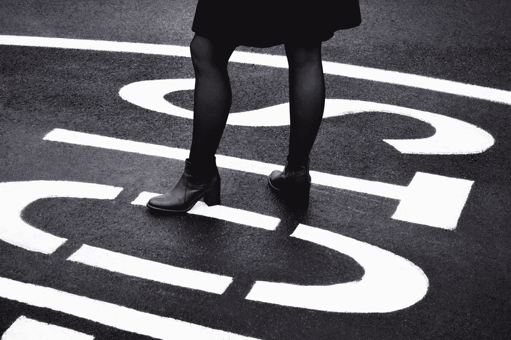

# 如何减少“思考”

> 原文：<https://medium.com/swlh/how-to-cut-down-the-think-5270847d5fad>

## 对内向者最糟糕的“最好的朋友”施以“暂停”,开始变得更有效率

[Source](http://"woman standing on black asphalt road" by Chris Barbalis on Unsplash)

作为创意者，尤其是内向的创意者，我们经常陷入可怕的“过度思考”通常，我们都这样做，内向的人和外向的人都一样。但是我们内向的人才是真正的主人。