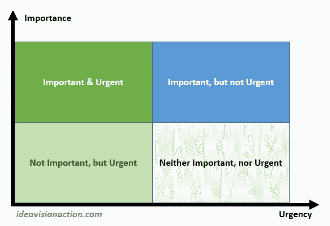

# 如何处理铺天盖地的待办事项清单，克服拖延症

> 原文：<https://medium.com/swlh/how-to-deal-with-an-overwhelming-to-do-list-and-overcome-procrastination-6f093da55d13>

[moshehar/pixabay](https://pixabay.com/en/dog-cute-animal-pet-puppy-looking-3071334/)

我有一个有限责任公司，它在每个季度开始时在我已经很忙的日程安排上增加了一堆管理任务。有时候，这段时间的工作量太大了，我很想拖延时间。今天，我想和大家分享我是如何处理那些不知所措和拖延的感觉的。

管理一个庞大的待办事项列表的第一步是把它分成艾森豪威尔矩阵。在左上角，我们有重要和紧急的任务。在右上方，重要但不紧急的任务。左下方，紧急但不重要。右下方，不急也不重要。

[The Eisenhower Matrix](https://ideavisionaction.com/personal-development/how-to-deal-with-an-overwhelming-to-do-list-and-overcome-procrastination/)

**从重要和紧急的事情开始**

显然，此时此刻的管理任务是重要而紧迫的。他们获得最高优先权。自从，我每天发表一篇博文，那也去左上。还有其他任务，其中一些很重要，但管理任务和写博客比其他任务更重要。

我在 Evernote 上写下我必须做的每一项任务。这样，我确信我不会忘记他们。然而，我的注意力将集中在我的重要和紧急的清单上，直到这个清单完成。我知道我会继续完成剩下的任务，因此，我不需要担心它们。

无论何时，当我想做一件重要而紧急的事情之外的事情时，我会放弃这种冲动。在这些忙碌的时候，[放手是我需要锻炼的一项重要技能](https://ideavisionaction.com/personal-development/how-long-does-it-take-to-let-go/)。

**避免拖延和一心多用的冲动**

忙碌时的另一个陷阱是开始尽可能多的任务。当我们看到待办事项列表中的所有任务时，我们会感到害怕。为了处理这种感觉，我们开始尽可能多的任务。不用说，无论是一次开始多项任务，还是多任务处理都不会提高我们的工作效率。相反，它们损害了我们的生产力。

> 无论你开始多少任务，也无论你并行执行多少任务。重要的是你完成了多少任务。

处理庞大的待办事项清单很简单。你只需在你的待办事项列表中选择最重要和最紧急的任务，并努力完成它。完成一项任务的最好方法是全力以赴，直到完成。

这很简单，但不容易，因为你会担心剩下的任务。结果，你可能会忍不住从一个任务跳到另一个任务，却没有完成任何一个任务。

**处理长长的待办事项清单的五个技巧**

每当你感觉到那些担忧和诱惑，就让它们过去吧。首先，**写下你所有的任务**。这保证了你以后会回到他们身边。第二，提醒自己完成待办事项清单的最好方法是**一次专注于一项任务**。

**给你手头的任务分配一个持续时间。目标是在指定的时间内完成你正在处理的任务。这样，你就会知道你有足够的时间去完成你的待办事项。此外，给你的任务设定一个截止日期会用一个微小的挑战来激励你，就像每周目标激励你一样。**

承诺给自己一些休息时间。如果你有一个看起来没完没了的待办事项清单，你很难有动力去开始它。结果，你可能会拖延。为了克服这种感觉，给自己一些休息时间，无论是晚上还是周末。

**通过完成一项任务来积累动力，不管它有多小。这听起来可能与从最重要、最紧急的任务开始相矛盾，但这是一个帮助你打破拖延模式的小技巧。一旦你完成了一项任务，你会有动力去完成更多。你完成的越多，你就越有动力去完成更多。**

**结论**

有时候，我们会被长长的待办事项清单淹没。为了处理这种感觉，我们要么拖延，要么从一个任务跳到另一个任务，却没有完成任何一个。你可以做一些事情来克服压迫感和拖延感。

*   写下所有需要完成的任务。
*   从手头最重要、最紧急的任务开始。
*   一次只专注于一项任务。
*   给任务分配一个持续时间，并挑战自己在该持续时间内完成任务。
*   承诺给自己一些休息时间。
*   如果你想拖延，通过完成一个小任务来打破这种感觉。

***如果你觉得这篇文章很有价值，注册*** [***每周简讯***](https://ideavisionaction.com/email-newsletter/) ***就可以收到我关于创业、企业家精神、领导力和自我提升的文章综述。***

## 这篇文章发表在《创业公司》杂志上，这是 Medium 最大的创业刊物，有 312，822 人关注。

## 订阅接收[我们的头条新闻](http://growthsupply.com/the-startup-newsletter/)。

