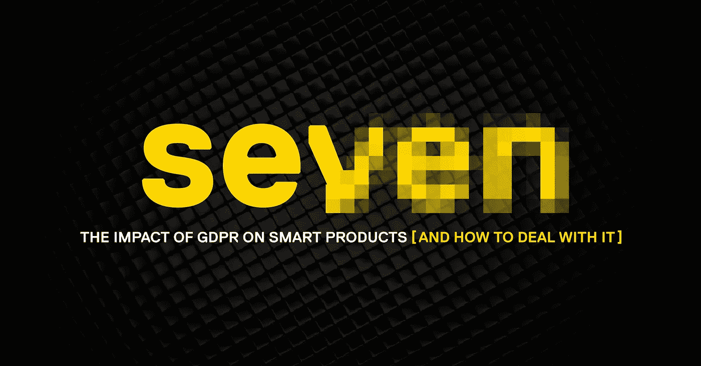
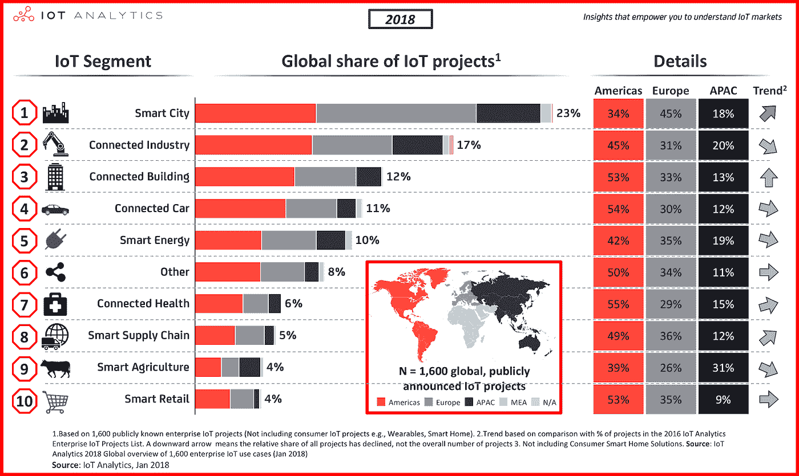
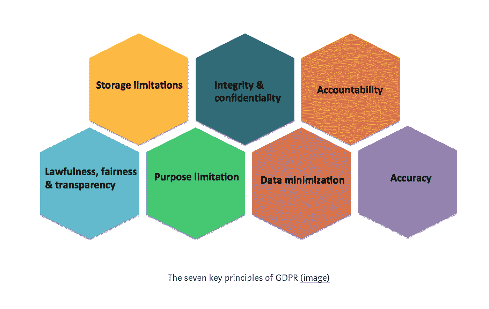
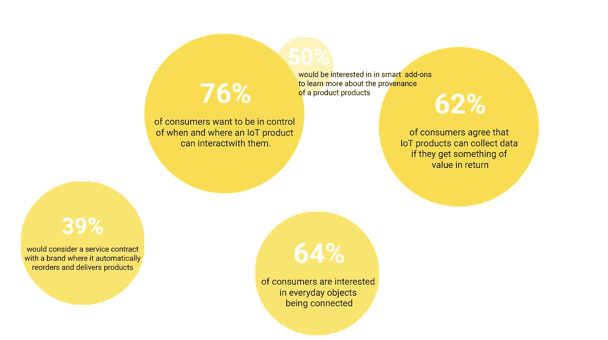

# GDPR 对智能产品的影响

> 原文：<https://medium.com/swlh/how-to-deal-with-gdpr-for-smart-product-design-c71d4986f1f8>

## 【以及如何应对】

在过去几周你的收件箱收到大量 GDPR 垃圾邮件后，我相信你已经意识到新法案的全球影响。但是你有没有花一分钟考虑一下这对设计和创新的世界意味着什么？

我们都听说过物联网，以及智能设备、智能冰箱和一系列智能包装。据估计，到 2022 年，将有不少于 290 亿台设备被连接。据 [research](https://www.smitherspira.com/industry-market-reports/packaging/active-intelligent-packaging-to-2023) 称，2018 年，主动和智能包装的总市场价值将达到 56.8 亿美元，这些数字清楚地表明，公司和客户都在寻求基于数据的产品。

**1:智慧城市& GDPR**

太好了！但是，5 月 25 日生效的《一般数据保护条例》或 GDPR 隐私立法，让企业有些不清楚如何提供客户需要的个性化产品。由于无形且无处不在的智能城市技术，通常很难获得自由和知情的同意。2017 年，ENISA 发表文章称，没有“物联网设备和服务信任的法律指南”。然而，GDPR 法规本身明确将常用的 RFID 芯片作为识别技术的一个例子，这取决于该技术的使用方式，这可能会影响一系列智能产品。

Source IoT Analytics 2018

**2:你为什么要在乎？**

在一个一切都是智能的、联网的、可跟踪的、与其他一切都相连的世界里，很难跟踪我们所有数据的去向。《GDPR 规则》的目的不是阻止使用数据，而是创造更多的透明度，从而建立更多的信任。这些规则侧重于了解您的隐私敏感数据来自哪里，谁在使用它，它是如何被使用的，以及在发生隐私侵犯时能够有效地做出响应。

Source: NewCo Shift

以可穿戴技术中的 RFIDs 为例，无论它们如何服务于客户自身的利益，它们也会带来潜在的隐私风险。当涉及到药物提醒和危险的心跳时，你的智能手表可能是一个救命稻草，但当这些信息被泄露给心怀不轨的人时，它也会带来巨大的风险。此外，超过一半的智能产品会收集各种各样的数据，而这些数据对于产品的运行并不是必需的。这同样适用于你的智能包装，通过你最喜欢的奶酪的眼睛来看世界，或者通过简单地挥动你的手机来获得各种各样的顶级食谱，这是非常有趣的。然而，所有这些互动也给包装公司提供了一个额外的深入了解消费者行为的金矿。

收集这些数据时，通常不知道正在跟踪什么，也不知道哪一方可能会收到这些信息。因此，你可能会向那些试图将“用户行为分析”应用到你的私人家庭生活中的公司透露大量关于你的活动和偏好的信息，这令人不安。

作为设计师，我们该如何处理这个问题呢？

首先，应该明确区分连接到互联网的智能产品和没有连接到互联网的智能产品。如果数据不是远程发送的，隐私和安全问题会更加有限。尽管如此，规则很简单，许可必须明确给出，消费者需要提供肯定的行动，并且许可必须是自由给出的，具体的和明确的。

现在轮到我们，设计师，来确保我们提供清晰和用户友好的许可表格。此外，我们应该避免不必要的风险，并通过确保产品只捕获对其运行绝对必要的数据来停止滥用我们的权力。

不要害怕诚实，统计数据显示，消费者非常乐意分享他们的数据，只要他们知道这些数据的用途，并最终使他们的生活更轻松。此外，许多专家确实认为，更严格的隐私要求可以改善客户体验。它给品牌一个与客户建立信任关系的机会。

**4:避免挫折，保持透明**

我们都知道这种感觉:你刚买了一台华而不实的新冰箱，希望它能让你的生活变得更加轻松。但是，事实证明，你不能使用它的任何功能，除非你同意让它访问你的所有数据。即使你觉得这样做不是特别舒服，你似乎也没有太多的选择。或者想象一下这个非常有趣的智能牛奶包。你把它带回家给孩子们玩，但事实证明，你首先需要登录脸书才能进入游戏。你能想象那种刺激吗？

没有人喜欢回家时对最近购买的东西兴奋不已，然后发现新买的东西需要访问大量令人不安的个人信息时，感到沮丧。那么，在购买产品、带回家并进行设置之后，为什么你必须在以后发现，它会请求你的许可来收集和使用你的个人信息，以便能够使用它的任何未来？

制造商应该确保他们清楚数据将被收集的事实。不了解一个产品能做什么或不能做什么，不了解一个产品能做什么，将会产生负面的用户体验。例如，它们可以向消费者发出某种警告，帮助你决定(在购买前)分享个人信息的舒适度。例如，智能包装可以说:“本产品将要求您创建一个个人在线帐户，以便访问所有功能，”或者，“本产品将要求您允许收集个人信息，以便使用！”这将符合新的规则，并非常类似于其他公认的包装披露。

**5:匿名**

由于无形且无处不在的智能城市技术，总是很难获得同意。然而，公司可以采取各种措施来确保他们遵守。例如:

答:这项技术的控制者可以确保所有数据都是匿名的，如果可能的话，允许用户查看他们的数据。

b:确保您有明确的策略来保护数据:

*   通过进行独立的安全审计来识别漏洞。
*   实施强加密标准(HTTPS / TLS ),这样就不会有任何个人信息通过不安全的通道发送或以不安全的格式存储。
*   确保你有好的元数据。如果你存储的个人数据遭到破坏，元数据可以提供文件的创建日期、被黑数据库的名称以及数据泄露发生的时间等信息。

**6:保持用户友好**

在一篇关于人们如何感知智能环境并与之互动的研究综述中，研究员 Eija Kassinen 和她的合著者表示，“如果用户不理解智能产品，他们就会失去对智能产品的信任和满意”。许多设计未能弥合看似显而易见的东西和现实中实际发生的事情之间的差距。

你可以拥有最复杂的应用程序或设备，但客户需要了解它才能成功。因此，目标是以一种非侵入性的方式清楚地告知用户，一个产品能够做什么，它当前正在做什么，并使用户容易获得选项或建议。

让它对用户友好的三个技巧:

答:互联产品的设计师和工程师应该尽最大努力为物联网系统创造一个统一的环境。换句话说，他们应该将不同的独立组件集成到一个一站式解决方案中，而不损失功能和可靠性。

b:设计师拥有的最强大的工具是熟悉的概念。不要让它变得比需要的更复杂，而是以熟悉为目标。过于聪明的设计可能不会被用户理解，而基于本能的设计实际上是可行的。

c:要防猴子的。当涉及到按钮和界面时，要确保它们的用途非常清楚。对你来说似乎很合理的东西，对消费者来说可能不是。所以在投入生产之前，测试你的原型，看看人们实际上是如何使用它的。

**7:发现机会**

引用威廉·阿瑟·沃德的名言:“机会就像日出。如果你等得太久，你就会错过他们，”虽然这篇文章可能很难理解，但它应该也能激励你！智能产品打开了一扇通往充满机遇的全新世界的大门。

它不仅可以极大地改善现有的业务和流程，而且智能产品还为全新类型的业务打开了大门。视觉元素是影响顾客购买行为的唯一关键因素的日子已经一去不复返了。有吸引力的交互式解决方案可以为消费者提供他们实际上愿意支付的附加价值——即使它的价格更高。这给了品牌无限的机会，使他们的产品更吸引人和个性化。从改变外观的二维码和包装，到将产品带入生活，让你出现在他们的世界。不确定你，但我忍不住兴奋地探索无数的可能性…

*这篇文章是“* [*【华丽的七个*](/@reggs/) *”系列文章的一部分，该系列文章探索了设计的影响和必须知道的健康剂量。关于* [*设计*](http://reggs.com) *的任何问题，给 hello@reggs.com 发消息，我们会写下来。如果你喜欢这篇文章，别忘了关注我们的***！**

**

## *这个故事发表在 [The Startup](https://medium.com/swlh) 上，这是 Medium 最大的创业刊物，拥有 333，253+人关注。*

## *在这里订阅接收[我们的头条新闻](http://growthsupply.com/the-startup-newsletter/)。*

**