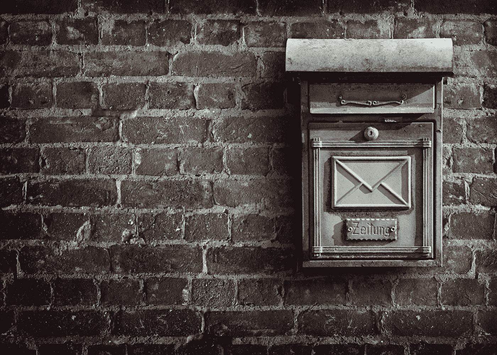

# 如何处理你泛滥的收件箱

> 原文：<https://medium.com/swlh/how-to-deal-with-your-overflowing-inbox-7214c3937b6>

这个世界上有两种人——一种是做收件箱零的人，另一种是不在乎的人。如果你觉得收件箱里没有邮件听起来很诱人，那就继续读下去。

如果你像我一样，喜欢生活有条不紊，你可能会尽量把收件箱的数量控制在一个较低的水平，确切地说应该是 0。

然而，*忙碌*发生了，然后那些讨厌的电子邮件开始悄悄靠近你。去过那里，做过那个，用很棒的技术复原。

*PS:这适用于个人/可操作的电子邮件，而不是时事通讯。简讯是一种简单的阅读归档操作，通常不需要回复。*

# 四步行动技巧

## **1。从最早的邮件开始**

是的，最老的。不准作弊！坏男孩很可能是你收件箱爆满的唯一原因。通常是你不知道如何处理的邮件，自然倾向于把它放在那里。不要！读完这篇文章后立即打开它，执行第二步。

## 2.阅读每封邮件

即使你收到邮件时已经读过了，也要再读一遍。自从你上次打开它，你可能已经获得了新的知识，或者你可能已经错过了一个重要的细节。

## 3.设置一个 3 分钟的计时器，找到一个你或发送者可以将对话转移到下一点的行动步骤

我发现的让我不能立即回复的最常见的原因是:

*   ***你没有足够的信息来做决定。*** 太好了，解释一下并询问更多信息。
*   你知道该做什么，但你懒得去做。 没问题，花 3 分钟，给自己写下一个待办事项(你确实有待办事项清单吧？)然后存档该电子邮件。如果发件人需要回复，让她知道你会在接下来的 X 天内处理这个问题，你就完成了。
*   ***你不确定自己是否准备好提出请求*** 。再一次——向发件人解释这一点，并要求他们在 X 周后继续跟进。如果他们是认真的，他们会的。

## 4.不要停下来，直到你到达收件箱零

这个也很重要。记住——每封邮件都应该有一个行动步骤。无论是询问更多信息，创建一个你马上要处理的待办事项，还是以任何其他方式结束对话。

就是这样！如果你不是零分，今天试试这个，以后再感谢我吧！