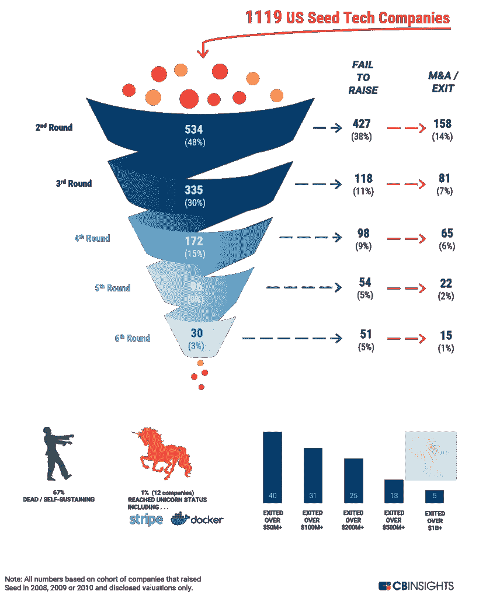

# 如何:决定是否加入早期初创企业

> 原文：<https://medium.com/swlh/how-to-decide-whether-or-not-to-join-an-early-stage-start-up-70623fa022c7>

“如何做”系列的下一篇文章是由伊莎贝尔·雅普(Isabel Yap)撰写的，她是一名作家、诗人，曾在@ guidance 担任产品经理，目前正在@ HBS 攻读 MBA。

在最近的一次晚宴上，我站在奶酪板旁，不太偷偷摸摸地吃了太多的葡萄和饼干，这时一位同事走过来征求我的意见。“我的合伙人正在考虑加入一家初创企业，”她说。“我知道你以前在一家公司工作过。你有什么有用的见解吗？”

我有一个“生活在我眼前闪过”的时刻。在过去的 4.5 年里，我一直在一家初创公司工作——在我入职两年后，这家公司经历了首轮融资。这是一次完全疯狂的旅行。我以第 25 名员工的身份加入了他们，在这期间，我从一个目光炯炯的大学毕业生成长为一个久经沙场的人。我度过了最美好的时光。我度过了最糟糕的时光。而且我学了一个*吨*。与我在 HBS 的许多同行相比，我的经历有多么不同，这仍然让我感到困惑——我与公司一起成长的方式，以及我处理的问题，都是难以置信的独特。

然而:创业并不适合所有人。当我在这里说“初创企业”时，我指的是一家真正的零散企业——不是 Airbnb 或 Pinterest，尽管它们肯定有许多类似初创企业的元素，但几乎在所有方面都仍在寻找立足点。(想象一下:硅谷第一季的花衣魔笛手，慢慢进入第二季。)加入一家初创企业可能会导致很多心痛和压力——你甚至不会获得成为创始人的荣耀！我没有给出一个无条件的“是”，而是告诉我的朋友:“好吧，这里有一些事情让你的伴侣考虑一下。”

***1。目前你对风险的偏好是什么？***

初创企业为潜在的加入者提供了很多令人信服的理由来凑热闹。你可以和一小群志趣相投、干劲十足的人一起规划你自己的道路，你还可以享受不为他人服务的快乐。但伴随着这些巨大回报的，往往是短期内能强烈感受到的风险。已经筹集了大量资金的初创企业可能会对员工非常慷慨，但对于规模较小或较新的企业(尤其是那些靠自己创业的企业)，工资通常较低，福利(旅游信贷、免费午餐等)也较少。如果你要养活其他人，或者要偿还债务，你可能很难接受比在一家更成熟的公司更低的薪酬。

该公司的生存也可能受到质疑。

Source: CB Insights - [https://www.cbinsights.com/research/venture-capital-funnel-2/](https://www.cbinsights.com/research/venture-capital-funnel-2/)

99%的初创公司永远也不会达到 100 万美元的收入，而且在这个过程中，通常会有跑道可能耗尽的恐慌，这就是为什么公司倾向于痴迷地衡量他们的[烧钱率](https://www.inc.com/magazine/201602/helaine-olen/startup-burn-rates-spend-money-to-make-money.html)。

好的一面？早期加入者确实经常获得一家公司的股份，这可以带来可观的回报。因为你希望这些股票有价值，你会有额外的动力来推动公司走向成功。我还发现，因为初创企业不能在额外津贴上花太多钱，所以他们对自己投资的额外津贴会更加深思熟虑。通常员工(读作:你！)可以显著影响此类投资，选择对员工真正重要的福利。

***2。你喜欢这个问题吗？***

当我在初创公司面试初级职位时，我通常会问他们:“你为什么想在这里工作？”我通常会收到一些不同的回答，“因为我想在一个有影响力的地方工作”或者“因为我想加入一家初创企业。”这些答案的问题在于，尽管它们可能是真诚的，但它们并不针对我的公司。你可以对任何其他初创公司说这些，但我想知道你喜欢我的公司什么。

你应该对初创企业所处的空间感兴趣，并渴望解决将会出现的无数问题:竞争、不断变化的市场动态、挑剔的客户等。我通常建议那些希望加入初创企业的人，要真正钻研他们将要从事的产品。即使你不会从事与产品相关的工作，你也应该试一试，问问自己是否会为出售它而感到自豪。产品很可能会随着时间的推移而改变，所以理解你的公司试图解决的首要问题(你可以称之为“使命”)是同等重要的，如果不是更重要的话。虽然这可能不是你存在的理由，但你应该对它有足够的热情，让它帮你度过困难的日子——困难的日子会有很多。

***3。你喜欢你的同事吗？***

我知道，约会的类比被滥用了。但是初创企业是小团体。我在 HBS 的部门比我的初创公司还要大，即使是在员工人数最多的时候。当人们(或案例)将 200 人的公司描述为“小”时，我感到困惑当我第一次加入我的初创公司时，每个工程师都向我们的 CTO 报告，每个没有向我们的 CEO 报告的人都是如此。我们在帕洛阿尔托大学大道附近的一个单间里工作，三天后，我知道了每个人的名字。当我搬到伦敦帮助启动我们的 EMEA 业务时，我在一个三人小组中工作。因为我们只有一个会议室，我们不得不在屋顶或楼梯间接私人电话。

考虑到小公司的规模，即使你不直接和某些人一起工作，你也会和他们*有很多互动。一个有问题的人会对整个公司产生重大影响。*

通常一个小的创业公司会有很多员工参与招聘过程。花点时间去了解他们，看看你们的性格是否配合得很好。“文化契合度”对于初创企业尤为关键。他们添加到组合中的每个员工都会极大地影响文化，并为所有未来的员工奠定基础。成为其中的一部分是令人兴奋的，但是你可以在投入之前通过了解文化来为自己节省很多摩擦。

***4。你(真的)愿意做任何需要的事情吗？***

一些初创公司完全取消了正式头衔，但大多数仍会给你一些可以放在 LinkedIn 上的东西。但是，请注意，你的标题不太可能代表你工作的真实范围。你可能会被赋予比你想象中更大的责任——却没有相应的提升。类似地，你可能会发现自己处于这样的情况，理想情况下“某个资历较浅的人”会完成某项任务——但是因为没有其他人来做这件事，那项单调乏味的任务就落到了你的身上。这可能是一次令人羞愧的经历！

你可能不得不在半夜醒来面对一个威胁要骂你的顾客。你可能不得不写博客或支持文章，即使那不是你的强项。你可能需要为公司厨房订购一台咖啡机，并确保水槽不会超载。当早期创业公司说他们需要一个“灵活的团队成员”时，他们是认真的。幸运的是，几乎所有和你一起工作的人都有相同的主人翁意识。这意味着更少的社交游手好闲，以及对公司成功的更大承诺。

***最后:5* 。你的直觉告诉你什么？**

这里有一个我一直喜欢建议的练习:闭上你的眼睛，想象你自己在那家初创公司。你能看到自己坐在办公桌前吗？图像清晰吗？(也许你的桌子上有可爱的小多肉植物。)这个画面让你*感觉如何？你能看到这家公司令人兴奋的未来吗？你渴望和你的同龄人一起并肩流血、流汗、流泪吗？如果你咧着嘴笑，看起来你已经有了答案。*

事情总有可能不顺利，在这种情况下，你当然可以搬家。但我相信，你从初创企业学到的经验将会永久流传，因此，如果你愿意，那就去做吧。你可能会后悔从未尝试过，而创业只会让风险更大，久而久之。至少，你会有一些有趣的故事可以分享(也许还有伤疤可以展示)…但我高度怀疑你会得到更多。

又及:我同桌的搭档最终还是接下了这个角色。现在说事情会如何发展还为时过早，但我为他们和他们的创业之旅感到兴奋！

## 这篇文章发表在[的《创业](https://medium.com/swlh)，这是 Medium 最大的创业刊物，拥有+395，714 人关注。

## 在这里订阅接收[我们的头条新闻](http://growthsupply.com/the-startup-newsletter/)。

